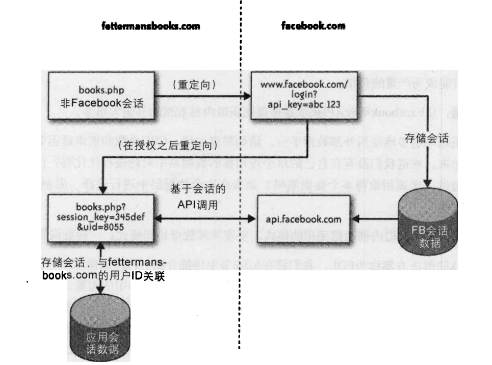

《架构之美》读书笔记

# 简介

## 在软件项目中为什么难以定义软件架构师的职责
相较于其他行业，软件架构师具体职责更难定义：主要在于软件行业诞生晚缺少可参考案例、软件的复杂性、不可见性以及系统复杂性等。
## 架构与设计和开发的区别
架构是设计的一部分，突出某些细节的同时通过抽象省略掉一些细节。即架构是设计的一个子集。

架构师关注的是组件之间的交互和系统与外部之间的交互，那么设计还要关注组件的内部结构，也就是开发者常常要考虑的东西。
## 如何做架构

### 首要关注点不是系统的功能。

成功架构师的两项关键实践：**让利益相关人参与以及同时关注功能和品质**。作为一名架构师， 你首先问我们想从系统中得到什么，有怎样的优先级。在实际项目中， 你会找出其他的利益相关人。典型的利益相关人和他们的关注点包括：

- 投资人，他们想知道项目是否能够在给定的资源和进度约束下完成。
- 架构师、开发人员和测试人员，他们首先考虑的是最初的构建和以后的维护与演进。
- 项目经理，他们需要组织团队，制定迭代计划。
- 市场人员，他们想通过品质特点实现与竞争者的差异化。
- 用户，包括最终用户、系统管理员，以及安装、部署、准备、配置人员。
- 技术支持人员，他们关注帮助平台电话呼人的数目和复杂性。
### 为什么不从功能需求开始？
因为系统分解方式有很多种，但是能满足品质需求的却是很少一部分。

### 系统概念完整性
创建架构时保持同一种思考方式和同一种哲学，即保持概念完整性。让团队保持尽可能小，让他们在充分沟通、高度协作的环境工作，让一两个“首席架构师”担任仁慈 的独裁者，最终做出所有决定。

# 两个系统的故事：现代软件神话

## 不好的架构设计的后果

> 不好的公司结构和不健康的开发过程将在糟糕的软件架构中得到反映。

### 不可理解

### 缺乏内聚

高度内聚的模块意味着其中的所有元素都紧密关联并且共同完成一个清晰
定义的任务，这可以提高模块的可维护性和可扩展性。

### 高耦合

耦合是指模块之间的关联程度，也就是两个或多个模块之间互相依赖的程度。太紧密的耦合会导致一个模块的修改会对
其他模块产生影响，从而增加了整个系统的维护和测试成本。因此，降低耦合度是提高系统可维护性和可扩展性的重要手段。

### 代码问题

松弛而模糊的架构将导致每个代码组件编写得不好，井且相互之间匹配得不好。它也会导致重复的代码和工作。

### 代码以外的问题

- 开发团队：很少有新人能在公司里待下来一—员工流失率非常高。
- 缓慢的开发周期：最简单的变更或 “很小的＂ 缺陷修复都不知道要花多少时间。 管理软件开发周期非常难。 客户只好等着实现重要
的特征，管理层对开发团队不能满足业务目标感到越来越沮丧。
- 公司内部政治：开发团队与营销销售团队之间关系紧张，每次新版本要推出时，制造部门总是要承受巨大的压力。

## 良好的架构设计

### 系统一致性

也就是自始至终坚持设计的一致性，即使有变更也能快速定位

### 架构的增长

软件架构不是一成不变的。需要时就改变它。要想做到可以修改，架构就必须保持简单。

### 延迟设计决定

延迟设计决定，直到你必须做出这些决定为止。不要在你还不知道需求的时候就做出架构决定。不要猜测

### 保持品质

- 结对编程
- 对没有结对编程的工作进行代码／设计复审
- 对每一段代码进行单元测试

### 管理技术债务

随着最后期限的临近， 一些不太重要的功能被砍掉，让产品能够准时推出。小的代码＂瑕疵”或设计问题允许
存在代码集中，要么是为了让功能快一点实现，要么是为了在接近发布时避免高风险的改动。

### 单元测试

- 单元测试给了我们信心，让我们相信系统的其他部分没有被破坏。
- 迫使我们实现好的结构。每个小的代码组件都被定型成定义良好的实体，可以独立存在。
  编写单元测 试确保了每个代码模块的内聚性，也确保了与系统其他部分之间的松耦合。

### 与设计同行

代码集很大，但它是一致而易理解的。新的程序员可以比较容易地拿起代码并开始工作。 
每个人痛应该觉得在修改代码的时候是一种乐趣，能够希望不断改进他。

# 伸缩性架构设计

游戏服务器相关的架构：

- 通过大区分散流量或者不同地图、不同副本分散流量，以获得更好的游戏体验，并发量。
- 封装各层级，不同层级各司其职，通过事务封装多操作，以此能够简化程序员的编程，
能够通过简单的规约就进行服务器的开发，实现并发编程。

# 记忆留存

架构怎么产生？不停重构。关注需求，拆解用户需求，在设计之初保持易用性、可维护性，之后发现
问题或者新需求就是不断改进，最后架构自然会出现。

# 数据增长：Facebook平台的架构

Web应用一般都是以数据驱动，将数据进行展示是其价值所在

SSO登录：每个应用都有它 自己特有的“应用键＂（也称为api_key),开始应用认证流程

1. 用户通过一个已知的api_key重定向到自己的Web应用登录界面。
2. 用户在该Web应用上输入口令，对这个应用授权。
3. 用户带着会话键和用户ID重定向到已知的应用。（会话键是非常私密的，所以对千将来的验证，应用的所有调用都会带有从这个共享秘密生成的散列值。）
4. 应用现在获得了授权，可以代表用户调用API方法（除非会话超时或被删除）。

在＂桌面"风格的应用、基于设备的应用（如手机应用）， 或浏览器内建的应用情况下，我们采用认证令牌进行SSO授权。

SSO三方授权的问题： 开发者访问自己的数据的模式与访间Facebook数据的模式有着很大的不同。 例如，
Facebook的数据位千HTTP请求的另一端，通过许多HTTP连接来调用这些方法增加了开发者自己页面的延迟和开销。也不好进行
排序、或者更多定制化的操作。

- 实际问题：从第三方平台API获取数据要比获取内部数据的开销大很多。
- 数据解决方案：类似内部数据采用的模式，实现外部数据访问模式：一种查询服务。即把三方平台作为一种类ORM框架提供黑盒服务。 
其中多次api调用可以通过批量方法调用进行优化：一批接受多个方法调用 的输入，一次返回输出的多棵XML树。

类似C#一般经典，将对象属性字段通过函数进行值的获取，还有visible属性决定是否可见。

# JPC：一个纯Java的x86PC模拟程序

## 性能

1. 创建对象不好
过多的对象实例（尤其是短期的对象）会导致不好的性能。这是因为大量对象引起频繁的年轻代(younggeneration)垃圾收集，而年轻代垃圾收集算法几乎是“全部
停止”类型的。
2. 静态好
如果一个方法可以定义成静态的，那就定义成静态的。静态方法不是虚的，所以，不会动态分派。与实例方法相比，高级的VM更容易也更愿意内联静态的方法。
3. 方法越小越好
小块的代码好，因为即时的环境通常按一个方法的粒度去理解代码。包含一个“热”区域的大方法将会整个编译。由此产生的大块本机代码会引起更多的缓存代码未能利用，这会影响性能。
4. 小心使用装饰(decorator)模式
从设计的角度来看，装饰模式是好的，但是，它的额外间接性开销很大。请记住，移除和增加装饰模式都是允许的。这种移除会被认为是一次“异常事件”井可以通过抛出一个专门的异常来实现。
5. 对类进行instanceof的操作更快
对一个类进行instanceof的操作比用接口来操作它快得多。Java的单继承模式意味着对千一个类，insanceof仅仅是一次减法和一次数组查找，对千一个接口，那是一次数组搜索。
6. 最低程度地使用同步
把同步的块减到最小它们会引起不必要的开销。如果可能，则考虑把它们替换为原子的或volaile引用。
7. 小心外部的库
避免使用超出你的目的的外部库。如果任务简单而且重要，那就认真地考虑在内部编码实现它定制的解决方案可能更适合这个任务，导致更好的性能和更少的外部依赖。

## 达到 “美丽架构” 的途径是一个分为4个步骤的计划：

1.	全面接受一个大而复杂的问题，找到一组比较简单的、 能够使构建一个完善的端到端的原型系统成为可能的阶段。每个阶段代表一个比最终目标简单和具有较少功能的系统，但是，每个阶段都可以在它的设计限制内作为完整系统原型的一部分进行测试， 而不是作为最终设计的小部分单独原型（例如， 比较传统的单元测试）。
2.	在构建每个阶段的每一部分之前， 清楚地知道正在开发哪个方面和为什么。 理论上， 每个阶段的瓶颈都可以容易地识别， 对这些瓶颈的改进将是下一阶段或下面 一些阶段的主要目标。 原则上， 在着手大块的工作之前要努力找到办法证明这个方法是否可行一一即使对每个阶段的每一部分。
3.	完成每个阶段的编码井对整个原型进行系统测试， 抵制在阶段设计限制参数上快速推进的诱惑。 一定要做到对每个阶段进行完整的系统测试才通知下一个阶段的测试。
4.	对设计进行迭代并返回到第二步， 无论在什么情况下， 你都不应该担心重写全部的组件。

