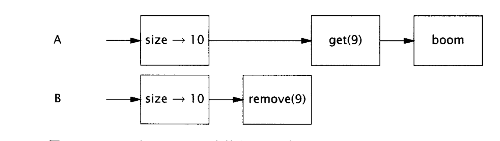
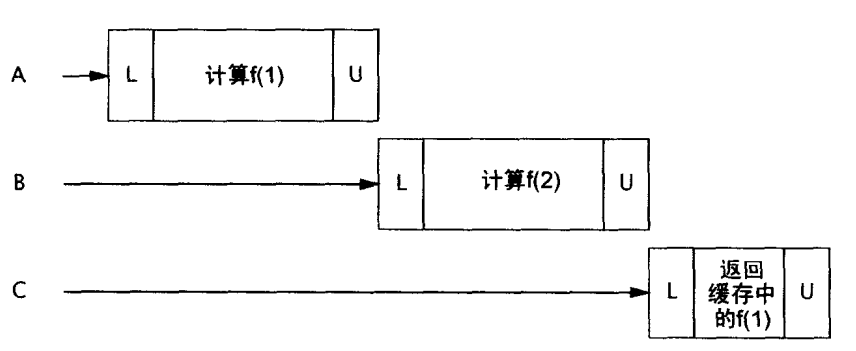
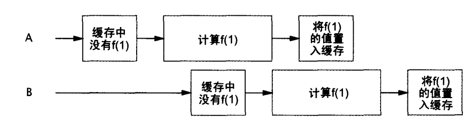
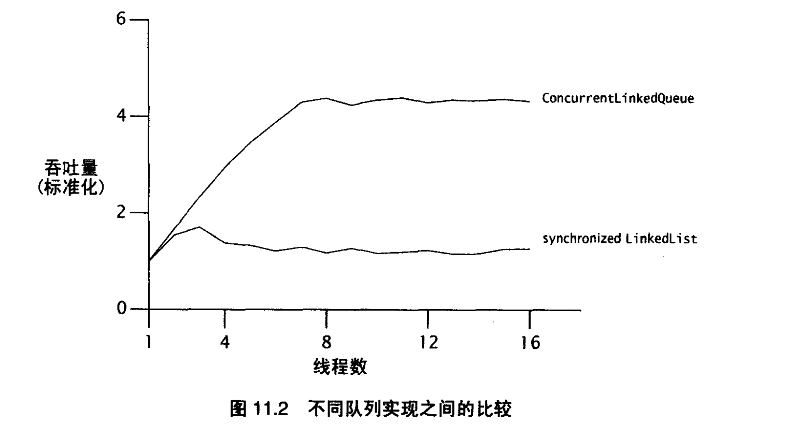

# 《JAVA并发编程实践》

## 环境

JDK1.8、Maven3.X

## 介绍

线程又能称为轻量级进程，作为现代操作系统的最小的时序调度单位。同一个进程有多个线程，它们共享该进程资源。

### 线程的优点

恰当的使用，能提高复杂应用的性能；可以把复杂难以理解的代码转化为直接简介的代码。GUI就使用线程来改善性能，同样线程被作用域JVM的垃圾回收器。

如AWT、Swing这样的现代GUI框架，用事件派发线程取代了主事件循环，如按下一个按钮，事件监听器就会去调用程序定义的事件处理器，这样子其他事件触发时就不会引起对上一个事件的长时间等待

### 线程的缺点

- 竞争资源导致了死锁
- 线程之间的频繁切换，导致了上下文切换时间太长了，掩盖了线程带带来的好处。

### 线程的场景

- 定时器

可能在定时任务执行的时候，可能有其他的线程正在访问相同的数据

- Servlets and JSP

一个servlet可能同时为多个用户提供服务，所以Servlet线程必须是安全的。同时Servlet间共享的信息（Session 、
ServletContext）都需要保证线程的安全

- 远程方法调用

诸多的远程方法调用中线程，可能会对同一个对象的同一个方法进行同时调用，也必须保证线程安全。

- Swing和AWT

为了对用户发起事件进行快速相应，后台的事件处理器执行时如果需要访问应用程序转台，就可能会遇到其他应用程序也在访问（如编辑的文件），故也需要线程的安全。

## 线程安全

本质是对共享、可变的状态的管理，状态就是对象的数据。

Java中的封装、不可变性、以及明确的不变约束有助于维护线程安全。

> 线程安全：多个线程访问同一个类，不需要指导线程如何调度与执行，不需要额外同步的情况下能保证类的行为仍然是正确的。

### 原子性

单独的不可分割的最小的操作单元，

对一个实例的变量进行更新，涉及读改写，很容易出现更新丢失——多个线程都同时读到，后续写回的时候就只更新了一次相当于。

#### 竞争条件

计算的正确性依赖于运行时相关的时序或者多线程的交替。最常见的竞争条件，检查再运行，就如同单例模式。

> 数据竞争：数据没有同步，导致读取的是别人已经更新但没有写入的数据。

UnsafeAtomTest1 虽然看似没有问题，每步都是原子操作，但其实复合之后，仍会出现竞争问题，需要保证整个update都是原子的才行。

### 锁

通过synchronized 可以消除 UnsafeAtomTest1 的问题 ，但是性能下降。

#### 内部锁

内部锁：synchronized

- 定义在方法上

`public synchronized void method()` 当method方法被调用时，调用线程必须获得当前对象的锁。

锁对象：当前对象。

- 同步代码块

synchronized(Object obj){ }

锁对象：自定义一个共同使用的锁对象。

好处：

1. 同步块可以更为精确的控制同步代码范围

2. 小的代码块非常有利于锁的快进快出，假设同步块前后代码段较为耗时，而它们又无需进行同步操作，那么，将这些代码纳入整个同步代码块就会增加锁的等待时间。

- 静态方法的同步

`public synchronized static method()`

锁对象：Class对象

#### 可重入

即获取锁之后，再次请求已经获取的锁对象锁定的资源时，仍旧是成功的。

如ReentryTest1中的代码，如果不能可重入就会导致死锁，子类调用父类的时候子类已经占用了父类的锁，这时候如果再调用就会死锁。

### 用锁来保护状态

会多个线程访问的对象上锁，只有获得锁对象的线程能使用锁。

能够一段复合操作中所涉及变量能通过一个锁进行控制。过多使用锁，可能导致活跃度和性能。

### 活跃度与性能

如果对一个Servlet声明为Synchronized，因此当同时有多个请求到达后，只能依次被处理，称为弱并发。

应该谨慎控制synchronized块的大小，把不会影响共享状态的代码移动到同步块外。

CachedFactorizer 展示一个适中的锁的粒度。

> 耗时的计算和操作，比如网络或控制台I/O，难以快速完成，不应该在执行期间，长时间占有锁。

## 共享对象

### 可见性

NoVisibility 可能输出42，可能输出0，或者无法终止，不能保证使用恰当的同步——写入ready和number的值不一定对读线程可见。

因为重排序机制的存在——在某线程中，如果重排序不影响结果就不能保证其中的操作一定是按照程序写定的顺序执行。

#### 过期数据

即读线程读取到的数据，可能是已被更新但还没更新到磁盘的数据。

#### 非原子的64位操作

> 最低限的安全性：数据是真实的数据，但不一定是最新。

没有声明为volatile的64位数据（double、long），不能保证最低限的安全性：JVM允许将64位的读和写划分为两个32位的操作，如果读和写发生在不同的线程，就可能读取到一个值的高32位，另一个值的低32
位。即使不关心数据是不是最新的，long、和double都是不安全的。注意这里要在32位多CPU的机器上运行Date64Test才能看到结果。

#### 锁和可见性

A ---> B 两个进程顺序的对对象加锁，那么A对象持有锁期间的对象的任何改变，在B持有对象锁的时候都是可见的。

> 为了保证可见性，对于共享的数据使用公共的锁进行同步是有必要的。

#### Volatile变量

同步的弱形式，可以让数据在更新后告知其他线程。声明为volatile类型的域，编译器在运行时会监视这个变量：共享且不会被重排序。在访问volatile变量的操作不会加锁，不会引起执行线程的阻塞，使得volatile
变量相对于synchronized，是轻量级的同步机制。但是依赖volatile变量会使得使用锁的代码更脆弱，难以理解。

> 当volatile变量能够简化实现和同步策略的验证时，才使用它们。一般用于确保它们所引用的对象状态的可见性，或者用于表示重要的生命周期事件的发生。

`- server`命令行选项——server模式的jVM比Client模式的JVM执行更多的优化，会把没有在循环体中修改的变量提升到循环体外部。所以开发环境中（client模式的JVM）可以工作的代码在部署（server模式的JVM
）环境中可能会失败。

volatile不足以使得自增操作原子化！！！

> 加锁可以保证可见和原子性，volatile只能保证可见性

满足以下条件可以使用volatile：

- 写入变量时不依赖变量的当前值
- 变量不需要其他状态变量共同参与
- 访问变量，不需要锁

### 发布和溢出

- 发布
  发布一个对象，就是让其能够其他的代码进行使用。
- 溢出
  对象还未准备好就把它进行发布

最常见的发布方式就是将对象的方存储到公共静态域中，任何类和线程都能看见这个域，在这个过程中就可能发生逃逸——所有该发布的对象中所能获取的数据都变成公有了。

#### 安全构建的实践

ThisEscape 就让this引用在构造期间溢出，新启的线程能够直接共享this引用，导致未完成构建的对象被使用，可以通过延迟线程的启动，使得对象完成构造之后再启动，一次解决问题。
同时构造函数中包含了对可重写方法的引用，导致了this引用溢出，可以把方法变成private或者final来解决该问题。

### 线程封闭

不共享数据，使得对象封闭在一个线程中。

- Swing把所有的非安全的数据限制在事件分发线程中，不同事件线程的其他线程不应该访问这些对象的，实现线程安全。通过invokeLater来安排事件线程如何执行Runable实例。
- JDBC并没有要求Connection是线程安全的，总是从连接池获取一个Connection对象，进行请求处理。每个线程都是同步地处理大多数请求（如Servlet或者Enterprise
  Java
  Bean调用），在这些请求在处理的过程中，不会把Connection对象分配给其他线程——相当于把连接对象限制在了使用它得的线程中，

#### Ad-hoc线程限制

Ad-hoc线程封闭是指，维护线程封闭性的职责完全有程序实现来承担。例如可见性修饰符或局部变量，能将对象封闭到目标线程上。事实上对于线程封闭对象通常保存在共有变量中。Ad-hoc线程封闭是非常脆弱的，所以程序中尽量少使用它，可以使用以下两种技术（栈封闭，ThreadLocal）。

如Volatile变量的单线程使用，是的volatile的”读-改-写“操作是安全的，同时这种情况下，该变量的修改，其他线程又能立即获取到。

#### 栈限制

只能通过本地变量才可以触及对象，本地变量本身就被封装在执行线程中，存在于执行线程栈。也称线程内部或者线程本地用法，不应该与核心库类的ThreadLocal混淆。相比于ad-hoc更加容易维护且健壮。

StackLockTest 展示了栈限制

#### ThreadLocal

将每个线程与持有的数据对象关联在一起。提供了get与set访问器。总是get到当前执行线程set的最新值。

ThreadLocal通常用于防止对可变对像的实例变量或全局变量进行共享。如果多个线程共享一个Jdbc
Connection很容易导致线程不安全，因为获得该连接的线程可能会进行connection的修改。

ThreadLocalTest展示了ThreadLocal保证每个线程拥有自己的JDBC connection的方法。这样子做肯定是不合适的，因为这样子并发很大就会OOM。

J2EE容器把一个事务上下文和一个可执行线程关联起来。框架代码只需要知道当前是哪个事务，就能从ThreadLocal获取事务上下文，省却了每个方法传递上下文信息的需要，但是增加了框架家的耦合。

### 不可变性

常量在构造函数中创建之后就不再改变，默认就是线程安全的。

- 不可变对象
    - 所有状态创建之后不能再修改
    - 所有域都是final
    - 被正确创建且没有this引用的溢出。

#### final域

final不能修改，但是对于final域指向的对象仍然是可变的。

> 尽量是私有、不可变

#### 使用volatile发布不可变对象

ImmutableTest 中的cache对象通过返回数据对象的拷贝，从而使得缓存内部的对象不能被其他线程修改；通过volatile设置cache的类型，使得一旦新的缓存出现，其他线程立即可见。

### 安全发布

发布数据，其他线程能够共享。即同步对象初始化，保证创建后的对象可见性。

#### 不正确发布：当好对象变坏时

可能会导致对象的最新状态不可见或者对象的最新引用的不可见。

UnsafePublicTest 展示了没使用同步来确保Holder对其他线程可见，称为非正确发布，可能引起的两种错误：

- 其他线程获取到的旧的Holder引用
- 其他线程获取了最新的Holder引用，但是状态非最新。

#### 不可变对象与初始化安全性

不可变对象中含有其他的对象的引用还是需要同步来保证安全发布。

#### 安全发布的模式

- 通过静态初始化器来初始化对象的引用（静态初始化器是由JVM在类的初始化阶段执行，即在类被加载后并且被线程使用前。在静态初始化期间，内存写入操作将自动对所有线程可见）
- 将引用存储到volatile或者AtomicReference中
- 将引用存储到final域中
- 用锁保护存储的域

#### 高效不可变对象（Effectively immutable objects）

对象可变，但是状态发布后不能被修改称为有效不可变；

> 任何线程可以在没有额外的同步下安全地使用一个安全发布的高效不可变对象、

#### 可变对象

对象可变，那么安全发布只能保证发布当时的状态可见性，状态修改时仍需要同步保证可见性。

> 发布对象：
> - 不可变对象可以任意机制发布
> - 高效不可变对象（对象可变，状态不可变）必须要安全发布
> - 可变对象必须要安全发布，同时必须要线程安全或者被锁保护。

## 组合对象

### 设计线程安全的类

#### 收集同步需求

就是把所有在状态变换过程中设计的对象收集起来，查找其中需要额外同步的地方。检查不变约束和后验条件。

### 实例限制

通过线程限制（单一线程访问）、或者所有的访问都能正确地上锁。

实例限制：简化了线程安全化工作，能够更简单地分析某个对象的所有访问路径。

通过限制以及锁就能更好的使用共享数据了。

> 数据封装在对象内部，把对数据的访问限制在对象的方法上，更易并发访问数据，获得正确的锁。

#### Java监视器模式

线程限制原则的直接推论之一。封装了所有的可变状态，由对象自己的内部所保护。如Vector和Hashtable都使用了该模式。效率低下

私有锁相较于对象锁的粒度更小，更好的并发，

详见 VehicleTracker1 其中代码

### 委托线程安全

把线程安全的类组装起来，把他们作为组装之后类的状态。即把当前类的状态委托给线程安全的内部组成类进行线程安全的职责。

详见 DelegatingSafeTest 其中代码

#### 非状态依赖变量

VisualComponent 展示了组合对象的不变约束与组件的状态变量无关

#### 当委任无法胜任时

组合对象中组件可能是单独的线程安全的，但是为了满足组合对象的不变性约束，光保证组件各自的线程安全是不够的，需要把所有涉及的状态都上锁。

NumberRangeTest 展示了两个线程安全的组件，但是由于volatile无法保证原子性，导致非线程安全的类。

### 向已有的线程安全类添加功能

方式：

- 修改原始类，以支持期望的操作，但是可能无法访问源代码或者修改的自由。
- 扩展这个类，并非所有的类都给子类暴露了足够多的状态，同时扩展之后，多个子类分布到了多个独立维护的源代码文件中，难以维护。一旦低层的类选择了不同的锁来保护状态变量就会把子类的同步策略破坏掉。BetterVector
  因为Vector的同步策略规约的原因不会出现该问题。

#### 客户端加锁

ListHelper 展示了 扩展类的时候 错误加锁会产生的问题。

#### 组合

详见 ImprovedList ,简单装饰了List之后，实现了自定义的putIfAbsent功能。通过额外的synchronized实现了所有功能的同步。

### 同步策略的文档化

为同步编写文档，可以减少后期维护时候的安全性的威胁。在设计阶段就编写同步策略的文档。何时请求锁、释放锁、锁干嘛了都需要记录。

## 构建块

### 同步容器

同步容器类包括两部分：一个是Vector和Hashtable；另一个是痛惜容器，同步包装类Collections.synchronizedXXXX工厂方法创建。通过封装状态，对公共方法进行同步实现线程安全。

#### 同步容器中出现的问题

复合操作如果存在多线程并发修改的时候就容易出现错误

如Vector中线程A请求获取最后一个元素，而这时候线程V请求删除最后一个元素

```java
public static Object getLast(Vector list){
        int lastIndex=list.size()-1;
        return list.get(lastIndex);
        }

public static void deleteLast(Vector list){
        int lastIndex=list.size()-1;
        list.remove(lastIndex);
        }

```

如果线程按照如下方式执行，就可能导致出现ArrayIndexOutOfBoundsException


由于允许客户端加锁的同步，所以可以对同步容器类list上锁，使得两个操作变为原子操作即可。当然这是减少了并发性了。

#### 迭代器和 ConcurrentModificationException

对Collections进行迭代的标准方式是使用Iterator，在并发修改的时候——迭代后被修改，会抛出未检查的ConcurrentModificationException。

ConcurrentModificationException专门用来捕获并发的错误，在迭代期间计数器被修改，hasNext或next就会抛出该异常。

如果对迭代加锁很容易出现死锁、饥饿，极大影响吞吐量。容器复制可能解决问题，但是性能差。

#### 隐藏迭代器

共享的容器类在toString的时候隐藏着对容器元素的迭代，如果没有上锁就容易出现 ConcurrentModificationException

详情见HiddenIterator

### 并发容器

提高了曾经的同步容器的吞吐量，并发性有所提升。

ConcurrentHashMap代替同步的哈希Map；当多数操作为读取时，CopyOnWriteArrayList是List的同步实现。

Queue相较于List有着更高的并发实现。 FIFO队列：ConcurrentLinkedQueue； 非并发的有顺序的队列：PriorityQueue；

BlockingQueue扩展了Queue，增加了可阻塞的插入和获取。如果队列是空的，就一直阻塞直到队列中存在可用元素；如果队列是满的，插入操作会一直阻塞直到队列有可用空间。

ConcurrentSkipListMap、ConcurrentSkipListSet作为同步的SortedMap和SortedSet的并发替代品。

#### ConcurrentHashMap

使用更加细化的锁机制：分离锁，实现更深层次的共享访问。任意数量的读线程可以并发访问，读者和写着也可以并发访问，并且有限数量的写线程还可以并发修改。提供的是弱一致性的迭代器，不会抛出ConcurrentModificationException。允许并发修改，不会感应到迭代器创建之后对容器的修改。

#### CopyOnWriteArrayList

是同步List的一个并发替代品，避免了迭代期间对容器加锁和复制。每次返回的都是当时底层数据状态的拷贝，之后的修改并不会影响已经返回的数据。读多写少的时候使用，否则每次改变容器就复制数组开销可能过多了。

1. CopyOnWrite适用于读多写少的情况，最大程度的提高读的效率；
2. CopyOnWrite是最终一致性，在写的过程中，原有的读的数据是不会发生更新的，只有新的读才能读到最新数据；
3. 如何使其他线程能够及时读到新的数据，需要使用volatile变量；
4. 写的时候不能并发写，需要对写操作进行加锁；

如事件通知系统：递交一个通知需要迭代已经注册的监听器，并且调用其中每一个。注册和注销事件监听器就少的多的情况。

### 阻塞队列和生产者-消费者模式

阻塞队列提供了可阻塞的put和take，与定时的offer和poll等价。支持生产者-消费者模式，该模式不需要把任务立即处理，而是存入到一个to
do清单，这样消费者和生产者就相当于解耦了，可以以不同的速度进行生产和消费，简化了工作负荷的管理。

生产者-消费者设计围绕阻塞队列展开，生产者把数据放入队列，不需要知道消费者是谁；消费者从队列中取出数据，不需要知道生产者是谁。如线程池和工作队列进行结合。

BlockingQueue：

- LinkedBlockingQueue、ArrayBlockingQueue都死FIFO队列，拥有比同步List更好的并发性能。
- PriorityBlockingQueue是排序后的阻塞队列。
- SynchronousQueue
  非真正的队列，不会为队列元素维护任何存储空概念。而是维护一个排队的线程清单。平常都是需要先入任务队列，之后取出来使用。而该队列直接进行任务的移交，减少了生产者和消费者之间移动数据的延迟。直接移交给生产者更多的反馈信息，就好像文件直接给了同事，而不是把文件发送到邮箱，等待同事取文件。由于没有存储能力，所以除非有线程能够执行任务，否则就会put和take一直阻塞。只有在消费者充足的时候适合使用。

#### 生产者消费者实例：桌面搜索（扫描本地驱动器并归档文件）

详见ch05.demo01

#### 连续的线程限制

充分的内部同步，使得对象能够从生产者安全的发布至消费者线程的过程中，有着连续的线程限制，不会出现争抢。一旦发布（对象被转移），也只能有唯一一个线程能够访问这个对象的权限，被其独占；归还之后又重归线程池独占。通过阻塞队列简化了这项工作。

#### 双端队列和窃取工作

Deque和BlockingDeque，分别扩展了Queue和BlockingQueue。通过ArrayDeque和LinkedBlockingDeque。双端队列适用于窃取工作。

窃取工作：线程在完成了自己队列的所有任务之后，能够取偷取其他消费者的双端队列中末尾的任务。

### Synchronizer

是一个对象，根据本身的状态调节线程的控制流。阻塞队列可以扮演Synchronizer角色。还有其他类型的Synchronizer：信号量（semaphore）、关卡（barrier）、闭锁（latch）

结构特性：封装状态，这些状态决定线程执行到某一个点时时通过还是被迫等待；提供操控状态的方法，高效等待Synchronizer进入期望状态。

#### 闭锁

是一种Synchronizer，可以延迟线程进度直到线程终止状态。一旦闭锁到达了终点状态，就不能再改变状态，允许所有线程都通过。

如以下场景：

- 一个计算不执行，直到它所需要的资源被初始化。一个二元闭锁（两个状态）可以用来表达“资源R已经被初始化”，并且所有需要用到R的活动都已经在闭锁中等待。
- 确保服务不会开始，直到它依赖的所有服务都已经开始。每个服务都包含一个二元闭锁，
- 等待，直到活动的所有部分都已经为继续处理做好了充分准备。比如所有玩家都准备，才能开启副本。

CountDownLatch是一个灵活的闭锁实现。用于：允许一个或者多个线程等待一个事件集的发生。闭锁的状态包括一个计数器，初始化是一个证书，表现为需要等待的事件数。countDown对计数器做减操，表示一个事件已经发生。await
表示等待计数器达到0。

详情见 TestHarness 通过闭锁模拟了瞬时并发，并对其进行计时

#### FutureTask

另一种闭锁。抽象的可携带结果的计算。等价于可携带结果的Runnable。一旦完成就会永远停止在这个状态。

Future.get会阻塞直到有结果返回。Executor利用FutureTask来完成异步任务，并且可以进行任何潜在的耗时计算

详情见Preloader

#### 信号量

计数信号量可以用来实现资源池或者给定容器的边界。semaphore跟操作系统中一致。没有可用的资源，阻塞acquire，直到release方法返回了一个许可。

用信号量约束容器：详情见BoundedHashSet

#### 关卡

类似于闭锁，能够阻塞一组线程，直到某些事件发生。闭锁要求所有的等待事件发生，而关卡要求所有线程到达。好似家庭聚会，所有人到达再决定之后的事情。

CyclicBarrier允许一个给定数量的成员多次集中在一个关卡点，常用于并行迭代算法。把问题拆分成相互独立的子问题，当线程到达关卡，就会await进行阻塞，直到所有线程都到达。关卡放行之后会再次重置状态，可以重复使用。

常用在把一个大任务拆分成多个独立的任务，之后当所有的独立任务都已经完成，关卡才会放行。

### 为计算结果建立高效、可伸缩的高效缓存

减少等待事件、提高吞吐量，代价是占用更多的内存。

详情见ch05.demo02，

Memoizer1 为了能够保证HashMap的同步，所以对缓存操作上了锁，导致对整个Memoizer实例上了锁，并发性相当弱。


Memoizer2 通过ConcurrentHashMap来提升性能


Memoizer3 通过Future来缓存计算任务，但是因为compute是个符合操作，但是未保证原子性，所以会出现创建的任务，但是却在计算相同的值。同时可能会出现缓存污染，因为可能计算失败也被缓存了，导致之后一致获取的是失败的。


Memoizer 通过ConcurrentHashMap的putIfAbsent解决了 计算相同值，同时在出现计算失败的时候，会消除该失败的缓存。

## 任务执行

大多数并发应用程序是围绕任务进行管理的，即抽象的、离散的工作单元。

### 在线程中执行任务

要明确清晰的任务边界，任务是独立的，有利于并发性，甚至能做到并行。在正常负载的时候，服务器应该具有良好的吞吐量和快速的响应性。在负载过高时，应该平缓劣化，而不是直接失败。大多数服务器都选择 单独的客户请求 作为任务边界。

#### 顺序地执行任务

单线程顺序执行任务的执行效率很差，处理和接收请求之间会出现阻塞，并不是并行，更不是并发。如果是因位IO而产生了阻塞，那么会限制大量CPU资源。但是顺序处理具备简单性、安全性。

详情见：SingleThreadWebServer

#### 显示地为任务创建线程

详情见：ThreadPerTaskWebServer

#### 无限制创建线程的缺点

- 线程创建和关闭需要耗费时间
- 活动线程会消耗系统资源，尤其是内存。如果可运行的线程数多于可用的处理器，线程会空闲，浪费很多内存，给垃圾回收器带来压力。同时线程竞争也会产生性能开销。
- 稳定性：限制创建的线程的数目，否则很容易导致OOM。

### Executor框架
详见：TaskExecutionWebServer 、WithinThreadExecutor 、ThreadPerTaskExecutor

#### 执行策略

是资源管理工具，取决于可用的计算资源和对服务质量的需求。最佳策略有助于在部署阶段选择一个与当前硬件最匹配的执行策略。

#### 线程池

在线程池种执行任务线程，重用线程，可以减少线程创建和消亡产生的开销。同时请求到达时，工作者线程已经存在，就不会导致创建线程引起延迟，提高了响应性。

- newFixedThreadPool：定长的线程池，每提交一个任务就创建一个线程，直到达到最大长度。（如果线程由于非预期的Exception而结束，线程池会补充一个新线程）
- newCachedThreadPool：创建一个可缓存的线程池，如果线程池长度超过了处理的需要，可以灵活地回收空闲线程。需求增加时，灵活地添加新线程，不会对池的长度有任何限制。
- newSingleThreadExecutor：单线程化的executor，如果该线程异常结束，会有另一个取代它。
- newScheduledThreadPool：创建一个定长的线程池，支持定时的以及周期性任务执行。

相较于每一个任务都创建一个线程，线程池更好的稳定性，不会因为过高负载而失败。使得服务器能够平缓的劣化

#### Executor的生命周期

JVM会在所有的（非后台的，nondaemon）线程全部终止才退出，因此，如果无法正确关闭Executor，就会阻止JVM结束。

Executor是异步执行任务，所以在任何时间里，之前提交的任务状态都不能立即可见。

生命周期状态：运行（running）、关闭（shutting down）、终止（terminated）；
- 最初创建后的初始状态是运行状态
- shutdown方法会启动一个平缓的关闭过程：停止接收新任务，同时等待已经提交的任务完成——包括尚未开始执行的任务。
- shutdownNow 启动一个强制的关闭过程：尝试取消所有运行中的任务和排在队列中尚未开始的任务

关闭后，再提交任务，会被 拒绝执行处理器（ExecutorService的一种实现ThreadPoolExecutor提供的） 处理，可能只是放弃任务，也可能会抛出未检查的RejectedExecutionException。

再所有的任务完成后，ExecutorService会转入终止状态。可以调用awaitTermination等待ExecutorService进入终止状态，也可以轮询检查isTerminated判断ExecutorService
是否已经终止。通常shutdown紧随awaitTermination之后，可以产生同步关闭ExecutorService的效果。

#### 延迟的、并具有周期性的任务

Timer工具管理任务的延迟执行以及周期执行，存在一些缺陷，应该考虑使用ScheduledThreadPoolExecutor 作为替代品。

Timer只创建唯一的线程来执行所有的timer任务，如果一个timer任务的执行很耗时，会导致其他定时任务时效准确性出问题。调度线程池解决了这个缺陷，可以多线程来执行延迟、并具有周期性的任务
Timer的另一个问题在于，Timer线程不捕获异常，所以定时任务抛出的未检查异常会终止timer线程。这种情况下，Timer不会再重新恢复线程执行，它会任务Timer被取消了，此时所有的定时任务永远不会执行了。（线程泄露）

详情见:OutOfTime

可以使用DelayQueue（管理包含Delayed对象的容器）来构建自己的调度服务，每个Delayed对象只有过期后，DelayQueue才能take获取元素，从DelayQueue中返回对象将根据Delayed对象的延迟时间进行排序。

> Timer对调度的支持是基于绝对时间，而不是相对时间，任务对系统时钟的改变是敏感的；ScheduledThreadPoolExecutor只支持相对时间。

### 寻找可强化的并行性

HTML只有包含标签文本，包括预定义了的尺寸和URL图片

#### 顺序执行的页面渲染器

先显示所有的非图片文本元素，所有图像都用占位符代替，之后回到程序开始位置并下载图像到占位符位置。

下载的时候CPU处于空闲，只用到IO操作，所以效率很差。

#### 可携带结果的任务：Callable和Future

很多任务都会引起严重的计算延迟——执行数据库查询、从网络上获取资源，进行复杂计算，这些Callable是更加的抽象。可以通过call等待返回值，并未可能抛出的异常做准备。

Executor包含了一些方法，可以把其他零星的任务封装成Callable，比如Runnable。

Runnable、Callable都是有明确的开始点，且最终会结束。而Executor执行的任务的生命周期：创建、提交、开始、完成。执行可能会花费很长时间，在Executor框架中，可以取消还未开始的任务，中断开始的任务。

Future描述了任务的生命周期。如果在get的时候抛出ExecutionException，可以用getCause获得被封装的原始异常。

通过Callable来下载所有图像，提交ExecutorService，之后返回Future，在最后进行future.get，极大了利用IO、以及CPU资源。

#### 并行运行异类任务的局限性

因为异类任务执行的时间有很大不同，如A 1000s 而 B 1s ，那么并行A，B最后所花费时间还是取决于A，并不能有很大的提升。

> 大量相互独立且同类的任务进行并发处理，会将程序的任务量分配到不同的任务中，这样才能获得真正的性能提升。

#### CompletionService ： 当 Executor遇见 BlockingQueue

如果向Executor提交了批处理任务，最后对每个任务调用get来检验Future是否完成，固然可以，但相当乏味。

CompletionService整合了Executor和BlockingQueue，将任务提交给它执行，之后使用take和poll方法来获取结果，像一个打包的Future。

首先把任务封装为一个QueuingFuture，在计算完成时调用FutureTask的done方法，并加入到BlockingQueue之中。

每需要下载一个图像，就创建一个独立的任务，并在线程池中执行他们，将顺序下载的过程转换为并行的，能减少下载所有图像的时间。从CompletionService获取结果，只要一个图像下载完成，就立刻呈现，提供了一个更加动态、高响应性的用户界面、

InvokeAll 可以处理任务集合，同时限时版的InvokeAll都会有返回值，超过时限后尚未完成的任务会被取消，每个任务要么正常完成，要么被取消，可以通过get或者isCancelled来判断。

## 取消和关闭

中断：一个协作机制，可以安全地强迫线程停止手头工作。
很少需要一个任务、线程或者服务立即停止，因为立即停止会导致共享的数据结构处于不一致状态。当要求任务终止时，会首先清楚当前进程中的工作，然后再终止。

> 避免使用Thread.stop 和 suspend

### 任务取消

详情见ch07.demo01

#### 中断
每个线程都有一个boolean类型的中断状态。

Thread中的interrupt方法终端目标线程，isInterrupted返回目标线程的中断状态，静态的interrupted是消除中断状态，并返回之前的中断状态值。

阻塞的函数如sleep、wait，只要被中断，就会提前返回。他们对中断的相应为：清除中断状态，抛出InterruptedException，表示阻塞操作因为中断而提前结束。

当线程在非阻塞状态下发生中断，会设置线程的中断状态，直到被取消的活动获取中断状态，来检查是否发生了中断。

> 调用interrupt并不意味着必然停止目标线程正在进行的工作；仅仅传递了请求中断的消息。

中断实际是发出中断请求，线程会在自己方便得时刻中断。

详情见BrokenPrimeProducerTest

#### 中断策略

在线程池中中断一个工作者线程，意味着取消当前任务，并且关闭工作线程。

当检查到中断请求时，任务可以推迟到完成当前正在进行得任务，最后抛出interruptedException或者知名终端，这项技术保证数据结构不被彻底破坏。

如果中断处理不仅仅把InterruptedException传递给调用者，那么应该在捕获之后会恢复中断状态：Thead。currentThread().interrupt()；

> 推迟中断，使得开发者能够制定更灵活得中断策略。

#### 响应中断

- 向上传递
- 捕获异常 ：只有真正实现了中断策略，才应该进行捕获，而不是捕获后什么都不做。

> 实现了线程得中断策略才可以接收中断请求。通用目的得任务和库得代码绝不应该接收中断请求。

例如线程池中的一个线程如果检测到中断，就会检查线程池是否关闭，如果关闭 就会清理资源池，否则创建一个新线程来维持线程池大小。

#### 计时运行

如果在时间期限内，抛出一个未经检查的异常，且该异常没有被显示处理，则很容易被忽略

可以通过TimeRunTest中的timeRun进行解决，这样所有的异常都会被timeRun的调用者捕获。但是破坏了如下规则：在中断线程之前，应该了解调用者的中断策略，但是显然timeRun可以被任意一个线程调用，这无法实现。

但是如果取消任务的执行发生在在执行中断且返回给调用者之后，那么会发生意想不到的结果。

#### 通过Future取消

Future的cancel方法返回值表示取消是否成功（线程是否能够接收中断，而不是检测并处理了中断）。如果cancel的参数设置未false意味着没有启动的话，不会运行这个任务。

如果直到中断策略，才可以把cancel的参数设置未true来尝试进行终端。如线程在标准的Executor中运行，就可以通过Future进行取消。

#### 处理不可中断阻塞

详情见ReaderThread，封装非标准取消的技术

#### 用newTaskFor封装非标准取消

newTaskFor是一个工厂方法，创建Future来代表人物。返回一个RunnableFuture，是一个扩展了Future和Runnable的接口。

详情见ch07.demo02

#### 实例：日志服务

详情见LogWriter,但是不能终止该线程。

为了实现可靠的取消，详情见LogService

#### 致命药丸

其实就是消费者、生产者模式下利用卫兵，生产者有n个，各自结束生产会向队列中添加一个特定标记，消费者取到总共n个就结束。

#### 只执行一次的服务

如果一个方法需要处理一批任务，且在所有任务结束前不会返回。详情见CheckMailTest

#### shutdownNow 的局限性

shutdownNow强行关闭ExecutorService时，它试图取消正在进行的任务，并返回已经提交，但并没有开始的任务清单。这样这些任务可以被日志记录或者存起来等进一步处理。shutdownNow返回的Runnable
对象可能并不是提交给ExecutorService的相同对象：可能是经过包装的已提交的任务的实例。

详情见 TrackingExecutor 可以判定关闭过程中哪些任务还在进行中

WebCrawler 展现了 对TrackingExecutor的应用，crawler通常无穷尽的，所以如果crawler必须关闭的时候，保存他的状态，这样可以稍后重新启动。在crawler
关闭的时候，不论是没开始还是被取消的任务，都会被记录下URL。重启时，这些URL就加入队列。

### 处理反常的线程终止

线程死亡的最主要原因是RuntimeException，因为这些异常表明一个程序错误或者其他不可修复的错误，通常不能被捕获，不会顺着栈调用传递。默认行为是在控制台打印栈追踪的信息，并终止线程。

#### 未捕获异常的处理

线程的API提供了UncaughtExceptionHandler工具，能够检测到线程因未不过的异常引起的线程死亡。防止线程泄露（不能使用）。

> Java5.0及之后的JDK中，可以通过Thread.setUncaughtExceptionHandler为每个线程设置一个 
> UncaughtExceptionHandler。也可以使用默认的UncaughtExceptionHandler。只有其中一个处理器能够被调用——JVM首先寻找每个线程的处理器，然后再查找ThreadGroup
> 的。ThreadGroup默认的处理器实现会委托给他们的父线程组，并且依次向上传递委托直到能够处理。高层线程组处理器委托给默认的系统处理器。

最常见的响应是记录一个错误信息，并把栈追踪信息写入应用程序日志中，详情见 UEHLogger

> 长时间运行的应用程序中，所有的线程都要给未捕获异常设置一个处理器，这个处理器至少要将异常信息记录到日志中。

为了给线程池设置UncaughtExceptionHandler，需要向ThreadPoolExecutor的构造函数提供一个ThreadFactory。标准线程池允许未捕获的任务异常去结束线程，但是使用try-finally 块来接收通知的话，如果使用try-finally来接收通知的话，当线程被终结，能够有新的线程取代它。如果没有捕获异常的处理器或者其他的失败通知，任务无声无息地失败，这会导致混乱。

<b>只有通过execute提交地任务才能将他抛出的异常交给未捕获异常的处理器；而submit抛出的异常，无论什么异常，都是作为返回状态的一部分，最后通过get重抛出。</b>

### JVM 关闭

程序自动结束、或者调用了System.exit，或者发送了SIGINT、Ctrl-C，都可以开始一个正常的关闭。也可以通过Runtime.halt或者“杀死”JVM的操作系统进程被强行关闭（SIGKILL）

#### 关闭钩子

正常的关闭中，JVM首先启动所有已注册的shutdown hook。关闭钩子是使用Runtime.
addShutdownHook注册的尚未开始的线程。JVM不能保证关闭钩子的开始顺序。当所有的关闭钩子结束的时候，如果runFinalizersOnExit为true，JVM可以选择运行finalizer，之后停止。JVM
不会停止或中断任何关闭时仍然在运行中的应用程序：在JVM最终终止时被强制退出。如果关闭钩子或finalizer没有完成，那么正常的关闭进程”挂起“并且JVM必须强制关闭。

关闭钩子用于服务或应用程序的清理，比如删除临时文件、或者清楚OS不能自动删除的资源。详情见LogService的start，通过注册关闭钩子来停止日志服务。

关闭钩子全部都是并发执行的。关闭钩子不应该依赖于可能被应用程序或其他关闭钩子关闭的服务。应该对所有服务进行统一管理，使用唯一的关闭钩子，让他调用一系列关闭行为，而不是每个服务使用一个。确保关闭的动作在但线程中顺序发生，避免竞争或者死锁。即使存在依赖，顺序执行也不会出现错误。

#### 精灵线程

精灵线程（daemon thread），常说的守护线程：执行辅助工作，不阻碍JVM关闭。

JVM启动的时候创建所有的线程，除了主线程以外，其他都是守护线程（比如垃圾回收器和其他类似线程）。当一个新线程创建的时候，会继承父线程的后台状态，所以默认情况下，主线程创建的线程都是普通线程。

普通线程和守护线程之间的差别在于退出的时候发生什么，一个线程退出时JVM会检查一个运行中线程的详细清单，如果只有守护线程，就会发起正常的退出，当JVM停止时，所有仍存在的守护线程都会被抛弃（不会执行finally
），也不会释放栈（JVM直接退出）。

守护线程要小心使用，几乎没有活动的处理不需要清理就可以被安全抛弃。特别是执行IO操作的任务，守护线程最好用于”家务管理“，比如一个背景线程可以从内存的缓存中周期性移除过期访问。

> 应用程序中，守护线程不能体态对服务的生命周期恰当、良好的管理

详情见DaemonTest。

#### Finalizer

当不再需要资源后，垃圾回收器进行内存资源回收是必要的。又如文件或者Socket句柄，我们不再需要的时候，必须显式地归还给操作系统。

finalize被调用，保证持久化的资源可以被释放。

finalizer可以运行在一个JVM管理的线程中，任何finalizer访问的状态都会被多个线程访问，所以必须被同步。大多数情况下，使用finally和显示close方法的结合 来管理资源，比finalizer作用更好。

> 避免使用finalizer

### 总结

Java没有明显优势的机制来取消活动或者中介线程，提供了写作的中断机制，来帮助取消，取决于如何构建取消的协议。如FutureTask和Executor框架可以简化这个过程。

## 应用线程池

### 任务与执行策略间的隐形耦合

- 依赖性任务：如果都是运行良好且独立的任务不依赖于时序，就没有问题；如果人物之间存在依赖，就会给执行策略带来了约束。
- 采用线程限制的任务：单线程的Executor相比于任意的线程池，可以对同步做出更强的承诺，线程安全性强。这会让任务和执行策略之间形成耦合——任务需要Executor来保证单线程化。
- 对响应时间敏感的任务：如果存在多个长时间运行的任务，会导致响应性差，削弱由Executor管理的服务的响应性。
- 使用ThreadLocal的任务：在线程池中，不应该使用ThreadLocal传递任务间的数值，只有线程本地值的生命周期被限制在当前的任务中，在池的某线程中使用ThreadLocal才有意义。

> 如果排斥特定执行策略，且存在依赖性，线程池就必须要大，以此保证他所依赖的任务不必排队或者不被拒绝；采用线程限制的任务需要顺序执行。把这些例子写入文档防止破坏安全性。

#### 线程饥饿死锁

详情见 ThreadDeadlock

### 定制线程池大小

- 计算密集型任务：N个CPU通常使用N+1个线程的线程池来获得最优的利用率。这样当意外发生的时候，刚好有一个额外的线程，确保这个情况下CPU周期不会中断
- 包含了I/O和其他阻塞操作的任务，不是所有线程都会在所有的时间被调度，因此需要一个更大的池。通过一些计算来进行大概的设置：_**线程的数量N = CPU数量*CPU利用率*（1+等待时间/响应时间）**_

其他的资源池的大小的计算，大多数都是通过 所有线程需要的资源总量/线程数 计算而来。

### 配置ThreadPoolExecutor

#### 线程的创建与销毁

- 核心池大小：目标线程池的大小；即使没有任务执行，池的大小也等于核心池的大小，直到工作队列充满前，池都不会创建更多的线程。
- 最大池的大小：可同时活动的线程数上限，如果一个线程已经闲置超过了存活的时间，就会成为被回收的候选者，如果当前池大小超过核心池大小，就会终止他。

#### 管理队列任务

如果出现了过多的请求，线程池会把这些请求放在一个Executor管理的Runnable队列中等待，而不是作为竞争CPU资源的线程队列，但是如果新的请求过快过多，仍可能耗尽资源。

线程池使用的任务队列：
- 无限队列
  - 无限的LinkedBlockingQueue，资源耗尽问题
- 有限队列
  - ArrayBlockingQueue、或者有限的LinkedBlockingQueue以及PriorityBlockingQueue，需要饱和策略
  - 一个大队列+一个小线程池，可以控制对内存和CPU的使用，还可以减少上下文切换，但是要接收潜在吞吐量约束的开销。
- 同步移交
  - 庞大或者无限的池，可以使用 SynchronousQueue，直接把任务生产者移交到工作者线程。SynchronousQueue 
    是一种移交线程的机制，为了把元素放入SynchronousQueue，必须有一个线程正在等待接收移交的任务。如果没有这样的线程，当前池大小小于最大值，就会创建新线程，否则根据饱和策略，任务被拒绝。

> newCachedThreadPool 工厂提供了比定长的线程池更好的队列等候性能，它是Executor的一个很好的默认选择。

如果线程之间相互依赖就尽量使用无线的池配置，防止死锁等问题。

#### 饱和策略

当有些队列满之后，饱和策略开始起作用。ThreadPoolExecutor的饱和策略可以通过setRejectedExecutionHandler进行修改。几种饱和策略：AbortPolicy、CallerRunsPolicy
、DiscardPolicy和DiscardOldestPolicy。
- 默认的”中止（abort）“策略会引起execute抛出未检查的RejectedExecutionException：调用者可以捕获该异常，实现自定义的业务。
- 抛弃（discard）会默认放弃这任务。
- 遗弃最旧的，丢弃本应该执行的任务，还会尝试去重新提交新任务。

调用者运行策略，不会丢弃任务、不会抛出异常。把一些任务退回到调用者，减缓任务流，不会在线程池中执行最新的策略，但是会在一个调用了execute 的线程中执行。通过使用优先队列和调用者运行策略，可以在服务器过载的时候，负荷逐渐外移：从池线程到工作队列到应用程序再到TCP
层（会判断连接请求队列是否已满，如果已满就丢弃请求任务），最后转嫁到用户头上——使得服务器在高负载下可以平缓地劣化。

```java
    private static final int N_THREAD = Runtime.getRuntime ( ).availableProcessors ( ) * 2 + 1; 
    private static final int CAPACITY = 100000;
    ExecutorService executor = new ThreadPoolExecutor (N_THREAD,N_THREAD,0L,TimeUnit.MILLISECONDS,
            new LinkedBlockingQueue<> (CAPACITY),new ThreadPoolExecutor.CallerRunsPolicy ());
```

工作队列满之后，没有预置的包和策略来阻塞execute。可以使用semaphore来实现这个效果，semaphore可以限制任务注入率。

详情见 BoundedExecutor

#### 线程工厂

默认线程工厂创建一个新的、非守护线程，没有特殊的配置。详细指明一个线程工厂，允许你定制线程的配置信息。ThreadFactory的newThread进行线程创建。

详情见MyThreadFactory，通过构造函数传入线程池名字，可以在线程转储和错误信息中分辨出线程来自哪个池。以定制的线程工厂，可以给线程提供名字、实现自定义的UncaughtExceptionHandler，以此向Logger
写入信息，还能维护统计信息，记录已经创建和销毁的线程数，最后在线程终结时，也可以把调试消息写入日志。

<b>如果希望为某些 代码基 授予安全策略</b>，可以使用Executors中的 privilegedThreadFactory 工厂来构建你的线程工厂。这样子创建出来的线程，与创建privilegedThreadFactory
的线程拥有相同的权限、AccessControlContext和contextClassLoader。如果不用privilegedThreadFactory，则线程池创建的线程继承的权限，是客户调用execute或submit
的时候，新线程所需要的权限。

代码基 详情见 MyAppThread

### 扩展 ThreadPoolExecutor

ThreadPoolExecutor提供了 beforeExecute、afterExecute和 terminated 可供重写的方法进行扩展。

执行任务的线程会调用钩子函数beforeExecute、afterExecute，可以用他们添加日志、时序、监视器或统计信息收集的功能。无论任务是正常从run中返回还是抛出异常，afterExecute
都会被调用（除非抛出的是Error或者在beforeExecute的时候抛出了RuntimeException）。

terminated在线程池完成关闭后调用。

详情见 TimingThreadPool

### 并行递归算法

详情见ch08.demo01

## GUI应用程序

特定的县城问题，为了维护安全，某任务必须运行在Swing的时间线程中。如果存在耗时操作，UI就会失去响应。几乎所有的GUI工具集都时限为单线程化子系统，所有的GUI活动都被限制在一个单独的线程中。

### 为什么GUI是单线程化的

现代的GUI框架：创建一个专门的线程，事件派发线程来处理GUI事件。

采用一个专门的线程从队列中抽取事件，并把他们转发给应用程序定义的事件处理器。

用户行为 转换成事件 被应用程序的监听器接收。 之后应用程序发起响应的动作给特定组件 进行展示。

#### 顺序事件处理

最好启动其他线程来处理耗时任务，尽快把控制权交还给事件派发线程。

#### Swing中的线程限制

所有组件如JButton 和 JTable和数据模型（TableModel和TreeModel）都被限制于事件线程中，所以任何访问他们的代码都必须在事件线程中运行。这样可以让运行于事件线程的任务，在访问表现对象的时候不必担心同步问题。

### 短期的GUI任务

事件发生时，事件线程向所有的注册的ActionListener发送一个ActionEvent，作为响应，ActionListener会做出响应。这一期间的控制权始终都是事件线程。

大多数可视化组件都被分成了：模型与视图。模型中存储了将被显示的数据，视图中存储了管理显示方式的规则。模型对象发起一个事件表明自身已经发生了变化，视图会收到这些表示模型数据已经改变的事件，会向模型查询新的数据，然后更新显示。

### 耗时GUI任务

首先会是按钮无效，显示正在计算，然后提交后台任务开始计算，最后提交后台任务 提示任务已经计算结束。

#### 取消

如果任务过久，可能用户会取消，这时候使用Future可以实现任务的取消。

#### 进度和完成标识

FutureTask通过 done 可以方便通知任务完成，后台Callable完成后会调用 done，详情见BackgroundTask

#### SwingWorker

通过FutureTask和Executor构建了简单框架，在后台执行耗时任务，以及取消、完成、进度指示都已经在SwingWorker中提供。

### 共享数据模型

树控件显示远程文件系统内容。枚举完整的文件系统会耗费大量的时间和内存。树应该惰性展开。可以后台任务中执行枚举。后台任务完成后，把数据送到树中。可以通过invokeLater
安排一个任务，把数据从后台任务推入事件线程；或者也可以让事件线程轮询查看数据是否可用。

#### 线程安全的数据模型

如果阻塞不过度影响响应性，多线程操作数据的问题就可以通过线程安全的数据模型来解决。如果支持精细的并发，事件线程和后台线程进行共享就不会存在响应性的问题。

#### 分拆数据模型

应用程序的数据模型既包含表现域，又包含应用域，我们称之为分拆模型的设计。即共享模型存数据，表现模型通过注册数据模型的监听器来更新自身控件的状态。

表现模型被限制在事件线程中。其他的模型，即共享模型，是线程安全的，被事件线程和应用程序线程共享。表现模型会注册共享模型的监听器，这样在更新时候得到通知。共享模型在更新的时候嵌入一个相关状态的快照，表现模型可以通过这个快照进行更新；或者表现对象在接收到更新事件后，直接从共享模型中取数据。

其实就是观察者模式 ： 一种 直接更新(通过传递最新状态的快照（副本）进行更新)； 一种延迟更新（需要的时候自取最新数据状态）；
其中方法一（直接更新），在更新频率极高的时候，可以发送更新增量代替发送快照，可以获得更高效率，尤其是在连续更新的状况下，增量更新的细粒度的信息改变提高了视觉效果——只重绘受影响的区域。

### 其他形式的单线程子系统

线程限制可以用作实现单线程化子系统的便利工具。当避免同步和死锁束手无策的时候，就可以使用线程限制。如对原生库的访问。

## 避免活跃度危险

### 死锁

- 数据库设计监测死锁以及从死锁中恢复，如果一个事务集发生了死锁（正在等待关系的有向图上搜索循环），会选择某事务退出，释放的资源进行分配，使得其他事务能够完成之后可以选择重新执行这个退出的事务。
- JVM发生死锁，线程就不再使用了。恢复的唯一方法就是中止并重启。

#### 锁顺序死锁

对资源请求顺序的不当导致了死锁。详情见 LeftRightDeadLock

#### 动态的锁顺序死锁

不能一目了然的看清是否对锁的足够控制，避免死锁。如因为方法参数传入的顺序是可以动的，所以依然会产生锁顺序死锁。

#### 协作死锁

详情见 CooperationDeadlock

#### 开放调用

当调用的方法不需要持有锁时，被称为开放调用。开放调用的类会具有更好的行为，更容易与其他类合作。尽量使用开放调用，比获得多重锁后识别代码路径更简单。

> 尽量使用开放调用，开放调用的程序，相比于持有锁还调用外部方法的程序，更容易进行死锁分析

开放调用来修改synchronized可能导致原子操作变成非原子操作。详情见CooperationDeadlock2

#### 资源死锁

数据库连接池死锁就是一种资源死锁，线程池越大，发生的可能性越小。因为资源的分配顺序出现特定顺序的概率就小了！

线程饥饿死锁也是一种基于资源的死锁。

### 避免和诊断死锁

#### 尝试定时的锁

使用显示的Lock的定时tryLock特性，代替使用内部锁机制。使用可轮询检查的tryLock基本避免了死锁的可能性 。 定时锁来获得多重锁能够有效应对死锁。如果超时，可以释放这个锁，等待一段时间后再次进行尝试来恢复程序。

#### 通过线程转储分析死锁

预防死锁：JVM使用线程转储来帮助识别死锁的发生。在生成线程转储之前，JVM会在正在等待关系的途中搜索循环来寻找思索。

### 其他的活跃度危险

饥饿、丢失信号、活锁

#### 饥饿

如果线程访问的资源被永久拒绝或者线程的优先级问题，都可能导致饥饿——无限循环、无限等待资源。

#### 线程优先级

Java应用程序中，大多数线程都具有相同优先级，线程优先级与平台有关，一旦修改了线程优先级，那么程序的行为就变为与平台相关，增加了饥饿的可能性。

> Thread.yield 和 Thread.sleep(0) 都是把当前线程放在运行队列的末尾，并且产生于其他线程相同的优先级。

#### 活锁

尽管没有阻塞，但是线程不能继续，总是重试相同的操作，每次都失败。常出现在消息处理应用程序中，如果消息被传递到存在问题的handler
，那么消息处理失败，其中传递消息的底层架构会回退整个事务，并把它放回到队首。这就是毒药消息问题。线程没有阻塞，但是永远不会前进了。

活锁同样发生在相互协作的线程间，为了彼此响应而修改了状态。如以太网上，如果两个基站以相同载波发送数据包会发生冲突，如果稍后重发恰巧同时重试，就会导致再次冲突，不断冲突，导致数据包永远不能发送，即使大量带宽都是闲置的。为了避免这些情况就可以使用随即组件让他们等待，通过随机等待和撤回进行重试能够避免活锁的发送。

## 性能和课伸缩性

### 性能的思考

#### 性能遭遇可伸缩性

可伸缩性、吞吐量和生产量在Server应用程序中往往比有多快收到更多的关注。

#### 对性能的权衡进行评估

> 避免不成熟的优化。首先使程序正确，然后再加快——如果运行的还不够快。

很多性能的优化可会损失可读性或可维护性，可能会违背好的面向对象的设计原则。比如打破封装。通常越快的算法越复杂。

进行性能优化方案的选择的时候，需要考虑：
- 快指的什么
- 什么样条件下才能真正得快？轻负载还是重负载？大数据集还是小数据集？是否支持你的测量标准的答案
- 这些条件发生的频率？是否支持测量标准的答案
- 在其他环境下的不同条件下被用到的可能性
- 用什么样隐含的代价，比如增加开发风险或维护性，换取了性能的提高？这个权衡的决定是否正确。

对性能的追求可能是并发bug唯一最大的来源。

### Amdahl定律

该定律描述了一个系统中，基于可并行化和串行化的组件各自所占的比重，程序通过获得额外的计算资源，理论上能够加速多少。如果F是必须串行化执行的比重，那么一个N处理器的机器中，最多可以加速


大致的性能优化图如下：


#### 框架中隐藏的串行化

通过观察比较在应用程序中，加入线程后的吞吐量，来推断串行源：



通过比较两个均为线程安全的Queue的实现：synchronizedList和ConcurrentLinedQueue，发现只有改变队列的实现，可伸缩性才有了明确的改变。因为线程过多，会导致线程之间的竞争增加，上下文切换的次数就会变多。

LinkedList通过使用锁守护整个队列的状态，在插入和删除都视为串行化；而ConcurrentLinkedQueue把每个指针的更新变成串行化，粒度小。

#### 定性地应用Amdahl定律

在评估一个算法地时候，应该考虑其在成百甚至上千个处理器情况下受到的限制，能够帮助我们洞察伸缩性的极限。

减小锁的粒度：分拆锁（一个锁分成两个），分离锁（一个锁拆分成多个锁）

### 线程引入的开销

单线程不存在同步问题，不存在调度问题，不需要保证数据的一致性。调度和线程内部的协调都需要付出性能的开销，并行带来的性能优势必须超过并发带来的开销。

#### 切换上下文

线程的调度需要操控OS和JVM中共享的数据结构。程序和OS、JVM使用相同的CPU，CPU在JVM和OS
的代码花费越多时间，用于程序的时间就越少。当一个新线程调入后，所需要的数据如果不在当前处理器本地的缓存中，所以切换上下文切换第一次调用的时候会稍微慢一些。调度程序回味每一个可运行的线程分配一个最小执行时间，来偿还上下文切换的开销，从整体来提高吞吐量。

大多数的处理器中，上下文切换的开销相当于5000-10000个时钟周期，或者几微妙。

unix的Vmstat和Windows的perfmon工具都能报告上下文切换次数和内核占用时间。高内核占用（超过10%）意味着繁重的调度。

#### 内存同步

synchronized 和 volatile提供的可见性保证要求使用一个特殊的、名为存储关卡的指令。来刷新缓存，使得缓存无效，刷新硬件的写缓冲，并延迟执行的传递。存储关卡一直了其他编译器的优化，在存储关卡中大多数操作不能被重排序。

synchronized 对无竞争同步进行了优化（volatile总之非竞争的）。现代JVM能够优化掉不存在竞争的锁，从而减少额外的同步。

更加成熟的JVM使用了逸出分析来识别本地对象的引用有没有在堆中暴露。

一个线程的同步可能影响到其他线程的性能。同步造成共享内存总线上的通信量。总线的带宽有限的，所有的进程都共享这条总线，线程必须竞争同步带宽，所有同步的线程都会阻塞。

#### 阻塞

非竞争的同步可以由JVM完全掌控；而竞争的同步可能需要OS的活动，会增大开销。

当锁为竞争性的时候，失败的线程必然发生阻塞，JVM既能自旋等待，也可以在OS中挂起。效率取决于上下文切换的开销，以及成功获取锁所需要等待的时间。自旋更适合短期的等待，挂起更适合长时间等待。

挂起需要两次额外的上下文切换，以及OS和缓存的相关活动：阻塞的线程在它的时间限额还没有到期就被换出，稍后如果能够获得锁就会再次被换入。

### 减少锁的竞争

串行化会损害可伸缩性，上下文切换会损害性能。竞争的锁会同时导致这两种损失。

锁的竞争性：锁被请求的频率以及每次持有锁的时间。如果两者的乘积足够小，那么可以看作都是非竞争的，不会成为可伸缩性巨大的阻碍。但是如果锁的请求量很大，线程会阻塞来等待锁，那么处理器会被限制，大量工作等待完成。

> 三种方式减少锁的竞争
> - 减少持有锁的时间
> - 减少请求锁的频率
> - 使用协调机制取代独占锁，从而允许更强的并发性

#### 缩小锁的范围（”快进快出“）

如果一个操作持有锁超过2毫秒，并且每一个操作都需要那个锁，吞吐量不会超过每秒500个操作，无论拥有多少个空闲处理器。如果变为1ms，就能把吞吐量提高到每秒1000个操作。

AttributeStore展示了一个例子,通过map查找用户位置，整个方法都是synchronized，但是实际上只有Map.get这一部分是真正需要锁的。

通过BetterAttributeStore来减少锁持续的时间，提高性能;缩小锁的范围，提高吞吐量。


## 附录

### 锁类型

1. 类锁：在代码中的方法上加了static和synchronized的锁，或者synchronized(xxx.class）的代码段，如下文中的increament()；

2. 对象锁：在代码中的方法上加了synchronized的锁，或者synchronized(this）的代码段，如下文中的synOnMethod()和synInMethod()；

3. 私有锁：在类内部声明一个私有属性如private Object lock，在需要加锁的代码段synchronized(
   lock），如下文中的synMethodWithObj()。


### 并发规则

- 可变状态越少，保证线程安全越容易
- 尽量域声明为final
- 不可变对象天生就是线程安全的，可以自由共享。
- 封装使得管理复杂度变得可行，可以更好的分析所有的路径。
- 用锁守护所有可变变量
- 同一不变约束中所涉及的变量使用相同锁
- 文档化同步策略

## 异常
- 受检异常：需要显式抛出或者捕捉的异常，非程序员的问题而引出的异常
- 非受检异常：不需要显式抛出或者捕捉的异常，是程序员编码出现了逻辑错误而引出的异常。

## Little定律

稳定的系统中，顾客的平均数量等于他们的平局到达率*他们在系统中的平均停留时间。
