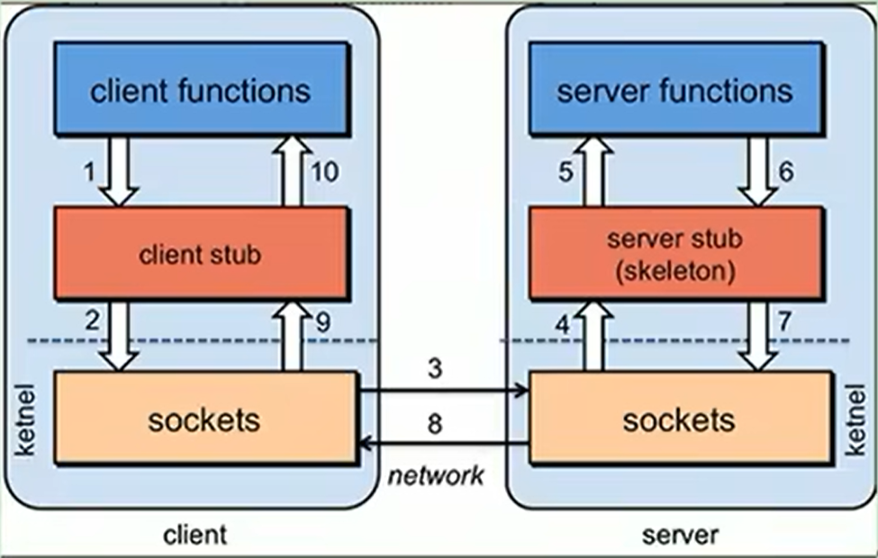
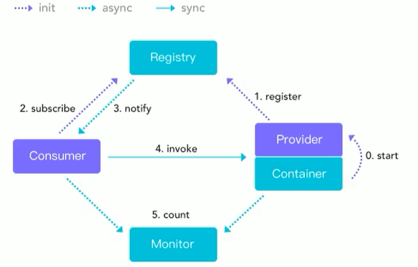

dubbo 学习


# 初识 Dubbo

## RPC

Remote Procedure Call 远程过程调用，是一种进程间通信方式。



> Feign 、Eureka、 restTemplate这些都是伪RPC，都是基于HTTP的；而Dubbo才是RPC框架

## Dubbo 简介

作为RPC框架，性能最为关键，其中最主要的两部分：序列化和网络通信

> 序列化：对象在网络传输，必须实现Serializable接口，必须序列化，如xml、Json、二进制流（最高效）
> 网络通信：不同于HTTP要7步（三次握手、四次挥手），Dubbo采用Socket通信机制，异步到位，提升了通信效率，且可以长连接。

### 特点

- 面向接口代理的高性能RPC调用

    提供高性能的远程调用能力，屏蔽调用的底层细节

- 服务自动注册和发现

    支持多种注册中心，服务上线实时感知。服务都注册在注册中心，之后RPC远程调用会先去注册中心找服务所在的服务器，并建立通信进行远程调用。

- 运行期流量调度

    内置条件、脚本等路由策略，配置不同的路由规则，实现灰度发布，
    > 灰度发布：慢慢进行过度的发布，最后统一所有服务器，使得用户没有任何感觉的过度到一个新版本，

- 智能负载均衡

    多种负载均衡策略，智能感知下游节点健康状况，提高吞吐量

- 高度可扩展能力

    支持可插拔以此扩展不同功能

- 可视化的服务治理与运维
    
    随时获取服务元数据、健康状态以及调用统计等

### Dubbo 架构



先通过容器启动，服务提供者注册到注册中心，消费者对注册中心进行订阅服务，如果服务提供者变更导致了注册中心发生了变更，那么注册中心会推送消费者。

### 环境搭建

```shell
# 查看系统内核
uname -r
# 查看已经安装的CentOS版本
cat /etc/redhat-release

# docker
# 添加镜像源
yum-config-manager --add-repo http://mirrors.aliyun.com/docker-ce/linux/centos/docker-ce.repo

# 安装yum 依赖 和 镜像源
yum install -y yum-utils device-mapper-persistent-data lvm2
yum makecache 
# 安装docker
yum -y install docker-ce（如果centos8 `sudo yum install docker-ce docker-ce-cli containerd.io --allowerasing`
systemctl enable docker && systemctl start docker

# 设置docker镜像
sudo mkdir -p /etc/docker
sudo tee /etc/docker/daemon.json <<-'EOF'
{
  "registry-mirrors": ["https://tgie9tnd.mirror.aliyuncs.com"]
}
EOF
sudo systemctl daemon-reload && sudo systemctl restart docker

# 卸载docker
systemctl stop docker
yum remove -y docker-ce
rm -rf /var/lib/docker
cd /usr/local && mkdir zookeeper && cd zookeeper
mkdir data
pwd

docker run -d -e TZ="Asia/Shanghai" -p 2181:2181 -v $PWD/data:/data --name zookeeper --restart always zookeeper:3.6
docker ps -a
```

dubbo管理控制台安装
- 压缩incubator-dubbo-ops-master.zip

- 修改dubbo-admin的application.properties


- 打包

mvn clean package

- 启动

java -jar dubbo-admin.jar

- Springboot & Dubbo 快速启动

> https://cn.dubbo.apache.org/zh-cn/overview/quickstart/

dubbo-quick-start
