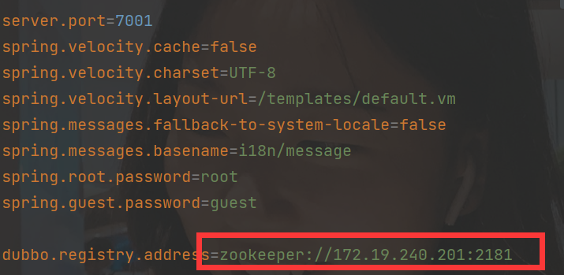
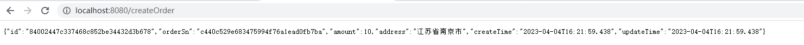
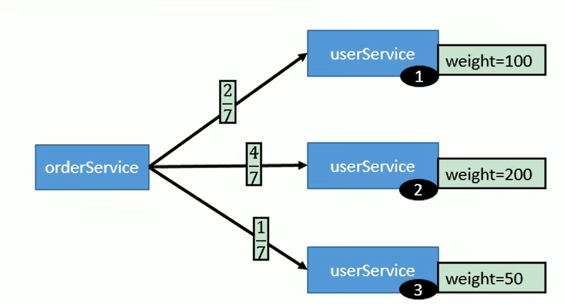
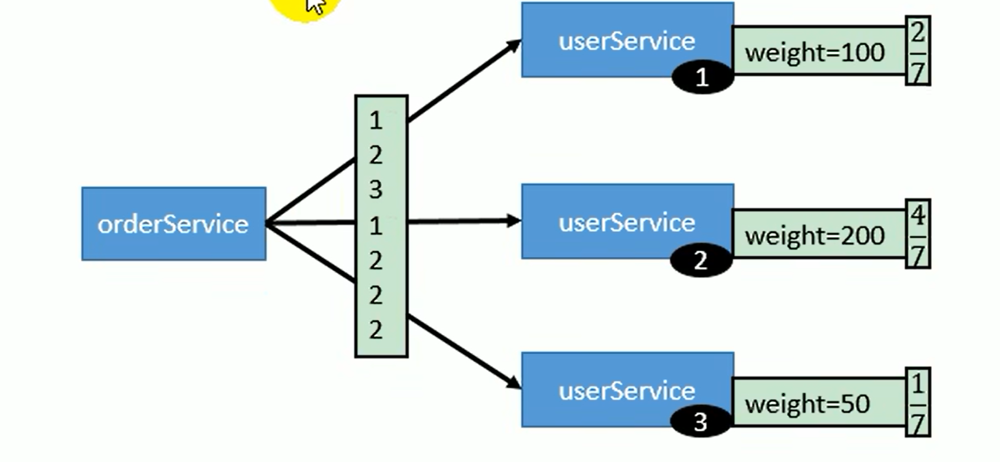
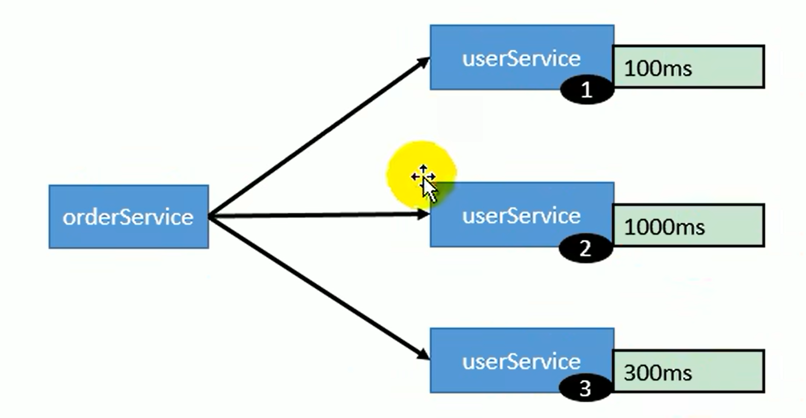
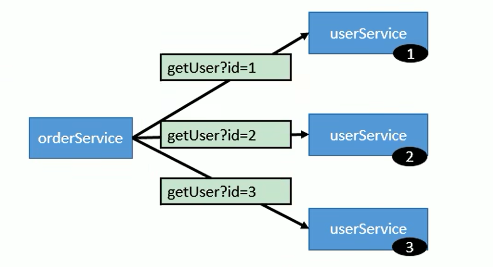
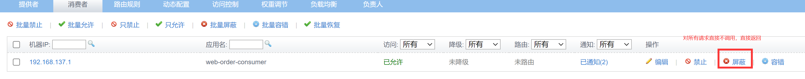
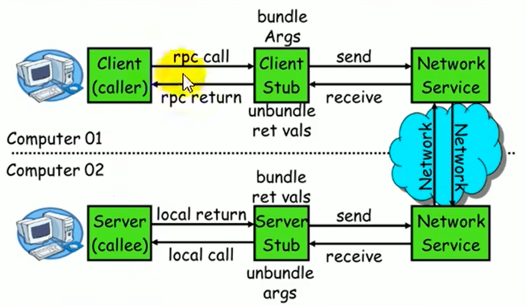
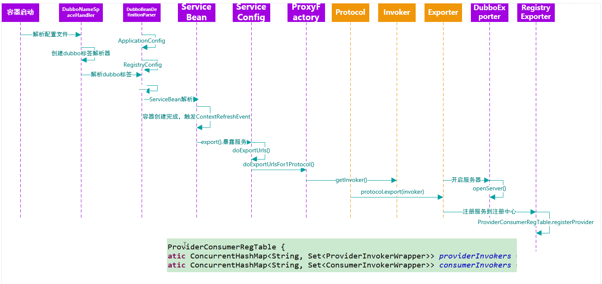
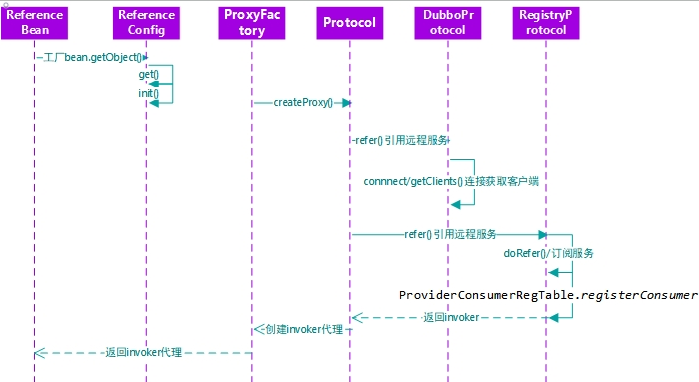

dubbo 学习


# 初识 Dubbo

## RPC

Remote Procedure Call 远程过程调用，是一种进程间通信方式。


> Feign 、Eureka、 restTemplate这些都是伪RPC，都是基于HTTP的；而Dubbo才是RPC框架

## Dubbo 简介

作为RPC框架，性能最为关键，其中最主要的两部分：序列化和网络通信

> 序列化：对象在网络传输，必须实现Serializable接口，必须序列化，如xml、Json、二进制流（最高效）
> 网络通信：不同于HTTP要7步（三次握手、四次挥手），Dubbo采用Socket通信机制，异步到位，提升了通信效率，且可以长连接。

### 特点

- 面向接口代理的高性能RPC调用

    提供高性能的远程调用能力，屏蔽调用的底层细节

- 服务自动注册和发现

    支持多种注册中心，服务上线实时感知。服务都注册在注册中心，之后RPC远程调用会先去注册中心找服务所在的服务器，并建立通信进行远程调用。

- 运行期流量调度

    内置条件、脚本等路由策略，配置不同的路由规则，实现灰度发布，
    > 灰度发布：慢慢进行过度的发布，最后统一所有服务器，使得用户没有任何感觉的过度到一个新版本，

- 智能负载均衡

    多种负载均衡策略，智能感知下游节点健康状况，提高吞吐量

- 高度可扩展能力

    支持可插拔以此扩展不同功能

- 可视化的服务治理与运维
    
    随时获取服务元数据、健康状态以及调用统计等

### Dubbo 架构


先通过容器启动，服务提供者注册到注册中心，消费者对注册中心进行订阅服务，如果服务提供者变更导致了注册中心发生了变更，那么注册中心会推送消费者。

# 入门

##  环境搭建

```shell
# 查看系统内核
uname -r
# 查看已经安装的CentOS版本
cat /etc/redhat-release

# docker
# 添加镜像源
yum-config-manager --add-repo http://mirrors.aliyun.com/docker-ce/linux/centos/docker-ce.repo

# 安装yum 依赖 和 镜像源
yum install -y yum-utils device-mapper-persistent-data lvm2
yum makecache 
# 安装docker
yum -y install docker-ce（如果centos8 `sudo yum install docker-ce docker-ce-cli containerd.io --allowerasing`
systemctl enable docker && systemctl start docker

# 设置docker镜像
sudo mkdir -p /etc/docker
sudo tee /etc/docker/daemon.json <<-'EOF'
{
  "registry-mirrors": ["https://tgie9tnd.mirror.aliyuncs.com"]
}
EOF
sudo systemctl daemon-reload && sudo systemctl restart docker

# 卸载docker
systemctl stop docker
yum remove -y docker-ce
rm -rf /var/lib/docker
cd /usr/local && mkdir zookeeper && cd zookeeper
mkdir data
pwd

docker run -d -e TZ="Asia/Shanghai" -p 2181:2181 -v $PWD/data:/data --name zookeeper --restart always zookeeper:3.6
docker ps -a
```

dubbo管理控制台安装
- 压缩incubator-dubbo-ops-master.zip

- 修改dubbo-admin的application.properties



- 打包

mvn clean package

- 启动

java -jar dubbo-admin.jar

- Springboot & Dubbo 快速启动

> https://cn.dubbo.apache.org/zh-cn/overview/quickstart/

## 测试

### dubbo-quick-start

启动ProviderApplication之后，如下


启动ConsumerApplication之后，如下


在之前的基础上多了一个对user-service-provider的消费者

### dubbo-web-demo

主要是对WEB端口测试

增加ConsumerController， 其余都类似
```java
@RestController("consumer")
public class ConsumerController {

    @DubboReference
    private OrderService orderService;

    @GetMapping("getOrder")
    public Order getOrder(){
        return orderService.createOrder();
    }
}
```

- 启动服务提供者

  发现已经注册成功


- 启动消费者

  发现已经注册成功
  

- 测试请求

如果404 控制台报错如下： not support none serializable class com.nju.web.domain.Order

需要把实体类进行序列化。




## 参数解释

有三种进行配置的方式:
- dubbo-starter 然后在 application.yaml 进行全局配置，或者 Reference或者Service上进行注解的配置

- 通过dubbo.xml进行bean的配置

- 通过注解Bean配置一个Config

```java
@Configuration
public class MyDubboConfig {
    @Bean
    public XXXConfig xxxConfig(){
    }
}

@EnableDubbo(scanBasePackageClasses = "com.nju.web")
```

### 消费者启动时检查是否存在服务提供者

```yaml
  consumer:
    check: false
```

```yaml
# 指定消费者取消启动时检查
  consumer:
    interface: com.nju.gmall.XXXService
    check: false
```

### 超时机制

超时设置优先级 消费者 > 提供者 && 方法 > 接口 > 全局。

```yaml
  consumer:
    timeout: 3500
```

```java
/**
 * 指定方法
 */
@DubboReference(version = "1.0.0",parameters = {
        "createOrder.timeout","2000"
})
private OrderService orderService;

/**
 * 指定接口
 */
@DubboService(version = "1.0.0",parameters = {
        "timeout","3000"
})
public class OrderServiceImpl implements OrderService 

```

在同时设置了全局超时和接口全局的时候，以接口优先：


### 重试机制

超时机制中，看服务提供者的控制台打印，默认是重试三次，这里进行重试次数设置。

```yaml
  consumer:
    timeout: 3500
    retries: 4
```

```java
/**
 * 指定方法
 */
@DubboReference(version = "1.0.0",parameters = {
        "createOrder.timeout","2000",
        "createOrder.retries","1"
})
private OrderService orderService;

/**
 * 指定接口
 */
@DubboService(version = "1.0.0",parameters = {
        "retires","0",
        "timeout","3000"
})
public class OrderServiceImpl implements OrderService 
```
查看服务提供者的控制台打印，重试2次，依旧是消费者 > 提供者 && 方法 > 接口 > 全局。

### Version

多版本可以实现灰度发布，先上线测试一部分的最新版本，平滑过度到最新版本。

```java
// 最新不超时版本
@DubboService(version = "2.0.0")
public class OrderServiceImplNew implements OrderService {

    @Override
    public Order createOrder() throws InterruptedException {
        return new Order(UUID.randomUUID().toString().replace("-", ""),
                UUID.randomUUID().toString().replace("-", ""),
                BigDecimal.TEN,
                "江苏省南京市",
                LocalDateTime.now(),
                LocalDateTime.now());
    }
}

// 休眠超时版本
/**
 * 正常使用
 */
@DubboService(version = "1.0.0")
public class OrderServiceImpl implements OrderService {

  @Override
  public Order createOrder() throws InterruptedException {
    Thread.sleep(3000);
    return new Order(UUID.randomUUID().toString().replace("-", ""),
            UUID.randomUUID().toString().replace("-", ""),
            BigDecimal.TEN,
            "江苏省南京市",
            LocalDateTime.now(),
            LocalDateTime.now());
  }
}

/**
 * Version 多版本测试
 */
@DubboReference(parameters = {
        "version","*"
})
```

查看服务提供者的控制台打印，Version来回进行切换调用

### 本地存根

其实就是转发前通过代理进行功能加强
```java
    @DubboReference(parameters = {
        "version", "2.0.0",
        "stub", "com.nju.web.service.order.impl.OrderServiceStub"
    })
    private OrderService orderService;
```

```java
public class OrderServiceStub implements OrderService {
    private final OrderService orderService;

    /**
     * 默认传入远程服务
     * @param orderService
     */
    public OrderServiceStub(OrderService orderService) {
        this.orderService = orderService;
    }

    @Override
    public Order createOrder() throws InterruptedException {
        System.out.println ("代理开启");
        return orderService.createOrder ();
    }
}
```


到这里结束了，后续都可以通过官网进行测试，https://cn.dubbo.apache.org/zh-cn/overview/home/

# 高可用

注册中心不会转发，只是一个路由表的功能

1. zookeeper与dubbo直连

现象：Zookeeper注册中心宕机，还可以消费dubbo暴露的服务

原因：健壮性
1. 监控中心宕机之后能使用，只是丢失部分采样数据
2. 数据库宕机，注册中心能通过缓存提供服务列表，但是不能注册新服务
3. 注册中心集群，任意一台宕机，能自动切换到另一台；即使全部宕机，消费者和提供者能通过本地缓存通讯
4. 服务提供者无状态，服务提供者宕机不影响使用
5. 服务提供者全部宕机，那么无法在消费，直到恢复

## 集群下dubbo的负载均衡

默认是random随机调用

### 策略
- Random(默认)

按权重设置随机概率



- RoundRobin

按权重的轮询负载均衡

轮询过程中考虑权重，如果发现已经超过其概率次数，就往后继续寻找机器来提供服务



- LeastActive

最少活跃调用（始终选择最快响应时间的机器）



- ConsistentHash

始终按照hash映射到指定的服务器



### 测试

```java
    @DubboReference(loadbalance = "roundrobin",parameters = {
            "version", "2.0.0"})
    private OrderService orderService;
```
添加两行代码，观察控制台打印结果
```java
    public Order createOrder() throws InterruptedException {
        System.out.println (2);

    public Order createOrder() throws InterruptedException {
        System.out.println (1);
```
启动两个相同的provider


有1、2说明确实是轮询。

调整随机的权重


## 服务降级

当服务器压力剧增，可以对服务进行不处理或者简单处理，释放一些资源保证核心交易正常运作。

设置熔断




## 集群容错

默认为failover

### 模式类别

#### failover

失败就自动重试其他服务器。

#### failfast

快速失败，非幂等性的写，只进行一次调用，失败就报错

#### failsafe

出现异常，直接忽略，写入审计日志

#### failback cluster

失败自动回复，并且后台做错误记录，定时重发，用于消息通知。一般用于必须成功的请求

#### forking cluster

并行调用多个服务器，只要一个成功返回。实时性较高，但是资源会浪费，一般forks=2进行设置最大并行数

#### Broadcast Cluster

广播调用所有提供者，任意一台报错就保存。通常与通知所有提供者更新缓存或日志等本地资源，实现数据一致性

### 整合Hystrix实现集群容错

在提供者、消费者配置pom

```xml
    <dependency>
          <groupId>org.springframework.cloud</groupId>
          <artifactId>spring-cloud-starter-netflix-hystrix</artifactId>
      </dependency>
```

开启Hystrix

```java
@SpringBootApplication
@EnableDubbo
@EnableHystrix
public class OrderProviderApplication

@SpringBootApplication
@EnableDubbo
@EnableHystrix
public class OrderConsumerApplication

```

配置容错方法和代码
```java
//OrderServiceImplNew  
@Override
@HystrixCommand
public Order createOrder() throws InterruptedException {
  return new Order(UUID.randomUUID().toString().replace("-", ""),
          UUID.randomUUID().toString().replace("-", ""),
          BigDecimal.TEN,
          "江苏省南京市",
          LocalDateTime.now(),
          LocalDateTime.now());
}

//ConsumerController
@GetMapping(value = "/createOrder")
@HystrixCommand(fallbackMethod = "mockOrder")
public Order createOrder() throws InterruptedException {
  return orderService.createOrder ();
}

public Order mockOrder(){
  return new Order(UUID.randomUUID().toString().replace("-", ""),
          UUID.randomUUID().toString().replace("-", ""),
          BigDecimal.TEN,
          "mock",
          LocalDateTime.now(),
          LocalDateTime.now());
}
```

## RPC原理



整体流程如下:
1. client消费者首先一本地方法的形式调用服务
2. client stub接收到之后将方法、参数等组装成能够进行网络传输的消息体，并找到服务地址，将消息发给服务端
3. server stub进行解码,并根据解码结果调用本地服务
4. 本地服务处理之后返回给server stub，server stub将结果打包并返回给消费方
5. client stub接收到之后进行解码，消费者最后会的结果。




