# 前言
工作中发现安全很是关键，涉及到一些加密算法，故特地简单学一下，该文件为简单的学习笔记，

# 对称加密算法

初等的加密算法，常见的对称加密算法有：
- DES
  - 3DES
- AES
- PBE
- IDEA

## DES

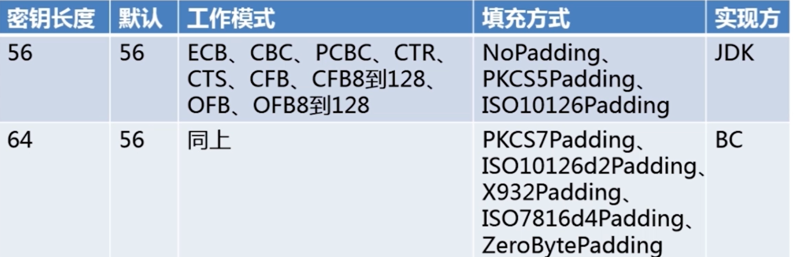

具体流程：
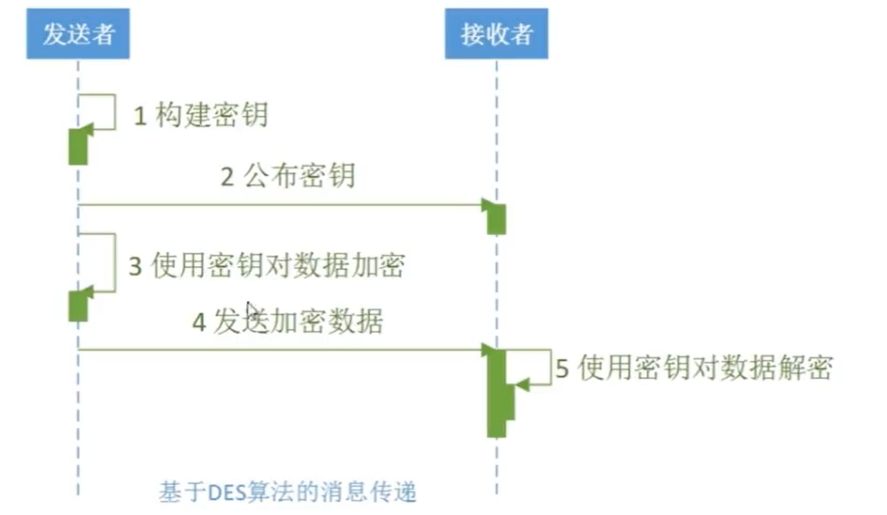

### 特点：
- 加密解密速度快。密钥长度短，可能会被破解。
- DES的密钥长度只有56位，有利于攻击者使用穷举法试图破解密钥。

### 为什么不使用：

现在已经不再使用，被更加安全的加密算法所取代，如AES。

## 3DES（Triple DES 或者 DESede）

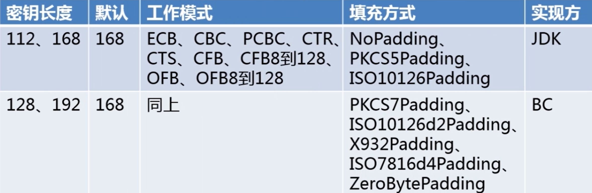

### 特点：

- 采用了DES算法的多轮加密方式，进一步提高了加密的安全性。 
- 密钥长度变长，破解难度增加，安全性提高。 
- 能够兼容DES系统，替代单轮DES，提高安全性。

### 使用场景：

- 适用于需要高度安全性的场景，例如银行、金融机构等。
- 适用于需要向多个受信任的实体发送信息时，每个实体都有自己的加密密钥，使用3重DES可以保证这些信息得到足够的安全保护。

### 为什么不用：

然而，随着计算机处理能力的飞速提高，3重DES对抗攻击的能力已经不足以保证安全。由于3重DES运算速度比单DES慢一倍以上，加/解密效率低下也成为了一个问题。因此，现在一般不再建议使用3重DES，
取而代之的是更加安全快速的AES（高级加密标准）算法，密钥长度从128-256位可选，是目前最广泛使用的加密算法之一。

## AES（Advanced Encryption Standard）

AES是目前最流行的加密算法之一，至今尚未被破解

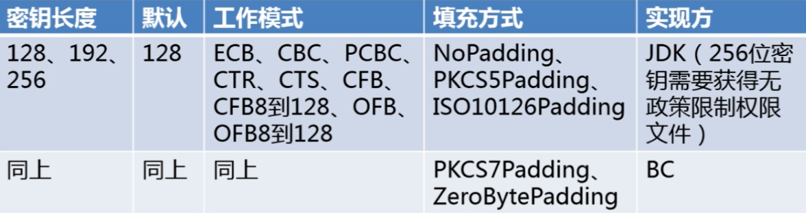

### 特点：

- 高度安全性：AES使用高度安全的加密算法，可避免黑客攻击和数据泄漏。
- 处理速度快：AES加/解密速度快，计算速度快，是更加高效的加密方式。
- 安全性强：AES能够支持128位、192位和256位密钥长度，可以为不同的应用提供不同的安全级别。

### 使用场景：

- 保护重要数据：AES可用于对敏感信息进行加密保护，如银行账户、个人信息和医疗记录。 
- 保护网络传输安全：AES可用于保护通过网络传输的敏感数据，如电子邮件、文件传输和数据库传输等。
- 保护通信安全：AES可用于加密通信，如移动电话通话或视频会议中的语音或视频数据。

### 为什么不用：

- 从侧信道攻击和行为分析的角度看，AES漏洞可能会让攻击者访问密钥而不是加密文本。
- 相对于硬件加密，软件AES实现速度相对较慢，因此在特定场景下，如信息量非常大时，可能需要寻求其他安全方案。

## PBE（Password-Based Encryption）

即基于密码的加密

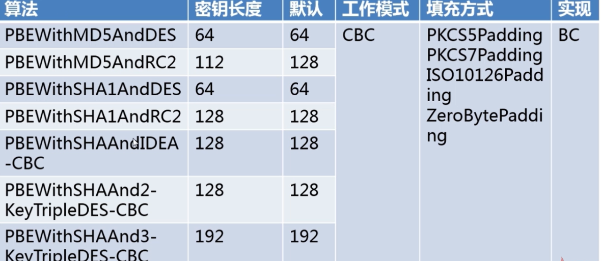

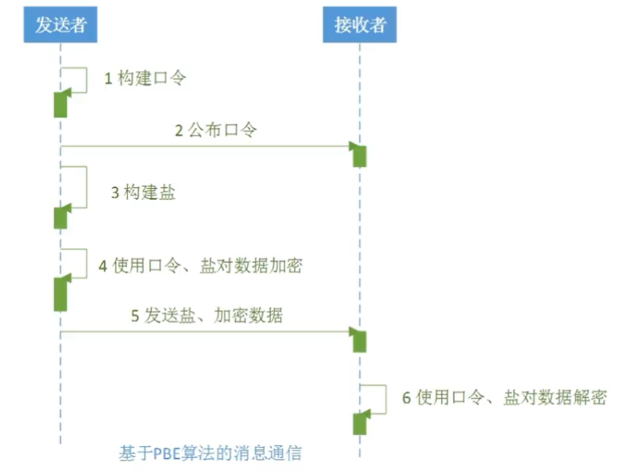

### 特点：

可以使用用户输入的密码作为密钥来加密和解密数据。 具体来说，PBE在加密数据之前会根据用户输入的密码生成一个密钥，
在解密时再根据同样的密码重新生成密钥，从而实现加密和解密操作。

### 使用场景：

- 需要根据用户的密码来对数据进行加密和解密的场景。

- 将加密后的数据保存到数据库中，只有在用户输入正确的密码后才能解密和使用的场景。

- 所有需要加密和解密的场景，例如加密和解密文件、保护敏感信息等。

### 为什么不使用：

需要非常高强度以及更加安全的加密过程中。PBE的加密过程是基于密码的，因此其安全性取决于密码的强度。如果密码强度较弱，
黑客可以通过暴力破解来获得密钥，从而可以解密数据。此外，PBE相对于其他加密算法来说，其加密速度较慢。

对数据在传输和存储过程中进行加密保护的场景，但在更加高强度和更加安全的场景中则不太适用。

# 非对称加密算法

高等的加密算法， 双保险（即公钥、私钥）
- DH（Diffie-Hellman） 密钥交换算法
- RSA——基于因子分解（应用范围最广的非对称）
- ElGamal——基于离散对数
- ECC（Elliptical curve Cryptography）——椭圆曲线加密

## DH

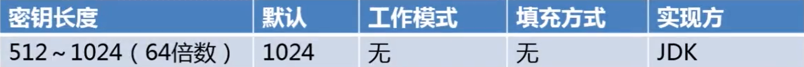

1. 发送方生成密钥对，并将公钥发送给接收方。 
2. 接收方收到发送方的公钥后，根据该公钥生成自己的密钥对，并将公钥发送回发送方。 
3. 发送方收到接收方的公钥后，再根据接收方的公钥生成自己的密钥。 
4. 双方生成的密钥相同，用于对称密钥加密，通信加密。

### 特点 ：

- 安全：由于DH算法采用了离散对数问题，很难被破解，因此安全性较高。 
- 无需预共享密钥：DH算法不需要预先存在共享密钥，可以在协商密钥时动态生成，因此具有很好的灵活性。 
- 高效：DH算法的计算开销较小，可在较短的时间内完成密钥协商。

### 使用场景：

主要用于需要保障通信安全的场景，比如网上银行、固话与手机通信等。它可以有效地避免密钥被偷窥、窃听等安全问题。
典型的DH算法使用例子是TLS协议，该协议广泛应用于互联网浏览器和Web服务器之间，确保用户的隐私信息在传输过程中得到安全保护。

### 为什么弃用：

无法解决中间人攻击问题，即攻击者可以伪装成与通信双方进行通信，从而窃取密钥，导致通信数据泄露。
除此之外，DH算法也存在一些种族歧视问题，被认为不能完全保证公正性。

## RSA

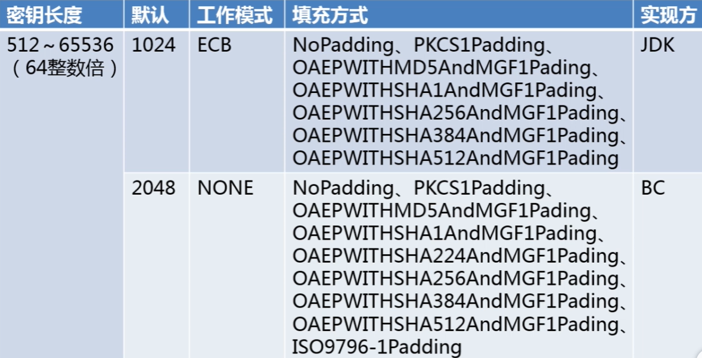

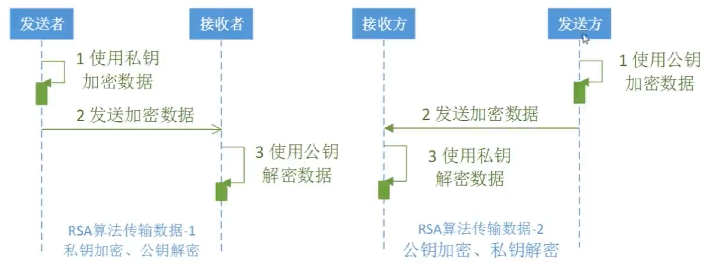

### 特点
- 非对称性：RSA算法使用一对密钥（公钥与私钥）进行加解密。公钥可以公开，任何人都可以获得，而私钥只有密钥持有人才能知道。因此，RSA算法具有非对称性，即加密和解密使用不同的密钥。
- 安全性：RSA算法基于数论中某些难解的问题，如质数分解，因此被认为是一种安全可靠的加密算法。
- 可签名性：除了可以用于加解密，RSA算法还可以用于数字签名。数字签名在保证通信过程中信息不被篡改，起到防抵赖的作用。

### 使用场景

- 加密通信：RSA算法可用于数据加密，保证通信过程中信息不被窃听、修改。
- 数字签名：RSA算法可用于生成数字签名，保证信息的完整性、真实性和抗抵赖性。
- 身份认证：RSA算法可用于身份认证，确认对方的身份和合法性。当然，在实际应用场景中，通常需要配合其他加密算法和协议来实现更加安全的通信。

## EIGamal

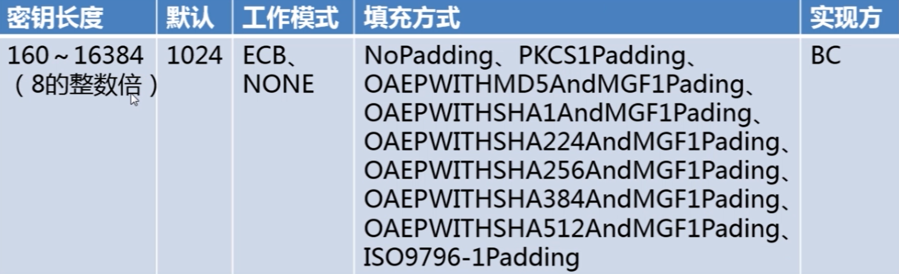

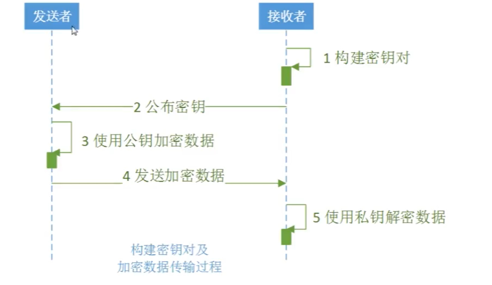

### 特点：

- 非对称性：ElGamal算法使用一对密钥（公钥与私钥）进行加解密。公钥可以公开，任何人都可以获得，而私钥只有密钥持有人才能知道。因此，ElGamal算法具有非对称性，即加密和解密使用不同的密钥。
- 安全性：ElGamal算法基于数论中某些难解的问题，如离散对数问题，因此被认为是一种安全可靠的加密算法。
- 可扩展性：ElGamal算法可扩展到多方秘密共享和群组加密等应用场景。

### 场景

- 加密通信：ElGamal算法可用于数据加密，保证通信过程中信息不被窃听、修改。
- 数字签名：ElGamal算法可用于生成数字签名，保证信息的完整性、真实性和抗抵赖性。
- 秘密共享：ElGamal算法可用于实现多方秘密共享，如在分布式系统中实现机密信息共享。
- 群组加密：ElGamal算法可扩展到群组加密中，实现多方通信的安全保障

需要注意的是，ElGamal算法在加解密速度和密钥长度等方面与RSA算法有所不同，具体应用场景需要考虑算法特点和应用需求。

# 消息摘要算法（数字摘要）

消息摘要算法的主要特征是加密过程不需要密钥，并且经过加密的数据无法被解密，
可以被解密逆向的只有CRC32算法，只有输入相同的明文数据经过相同的消息摘要算法才能得到相同的密文。
消息摘要算法是一种单向函数，不可逆，只能用于数据完整性校验或者数字签名验证。如文件的上传和下载时候的校验。

- MD
  - MD5
  - MD2
  - MD4
- SHA
  - SHA1
  - SHA256
  - SHA512
- MAC

## MD

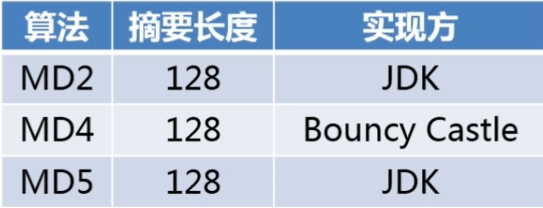

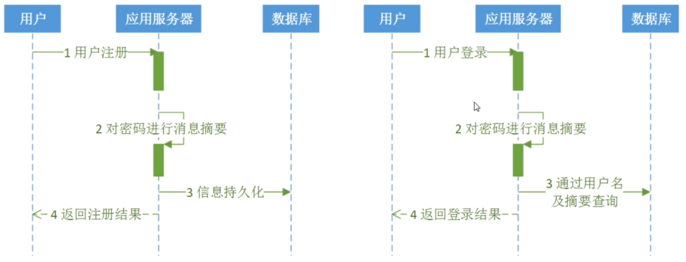

### 特点：

- 输出固定长度的摘要信息，MD2、MD4和MD5的输出长度均为128bit
- 输入长度不限，支持任意长度的输入
- 算法简单，速度较快
- 适合用于数据完整性校验和数字签名等场景

### 使用场景：
MD算法广泛应用在数字签名、数据完整性校验、密码学中的消息验证码和密码存储等领域。比如在网络通信中，由于数据传输的不可靠性，MD算法可以用于校验传输过程中是否有修改、丢失和重放攻击等情况。

### 为什么弃用？
采用MD算法进行数字签名时，如果想要保证算法的不可逆性和安全性，需要保证算法满足以下条件：

- 碰撞攻击强度很高，即两个不同的输入难以生成同样的输出；
- 抵抗预像攻击，即由输出恢复输入的难度很高。

- 然而，MD2、MD4和MD5的算法结构相对较简单，所以很容易受到各种攻击，不具备足够的安全性。比如，在2012年，研究人员证明了MD2算法容易受到碰撞攻击，而MD4和MD5算法也已经被证明存在安全隐患。因此，这些算法已经被弃用，目前广泛应用的安全消息摘要算法是SHA (Secure Hash Algorithm) 算法。

## SHA

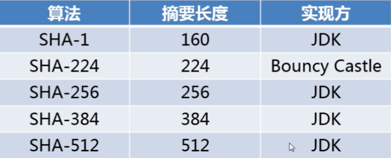

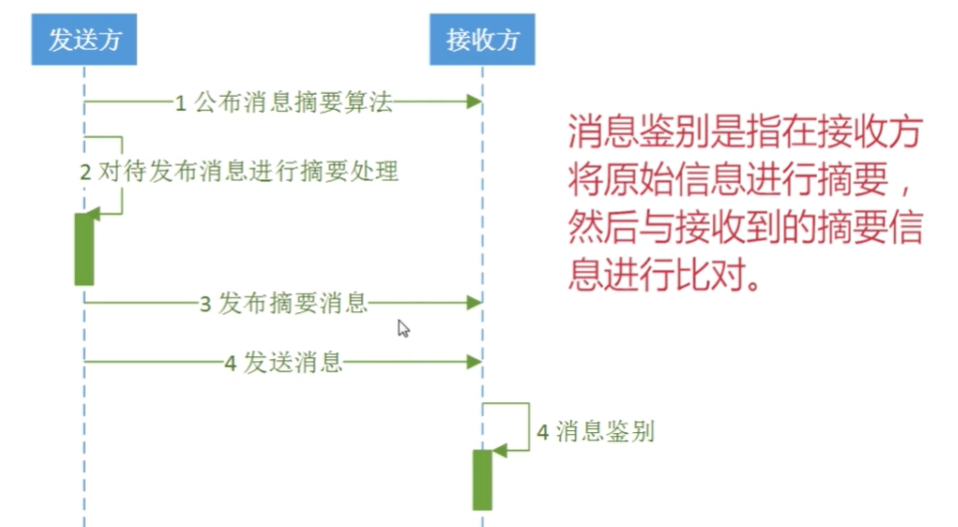

### 特点：

- 输出固定长度的摘要信息，SHA-1、SHA-2、SHA-3的输出长度分别为160bit、224/256/384/512bit和224/256/384/512bit；
- 输入长度不限，支持任意长度的输入；
- 算法复杂度高，安全性较高；
- 适合用于数据完整性校验和数字签名等场景。

### 使用场景：

SHA算法被广泛应用于网络通信、数据传输、数字签名、加密解密等领域。
比如，在密码学中，SHA算法可以用于对密码进行哈希化处理，生成随机的、不可逆的摘要值，从而保证密码的安全和保密性；
在数字签名中，SHA算法可以用于对数据进行哈希处理，生成唯一的数字签名，从而证明数据的完整性和不可否认性。

#### 摘要算法整体流程：

- 事先约定key
- 请求链接
  - 
  其中msg是对 原始信息（原始的摘要信息（事先约定好） + key（事先会约定，就如同代码中的SOURCE）+ 时间戳 三部分）进行sha加密，之后发送过去
- 最后接收方根据约定，对原始信息同样加密，最后看是否相同

### 为什么广泛使用：

相对于MD算法来说，SHA算法具有更高的安全性和强度，主要是因为SHA算法具有更复杂的算法结构和更长的摘要长度。此外，SHA算法的标准也在不断地被更新和完善，如目前广泛使用的SHA-2算法就比SHA-1算法具有更高的安全性。因此，SHA算法目前没有被弃用，而是被广泛应用于各种应用领域中。

## MAC算法

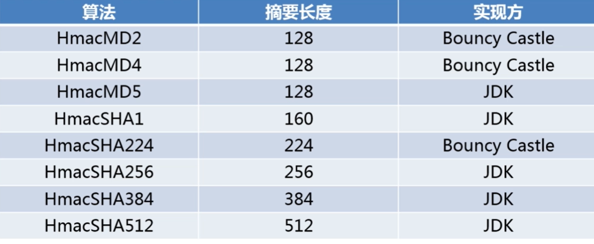

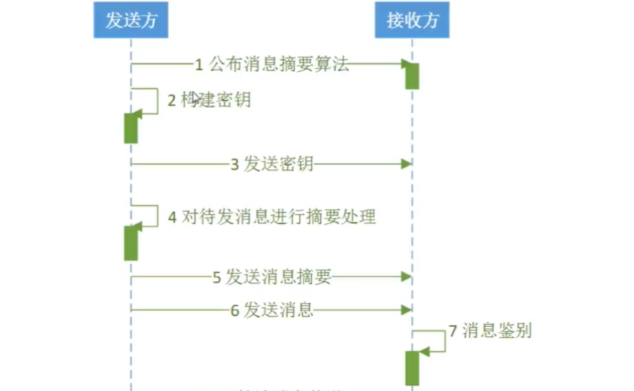

### 特点：
- 使用一个密钥来加密消息，只有拥有该密钥的人才能解密消息和验证其完整性和真实性；
- 使用的算法可以是基于对称密钥的加密算法，如AES、DES等；
- 可以提供较高的安全性，能够有效防止消息被篡改或伪造；
- 在使用 MAC 算法时，对消息进行了加密后，并不会增加消息的长度，这使得 MAC 算法在网络传输数据时更加高效；

### 使用场景：

MAC 算法的使用场景主要包括密码学方面、数据安全方面、网络通信方面等。常见的应用包括电子邮件、移动通信、电子商务和网络银行等。MAC 算法被广泛
应用于数据传输过程中的验证与加密，特别是在需要保证通信安全的金融、军事、安全等领域中。

### 为什么弃用：

MAC 算法主要是基于对称密钥的加密算法，需要保证发送者和接收者都有密钥，但如果密钥被盗取或泄露，就会导致数据泄露，因此安全性问题成为该算法的主要缺点。为了提高安全性，一些安全协议已经不再使用 MAC 算法，而使用更加安
全的公钥加密算法和数字签名等技术来解决安全问题。

# 数字签名

经过非对称加密的消息摘要，保证数据完整性、认证数据来源、抗否认、

私钥签名、公钥验证

- RSA
- DSA
- ECDSA

## RSA

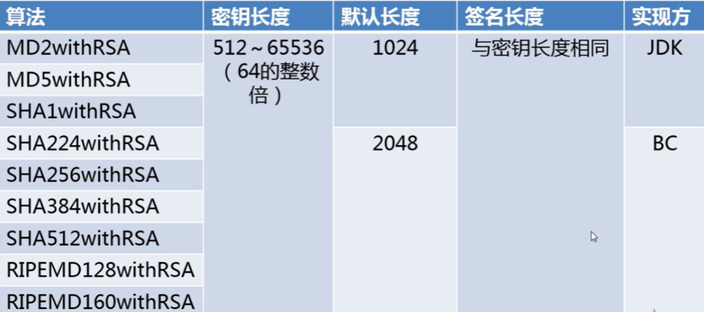

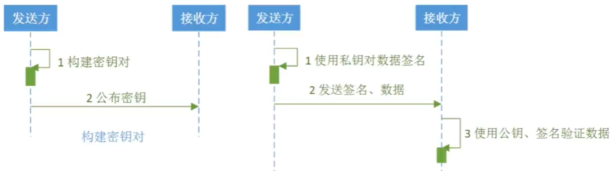

## DSA

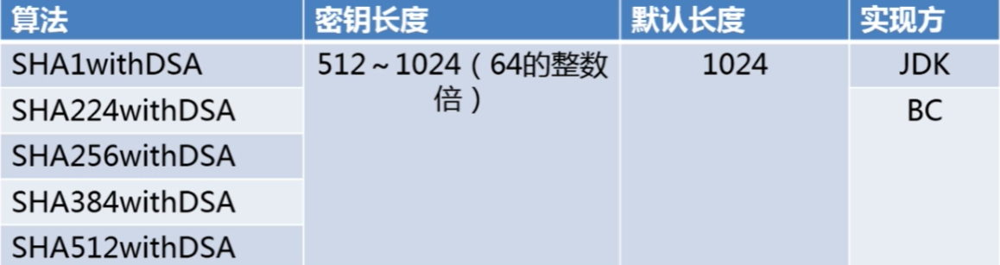

### 特点：

- 安全性高：DSA 算法的安全性基于离散对数问题，是一种比较强的安全性保障。
- 验证效率高：DSA 算法采用哈希函数，可以快速计算签名的值。
- 签名效率低：DSA 签名的计算相对较为耗时，需要较大的运算量和较长的时间。

### 使用场景：

DSA 的主要应用场景是数字签名和身份认证，以保证数据的完整性和合法性，防止篡改和伪造。DSA 由于其高安全性和验证效率，被广泛应用于信息安全领域中的各种应用场景，
例如：网络通信中的数据签名和身份认证、电子票据、文件保险箱等领域的身份验证和电子签名

### 为什么弃用：
DSA 算法在一些标准和政策方面存在问题，主要原因是它对密钥长度的限制，而且很难升级到更强的安全强度。目前，DSA 的使用越来越少，主要被更安全和更灵活的算法所替代，例如 ECDSA 和 RSA 等。

## ECDSA

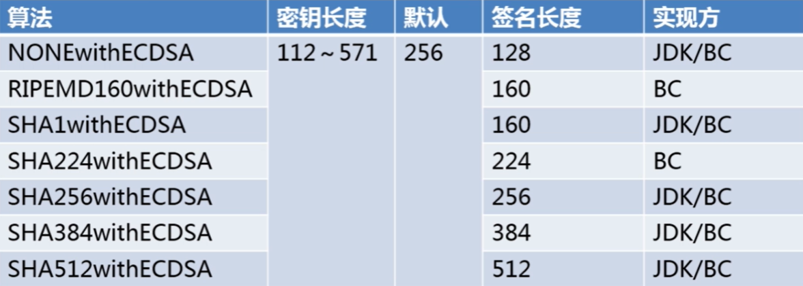

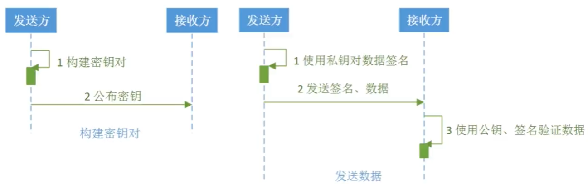

### 特点：
- 安全性高：与DSA算法相比，ECDSA算法的签名长度较短，但是具有相同的安全等级。
- 计算效率高：与RSA算法相比，ECDSA算法的签名和验签速度更快。
- 密钥长度短：相对于RSA算法来说，ECDSA算法在确保安全强度的情况下，可以使用更短的密钥长度，更适合于低功耗设备和资源受限设备。

### 使用场景：

- 云计算环境中的身份验证和数据安全保护；
- 终端设备中的身份认证和数据传输保护；
- 金融支付领域中的交易签名和验证等。

### 缺点：

ECDSA的优点在于安全等级高、计算效率高等特点，同时还可以使用更短的密钥长度。但是在一些标准和政策方面存在一些问题，主要原因是没有一个广泛接受的标准，同时ECDSA算法的实现和参数设置都比较复杂，导致在
实际应用中比较困难。此外，ECDSA算法也存在一些攻击方式，在安全性保障方面需要更加注意。

# bug 记录

## 问题

### 简述

java.security.invalidkeyexception: illegal key size or default parameters

java环境安装的时候自带的安全策略的密钥长度受限了，因为美国对软件出口的限制。需要去oracle官方网站下载

#### 问题解决

[JDK6 Java Cryptography Extension (JCE) Unlimited Strength Jurisdiction Policy Files 6] (https://www.oracle.com/java/technologies/jce-6-download.html)
[JDK7 Java Cryptography Extension (JCE) Unlimited Strength Jurisdiction Policy Files 7 Download] (https://www.oracle.com/java/technologies/javase-jce7-downloads.html)
[JDK8 JCE Unlimited Strength Jurisdiction Policy Files for JDK/JRE 8 Download] (https://www.oracle.com/java/technologies/javase-jce8-downloads.html)

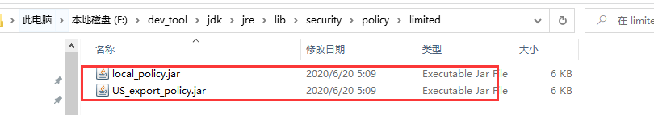 替换这两个文件即可。

# 总结

## 对称加密 vs 非对称加密

- 对称加密
又称为共享密钥加密，它是一种加密方法，使用同一个密钥进行加密和解密。因此，密钥在加密和解密过程中都是相同的。对称加密算法执行快速，但存在密钥分发问题，就是如果敌手截取了密钥，那么其实一切就一点不安全了。对称加密算法的常见算法有DES、3DES和AES。

- 非对称加密 
又称为公开密钥加密，它是一种加密方法，使用公钥和私钥进行加密和解密。公钥是公开的，任何人都可以获取，它用于加密数据；而私钥是保密的，只有密钥的所有者可以获取它，它用于解密数据。非对称加密算法执行缓慢，但不需要密钥分发，所以更为安全。非对称加密算法的常见算法有RSA、ECC和DSA。非对称加密算法还广泛用于数字签名、密钥协商和身份验证等场景。

对称加密的优点是执行速度快，缺点是存在密钥分发问题，不适用于公开环境。非对称加密的优点是不需要进行密钥分发，更加安全，但执行速度较慢。两者在实际应用中常常结合使用，以克服各自的缺点。

## 消息摘要

消息摘要是指从作为数字签名对象的文件整体中计算出来的数值。对比由文件计算出的信息摘要，可以证明文件的内容有没有被篡改。通过摘要算法计算后的消息摘要其长度总是固定的，所以也叫数据指纹，它可以唯一地标识一段数据。
消息摘要算法的主要特征是加密过程不需要密钥，并且经过加密的数据无法被解密（单向加密）。

## 数字签名

使用非对称加密算法加密处理过的消息摘要就是数字签名，又叫公钥数字签名。消息的发送者使用私钥对消息摘要进行加密，消息接收者再用消息发送者提供的公钥进行解密。
印章或签名有两层含义：一是发送者承认文件的内容是完整有效的（消息摘要）；其二是文件确实是发送者本人发送的（使用私钥加密）。
