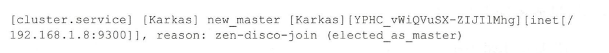
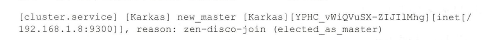
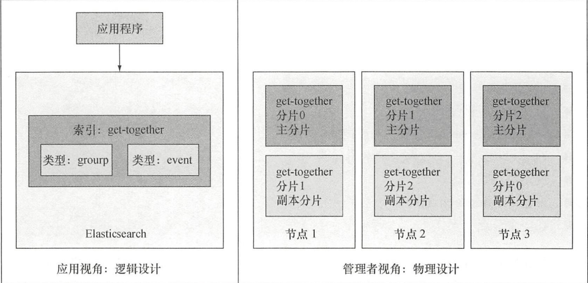
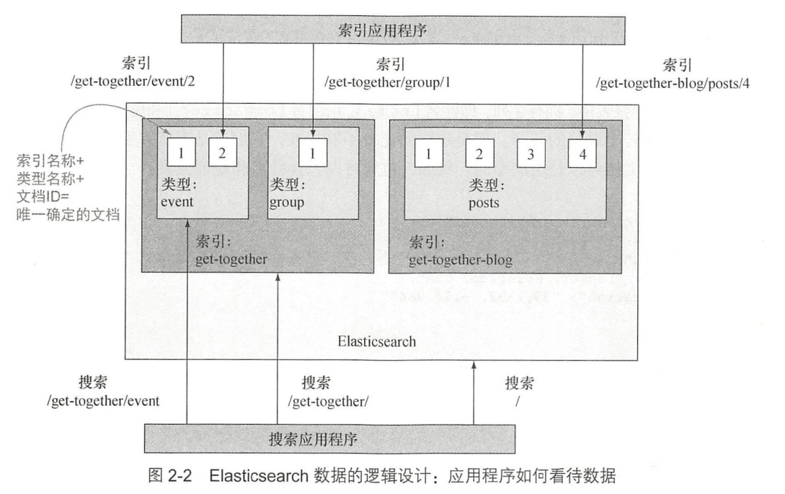
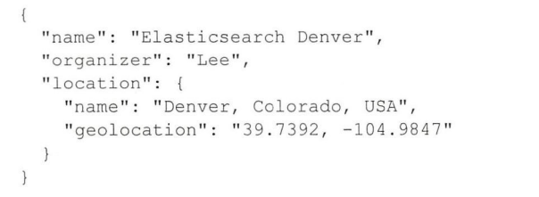

根据《Elasticsearch in action》重新学习Elasticsearch ， 回顾一下基础

# Elasticsearch 介绍

## 用ES解决搜索问题

### 提供快速查询

使用倒排索引：


### 结果的相关性

默认相关性得分算法： TF-TDF（词频-逆文档频率）
- 词频——查找的单词在文档中出现次数越多，得分越高
- 逆文档词频——如果某个单词在文档中比较少见，那么词的权重就越高，得分就越高

可以定制化需求，实现自定义字段得分

### 超越精确匹配
不局限于精确匹配，当用户错误拼写、同义词、派生词的时候，使用起来更加方便。

- 处理错误拼写
如 bicycel 可以找到 bicycles的内容
- 支持变体
bicycle 同样可以可以跟bicycliist和sycling匹配
- 使用统计信息
如 自行车大类里有好多小的分类统计 ： 自行车鉴赏、自行车大事件
- 给予自动提示
通过特殊的查询类型来匹配前缀、通配符或者正则表达式来进行自动提示。建议器的效率高于普通的查询。

## 典型的ES使用案例

历史上的搜索引擎没有持久化以及统计功能。ES是一个现代搜索引擎，提供了持久化存储、统计以及其他数据存储的特性。ES不支持事务。

## Elasticsearch 主要特性

在Lucene之上，从缓存到实时性分析。

> 什么是Apache Solr
> 基于Lucene的分布式搜索引擎。ES采用分布式模式，而Solr加入分片、

大体执行流程如下:


默认情况下，ES原封不动地保存文档，将解析出的词条放入倒排索引，使得重要、快速、相关性好的搜索成为可能。

## docker安装ES

```bash
docker pull docker.elastic.co/elasticsearch/elasticsearch:8.3.2
docker network create elastic
docker run --name es01 -p 9200:9200 -it docker.elastic.co/elasticsearch/elasticsearch:8.3.2
```
启动之后，出现：node节点名称、ES版本号、java进程号；同时加载插件；
- 9300默认是节点之间的通信端口

- 选举主节点

- 9200端口默认用于HTTP通信

- 节点启动

- gateway持久化数据,启动节点时，gateway会查看磁盘来判断是否有数据意外保存过来恢复数据


通过http://ip:9200来发起http请求

## 总结
- ES建立在Lucene基础上的搜索引擎，用来索引大规模数据，可以全文搜索和实时数据统计，是一个NoSQL数据存储，包括试试搜索和分析。
- 自动数据分片，服务器负载均衡，扩展性强。

# 深入功能

- 逻辑设计——索引和搜索的单位都是文档，可以认为是数据库中的一行。类型包含若干文档，一个或者多个类型存在于同一索引，就好像行——表——数据库。
- 物理设计——索引分片，并且在服务器之间迁移；物理设计的配置方式决定了集群的性能、可扩展性、可用性


## 理解逻辑设计：文档、类型、索引

索引一篇文章，就是一个类型。聚会索引get-together包含：活动、分组。文档有标签id


### 文档

数据的最小单位

- 自我包含
- 层次性：location 包含城市、街道。就是非原子
- 灵活的结构：没有预先定义的模式，就如同没有表结构设计，其中location在数据没集齐的时候就可以省略



字段类型很重要，需要保存字段和类型之间的映射，故类型也被称为映射类型。

### 类型

不同的类型中最好存放不同的结构文档。例如类型定义聚会时的分组，另一个类型定义人们参加的活动。

如name映射为string，location的geolocation映射为geo_point;

> 无模式：映射首先指定某个类型中当前索引的所有文档的所有字段，但是不是要求文档要有所有的字段，即使数据有缺失也能加入。

### 索引
是由一个或多个分片数据块组成，多台服务器运行，同一个索引的多个分片在所有服务器存活，可扩展性好。

是类型的容器，类似数据库。所有索引存储在磁盘上的同组文件中，存储了所有映射类型字段。每个索引都有一个refresh_interval的设置，定义了文档对于搜索可见的时间间隔。

更新少，否则影响性能，默认每秒一次，准实时就是此原因。

## 理解物理设计： 节点和分片


