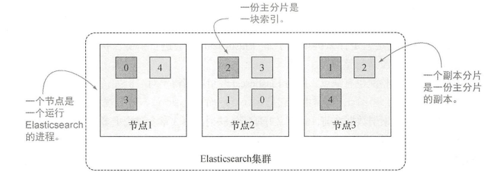
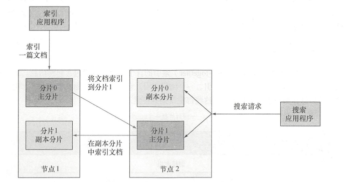
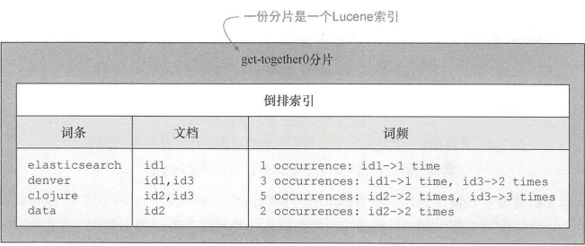
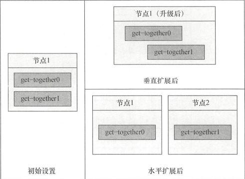
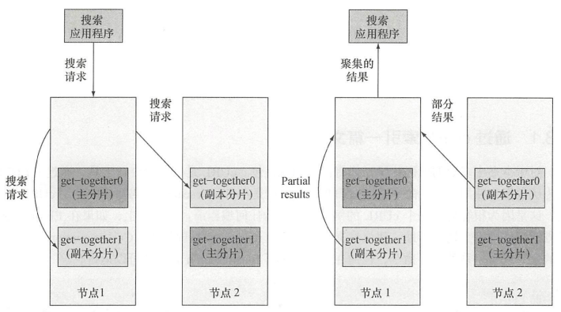
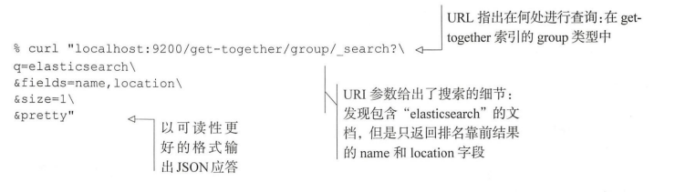
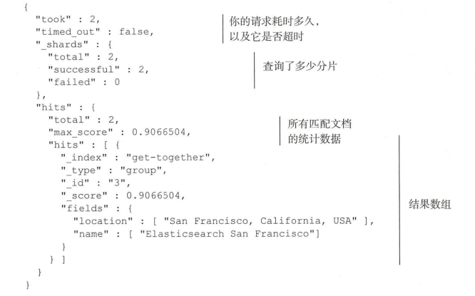

根据《Elasticsearch in action》重新学习Elasticsearch ， 回顾一下基础。

# Elasticsearch 介绍

## 用ES解决搜索问题

### 提供快速查询

使用倒排索引：


### 结果的相关性

默认相关性得分算法： TF-TDF（词频-逆文档频率）
- 词频——查找的单词在文档中出现次数越多，得分越高
- 逆文档词频——如果某个单词在所有文档中比较少见，那么词的权重就越高，得分就越高

可以定制化需求，实现自定义字段得分

### 超越精确匹配
不局限于精确匹配，当用户错误拼写、同义词、派生词的时候，使用起来更加方便。

- 处理错误拼写
如 bicycel 可以找到 bicycles的内容
- 支持变体
bicycle 同样可以可以跟bicycliist和sycling匹配
- 使用统计信息
如 自行车大类里有好多小的分类统计 ： 自行车鉴赏、自行车大事件
- 给予自动提示
通过特殊的查询类型来匹配前缀、通配符或者正则表达式来进行自动提示。建议器的效率高于普通的查询。

## 典型的ES使用案例

历史上的搜索引擎没有持久化以及统计功能。ES是一个现代搜索引擎，提供了持久化存储、统计以及其他数据存储的特性。ES不支持事务。

### Elasticsearch 主要特性

在Lucene之上，ES添加了自己的功能，从缓存到实时性分析。 默认是集群化的，即使是单台服务器上运行，也称为集群。

> 什么是Apache Solr
> ES和Solr都是基于Lucene的分布式搜索引擎。ES采用分布式模式，而Solr采用分片

大体执行流程如下:


默认情况下，ES原封不动地保存文档，将解析出的词条放入倒排索引，使得重要、快速、相关性好的搜索成为可能。

### docker安装ES

```bash
docker pull docker.elastic.co/elasticsearch/elasticsearch:8.3.2
docker network create elastic
docker run --name es01 -p 9200:9200 -it docker.elastic.co/elasticsearch/elasticsearch:8.3.2
```
启动之后，出现：node节点名称、ES版本号、java进程号；同时加载插件；
- 9300默认是节点之间的通信端口

- 选举主节点

- 9200端口默认用于HTTP通信

- 节点启动

- gateway持久化数据,启动节点时，gateway会查看磁盘来判断是否有数据意外保存过来恢复数据


通过http://ip:9200来发起http请求

## 总结
- ES建立在Lucene基础上的搜索引擎，用来索引大规模数据，可以全文搜索和实时数据统计，是一个NoSQL数据存储
- 自动数据分片，服务器负载均衡，扩展性强。

# 深入功能

- 逻辑设计——索引和搜索的单位都是文档，可以认为是数据库中的一行。类型包含若干文档，一个或者多个类型存在于同一索引，就好像行——表——数据库。
- 物理设计——索引分片，并且在服务器之间迁移；物理设计的配置方式决定了集群的性能、可扩展性、可用性


## 理解逻辑设计：文档、类型、索引

索引一篇文章，就是一个类型，类型有多个文档，每个文档都有唯一的标签id


### 文档

数据的最小单位

- 自我包含
- 层次性：location 包含城市、街道。就是非原子
- 灵活的结构：没有预先定义的模式，就如同没有表结构设计，其中location在数据没集齐的时候就可以省略


字段类型很重要，需要保存字段和类型之间的映射，故类型也被称为映射类型。

### 类型

不同的类型中最好存放不同的结构文档。例如一个类型定义聚会时的分组，另一个类型定义人们参加的活动。

每个类型中字段的定义称为映射。如name映射为string，location的geolocation映射为geo_point;

> 提示如果一个字段不是JSON文档的根节点，在其中搜索时必须指定路径。举个例子 location 中的 geolocation 字段被称为 location.geolocation。

#### 无模式

映射首先指定某个类型中所有文档的所有字段，但不是要求文档要有所有的字段，即使数据有缺失也能加入。同样如果有一篇新的索引文档
拥有一个映射中不存在的字段，ES也能猜测字段类型，自动加入该字段映射。

例如，如果值是 7, Elasticsearch 会假设字段是长整型。这种新字段的自动检测也有缺点，因为 Elasticsearch 可能猜得不对。例如，在索引了值 7之后，你可能想再索引hello world，
这时由于它是 string 而不是 long，索引就会失败。对于线上环境，最安全的方式是在索引数据之前，就定义好所需的映射。

### 索引
是由一个或多个分片数据块组成，多台服务器运行，同一个索引的多个分片在所有服务器存活，可扩展性好。

是类型的容器，类似数据库。所有索引存储在磁盘上的同组文件中，存储了所有映射类型字段。每个索引都有一个refresh_interval的设置，定义了文档对于搜索可见的时间间隔。
更新少，否则影响性能，默认每秒一次，准实时就是此原因。

## 理解物理设计： 节点和分片

索引创建的时候，每个索引默认5个主要分片，每个主要分片一个副本分片，所以总共10分片



副本分片对于可靠性和搜索性能很有益处。技术上而言，一份分片是一 个目录中的文件,
Lucene 用这些文件存储索引数据。分片也是 Elasticsearch 将数据从一个节点迁移到另一个节点的最小单位。

### 创建一个或多个节点的集群

#### 当索引一篇文档时发生了什么

默认情况下，当索引一篇文档的时候，系统首先根据文档ID 的散列值选择一个主分片，并将文档发送到该主分片。这份主分片可能位于另一个节点，
就像图中节点 2上的主分片，不过对于应用程序这一点是透明的。

参见左边请求


然后文档被发送到该主分片的所有副本分片进行索引。这使得副本分片和主分片之间保持数据的同步。数据
同步使得副本分片可以服务于搜索请求，并在原有主分片无法访问时自动升级为主分片。


#### 搜索索引时发生什么

参见右边请求：


当搜索一个索引时，Elasticsearch 需要在该索引的完整分片集合中进行查找。这些分片可以是主分片，也可以是副本分片，原因是
对应的主分片和副本分片通常包含一样的文档。Elasticsearch 在索引的主分片和副本分片中进行搜索请求的负载均衡，使得副本分片对于搜索性能和容错都有所帮助

### 主分片和副本分片

ES能处理的最小单元，一个分片是lucene的索引——包含倒排索引的目录。

> 一个ES索引，对应于多个Lucene索引。



### 在集群中分发分片

垂直分片就是增加内存或者CPU，水平扩展就是增加节点


### 分布式索引和搜索

每份分片拥有相同的散列范围，接收新文档的机会均等。一旦目标分片确
定，接受请求的节点将文档转发到该分片所在的节点。随后，索引操作在所有目标分片的所有副本分片中进行。在所有可用副本分片完成文档的索引后，索引命令就会成功返回。

ES 使用 round-robin 的轮询机制选择可用的分片(主分片或副本分片)，并将搜索请求转发过去。Elasticsearch 然后从这些分片收集结果，将其聚集到单一的回复，然后将回复返回给客户端应用程序。



## 索引新数据

### 创建索引和映射类型

#### 手动创建索引

PUT

比文档创建要多花一点时间，建议指定与Es不同的默认设置。

#### 获取映射

GET请求_mapping 


- 索引名称——get-together。
- 类型名称——group
- 属性列表——name 和 organizer。
- 属性选项——两个属性的 type 选项都是 string

## 搜索并获取数据

搜索：


响应：


- query_string ：查找字符串的时候使用
- term ：如果只是查找一个单词可以使用，更加简洁直接。
- filter ： 上述两个方法都会有score返回，filter不关心查询的分数，其过滤查询更快也更容易缓存。返回的结果和同样词条的查询相同，结果没有根据得分来排序(因为所有的结果得分都是1.0)。
- id ：通过id获得文档比搜索更快，消耗的资源成本也更低。其余三个都是近实时，id是实时的。


