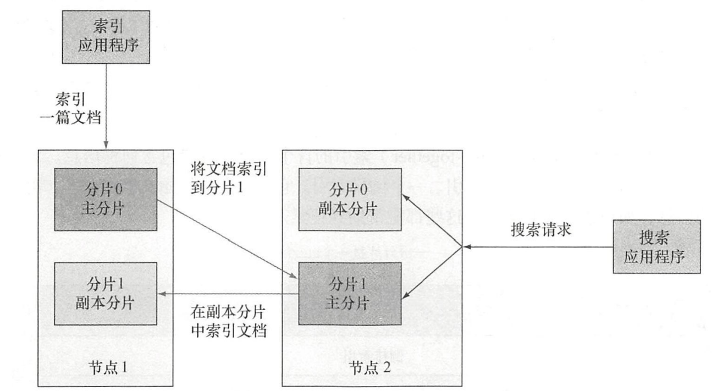
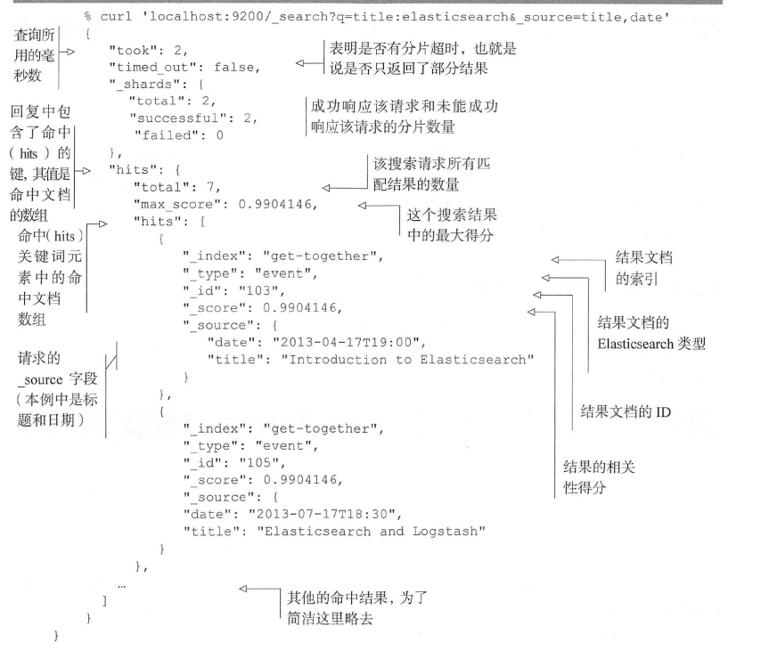
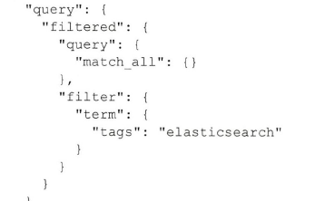
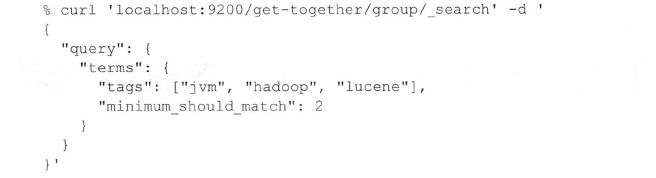
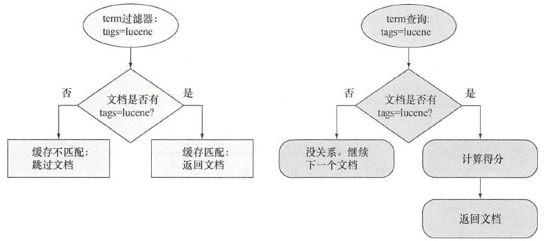
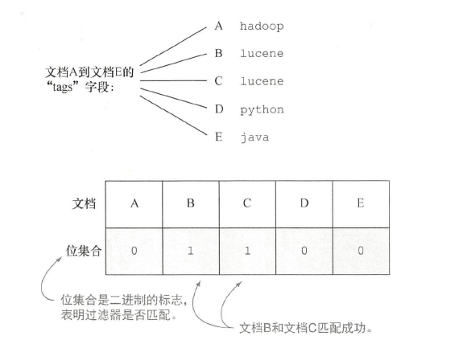

根据《Elasticsearch in action》重新学习Elasticsearch ， 回顾一下基础。

# Elasticsearch 介绍

## 用ES解决搜索问题

### 提供快速查询

使用倒排索引：


### 结果的相关性

默认相关性得分算法： TF-TDF（词频-逆文档频率）
- 词频——查找的单词在文档中出现次数越多，得分越高
- 逆文档词频——如果某个单词在所有文档中比较少见，那么词的权重就越高，得分就越高

可以定制化需求，实现自定义字段得分

### 超越精确匹配
不局限于精确匹配，当用户错误拼写、同义词、派生词的时候，使用起来更加方便。

- 处理错误拼写
如 bicycel 可以找到 bicycles的内容
- 支持变体
bicycle 同样可以可以跟bicycliist和sycling匹配
- 使用统计信息
如 自行车大类里有好多小的分类统计 ： 自行车鉴赏、自行车大事件
- 给予自动提示
通过特殊的查询类型来匹配前缀、通配符或者正则表达式来进行自动提示。建议器的效率高于普通的查询。

## 典型的ES使用案例

历史上的搜索引擎没有持久化以及统计功能。ES是一个现代搜索引擎，提供了持久化存储、统计以及其他数据存储的特性。ES不支持事务。

### Elasticsearch 主要特性

在Lucene之上，ES添加了自己的功能，从缓存到实时性分析。 默认是集群化的，即使是单台服务器上运行，也称为集群。

> 什么是Apache Solr
> ES和Solr都是基于Lucene的分布式搜索引擎。ES采用分布式模式，而Solr采用分片

大体执行流程如下:


默认情况下，ES原封不动地保存文档，将解析出的词条放入倒排索引，使得重要、快速、相关性好的搜索成为可能。

### docker安装ES

```bash
docker pull docker.elastic.co/elasticsearch/elasticsearch:8.3.2
docker network create elastic
docker run --name es01 -p 9200:9200 -it docker.elastic.co/elasticsearch/elasticsearch:8.3.2
```
启动之后，出现：node节点名称、ES版本号、java进程号；同时加载插件；
- 9300默认是节点之间的通信端口

- 选举主节点

- 9200端口默认用于HTTP通信

- 节点启动

- gateway持久化数据,启动节点时，gateway会查看磁盘来判断是否有数据意外保存过来恢复数据


通过http://ip:9200来发起http请求

## 总结
- ES建立在Lucene基础上的搜索引擎，用来索引大规模数据，可以全文搜索和实时数据统计，是一个NoSQL数据存储
- 自动数据分片，服务器负载均衡，扩展性强。

# 深入功能

- 逻辑设计——索引和搜索的单位都是文档，可以认为是数据库中的一行。类型包含若干文档，一个或者多个类型存在于同一索引，就好像行——表——数据库。
- 物理设计——索引分片，并且在服务器之间迁移；物理设计的配置方式决定了集群的性能、可扩展性、可用性


## 理解逻辑设计：文档、类型、索引

索引一篇文章，就是一个类型，类型有多个文档，每个文档都有唯一的标签id


### 文档

数据的最小单位

- 自我包含
- 层次性：location 包含城市、街道。就是非原子
- 灵活的结构：没有预先定义的模式，就如同没有表结构设计，其中location在数据没集齐的时候就可以省略


字段类型很重要，需要保存字段和类型之间的映射，故类型也被称为映射类型。

### 类型

不同的类型中最好存放不同的结构文档。例如一个类型定义聚会时的分组，另一个类型定义人们参加的活动。

每个类型中字段的定义称为映射。如name映射为string，location的geolocation映射为geo_point;

> 提示如果一个字段不是JSON文档的根节点，在其中搜索时必须指定路径。举个例子 location 中的 geolocation 字段被称为 location.geolocation。

#### 无模式

映射首先指定某个类型中所有文档的所有字段，但不是要求文档要有所有的字段，即使数据有缺失也能加入。同样如果有一篇新的索引文档
拥有一个映射中不存在的字段，ES也能猜测字段类型，自动加入该字段映射。

例如，如果值是 7, Elasticsearch 会假设字段是长整型。这种新字段的自动检测也有缺点，因为 Elasticsearch 可能猜得不对。例如，在索引了值 7之后，你可能想再索引hello world，
这时由于它是 string 而不是 long，索引就会失败。对于线上环境，最安全的方式是在索引数据之前，就定义好所需的映射。

### 索引
是由一个或多个分片数据块组成，多台服务器运行，同一个索引的多个分片在所有服务器存活，可扩展性好。

是类型的容器，类似数据库。所有索引存储在磁盘上的同组文件中，存储了所有映射类型字段。每个索引都有一个refresh_interval的设置，定义了文档对于搜索可见的时间间隔。
更新少，否则影响性能，默认每秒一次，准实时就是此原因。

## 理解物理设计： 节点和分片

索引创建的时候，每个索引默认5个主要分片，每个主要分片一个副本分片，所以总共10分片


副本分片对于可靠性和搜索性能很有益处。技术上而言，一份分片是一 个目录中的文件,
Lucene 用这些文件存储索引数据。分片也是 Elasticsearch 将数据从一个节点迁移到另一个节点的最小单位。

### 创建一个或多个节点的集群

#### 当索引一篇文档时发生了什么

默认情况下，当索引一篇文档的时候，系统首先根据文档ID 的散列值选择一个主分片，并将文档发送到该主分片。这份主分片可能位于另一个节点，
就像图中节点 2上的主分片，不过对于应用程序这一点是透明的。

参见左边请求


然后文档被发送到该主分片的所有副本分片进行索引。这使得副本分片和主分片之间保持数据的同步。数据
同步使得副本分片可以服务于搜索请求，并在原有主分片无法访问时自动升级为主分片。


#### 搜索索引时发生什么

参见右边请求：


当搜索一个索引时，Elasticsearch 需要在该索引的完整分片集合中进行查找。这些分片可以是主分片，也可以是副本分片，原因是
对应的主分片和副本分片通常包含一样的文档。Elasticsearch 在索引的主分片和副本分片中进行搜索请求的负载均衡，使得副本分片对于搜索性能和容错都有所帮助

### 主分片和副本分片

ES能处理的最小单元，一个分片是lucene的索引——包含倒排索引的目录。

> 一个ES索引，对应于多个Lucene索引。


### 在集群中分发分片

垂直分片就是增加内存或者CPU，水平扩展就是增加节点


### 分布式索引和搜索

每份分片拥有相同的散列范围，接收新文档的机会均等。一旦目标分片确
定，接受请求的节点将文档转发到该分片所在的节点。随后，索引操作在所有目标分片的所有副本分片中进行。在所有可用副本分片完成文档的索引后，索引命令就会成功返回。

ES 使用 round-robin 的轮询机制选择可用的分片(主分片或副本分片)，并将搜索请求转发过去。Elasticsearch 然后从这些分片收集结果，将其聚集到单一的回复，然后将回复返回给客户端应用程序。


## 索引新数据

### 创建索引和映射类型

#### 手动创建索引

PUT

比文档创建要多花一点时间，建议指定与Es不同的默认设置。

#### 获取映射

GET请求_mapping 


- 索引名称——get-together。
- 类型名称——group
- 属性列表——name 和 organizer。
- 属性选项——两个属性的 type 选项都是 string

## 搜索并获取数据

搜索：


响应：


- query_string ：查找字符串的时候使用
- term ：如果只是查找一个单词可以使用，更加简洁直接。
- filter ： 上述两个方法都会有score返回，filter不关心查询的分数，其过滤查询更快也更容易缓存。返回的结果和同样词条的查询相同，结果没有根据得分来排序(因为所有的结果得分都是1.0)。
- id ：通过id获得文档比搜索更快，消耗的资源成本也更低。其余三个都是近实时，id是实时的。

# 索引、更新和删除数据

更新：先索引再更改，再索引删除就文档。

## 映射来定义各种文档

索引---表、类型---表、文档---数据行

每个表虽然无模式（某些字段可有可无），但是要定义表结构数据类型。

一个索引一个分片，类型只是提供了逻辑上的分离

### 扩展现有的映射

如果在原有基础上再设置一个映射，Elasticsearch会将两者进行合并。也就是两个字段，但是不同的类型。

有些例外，需要移除现有的映射，之后设置新的映射，最后需要再次索引所有的数据。

## 用于定义文档字段的核心类型


## 数组和多字段

### 数组

把值放入方括号


实际存储的时候是按核心类型存储，和单个但类型没有区别。

### 多字段

数组是将多项数据进行同一个设置索引，而多字段是使用不同的设置，即对一个字段数据索引多次。

> 无须重新索引数据，就能将单字段升级到多字段。如果在运行代码前，就已经创建了string类型的标签字段，那么自动升级就会触发。反其道行之是不可以的，一旦子字段已经存在了，就不能将其抹去。

就好像结构体一样，查找的时候需要指定完整的路径,如user.name

## 预定义字段

特点：
- 通常，不用部署预定义的字段，Elasticsearch会做这件事情。例如,可以使用_timestamp字段来记录文档索引的日期。
- 它们揭示了字段相关的功能。例如，_ttl(存活时间, time to live)字段使得Elasticsearch可以在指定的时间过后删除某些文档。
- 预定义的字段总是以下划线(_)开头。这些字段为文档添加新的元数据，Elasticsearch将这些元数据用于不同的特性，从存储原始的文档，到存储用于自动过期的时间戳信息。

预定义字段类别：
- 控制如何存储和搜索你的文档。_source存储原始的JSON文档。_all将所有的字段一起索引。
- 唯一识别文档: _uid、_id、_type和_index。
- 为文档增加新的属性。_size来索引原始JSON内容的大小。_timestamp来索引文档索引的时间,并且使用_ttl来告知 Elasticsearch在一定时间后删除文档。
- 控制文档路由到哪些分片。相关的字段是_routing和 parent。

### 文档更新

- 检索现有的文档。为了使这步奏效，必须打开_source字段，否则Elasticsearch并不知道原有文档的内容。
- 进行指定的修改。例如，如果文档是 { "name" : "Elasticsearch Denver", "organizer" : "Lee" }而你希望修改组织者，修改后的文档应该是 { "name" : "Elasticsearch Denver", "organizer" : "Roy"}
- 删除旧的文档，在其原有位置索引新的文档（包含修改的内容)。

> 重新索引文档的含义是将文档的内容存储在Elasticsearch的新索引中。在实际应用中，重新索引通常用于将文档从旧的索引模式迁移到新的索引模式。当我们需要对现有的索引模式进行重构或更改时，我们需要重新索引文档，以便它们适应新的索引模式。在重新索引时，Elasticsearch会将数据从源索引读取，重新解析每个文档，将文档的内容存储在新索引中。重新索引过程还可以应用其他转换，例如更改日期格式、更改字段名称等。

#### doc:
更新部分字段，但是文档不存在就会报错 

#### update：
文档不存在也能更新，需要在upsert中指定初始文档

#### 脚本更新:
通过groovy获取_source进行更新。 动态脚本使用的时候需要在elasticsearch.yml中将script.disable_dynamic设置为false

```shell
curl -XPUT 'localhost : 9200/online-shop/shirts/1' -d '
  "caption" : "Learning Elasticsearch" ,
  "price" : 15
} 
curl -XPOST 'localhost :9200/online-shop/shirts/1/_update' -d '{
  "script" : "ctx._source.price += price_diff",
  "params" : {
    "price_diff": 10
  }
}
```

### 通过版本来实现并发控制（乐观锁）

冲突解决方法：
- retry_on_conflict 重试机制
- 索引文档的时候通过version进行更新，也能解决并发修改问题

## 删除数据

- 删除单个文档或者一组文档。Elasticsearch只是将它们标记为删除，不会再出现于搜索结果中，通过异步的方式将它们彻底地从索引中移出。
  
  默认是60s，以此来拒绝比删除操作版本更低的更新操作。

- 删除整个索引是删除多组文档的特例，这样做的性能更好。主要的工作就是移除和那个索引相关的所有文件,几乎是瞬间就能完成。

  删除文档速度 比 删除索引文件慢。文件被标记为已删除。在分段合并的时候才会被移除。

- 关闭索引。关闭的索引不允许读取或者写入操作，数据也不会加载到内存。和删除Elasticsearch数据类似，但是索引还是保留在磁盘上，很容易恢复，只要再次打开关闭的索引。
  
  在日志文件这样的流式文件长被用到。  

action.destructive_requires_name: true 可以防止delete _all的误删

> 一个分段是建立索引的时候所创建的一块Lucene索引按照Elasticsearch 的术语,也称作分片)。当你索引新的文档时,其内容不会添加到分段的尾部,而只会创建新的分段。由于删除操作只是将文档标记为待删除，所以分段中的数据也从来不会被移除。最终,更新文档意味着重新索引,数据就永远不会被修改。
当Elasticsearch在分片上进行查询的时候，Lucene需要查询它所有的分段，合并结果，然后将其返回—就像查询同一索引中多个分片的过程。就像分片那样,分段越多,搜索请求越慢。
你可能已经想到,日常的索引操作会产生很多这样的小分段。为了避免一个索引中存在过多的分段,Lucene定期将分段进行合并。
合并文档意味着读取它们的内容(除了被删除的文档),然后利用组合的内容创建新的、更大的
分段。这个过程需要资源,尤其是CPU和磁盘的/O。幸运的是,合并操作是异步运行的,Elsticsearcn也允许配置相关的若干选项。第12章将讨论更多关于这些选项的内容,那里你将学习如何提升索引、
更新和删除操作的性能。

# 搜索数据

## 搜索请求的结构

### 结果的解析



## 查询和过滤器

### 常用基础查询和过滤器

- match_all 

  默认对所有文档进行匹配
- query_string 
  
  非常强大，甚至不安全

- term查询和term过滤器 

  - 简单，不经过分析就进行匹配，所以必须精确。 可以用作filter过滤器中来进行匹配。
    
  - 限制文档至少拥有多少字段才算匹配
    

### match 查询 和 term 过滤器

- match 先对要查询的进行拆分，再去进行匹配，实际是or操作。指定了operator是and才能完整匹配。

- 可以通过phrase词组查询，尤其是想让查询多个词之间有空一定空白时，通过slot=1来完成。

## 组合和复合查询

### must、should、must_not

- must ： query1 && query2 ....
- should: query1 || query2 ....
- must_not: not query1 & not query2...

> minimum_should_match选项的默认值有一些隐藏的特性。如果指定了must子句,minimum_should_match默认值为0。如果没有指定must子句，默认值就是1。

## 超越match和过滤器查询

- 通配符 wildcard 
  - 0或多个
  - ？单个字符
  - 前缀当然越精准越好，能提前过滤很多数据
- 范围查询 range
- 过滤器 exits 
- query_string 也能包装后实现过滤功能
- 指定是否缓存过滤结果 _cache
# 总结

## ES存放大量数据需要增加资源，通过_close为什么能解决？

在ES中，每个索引都会占用一定的资源，其中包括内存、磁盘等。当索引中存放的数据量非常大时，会占用大量的资源，可能会影响ES的性能。如果服务器的资源不足，可以通过_close关闭索引来释放它所占用的资源。

_close操作实际上是关闭整个索引，使它进入不可用状态。关闭索引后，将不再接受任何查询和写入请求。但是，关闭索引不会删除索引中的数据，关闭后索引可以重新打开，数据依然可以继续使用。

通过关闭不需要的或者不常用的索引，可以释放资源，提高ES的性能。需要注意的是，关闭索引可能会导致查询失败或者数据无法写入，因此需要合理使用_close操作

## Es更新原理 

由于Elasticsearch在 Lucene分段里存储数据，而分段一旦创建就不会修改，因此更新文档意味着检索现存的文档，将修改放入即将索引的新文档中，然后删除旧的索引。
当Lucene分段异步合并时，就会移除待删的文档。这也是为什么删除整个索引要比删除单个或多个文档要快——索引删除只是意味着移除磁盘上的文件，而且无须合并。

## ES并发操作原理
在索引、更新和删除过程中，可以使用文档版本来管理并发问题。对于更新而言，如果因为并发问题而导致更新失败了，可以告诉Elasticsearch自动重试。

## ES _source 与 _all的对比

### _source：

文档的完整源文本，包含了所有存储在文档中的字段和值。_source字段总是存储在Elasticsearch索引中，对于大多数情况，它们很有用。当我们需要检索完整的文档内容时，我们可以使用_source
，而不必检索每个单独的字段。使用_source也允许我们轻松地执行模板搜索，这在动态构建查询时非常有用

假设我们有一个包含多个电影字段的电影索引，包括电影名称、导演名、演员名、剧情简介、评分等，如果我们需要查询电影索引中某一个字段的具体内容，可以使用_source。
```shell
GET movies/_search
{
"_source":["title","director","actors"]
"query": {
    "match": {
    "title": "The Shawshank Redemption"
    }
  }
}
```

### _all:

索引中所有字段的组合，如果将所有字段组合起来，就可以在单个字段中搜索所有字段，从而避免了对索引中的每个字段进行搜索。当我们希望全文搜索文档的每个字段时，我们可以使用_all。不过，需要注意的是，_all
字段在默认情况下是禁用的，因为它会增加功耗和存储，可能导致查询缓慢。在需要使用_all字段进行全文搜索的时候，需要开启该字段。

如果在电影索引中需要进行全文搜索，包括电影名称、导演名、演员名、剧情简介、评分等，可以使用_all。
```shell
GET movies/_search
{
"query": {
    "match": {
    "_all": "The Shawshank Redemption"
    }
  }
}
```

### 查询 和 过滤器 的区别

- 查询会对文档排序打分，过滤器不会。由于过滤器返回结果是固定的，对结果分数高低不关心，所以可以进行缓存。
- 过滤器性能优于查询



过滤器就是就是建立一个二进制位集合表明是否存在，一旦建立就成为缓存，之后对位集合的过滤自然是提升了性能。
加入过滤器能够减少很多不必要文档的分数计算，提升性能。



### phrase_prefix

将最后一个词进行扩展，当搜索的时候可以进行自动填充，max_expansions来指定别扩展太多的词语。
如下就是可以搜到Elasticsearch dendvid

```shell
"query" : {
  "match" : {
    "name" : {
      "type" : "phrase_prefix",
      "query" : "Elasticsearch den" ,
      "max_expansions" : 1
    }
  }
}
"_source" : [ "name" ]
```
