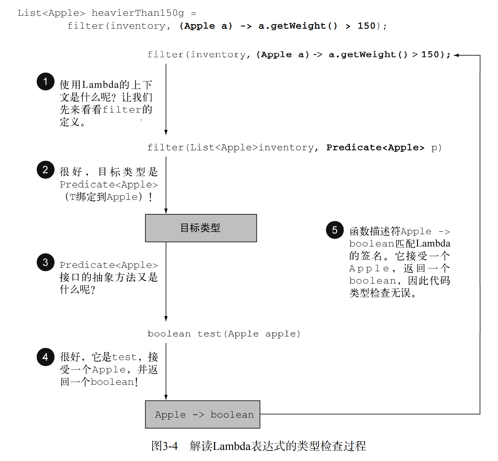

# Java 8 in action

## 简介

- Java8以前只能把方法作为对象的一部分，才能把这个方法传递出去；Java8可以通过方法引用::，把函数直接传递出去。
- Java8通过流简化了方法的书写，同时又从底层进行数据处理，使得数据处理得更快，且可以更好地并行处理数据。
- Java8中Streams的概念使得Collections的许多方面得以推广，让代码更为易读，并允
许并行处理流元素。
- 可以在接口中使用默认方法（default），在实现类没有实现方法时提供方法内容。
- 其他来自函数式编程的有趣思想，包括处理null和使用模式匹配。

## 通过行为参数化传递代码

### 案例 筛选绿苹果 (详见AppleFilterTest)

```java
    @Data
    private static class Apple{
        private String color;
        private int weight;
    }
```

- 先展示一段及其糟糕的代码：重复的代码块（遍历苹果集合操作）
```java
    /**
     * 筛选苹果颜色
     * @param inventory
     * @param color
     * @return
     */
    public static List<Apple> filterApplesByColor(List<Apple> inventory,
                                                  String color) {
        List<Apple> result = new ArrayList<Apple>();
        for (Apple apple: inventory){
            if ( apple.getColor().equals(color) ) {
                result.add(apple);
            }
        }
        return result;
    }

    /**
     * 筛选苹果重量
     * @param inventory
     * @param weight
     * @return
     */
    public static List<Apple> filterApplesByWeight(List<Apple> inventory,
                                                   int weight) {
        List<Apple> result = new ArrayList<Apple>();
        for (Apple apple: inventory){
            if ( apple.getWeight() > weight ){
                result.add(apple);
            }
        }
        return result;
    }
```
- 那么针对重复代码块进行小小的抽取,但是显然需要传递的参数已经过多了，不容易调用了。
```java
    public static List<Apple> filterApples(List<Apple> inventory, String color,
                                           int weight, boolean flag) {
        List<Apple> result = new ArrayList<Apple>();
        for (Apple apple: inventory){
            if ( (flag && apple.getColor().equals(color)) ||
                    (!flag && apple.getWeight() > weight) ){
                result.add(apple);
            }
        }
        return result;
    }
```

-  行为参数化,当然这里面向接口编程的思想很容易想到策略\状态模式。通过注入的对象来携带者方法的传入。
但是显然为了行为越来越多，那么就会需要很多类来实现ApplePredicate接口的类，非常凌乱、费时间
```java
    public interface ApplePredicate{
        boolean test (Apple apple);
    }
    public class AppleHeavyWeightPredicate implements ApplePredicate{
        @Override
        public boolean test(Apple apple){
            return apple.getWeight() > 150;
        }
    }
    public class AppleGreenColorPredicate implements ApplePredicate{
        @Override
        public boolean test(Apple apple){
            return "green".equals(apple.getColor());
        }
    }

    /**
     * 注入策略实现过滤
     */
    public static List<Apple> filterApples(List<Apple> inventory,
                                           ApplePredicate p){
        List<Apple> result = new ArrayList<>();
        for(Apple apple: inventory){
            if(p.test(apple)){
                result.add(apple);
            }
        }
        return result;
    }
```
- 通过匿名函数类简化接口类实现,但是匿名类会使得调用类显得臃肿，且不好理解，尤其是在变量方面。

```java
    // .. 省略代码
    List<Apple> redApples = filterApples(inventory, new ApplePredicate() {
        @Override
        public boolean test(Apple apple) {
            return "red".equals(apple.getColor());
        }
    });
```

- Lambda表达式

```java
    List<Apple> result =
            filterApples(inventory, (Apple apple) -> "red".equals(apple.getColor()));
```

- 例子只满足苹果，所以可以考虑在Lambda基础上对List进行泛化

```java
    public interface Predicate<T>{
        boolean test(T t);   
    }

    public static <T> List<T> filter(List<T> list , Predicate<T>p){
        List<T> result = new ArrayList<>();
        for (T e : list){
            if (p.test(e)){
                result.add(e);
            }
        }
        return result;
    }
```

最后一种Predicate和filter的实现其实就是Java8的内置实现的简单展示。

### 总结

Java8行为参数化：去掉了Java8以前承载行为传递的对象，直接传递函数即可。

## Lambda表达式

可以把Lambda表达式理解为简洁地表示可传递的匿名函数的一种方式：它没有名称，但它有参数列表、函数主体、返回类型，可能还有一个可以抛出的异常列表
- 匿名——我们说匿名，是因为它不像普通的方法那样有一个明确的名称：写得少而想
得多！
- 函数——我们说它是函数，是因为Lambda函数不像方法那样属于某个特定的类。但和方
法一样，Lambda有参数列表、函数主体、返回类型，还可能有可以抛出的异常列表。
- 传递——Lambda表达式可以作为参数传递给方法或存储在变量中。
- 简洁——无需像匿名类那样写很多模板代码。

### 函数式接口

函数式接口就是只定义一个抽象方法的接口。最好通过`@FunctionalInterface`来标识函数式接口。

> 接口现在还可以拥有默认方法（即在类没有对方法进行实现时，其主体为方法提供默认实现的方法）。哪怕有很多默认方法，只要接口只定义了一个抽象方法，它就仍然是一个函数式接口

有了函数式接口，就可以利用Lambda表达式（函数式接口的一种具体实现的实例），来代替匿名函数传递方法。

#### 内置的函数式接口 ❤

##### Predicate

通过test方法来检查传入对象是否符合条件。
```java
    @FunctionalInterface
    public interface Predicate<T>{
        boolean test(T t);
    }
```

##### Consumer

对传入对象进行消费使用。
```java
    @FunctionalInterface
    public interface Consumer<T>{
        void accept(T t);
    }
```

##### Function

接收T类型对象，经过apply方法之后返回R类型对象。
```java
    @FunctionalInterface
    public interface Function<T, R>{
        R apply(T t);
    }
```

> 异常、Lambda，还有函数式接口:任何函数式接口都不允许抛出受检异常（checked exception）。如果你需要Lambda表达式来抛出异常，有两种办法：定义一个自己的函数式接口，并声明受检异常，或者把Lambda
>包在一个try/catch块中。如BufferedReaderProcessor或者传递行为的时候显式捕捉受检异常
>```java
>    Function<BufferedReader, String> f = (BufferedReader b) -> {
>        try {
>             return b.readLine();
>         }
>         catch(IOException e) {
>             throw new RuntimeException(e);
>         }
>     };
>```

### 函数描述符

函数式接口的抽象方法的签名基本上就是Lambda表达式的签名，也就是函数描述符。简单说Lambda表达式与函数式接口中的抽象方法拥有一样的入参和返回值，以此Lambda表达式能够标识一个函数式接口的抽象方法。

### 案例 环绕执行模式 (详见FileLambdaTest)

资源处理（例如处理文件或数据库）时一个常见的模式就是打开一个资源，做一些处理，
然后关闭资源。环绕执行模式指的就是设置和清理阶段的代码总是非常相似，把处理的代码包围住。

```java
   public static String processFile() throws IOException {
        try (BufferedReader br =
                     new BufferedReader(new FileReader("data.txt"))) {
            return br.readLine();
        }
    }
```

`return br.readLine();`就是需要行为参数化的地方，通过传递行为，来实现不同的数据处理功能。最终代码见FileLambdaTest

<b>转化过程</b>
1. 首先定位要抽取的行为，然后创建函数式接口，把行为抽象化。
2. 修改原函数，引入新的函数式接口，把之前的行为改成对函数式接口的函数的调用
3. 调用变化后的函数，注入行为（Lambda实现了该函数式接口中的接口）

### 类型检查、类型推断以及限制

#### 类型检查



- 先获取查找filter方法的声明
- 找到对应的函数式接口，消除泛型
- 检查函数式接口中的抽象方法的标识符与传入的Lambda标识符是否一致


