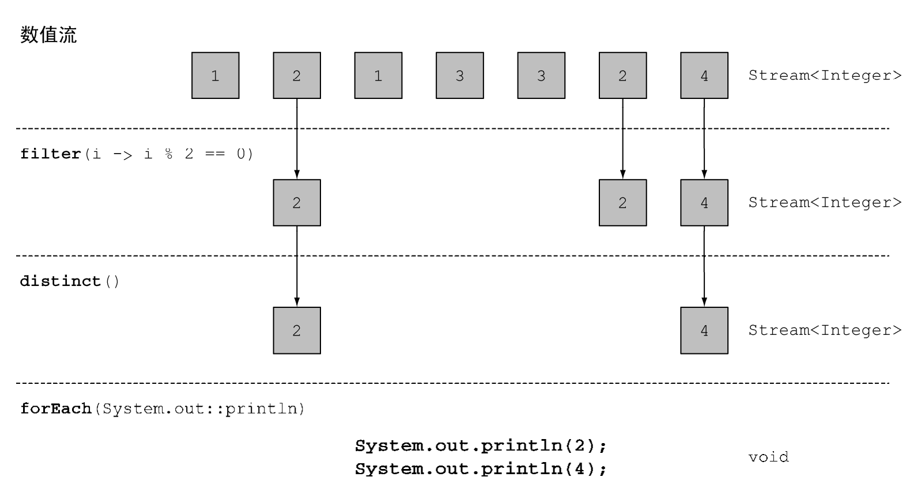

# Java 8 in action

## 简介

- Java8以前只能把方法作为对象的一部分，才能把这个方法传递出去；Java8可以通过方法引用::，把函数直接传递出去。
- Java8通过流简化了方法的书写，同时又从底层进行数据处理，使得数据处理得更快，且可以更好地并行处理数据。
- Java8中Streams的概念使得Collections的许多方面得以推广，让代码更为易读，并允
许并行处理流元素。
- 可以在接口中使用默认方法（default），在实现类没有实现方法时提供方法内容。
- 其他来自函数式编程的有趣思想，包括处理null和使用模式匹配。

## 通过行为参数化传递代码

### 案例 筛选绿苹果 (详见AppleFilterTest)

```java
    @Data
    private static class Apple{
        private String color;
        private int weight;
    }
```

- 先展示一段及其糟糕的代码：重复的代码块（遍历苹果集合操作）
```java
    /**
     * 筛选苹果颜色
     * @param inventory
     * @param color
     * @return
     */
    public static List<Apple> filterApplesByColor(List<Apple> inventory,
                                                  String color) {
        List<Apple> result = new ArrayList<Apple>();
        for (Apple apple: inventory){
            if ( apple.getColor().equals(color) ) {
                result.add(apple);
            }
        }
        return result;
    }

    /**
     * 筛选苹果重量
     * @param inventory
     * @param weight
     * @return
     */
    public static List<Apple> filterApplesByWeight(List<Apple> inventory,
                                                   int weight) {
        List<Apple> result = new ArrayList<Apple>();
        for (Apple apple: inventory){
            if ( apple.getWeight() > weight ){
                result.add(apple);
            }
        }
        return result;
    }
```
- 那么针对重复代码块进行小小的抽取,但是显然需要传递的参数已经过多了，不容易调用了。
```java
    public static List<Apple> filterApples(List<Apple> inventory, String color,
                                           int weight, boolean flag) {
        List<Apple> result = new ArrayList<Apple>();
        for (Apple apple: inventory){
            if ( (flag && apple.getColor().equals(color)) ||
                    (!flag && apple.getWeight() > weight) ){
                result.add(apple);
            }
        }
        return result;
    }
```

-  行为参数化,当然这里面向接口编程的思想很容易想到策略\状态模式。通过注入的对象来携带者方法的传入。
但是显然为了行为越来越多，那么就会需要很多类来实现ApplePredicate接口的类，非常凌乱、费时间
```java
    public interface ApplePredicate{
        boolean test (Apple apple);
    }
    public class AppleHeavyWeightPredicate implements ApplePredicate{
        @Override
        public boolean test(Apple apple){
            return apple.getWeight() > 150;
        }
    }
    public class AppleGreenColorPredicate implements ApplePredicate{
        @Override
        public boolean test(Apple apple){
            return "green".equals(apple.getColor());
        }
    }

    /**
     * 注入策略实现过滤
     */
    public static List<Apple> filterApples(List<Apple> inventory,
                                           ApplePredicate p){
        List<Apple> result = new ArrayList<>();
        for(Apple apple: inventory){
            if(p.test(apple)){
                result.add(apple);
            }
        }
        return result;
    }
```
- 通过匿名函数类简化接口类实现,但是匿名类会使得调用类显得臃肿，且不好理解，尤其是在变量方面。

```java
    // .. 省略代码
    List<Apple> redApples = filterApples(inventory, new ApplePredicate() {
        @Override
        public boolean test(Apple apple) {
            return "red".equals(apple.getColor());
        }
    });
```

- Lambda表达式

```java
    List<Apple> result =
            filterApples(inventory, (Apple apple) -> "red".equals(apple.getColor()));
```

- 例子只满足苹果，所以可以考虑在Lambda基础上对List进行泛化

```java
    public interface Predicate<T>{
        boolean test(T t);   
    }

    public static <T> List<T> filter(List<T> list , Predicate<T>p){
        List<T> result = new ArrayList<>();
        for (T e : list){
            if (p.test(e)){
                result.add(e);
            }
        }
        return result;
    }
```

最后一种Predicate和filter的实现其实就是Java8的内置实现的简单展示。

### 总结

Java8行为参数化：去掉了Java8以前承载行为传递的对象，直接传递函数即可。

## Lambda表达式

可以把Lambda表达式理解为简洁地表示可传递的匿名函数的一种方式：它没有名称，但它有参数列表、函数主体、返回类型，可能还有一个可以抛出的异常列表
- 匿名——我们说匿名，是因为它不像普通的方法那样有一个明确的名称：写得少而想
得多！
- 函数——我们说它是函数，是因为Lambda函数不像方法那样属于某个特定的类。但和方
法一样，Lambda有参数列表、函数主体、返回类型，还可能有可以抛出的异常列表。
- 传递——Lambda表达式可以作为参数传递给方法或存储在变量中。
- 简洁——无需像匿名类那样写很多模板代码。

### 函数式接口

函数式接口就是只定义一个抽象方法的接口。最好通过`@FunctionalInterface`来标识函数式接口。

> 接口现在还可以拥有默认方法（即在类没有对方法进行实现时，其主体为方法提供默认实现的方法）。哪怕有很多默认方法，只要接口只定义了一个抽象方法，它就仍然是一个函数式接口

有了函数式接口，就可以利用Lambda表达式（函数式接口的一种具体实现的实例），来代替匿名函数传递方法。

#### 内置的函数式接口 ❤


##### Predicate

通过test方法来检查传入对象是否符合条件。
```java
    @FunctionalInterface
    public interface Predicate<T>{
        boolean test(T t);
    }
```

##### Consumer

对传入对象进行消费使用。
```java
    @FunctionalInterface
    public interface Consumer<T>{
        void accept(T t);
    }
```

##### Function

接收T类型对象，经过apply方法之后返回R类型对象。
```java
    @FunctionalInterface
    public interface Function<T, R>{
        R apply(T t);
    }
```

> 异常、Lambda，还有函数式接口:任何函数式接口都不允许抛出受检异常（checked exception）。如果你需要Lambda表达式来抛出异常，有两种办法：定义一个自己的函数式接口，并声明受检异常，或者把Lambda
>包在一个try/catch块中。如BufferedReaderProcessor或者传递行为的时候显式捕捉受检异常
>```java
>    Function<BufferedReader, String> f = (BufferedReader b) -> {
>        try {
>             return b.readLine();
>         }
>         catch(IOException e) {
>             throw new RuntimeException(e);
>         }
>     };
>```

### 函数描述符

函数式接口的抽象方法的签名基本上就是Lambda表达式的签名，也就是函数描述符。简单说Lambda表达式与函数式接口中的抽象方法拥有一样的入参和返回值，以此Lambda表达式能够标识一个函数式接口的抽象方法。

### 案例 环绕执行模式 (详见FileLambdaTest)

资源处理（例如处理文件或数据库）时一个常见的模式就是打开一个资源，做一些处理，
然后关闭资源。环绕执行模式指的就是设置和清理阶段的代码总是非常相似，把处理的代码包围住。

```java
   public static String processFile() throws IOException {
        try (BufferedReader br =
                     new BufferedReader(new FileReader("data.txt"))) {
            return br.readLine();
        }
    }
```

`return br.readLine();`就是需要行为参数化的地方，通过传递行为，来实现不同的数据处理功能。最终代码见FileLambdaTest

<b>转化过程</b>
1. 首先定位要抽取的行为，然后创建函数式接口，把行为抽象化。
2. 修改原函数，引入新的函数式接口，把之前的行为改成对函数式接口的函数的调用
3. 调用变化后的函数，注入行为（Lambda实现了该函数式接口中的接口）

### 类型检查、类型推断以及限制

#### 类型检查


- 先获取查找filter方法的声明
- 找到对应的函数式接口，消除泛型
- 检查函数式接口中的抽象方法的标识符与传入的Lambda标识符是否一致

#### 类型推断详述

##### 前置知识

> `<>` 主要是就是泛型如何擦除，这里就不说了。

> 特殊的void兼容规则：如果是一个原子性的语句表达式，那么就和void兼容
> ```java
> // 即使add返回了boolean，而不是Consumer上下文（T->void)所要求的返回类型void
> Consumer<String> b = s -> list.add(s) 
> ```
 
 ##### 类型推断
 
 通过类型推断，可以省去了Lambda表达式的参数类型。
 
 ```java
Comparator<Apple> c = 
        (Apple a1, Apple a2) -> a1.getWeight().compareTo(a2.getWeight()); 

Comparator<Apple> c = 
        (a1, a2) -> a1.getWeight().compareTo(a2.getWeight());
```
 
#### 使用局部变量
 
 Lambda表达式中只能使用外部的"final"类型（外部只赋值过一次）的局部变量。主要是之前提到过流式编程主要是支持并行处理，那么不同线程使用一个临时变量自然会出现问题。
 
> ### 闭包
>    闭包可以作为参数传递给另一个函数。它也可以访问和修改其作用域之外的变量。Lambda和匿名类可以做类似于闭包的事情：它们可以作为参数传递给方法，并且可以访问其Lambda作用域之外的变量。但有一个限制：它们不能修改定义Lambda
>的方法的局部变量的内容。

### 方法引用

```java
// 先前
inventory.sort((Apple a1, Apple a2) -> a1.getWeight().compareTo(a2.getWeight())); 
// 之后
inventory.sort(comparing(Apple::getWeight));
```

- 静态方法的方法引用 `Integer::parseInt`
- 任意类型实例方法的方法引用 `String::length` 这里是程序中还未存在实例化对象的实例方法
- 现有对象的实例方法的方法引用 `Apple::getWeight`  这里是程序中已经存在了实例化对象的实例方法

#### 构造函数引用

```java
// 空参构造函数 函数描述符()->Apple
// 先前
Supplier<Apple> c1 = () -> new Apple(); 
// 之后
Supplier<Apple> c1 = Apple::new; 

// 有参构造函数  Apple(String color, Integer weight)  函数描述符 (T,T) -> Apple
// 之前
Function<String, Integer, Apple> c2 = (color, weight) -> new Apple(color, weight);
Apple a2 = c2.apply(110);
// 之后
Function<String, Integer, Apple> c2 = Apple::new;
Apple a2 = c2.apply("green" ,110);
```

### 复合Lambda表达式的有用方法

#### 比较器复合

```java
    // 根据重量递减排序，如果苹果一样重就按照国家排序
    inventory.sort(comparing(Apple::getWeight) 
        .reversed() 
        .thenComparing(Apple::getCountry));
```

#### 谓词符合

<b>and和or方法是按照在表达式链中的位置，从左向右确定优先级的。因此，`a.or(b).and(c)`可以看作`(a || b) && c`。</b>
```java
    // 超过150g的红苹果 或者 绿苹果 
    Predicate<Apple> redAndHeavyAppleOrGreen = 
         redApple.and(a -> a.getWeight() > 150) 
                 .or(a -> "green".equals(a.getColor()));         
```

#### 函数复合

通过Function的`andThen`和`compose`两个默认方法(它们都会返回Function的一个实例)来复合多个Function
```java
    // 数学上会写作g(f(x))
    Function<Integer, Integer> f = x -> x + 1; 
    Function<Integer, Integer> g = x -> x * 2; 
    Function<Integer, Integer> h = f.andThen(g); 
    int result = h.apply(1)
    
    // 数学上会写作f(g(x))
    Function<Integer, Integer> f = x -> x + 1; 
    Function<Integer, Integer> g = x -> x * 2; 
    Function<Integer, Integer> h = f.compose(g);
    int result = h.apply(1);  
```

## 引入流

先看Java8前后的代码对比：筛选元素，对菜肴排序，处理排序后的菜名列表
```java
    @Data
    class Dish {
        int calories;
        String name;
    }
```
Java7 
```java
   List<Dish> lowCaloricDishes = new ArrayList<>();
   for (Dish d : menu) {
       if (d.getCalories() < 400) {
           lowCaloricDishes.add(d);
       }
   }
   Collections.sort(lowCaloricDishes, new Comparator<Dish>() {
       @Override
       public int compare(Dish d1, Dish d2) {
           return Integer.compare(d1.getCalories(), d2.getCalories());
       }
   });
   List<String> lowCaloricDishesName = new ArrayList<>();
   for (Dish d : lowCaloricDishes) {
       lowCaloricDishesName.add(d.getName());
   }
```
Java8
```java
    List<String> lowCaloricDishesName =
            menu.stream()
                    .filter(d -> d.getCalories() < 400)
                    .sorted(comparing(Dish::getCalories))
                    .map(Dish::getName)
                    .collect(toList());
```
显然Java8版本的更简介，且Stream API 可能已经隐式地用多线程在处理这一整串业务了。

<b>注意:</b>Java8中的代码块，如果最后不进行collect收集，其实不会之前的所有操作，可以看作collect是前面操作的开始信号。

> <b>其他库Guava、Apache
>   Guava是谷歌创建的一个很流行的库。它提供了multimaps和multisets等额外的容器类。Apache Commons Collections库也提供了类似的功能

### 流与集合

如下所示：


集合中的数据必须是经过计算之后的值，展示出急切计算的特带你；流中的数据不一定要是经过了计算的，展示出延迟计算的特点。

<b>其中每个流只能被消费一次。</b>

#### 内部迭代与外部迭代

```java
    // 外部迭代
    List<String> names = new ArrayList<>(); 
    for(Dish d: menu){ 
        names.add(d.getName()); 
    }

    // 内部迭代
    List<String> names = menu.stream() 
                             .map(Dish::getName)
                             .collect(toList());
```
背后原理都是通过迭代器进行迭代

## 使用流

<b>建议大家查一下文档，这里只展示部分操作</b>

### 筛选和切片

```java
    // 筛选各异的偶数，并打印
    List<Integer> numbers = Arrays.asList(1, 2, 1, 3, 3, 2, 4); 
    numbers.stream() 
         .filter(i -> i % 2 == 0) 
         .distinct() 
         .forEach(System.out::println);
```

其工作图不难看出Stream对数据隐式并行的处理：



```java
    //  skik跳过前n个元素
    List<Dish> dishes = menu.stream() 
                         .filter(d -> d.getCalories() > 300) 
                         .skip(2) 
                         .collect(toList()); 


    // 收集所有菜名长度
    List<Integer> dishNameLengths = menu.stream() 
                                     .map(Dish::getName) 
                                     .map(String::length) 
                                     .collect(toList()); 

    // 流的扁平化 flatMap 降维压缩成一维的完整的流 ❤
    List<String> uniqueCharacters = words.stream() 
                                        .map(w -> w.split("")) 
                                        .flatMap(Arrays::stream) 
                                        .distinct() 
                                        .collect(Collectors.toList()); 
    
    // flatMap 返回总和能被3整除的数对
       List<Integer> numbers1 = Arrays.asList(1, 2, 3); 
       List<Integer> numbers2 = Arrays.asList(3, 4); 
       List<int[]> pairs = 
                numbers1.stream() 
                    .flatMap(i -> numbers2.stream()
                                    .filter(j -> (i + j) % 3 == 0) 
                                    .map(j -> new int[]{i, j}) 
                            ) 
                    .collect(toList()); 
            
    // findFirst 在有序的流中查出第一个满足条件的元素
    List<Integer> someNumbers = Arrays.asList(1, 2, 3, 4, 5); 
    Optional<Integer> firstSquareDivisibleByThree = 
         someNumbers.stream() 
         .map(x -> x * x) 
         .filter(x -> x % 3 == 0) 
         .findFirst(); // 9

    // findAny 找出任意一个满足条件的元素 
       Optional<Dish> dish = 
            menu.stream() 
            .filter(Dish::isVegetarian) 
            .findAny(); 
```
> findAny & findFirst 区别在于并行程度，显然关注顺序的findFirst对并行的利用要差于findAny

flatMap方法让你把一个流中的每个值都换成另一个流，然后把所有的流连接起来成为一个流。
flagMap的工作模式图：


### 规约

```java
    // 使用reduce前
    int sum = 0;
    for (int x : numbers) {
        sum += x;
    }

    // 使用reduce后
    int sum = numbers.stream().reduce(0, (a, b) -> a + b);
    
```
上述代码的reduce的工作过程：


> map和reduce的连接通常成为map-reduce模式，Google用它来进行网络搜索而出名。

> 流操作：无状态和有状态
>   
> filter、map：无状态，从输入流中获取元素，并输出0或1个结果
> 
> reduce、sum、max : 有状态，都是需要通过内部状态来积累结果
>
> sort、distinct： 有状态，需要知道前面缓冲区的元素才能进行把当前元素排序、是否要删除当前的元素

### 练习题 

参见 java8.chapter05.demo01.Practice

### 数值流

```java
    // 会装箱拆箱
    int calories = menu.stream() 
                     .map(Dish::getCalories) 
                     .reduce(0, Integer::sum); 

    // 映射到数值流 避免拆箱装箱
    int calories = menu.stream() 
                    .mapToInt(Dish::getCalories) 
                    .sum(); 

    // 转换成对象流
    // 1. boxed
    IntStream intStream = menu.stream().mapToInt(Dish::getCalories); 
    Stream<Integer> stream = intStream.boxed();

    // 2. mapToObj
    int a = 1;
    IntStream.rangeClosed(1, 100)
            .filter(b -> Math.sqrt(a * a + b * b) % 1 == 0)
            .mapToObj(b-> new int[]{a,b,(int)Math.sqrt(a*a+b*b)});


    // 默认流OptionalInt 防止数值流因为流为空而统计出错误结果
    OptionalInt maxCalories = menu.stream()     
                                .mapToInt(Dish::getCalories) 
                                .max();
    // 如果没有最大值的话，显式提供一个默认最大值
    int max = maxCalories.orElse(1);

    // 数值范围
    // 表示范围 [1, 100]
    IntStream evenNumbers = IntStream.rangeClosed(1, 100) 
                                                .filter(n -> n % 2 == 0); 
```

### 构建流

#### 由值创建流
`Stream<String> stream = Stream.of("Java 8 ", "Lambdas ", "In ", "Action");`
 
#### 由文件生成流

统计文件中有多少个不同的单词，其中`Files.lines`，它会返回一个由指定文件中的各行构成的字符串流。
```java
    long uniqueWords = 0;
    try(Stream<String> lines =
                Files.lines(Paths.get("data.txt"), Charset.defaultCharset())){
        uniqueWords = lines.flatMap(line -> Arrays.stream(line.split(" ")))
                .distinct()
                .count();
    }catch(IOException e){
    }
```

#### 由函数生成流：创建无限流

##### 迭代 iterate

```java
    // 1. 生成1-10
    IntStream.iterate(1,i->i+1).limit(10)
    // 2. 斐波那契元组，映射成斐波那契数
    Stream.iterate(new int[]{0, 1},
            t -> new int[]{t[1],t[0] + t[1]})
            .limit(10)
            .map(t -> t[0])
            .forEach(System.out::println);
```

##### 生成 generate

`IntStream ones = IntStream.generate(() -> 1);` 生成全是1的流

```java
    // 1. 打印斐波那契数列 通过实现IntSupplier来实现有状态的lambda
    IntSupplier fib = new IntSupplier(){
        private int previous = 0;
        private int current = 1;
        public int getAsInt(){
            int oldPrevious = this.previous;
            int nextValue = this.previous + this.current;
            this.previous = this.current;
            this.current = nextValue;
            return oldPrevious;
        }
    };
    IntStream.generate(fib).limit(10).forEach(System.out::println);
```

## 用流收集数据

熟悉`Collectors`使用

### 归约和汇总

规约的并行操作过程：


#### 查找流中的最大值和最小值
```java
    Comparator<Dish> dishCaloriesComparator =
            Comparator.comparingInt(Dish::getCalories);
    // Optional<Dish> 防止menu是null
    Optional<Dish> mostCalorieDish =
            menu.stream()
                    .collect(maxBy(dishCaloriesComparator));
```

#### 汇总
```java
    // summingInt 对菜的卡路里求和
    int totalCalories = menu.stream().collect(summingInt(Dish::getCalories));

    //  summarizingInt 获取所有的汇总数据 
    IntSummaryStatistics menuStatistics = 
        menu.stream().collect(summarizingInt(Dish::getCalories)); 
```
对菜的卡路里求和的工作过程：


#### 连接字符串
```java
    // joining 所有字符串连成一个字符串 用逗号分割
    String shortMenu = menu.stream().map(Dish::getName).collect(joining(","));
```

#### 广义的规约汇总
通过`Collectors.reducing`进行一般化的规约
```java
    // 对菜的卡路里求和
    int totalCalories = menu.stream().collect(reducing( 
                                     0, Dish::getCalories, (i, j) -> i + j)); 
```

### 分组
`Collectors.groupingBy`
```java
    // 按照热量分组 高热量、正常、低热量
    public enum CaloricLevel { DIET, NORMAL, FAT }
    Map<CaloricLevel, List<Dish>> dishesByCaloricLevel = menu.stream().collect(
            groupingBy(dish -> {
                if (dish.getCalories() <= 400) return CaloricLevel.DIET;
                else if (dish.getCalories() <= 700) return
                        CaloricLevel.NORMAL;
                else return CaloricLevel.FAT;
            } ));
```

#### 多级分组
```java
    // 在groupingBy之后传递groupingBy
    Map<Dish.Type, Map<CaloricLevel, List<Dish>>> dishesByTypeCaloricLevel =
            menu.stream().collect(
                    groupingBy(Dish::getType,
                            groupingBy(dish -> {
                                if (dish.getCalories() <= 400) return CaloricLevel.DIET;
                                else if (dish.getCalories() <= 700) return CaloricLevel.NORMAL;
                                else return CaloricLevel.FAT;
                            } )
                    )
            );
```

#### 按子组收集数据

传递给第一个groupingBy的第二个收集器可以是任何类型，而不一定是另一分组个groupingBy，只要是一个收集器就好了。
```java
    // 分类查找各自菜单中热量最高的菜肴
    Map<Dish.Type, Optional<Dish>> mostCaloricByType =
            menu.stream()
                    .collect(groupingBy(Dish::getType,
                            collectingAndThen(maxBy(comparingInt(Dish::getCalories)),
                            Optional::get)));

    // 分类，对每个类进行卡路里求和
    Map<Dish.Type, Integer> totalCaloriesByType =
            menu.stream().collect(groupingBy(Dish::getType,
            summingInt(Dish::getCalories)));

    // 分类，查看每个类中有哪些热量级别
    Map<Dish.Type, Set<CaloricLevel>> caloricLevelsByType =
            menu.stream().collect(
            groupingBy(Dish::getType, mapping(
            dish -> { if (dish.getCalories() <= 400) return CaloricLevel.DIET;
                      else if (dish.getCalories() <= 700) return CaloricLevel.NORMAL;
                      else return CaloricLevel.FAT; },
            toCollection(HashSet::new) )));
```

### 分区
由一个谓词（返回一个布尔值的函数）作为分类函数，它称分区函数`partitioningBy`

```java
    // 按照荤素分区
    Map<Boolean, List<Dish>> partitionedMenu =
            menu.stream().collect(partitioningBy(Dish::isVegetarian));
    partitionedMenu.get(true);

    // 分区之后获取各自分区中的热量最高的菜
    Map<Boolean, Dish> mostCaloricPartitionedByVegetarian =
            menu.stream().collect(
                    partitioningBy(Dish::isVegetarian,
                            collectingAndThen(
                                    maxBy(comparingInt(Dish::getCalories)),
                                    Optional::get)));
```
### 开发性能更好的收集器


## 附录

- 恒等函数 `Function.indentity()` 意味着中间结果和最终结果类型一致，不需要变换。

- characteristics方法,返回一个不可变的Characteristics集合，它定义了收集器的行为——尤其是关于流是否可以并行归约，以及可以使用哪些优化的提示。Characteristics是一个包含三个项目的枚举。
    - UNORDERED——归约结果不受流中项目的遍历和累积顺序的影响。
    - CONCURRENT——accumulator函数可以从多个线程同时调用，且该收集器可以并行归约流。如果收集器没有标为UNORDERED，那它仅在用于无序数据源时才可以并行归约。
    - IDENTITY_FINISH——这表明完成器方法返回的函数是一个恒等函数，可以跳过。这种情况下，累加器对象将会直接用作归约过程的最终结果。这也意味着，将累加器A不加检查地转换为结果R是安全的

## 并行数据处理与性能

### 并行流
`parallelStream`并行流对数据分块，并用不同的线程分别处理每个数据块的流。对并行流调用`sequential`方法就可以把它变成顺序流

> 并行流内部使用了默认的ForkJoinPool（分支/合并框架），它默认的线程数量就是你的处理器数量，这个值是由`Runtime.getRuntime().availableProcessors()`得到的。
> 可以通过`System.setProperty("java.util.concurrent.ForkJoinPool.common.parallelism","12");`修改线程池大小。
> 注意availableProcessors方法虽然看起来是处理器，但它实际上返回的是可用内核的数量，包括超线程生成的虚拟内核。
```java
    // 1 + .. + 10
    public static long sequentialSum(long n) {
        return Stream.iterate(1L, i -> i + 1)
                .limit(n)
                .reduce(0L, Long::sum);
    }

    // 并行流
    public static long parallelSum(long n) {
        return Stream.iterate(1L, i -> i + 1)
                .limit(n)
                .parallel()
                .reduce(0L, Long::sum);
    }
```

其中整个并行执行过程如下:


其实并行流不一定比串行执行更快，首先如果对顺序有要求，对前值有依赖，因而无法有效地把流划分为小块来并行处理，同时每次把操作递归地分到不同的线程也需要开销，就可能让程序的整体性能更差

#### 错误使用并行流

```java
    public class Accumulator {
        public long total = 0;
        public void add(long value) { total += value; }
    }

    // 1.这里因为并行流共享total变量导致性能下降，会出现对total的竞争
    public static long sideEffectParallelSum(long n) {
        Accumulator accumulator = new Accumulator();
        LongStream.rangeClosed(1, n).parallel().forEach(accumulator::add);
        return accumulator.total;
    }
    // 2
    public static long sideEffectSum(long n) {
        Accumulator accumulator = new Accumulator();
        LongStream.rangeClosed(1, n).forEach(accumulator::add);
        return accumulator.total;
    }

```
#### 高效使用并行流

- 如果有疑问，测量。把顺序流转成并行流轻而易举，第一个也是最重要的建议就是用适当的基准来检查其性能。
- 留意装箱。自动装箱和拆箱操作会大大降低性能。Java 8中有原始类型流（IntStream、LongStream、DoubleStream）来避免这种操作.
- 有些操作本身在并行流上的性能就比顺序流差。特别是limit和findFirst等依赖于元
  素顺序的操作，它们在并行流上执行的代价非常大。例如，findAny会比findFirst性
  能好，因为它不一定要按顺序来执行。
- 还要考虑流的操作流水线的总计算成本。流中数据处理时间越大，就越可能受益。
- 对于较小的数据量，选择并行流几乎从来都不是一个好的决定。
- 要考虑流背后的数据结构是否易于分解。例如，ArrayList的拆分效率比LinkedList高得多，因为前者用不着遍历就可以平均拆分，而后者则必须遍历。另外，用range工厂方法创建的原始类型流也可以快速分解。
- 流自身的特点，以及流水线中的中间操作修改流的方式，都可能会改变分解过程的性能。例如，一个SIZED流可以分成大小相等的两部分，这样每个部分都可以比较高效地并行处理，但筛选操作可能丢弃的元素个数却无法预测，导致流本身的大小未知。
- 终端操作中合并步骤的代价是大是小（例如Collector中的combiner方法）。如果这一步代价很大，那么组合每个子流产生的部分结果所付出的代价就可能会超出通过并行流得到的性能提升。

一些流数据源适不适于并行:


### 分支/合并框架

分支/合并框架的目的是以递归方式将可以并行的任务拆分成更小的任务，然后将每个子任务的结果合并起来生成整体结果。它是ExecutorService接口的一个实现,它把子任务分配给线程池（称为ForkJoinPool）中的工作线程

#### RecursiveTask<R>

递归分解子任务，返回R的类型；如果没有返回类型，则实现RecursiveAction。

需要实现`protected abstract R compute(); `，同时其拆分逻辑为：
```java
    if (任务足够小或不可分) {
        顺序计算该任务
    } else {
        将任务分成两个子任务
        递归调用本方法，拆分每个子任务，等待所有子任务完成
                合并每个子任务的结果
    }
```

##### 案例
 
- 用分支/合并框架执行求和 （ForkJoinSumCalculator）

#### 使用分支/合并框架的最佳做法

- 对一个任务调用join方法会阻塞调用方，直到该任务做出结果。因此，有必要在两个子任务的计算都开始之后再调用它。否则，你得到的版本会比原始的顺序算法更慢更复杂，因为每个子任务都必须等待另一个子任务完成才能启动。
- 不应该在RecursiveTask内部使用ForkJoinPool的invoke方法。相反，你应该始终直接调用compute或fork方法，只有顺序代码才应该用invoke来启动并行计算。
- 对子任务调用fork方法可以把它排进ForkJoinPool。同时对左边和右边的子任务调用它似乎很自然，但这样做的效率要比直接对其中一个调用compute低。这样做你可以为其中一个子任务重用同一线程，从而避免在线程池中多分配一个任务造成的开销。
- 调试使用分支/合并框架的并行计算可能有点棘手。特别是你平常都在你喜欢的IDE里面看栈跟踪（stack trace）来找问题，但放在分支/合并计算上就不行了，因为调用compute的线程并不是概念上的调用方，后者是调用fork的那个。
- 和并行流一样，你不应理所当然地认为在多核处理器上使用分支/合并框架就比顺序计算快。我们已经说过，一个任务可以分解成多个独立的子任务，才能让性能在并行化时有所提升。所有这些子任务的运行时间都应该比分出新任务所花的时间长；一个惯用方法是把输入/输出放在一个子任务里，计算放在另一个里，这样计算就可以和输入/输出同时进行。此外，在比较同一算法的顺序和并行版本的性能时还有别的因素要考虑。就像任何其他Java代码一样，分支/合并框架需要“预热”或者说要执行几遍才会被JIT编译器优化。这就是为什么在测量性能之前跑几遍程序很重要，我们的测试框架就是这么做的。同时还要知道，编译器内置的优化可能会为顺序版本带来一些优势（例如执行死码分析——删去从未被使用的计算）。

#### 工作窃取

每个子任务所花的时间可能天差地别，要么是因为划分策略效率低，要么是有不可预知的原因，比如磁盘访问慢，或是需要和外部服务协调执行。分支/合并框架工程用一种称为<b>工作窃取（work stealing）</b>的技术来解决这个问题

<b>工作窃取：</b> 每个线程都把分配给它的任务保存在一个双向列表中，如果执行完毕当前的任务，就会从队列头摘除该任务，执行下一个任务执行，但是如果执行完毕，队列为空，就会从其他线程的任务队列尾部“偷走”一个线程，直到所有的任务都执行完毕。

### Spliterator

可分迭代器，自Java8之后引入的新街口，是一种拆分流的自动机制。

- 源码展示
```java
    public interface Spliterator<T> { 
        boolean tryAdvance(Consumer<? super T> action); 
        Spliterator<T> trySplit(); 
        long estimateSize(); 
        int characteristics(); 
    }
```

- 特性


- 例子 
    
    WordCounter
    
 


