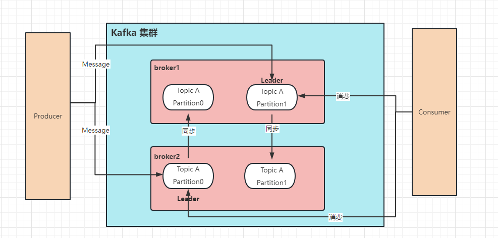

简单回顾一下kafka的学习


## What
1. Broker：在Kafka中，Broker是指Kafka集群中的一个节点（服务器）或一个实例。每个Broker都是独立运行的Kafka服务器，负责接收、存储和转发消息。它们协同工作以构建一个分布式、高可靠性的消息系统。
2. Controller：Controller是Kafka集群中的一种特殊角色，每个时刻只有一个Broker扮演Controller角色。Controller负责管理整个Kafka集群的元数据信息，包括维护Topic 
、Partition的状态以及监控Broker的健康状态。当发生故障或者新的Broker加入集群时，Controller会负责重新分配Partition的副本。 
3. Partition：Partition是Kafka中对消息进行分区的概念。一个Topic可以被划分为多个Partition，每个Partition是一个有序且持久化存储的消息日志。每条消息都被写入到一个特定的Partition，并且每个Partition可以在不同的Broker上进行复制，以提供高可用性和容错性。 
4. Replication：在Kafka中，消息的副本复制是为了提供高可用性和数据冗余。每个Partition可以配置多个副本，其中一个副本称为Leader，其余的副本称为Follower。Leader负责处理读写请求，而Follower则通过复制Leader的消息来提供备份和容错能力。如果Leader发生故障，Controller将从Follower中选举出新的Leader。 
5. Topic：Topic是Kafka中消息发布和订阅的逻辑名称。它是一个消息的分类或者主题。生产者（Producer）将消息发送到特定的Topic，而消费者（Consumer）则订阅感兴趣的Topic来接收消息。每个Topic可以划分为多个Partition，并且可以在多个Broker上进行复制以实现高可用性。
6. Producer：消息的生产者
7. Consumer：消息的消费者，同一个消费组如果是在生产者单播的情况下，就只能由一个消费者进行消费，防止重复消费

这些概念之间的关系如下：一个Kafka集群由多个Broker组成，每个Broker负责存储和传输消息。集群中有一个Controller负责管理元数据和协调操作。每个Topic可以划分为多个Partition，每个Partition可以在多个Broker上进行复制。这种分区和复制的机制提供了高吞吐量、可扩展性和容错性的特性，使得Kafka成为一种强大的分布式消息系统。



## Why

### 为什么有多个分区

1. 同一个主题有了多个分区，那么我就可以多个生产者并行的写到同一个的主题的不同分区。显然能提高写的吞吐量；
同理消费的时候也可从同一个主题的不同分区并行消费，提高读的吞吐量。
2. 如果同一主题消息过大过多，那么分区可以解决存储文件过大的问题。

### 为什么有副本

防止leader挂了之后，无法提供服务；如果副本（follower）存在就可以成为新的leader提供数据服务。

## How

### 搭建集群

```shell
# zookeeper进行节点管理、监控
docker pull wurstmeister/zookeeper

docker run -d --name zookeeper -p 2181:2181 -t wurstmeister/zookeeper

# kafka集群搭建
docker search kafka --limit=50
docker pull wurstmeister/kafka

docker run -d --name kafka0 -p 9092:9092 -e KAFKA_BROKER_ID=0 -e KAFKA_ZOOKEEPER_CONNECT=master:2181 -e KAFKA_ADVERTISED_LISTENERS=PLAINTEXT://master:9092 -e KAFKA_LISTENERS=PLAINTEXT://0.0.0.0:9092 -t wurstmeister/kafka

docker run -d --name kafka1 -p 9093:9093 -e KAFKA_BROKER_ID=1 -e KAFKA_ZOOKEEPER_CONNECT=master:2181 -e KAFKA_ADVERTISED_LISTENERS=PLAINTEXT://master:9093 -e KAFKA_LISTENERS=PLAINTEXT://0.0.0.0:9093 -t wurstmeister/kafka

docker run -d --name kafka2 -p 9094:9094 -e KAFKA_BROKER_ID=2 -e KAFKA_ZOOKEEPER_CONNECT=master:2181 -e KAFKA_ADVERTISED_LISTENERS=PLAINTEXT://master:9094 -e KAFKA_LISTENERS=PLAINTEXT://0.0.0.0:9094 -t wurstmeister/kafka
```

### Java简单使用 

#### Producer

[AsyncProducer.java](nospring/src/main/java/com/nju/producer/AsyncProducer.java)：异步发送

[SyncProducer.java](nospring/src/main/java/com/nju/producer/SyncProducer.java)：同步发送

> 在同步发消息的场景下：生产者发动broker上后，ack会有 3 种不同的选择：
>    1. acks=0： 表示producer不需要等待任何broker确认收到消息的回复，就可以继续发送下一条消息。性能最高，但是最容易丢消息。
>    2. acks=1： 至少要等待leader已经成功将数据写入本地log，但是不需要等待所有follower是否成功写入。就可以继续发送下一条消息。这种情况下，如果follower没有成功备份数据，而此时leader又挂掉，则消息会丢失。
>    3. acks=-1或all： 需要等待 min.insync.replicas(默认为 1 ，推荐配置大于等于2) 这个参数配置的副本个数都成功写入日志，这种策略会保证只要有一个备份存活就不会丢失数据。这是最强的数据保证。一般除非是金融级别，或跟钱打交道的场景才会使用这种配置。

> 重试机制 & 消息缓冲区
> 
> - 发送会默认会重试 3 次，每次间隔100ms 
> - 发送的消息会先进入到本地缓冲区（32mb），kafka会跑一个线程，该线程去缓冲区中取16k的数据，发送到kafka，如果到 10 毫秒数据没取满16k，也会发送一次。
> 
> ```java
>    //批次大小
>    properties.put(ProducerConfig.BATCH_SIZE_CONFIG,"16384"); 
>    //多长时间发送一个批次
>    properties.put(ProducerConfig.LINGER_MS_CONFIG,"1");
>    //最大缓存
>    properties.put(ProducerConfig.BUFFER_MEMORY_CONFIG,"33554432")
> ```

#### Consumer

[CustomerConsumer.java](nospring/src/main/java/com/nju/consumer/CustomerConsumer.java)：简单的消费者

[TimeConsumer.java](nospring/src/main/java/com/nju/consumer/TimeConsumer.java)：按照时间进行消费

##### offset提交方式
###### 自动提交 - 默认 
    ```java
       // 是否自动提交offset，默认就是true
       props.put(ConsumerConfig.ENABLE_AUTO_COMMIT_CONFIG, "true");
       // 自动提交offset的间隔时间
       props.put(ConsumerConfig.AUTO_COMMIT_INTERVAL_MS_CONFIG, "1000");
    ```
    消费者poll到消息后默认情况下，会自动向broker的_consumer_offsets主题提交当前主题-分区消费的偏移量。

    自动提交会丢消息： 因为如果消费者还没消费完poll下来的消息就自动提交了偏移量，那么此 时消费者挂了，于是下一个消费者会从已提交的offset的下一个位置开始消费消息。之前未被消费的消息就丢失掉了
###### 手动提交
- 手动同步提交
```java
    if (records.count() > 0 ) {
       // 手动同步提交offset，当前线程会阻塞直到offset提交成功
       // 一般使用同步提交，因为提交之后一般也没有什么逻辑代码了
       consumer.commitSync();
    }
```
- 手动异步提交
```java
     if (records.count() > 0 ) {
         // 手动异步提交offset，当前线程提交offset不会阻塞，可以继续处理后面的程序逻辑
         consumer.commitAsync(new OffsetCommitCallback() {
             @Override
                 public void onComplete(Map<TopicPartition, OffsetAndMetadata>offsets, Exception exception) {
                     if (exception != null) {
                         System.err.println("Commit failed for " + offsets);
                         System.err.println("Commit failed exception: " +exception.getStackTrace());
                 }
             }
         });
     }
```

##### 消费者poll消息的过程

- 消费者建立了与broker之间的⻓连接，开始poll消息。
- 默认一次poll 500条消息
```java
    props.put(ConsumerConfig.MAX_POLL_RECORDS_CONFIG, 500 );
```

可以根据消费速度的快慢来设置，因为如果两次poll的时间如果超出了30s的时间间隔，kafka会认为其消费能力过弱，将其踢出消费组。将分区分配给其他消费者。可以通过这个值进行设置：
```java
props.put(ConsumerConfig.MAX_POLL_INTERVAL_MS_CONFIG, 30 * 1000 );
```

每次poll的时间为1s。
- 如果1s内直接poll到500条消息那么直接消费消息并进入下一轮poll；
- 如果1s内没有poll到500条消息，则继续去poll消息，循环往复直到累计500条或者到了1s。
  - 如果poll到消息了，就开始消费1s内poll到的消息。
  - 如果没有poll到就直接进入下一轮poll
```java
ConsumerRecords<String, String> records =consumer.poll(Duration.ofMillis( 1000 ));
```

消费者发送心跳的时间间隔
```java
props.put(ConsumerConfig.HEARTBEAT_INTERVAL_MS_CONFIG, 1000 );
```

kafka如果超过 10 秒没有收到消费者的心跳，则会把消费者踢出消费组，进行rebalance，把分区分配给其他消费者。
```java
props.put(ConsumerConfig.SESSION_TIMEOUT_MS_CONFIG, 10 * 1000 );
```
##### 指定分区消费
```java
consumer.assign(Arrays.asList(new TopicPartition(TOPIC_NAME, 0 )));
```
##### 消息回溯消费
```java
consumer.assign(Arrays.asList(new TopicPartition(TOPIC_NAME, 0 )));
consumer.seekToBeginning(Arrays.asList(new TopicPartition(TOPIC_NAME,0 )));
```

##### 指定offset消费
```java
consumer.assign(Arrays.asList(new TopicPartition(TOPIC_NAME, 0 )));
consumer.seek(new TopicPartition(TOPIC_NAME, 0 ), 10 );
```

##### 新消费组的消费偏移量

当消费主题的是一个新的消费组，或者指定offset的消费方式，offset不存在，那么应该如何消费?

- latest(默认) ：只消费自己启动之后发送到主题的消息
- earliest：第一次从头开始消费，以后按照消费offset记录继续消费，这个需要区别于consumer.seekToBeginning(每次都从头开始消费)

```java
props.put(ConsumerConfig.AUTO_OFFSET_RESET_CONFIG, "earliest");
```