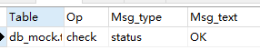
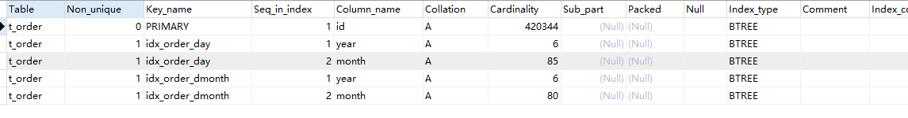

高性能MYSQL

# 创建高性能索引

## 索引基础

### 索引类型

#### B-Tree索引

MyIsam都是非聚簇索引，节点存数据，节点的数据存储的是数据的地址，需要根据这个地址去查内存；Innodb如果是主键那么就是聚簇索引，存的是key+数据，其余的都是非聚簇索引，存的是key+主键index，需要根据主键index去回表获取索要查询的数据。

B-Tree都是叶子节点存数据，叶子节点之间有顺序，如果索引有顺序，那么就可以range查询，直接遍历叶子的后续判断是不是也符合查询条件。

- 全值匹配：根据索引的所有列来进行匹配
- 最左前缀：依次根据索引列的左部进行匹配，索引下推，减少回表，直到不匹配为止
- 匹配列前缀：根据索引列的开头左边部分进行匹配。
- 匹配范围值
- 精确匹配到某一列，并且范围匹配另一列
- 索引覆盖：查询的字段正好是索引，减少回表

#### 哈希索引

缺点：

- 不支持部分索引列匹配，始终使用列的全部内容进行hash计算；如（A，B）索引，如果只查询A就不能使用该索引
- 不支持顺序查询以及排序
- 索引只包含哈希值和行指针，不存字段值，需要根据行指针去比较数据行是否相等并读数据行
- 只能用于等值查询
- 访问数据很快，如果有哈希冲突，需要遍历链表中的所有行指针，直到找到符合条件的行
- 哈希冲突很多，维护索引的代价会很高。如果选择过滤性很差的列建立索引，那么删除的时候，需要遍历链表。

数据仓库星形结构就适合hash索引。

Innodb自适应哈希索引：如果发现某些索引值被使用非常频繁，就会B+索引上创建哈希索引

```mysql
#法1.导致非常慢，且存储内容会非常大
select id from url where url="http://www.mysql.com"

#法2 用 哈希
# 利用触发器创建hash，hash函数的选择尽量不要太过费时间且复杂
DELIMITER //
CREATE TRIGGER tablename_crc_ins BEFORE INSERT ON tablename FOR EACH ROW BEGIN SET NEW.url_crc=crc32(NEW.url)
END;
//

CREATE TRIGGER tablename_crc_upd BEFORE UPDATE ON tablename FOR EACH ROW BEGIN SET NEW.url_crc=crc32(NEW.url)
EDN;
//
DELIMITER;
# and后面的语句必须存在为了防止hash冲突
select id from url where url_crc=CRC32("http://www.mysql.com") and url="http://www.mysql.com" 

```


#### 空间数据索引

MyISQM支持空间索引，无须前缀匹配。必须使用Mysql的GIS相关函数如MBRCONTAINS()来维护数据。推荐使用PostgreSQL的postGIS。

#### 全文索引

查找文本中的关键词

#### 其他

TokuDB使用分形树索引

## 索引的优点

- 减少数据量扫描
- 将随机IO变为顺序IO
- 帮助服务器避免排序和临时表

## 高性能索引策略

### 独立的列

- 非表达式一部分

  ```mysql
  SELECT actor_id FROM actor WHERE actor_id + 1 = 5;
  ```

- 非函数的参数

  ```mysql
  SELECT …… FROM TO_DAYS(CURRENT_DATE) - TO_DAYS(date_col) <= 10
  ```

### 前缀索引和索引选择性

前缀索引的选择必须是过滤程度高的，<b>对于BLOB、TEXT或者很长的VARCHAR，必须使用前缀索引，MSYQL不允许索引这些列的完整长度。关键点在于长度适当且能够高过滤性。

<b>缺点</b> 不能order by 和 group by，不能作为覆盖索引

```mysql
# 首先查询所有的 城市名字 前十名
SELECT COUNT(*) AS cnt , city_name FROM city 
GROUP BY city_name 
ORDER BY cnt DESC
LIMIT 10
# 法1 逐步查找合适的区分度
SELECT COUNT(*) AS cnt , LEFT(city_name,3) AS prefix
FROM city
GROUP BY city_name 
ORDER BY cnt DESC
LIMIT 10

SELECT COUNT(*) AS cnt , LEFT(city_name,7) AS prefix
FROM city
GROUP BY city_name 
ORDER BY cnt DESC
LIMIT 10

# 法2 逐步计算不同前缀长度的选择性 相较于1 不精确
SELECT COUNT(DISTINCT LEFT(city_name,3)/COUNT(1) AS sel3),
COUNT(DISTINCT LEFT(city_name,4)/COUNT(1) AS sel4),
COUNT(DISTINCT LEFT(city_name,5)/COUNT(1) AS sel5),
COUNT(DISTINCT LEFT(city_name,6)/COUNT(1) AS sel6),
COUNT(DISTINCT LEFT(city_name,7)/COUNT(1) AS sel7)

# 创建前缀索引
ALTER TABLE CITY ADD KEY(city(7))
```

#### 案例

将电子邮件反向存储之后，建立前缀索引可以快速找到某个域名的电子邮件

### 多列索引

多个单列索引最后查询优化使用了索引合并不是一个好的操作，如

```mysql
SELECT film_id , actor_id FROM film_actor WHERE actor_id = 1 OR film_id = 1

# 会被优化
SELECT film_id , actor_id FROM film_actor WHERE actor_id = 1 UNION ALL
SELECT film_id , actor_id FROM film_actor WHERE film_id = 1 AND actor_id <> 1
```

AND 或者 OR 多个索引列的时候考虑 建立联合索引。

### 合适的索引列顺序

过滤性能高的放在左边,但是注意要所有group by ，order by中出现的字段，都是极度影响性能的。

```mysql
SELECT COUNT(*) ,SUM(groupId = 10137), 
SUM(userId = 1288826), SUM(anunymous = 0)
FROM Message
```

###  聚簇索引

#### 优点

相关数据保存在一起，减少回表

#### 缺点

- 提高IO密集型应用性能，但是数据都在内存，那么聚簇索引没有什么优势
- 插入速度严重依赖插入顺序。如果按照主键插入速度很快，否则最好使用OPTIMISE TABLE 重新组织一下表。
- 聚簇索引插入新行或者主键被更新导致要移动行的时候，需要面临”页分裂“。如一行数据插入已经满的页，存储引擎会将页分成两个页，这就是页分裂，导致更多的磁盘空间。
- 可能导致全表扫描变慢，尤其是行稀疏或者页分裂导致数据存储不连续的时候。
- 二级索引需要找到叶子节点中的主键行之后去聚簇索引中查找真正的数据行，也就是两次IO。对于InnoDB，自适应hash索引能减少这样的重复工作。

#### 按照主键顺序插入

- 主键是顺序的，每一条记录都存储在上一条记录的后面。当达到页的最大填充因子（默认15/16)后会插入新的数据页，最后数据页会被顺序填满。
- 非顺序插入，因为存储的数据无序，要找到合适的位置进行插入，可能导致如下缺点
  - 目标页不在内存，需要从磁盘加载到内存，导致大量IO
  - 写入是乱序的，InnoDB不得不频繁页分裂，需要移动大量数据
  - 频繁页分裂，导致页变得系数并且不规则，最终有碎片

> 顺序的主键在高并发的情况下，InnoDB按主键顺序插入可能造成明显的争用，对间隙锁竞争；同时可能造成AUTO_INCREMENT锁竞争。这时候需要考虑表重新设计或者更改innodb_autoinc_lock_mode配置。

### 覆盖索引

#### 优点

- 索引条目通常远小于数据行大小，只需要读取索引，就会减少数据访问量
- 索引按列顺序存储，这样使得IO密集型范围查询比随机从磁盘读取一行数据的IO要少很多
- 像MyISAM内存中只缓存索引，数据访问需要系统调用。如果每次访问数据都需要一次系统调用，很可能造成性能问题。
- InnoDB的覆盖索引保证二级索引不去回表，提升性能

#### 延迟关联

```mysql
SELECT * FROM products JOIN 
(
  SELECT prod_id 
  FROM products
  WHERE actor="ABC" AND title LIKE '%APOLLO%'
) t1 ON (t1.prod_id=products.prod_id)
```

先利用覆盖索引将少量prod_id查出来之后，在进行关联回表

### 使用索引扫描来做排序

如果覆盖索引有序，则可以顺序查找且不需要回表，否则多次回表不如顺序全表扫描。

> order by 需要满足最左前缀原则，多表连接进行order by的时候需要满足第一张表的最左前缀匹配，否则不嫩那个使用索引排序。除非where 或者 join字句对最左前缀的列指定了常量，然后紧接着后续的索引列进行order by

```mysql
# 联合索引 rental_date,inventory_id,customer_id
SELECT rental_date , staff_id FROM rental 
WHERE rental_date = '2005-05-25'
ORDER BY inventory_id,customer_id

# 最左前缀多个等于条件 也能使用索引
... WHERE rental_date = '2005-05-25' ADN inventory_id IN(1,2) ORDER BY customer_id
```

下面这个无法使用索引进行范围查找
```mysql
# 索引列第一列用来范围查询
... WHERE rental_date > '2005-05-25' ORDER BY inventory_id, customer_id;
```

### 压缩（前缀压缩）索引
MyISAM使用前缀压缩来减少索引的大小，在内存中存放更多的索引，以此提升性能。如perform，performance，那么performance会压缩成7,ance

压缩虽然使用空间更少，但是查找时无法使用二分查找。如果IO密集型就会减少很多成本，但是如果是CPU密集型就会导致随机读浪费很多性能，倒序扫描尤其。

删除冗余索引，可以减少修改时间。

二级索引进行修改的时候需要注意，如二级索引A，其实存的是（A，ID），对于`WHERE A = 5 ORDER BY ID`能命中，但是变成（A，B）就变成（A，B，ID）了反而会变成文件排序了，不能利用索引了。

### 未使用的索引

删除不经常使用的索引，通过MariaDB打开userstates让服务器运行一段时间之后查看`INFORMATION_SCHEMA.INDEX_STATISTICS查看索引使用频率。

也可以使用Percona Toolkit的pt-index-usage来获取查询日志并对每个查询就行EXPLAIN。

### 索引和锁

索引使得锁定更少的行，性能更好；虽然行锁效率高，但是锁终究有额外开销，锁定超过需要的行会增加锁争用并减少并发性。

一旦InnoDb检索到数据并返回到服务器之后，MYSQL服务器再进行WHERE这段时间都是上锁的，只有过滤后才能释放锁。

```mysql
SET AUTOCOMMIT = 0;
BEGIN;
SELECT actor_id FROM actor WHERE actor_id < 5 AND actor_id <> 1 FOR UPDATE 
```
上述语句会获取1-4之间的排他锁，返回后才会进行WHERE进一步过滤。如下的语句就会被挂起
```mysql
SET AUTOCOMMIT = 0;
BEGIN;
SELECT actor_id FROM actor WHERE actor_id = 1 FOR UPDATE;
```

InnoDb在二级索引使用读锁，主键索引使用写锁。消除了覆盖索引的可能性，使得SELECT FOR UPDATE 比 LOCK IN SHARE MODE 慢很多。

## 索引案例学习

### 支持多种过滤条件

如sex、country虽然选择性不高，但是每次都会用到，所以创建(sex,country)作为前缀，虽然sex过滤性很差，但是可以通过`AND SEX IN('m','f')`来命中索引，并且不过滤任何行。
应该考虑同时优化查询和索引来达到最佳平衡。尽可能将范围查询字段放在索引最后，因为范围查询后的字段不再匹配。并且用IN()来覆盖不再WHERE子句中的列，如果IN过多会导致组合暴增，降低性能。
```mysql
# 优化器会变成4 * 3 * 22 = 24种组合
WHERE eye_color     IN('brown','blue','hazel')
AND   hair_color    IN('black','red','blonde','brown')
AND   sex           IN('M','F')
```

### 优化排序

```mysql
# 翻页到很后面会非常慢，会花费大量实践去扫描需要丢弃的数据
SELECT <clos> FROM profiles WHERE sex='M' ORDER BY rating LIMIT 1000000,10
```
可以通过反范式或者预先缓存计算解决这个问题，也可以延迟关联，利用覆盖索引只返回主键，再根据主键获得需要的行。

```mysql
# 索引 (sex,rating) 默认带了id
SELECT <cols> FROM profiles INNER JOIN(
    SELECT id from profiles
    WHERE x.sex='M' ORDER BY rating LIMIT 1000000,10
  ) AS x using(id)
```

## 维护索引和表

创建表并建立索引还需要维护表和索引
- 找到并修复损坏的表
- 维护准确的索引统计信息
- 减少碎片

### 找到并修复损坏的表

表损坏通常是系统崩溃导致，会导致查询返回错误的结果或者莫须有的主键冲突问题，甚至会导致数据库崩溃。
`check table` 来检查是否表损坏。`repair table` 来修复损坏的表。


### 更新索引统计信息

可以通过两个API来了解存储引擎的索引分布信息，决定如何使用索引
- records_in_range() 来判断这个范围有多少记录。
- info() 返回各种类型数据，包括索引的基数（每个键有多少记录）
存储引擎向优化器提供的扫描行数如果不准确或者执行计划太复杂以至于无法准确获取各个阶段的行数，那么会使用索引统计信息来估算扫描的行数，优化器就是基于需要扫描的行数进行优化的。
可以通过ANALYZE TABLE 来重新生成统计信息解决这个问题。不同引擎运行的成本也不同
- Memory 不存储索引统计信息
- MyISAM存在磁盘，全表扫描会锁表
- InnoDB随机索引访问进行评估并存储在内存中

> 表首次打开、或者执行ANALYZE TABLE 或者 表的大小发生巨大变化（超过1/16或者插入了超过20亿数据)就会计算索引的统计信息
> 打开INFORMATION_SCHEMA表或者使用SHOW TABLE STATUS 和 SHOW INDEX或者在MYSQL客户端打开自动不全都会出发索引统计信息更新，会加剧服务器压力，
> 可以关闭`innodb_stats_on_metadata`来避免

```mysql
# 查看索引的基数Cardinality
SHOW INDEX FROM t_order
```


