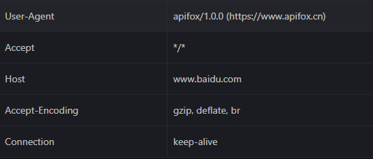
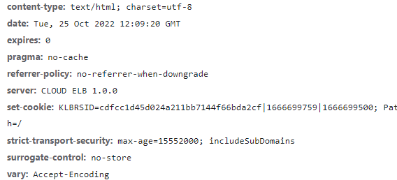

# 流

## 简介

- java的I/O都建立于流（stream）之上：FileInputStream、TelnetOutputStream
- 过滤器（filter）流可以串联到输入流或输出流上。可以来实现加密或者压缩，或者只是将数据转换为其他格式。DataOutputStream
- 阅读器（reader）和书写器（writer）可以串联到输入流和输出流，允许程序读写的是字符。
- 流是同步的。
- 支持通道和缓冲区的非阻塞IO

## 输出流

OutputStream

- FileOutputStream把数据写入文件
- TalnetOutputStream把数据写入网络
- ByteArrayOutputStream 把数据写入可扩展的字节数组

### flush

java代码缓存的存在，会导致流不会直接发送，而是等到缓冲区满了之后才发送。那么试想一下，如果服务器发送了300字节数据，1024字节的缓冲区显然未满，还在等待服务器继续发送，可是服务器却在等待客户端响应（没收到响应就不发），那么显然已经产生了死锁了，flush()方法可以强制缓冲区发送数据，即使缓冲区未满。

在关闭流之前记得刷新输出流，否则容易造成缓冲区数据丢失。

## 输入流

InputStream

- FileInputStream 从文件中读数据
- TelnetInputStream从网络中读数据
- ByteArrayStream 从字节数组中读数据

## 标记和充值

InputStream 允许程序备份和重新读取已经读取的数据。

## 过滤器串链在一起

```java
DataOutputStream out = new DataOutputStream(new BufferedOutputStream(new FileOutputStream("data.txt")));
```

## 缓冲流

- BufferedOutputStream把写入的数据存储在缓冲区（一个名为buf的保护字节数组字段），直到缓冲区满或者刷新输出流。
- BufferedInputStream会先从缓冲区的保护字节数组（buf)中读取数据，如果不存在才回去底层源中读取数据，且会读取的数据尽可能的多，方便之后读取。

## PrintStream

有害，应该尽可能避免。

- println()的输出与平台有关，转义字符可能有不同的意思
- PrintStream假定使用所在平台的默认编码，在网络传输的时候可能并不是服务器或者客户端所期望的。
- PrintStream吞掉了所有异常

可以通过checkError()检查错误标志，但是无法重置错误标志。

## 数据流

DataInputStream和DataOutputStream可以用二进制格式读写Java的基本数据类型和字符串。

## 阅读器和书写器

Reader和Writer最重要的具体子类时InputStreamReader 和 OutputStreamReader；将面向字节的接口改为面向字符的接口

## 过滤器阅读器和书写器

BufferedReader、BufferedWriter、LineNumberReader、PushbackReader、PrintWriter

BufferedReader和BufferedWriter对应于InputStreamReader 和 OutputStreamReader（内部字节数组作为缓冲区），是面向字符的，使用的是一个内部字符数组作为缓冲区

BufferedWriter()新增的newLine()解决了跨平台换行符的问题，通过line.separator获取换行符。

## PrintWriter

尽管能正确处理多字节字符集和管计划文本，但是还是存在着平台依赖性和错误报告信息量小的问题。

# 线程

每个进程都有独立的内存，但是太重了。线程可以共享进程的资源，提升性能，轻量级，但是增加了程序的复杂性，尤其是一致性问题。

## 运行线程

可以覆盖Thread.run()方法或者实现Runnable接口让线程执行指定的任务。

`public void run`：所有的工作都写在这个方法里，线程开始结束都在这里。

## 派生Thread

通过继承Thread，重写run()实现多线程

见char3.demo1

## 实现Runnable

通过实现Runnable接口中的run()方法，传递给Thread来运行

见char3.demo2

## 从线程返回信息

默认线程run不接受参数，不返回结果。需要变量或者回调来传递返回信息。

见char3.demo3

## 轮询 & 回调

见案例char3.demo3，这里不再展示

## Feture、Callable、Executor

见案例char3.demo4，这里不再展示

## 同步类、实例、方法

不同的粒度，通过synchronized同步锁控制程序并发执行，但是性能有所下降。

## 同步的替代方法

- 方法内部创建全新的局部变量
- 基本类型的方法参数也是安全的，因为Java按值传递
- 对象类型的方法除了String（不可变）其他都很麻烦
- 不包含对其他类型对象引用的构造函数是安全的；如果构造函数把正在创建的对象传递给另一个不同线程可能会出问题。
- 利用不可变性
- 把非线程安全的类作为线程安全类的一个私有字段，只要包含类线程安全的访问这个非安全类。

> List list = Collections.synchronizedList(new ArrayList())使用的时候，如果对list执行一系列原子操作的组合需要对list进行同步。如果对包含list的对象进行同步，因为如果其他对象也引用该list，可能会造成线程不安全。

## 优先级

Java中10最高优先级、0最低优先级、默认是5.与UNIX相反。

## 让线程暂停的8种方法

### 阻塞

等待获取暂时无法获取到的资源

### 放弃 

yield() 允许同级线程抢占CPU，但是不会释放上锁资源

### 休眠

sleep() 允许低级线程抢占CPU，但是不会释放上锁资源；可以通过interrupt()唤醒，继续执行catch块内的代码，但是如果是唤醒IO阻塞，则很大可能不起效果。

### 连接线程 

join() 阻塞当前线程，等待被连接线程运行结束。

### 等待一个对象

wait(),等待一个对象，直到

- 时间到期：但是如果仍旧没有获得等待对象的锁，可能仍要阻塞一段时间
- 线程被中断：interrupt()
- 对象得到通知：notify() \ notifyAll()

### 结束

线程正常结束，如果任务运行时间本来就极短，不建议为它开设线程。

## 线程池和Executor

线程启动和撤销都会有性能开销；线程间切换也会有开销；生成过多的线程，超过机器所能承载的极限时，只会导致更多的线程管理的开销。

## Internet地址

### 简述

- IPV4

四字节三十二位，每个无符号字节范围0-255，字节间通过.分割

- IPV6

16字节128位，通过:分隔成8个块，每个区块都是4个16进制数字。可以省略前导0，最早出现的多个连续0区块可以用::表示。
有时候最后四个字节表示成IPV4格式。

- DNS

域名解析器。如果一个域名对应多个IP，可以通过DNS随机选择一个主机进行响应。如果该服务移动到其他机器时，会重新做域名与IP之间的映射

### InetAddress

Java对Ip的封装,当IP相同时，两个InetAddress对象就相同，否则就是不相同。

### 缓存

暂存最近请求的域名和IP映射。由于第一次查找超时（其实存在该域名到IP的映射），可是由于缓存机制的原因，会把第一次超时返回的域名到IP的映射存的时间较短，可以通过

- `newworkaddress.cache.ttl` 指定成功的查找结果的缓存时间
- `newworkaddress.cache.negative.ttl` 指定不成功的查找结果的缓存时间
- -1 表示永久缓存

### 安全性

对不可信的applet不提供DNS查找服务。可以通过`public void checkConnect(String hostname,int port)`测试主机能否解析.

### 地址类型

- 127.0.0.1 \ ::1 本机地址 可以通过`isLoopbackAddress()`测试
- 224.0.0.0 - 239.255.255.255 \ FF 组播地址，可以通过`isMulticastAddress()`测试
- FF0E\FF1E开头的IPV6地址 全球组播地址
- FF08\FF18开头的IPV6地址 组织范围组播地址
- FF05\FF15开头的IPV6地址 网站组播地址
- FF02\FF12开头的IPV6地址 子网范围组播地址
- FF01\FF11开头的IPV6地址 本地接口组播地址
- 0.0.0.0 \  :: 通配地址 可以通过`isAnyLocalAddress()`测试
- FE80:0000.0000:0000开头的IPV6地址 本地链接地址（对比DHCP服务的IP自动分配） 可以通过`isLinkLocalAddress()`测试
- EFC0:0000.0000:0000开头的IPV6地址 本地哇那个站地址，可以通过`isSiteLocalAddress()`测试

### 测试可达性

`isReachable()`测试是否连接到某特定主机

### NetworkInterface

表示本地IP地址，可以是一个物理接口，也可以是一个虚拟接口。可以通过这个类来枚举所有本地方法，之后通过这些地址创建InetAddress。

1. `getByName(String name)`获取指定名字的网络接口
2. `getByInetAddress(InetAddress address)` 获取指定IP地址绑定的网络接口
3. `getNetWorkInterfaces()` 获取所有的本机的网络接口
4. `getInetAddresses()` 一个接口可能对应多个IP，列举某接口的所有IP
5. `getName()` 返回某个接口的名字
6. `getDisplayName()` 返回一个更友好的接口名字

# URL & URI

## URI

统一资源标识符,由一个模式和一个模式特定组成部分组成，模式和模式组成部分用一个冒号分隔。模式：模式特定部分

URI大多采用层次结构：如http://www.ietf.org/rfc/rfc3986.txt 

- 模式为http
- 授权机构为www.ietf.org
- 路径为/rfc/rfc3986.txt 

意味着www.ietf.org服务器负责将/rfc/rfc3986.txt 映射到一个文件。

> 如果没有把ASCII字符编码为十六进制码，直接包含在URI中，称为IRI（国际化资源标识符），更容易读入、更容易录入。

## URLs

是最常见的URI，既能表示资源，又能为资源提供一个特定的网络位置，客户端可以通过它来获取资源。

`java.net.URI` 只标识资源
`java.net.URL` 既能标识资源，又能获取资源。

URL语法为：protocol://userInfo@host:port/path?query#fragment，如http://www.ietf.org/rfc/rfc3986.txt 就是一个URL地址。

- protocol：协议，对URI模式的另一种叫法。可以是file、ftp、http、https、magnet、telnet……
- userInfo@host:port/path：指定用户、主机、端口号、文件路径 这部分与linux中`scp` 传输文件时的路径含义一致。
- query：传入的查询参数
- fragment： 片段指向远程资源的某个特定部分，如anchor、XPointer、section

包含片段标识符的URL引用，不是URL。

## 相对URL

- `<a href="javafaq.html">` 当前文件夹的javafaq.html
- `<a href="/projects/ipv6/">` 文档根目录的/projects/ipv6/

## URL类

`java.net.URL`是对统一资源定位符的抽象，使用了策略设计模式。这个类只会对URL协议进行识别，其他参数不做检查。

### 由字符串构造URL

#### 案例

- 测试URL类对协议的支持情况 （ProtocolTester）

### 由组成部分构造URL

`public URL(String protocol, String hostname, String file) throws MalformedURLException`
`public URL(String protocol, String hostname, int port, String file) throws MalformedURLException`  

端口不指定的时候，端口为协议的默认端口。file参数应该/开头，包括路径、文件名、可选的片段标识符。

### 构造相对URL

`public URL(URL base, String relative) throws MalformedURLException` 通过相对URL和基础URL构建一个绝对URL

实际就是把base的文件名替换成relative参数值

## 从URL获取数据

### openStream

#### 案例 

- 下载一个Web页面 （SourceViewer）

### openConnection

`public URLConnection openConnection() throws java.io.IOException` 为指定的URL打开一个socket，并返回一个URLConnection。URLConnection
白哦是一个网络资源的打开的连接。之后会详细介绍。
`public URLConnection openConnection(Proxy proxy) throws java.io.IOException` 指定通过特定代理服务器传递连接

### getContent

`public final Object getContent() throws java.io.IOException ` 获取URL内容
`public final Object getContent(Class[] classes) throws java.io.IOException` 以Class类型返回URL内容

#### 案例

- 下载一个对象 (ContentGetter)

## URL组成部分

包含了协议、主机、端口号、口令、用户等等信息。

### 案例

- URL组成部分

## 相等性和比较

`equals()` 和 `hashCode()`

当且仅当两个URL都指向相同主机、端口和路径上的相同资源，且拥有相同标识符和查询字符串才相等。但是equals通过DNS解析主机，所以www.ibiblio.org/ 与 ibiblio.org/ 是相等的。

> equals() 可能是一个阻塞的IO操作，避免将URL存储在需要用到equals的数据结构中，如HashMap.

### 案例

- 比较两个资源是否相等

<b>缺点：</b>equals不会具体比较两个实际标识的资源，如 www.ibiblio.org/ 与 www.ibiblio.org:80 不相等。

可以通过`sameFile()`进行检查，但是该方法<b>不考虑片段标识符。</b>

## URI 

是对URL的抽象，不仅包括统一资源定位符，还包括统一资源名。一般格式为:`模式：模式特定部分：片段`
                           
特定模式部分一般采用特定的分层格式，如果采用分层格式（URI是透明的），就可以将特定模式部分划分为授权机构（用户信息、主机、端口）、资源路径、查询字符串

### URI各部分

#### 案例

- URI各部分解析 （URISplitter）

### 解析相对URI

```java
    // 相对转绝对 resolved = http://www.example.com/images/logo.png
    URI absolute = new URI("http://www.example.com/");
    URI relative = new URI("images/logo.png");
    URI resolved = absolute.resolve(relative);

    // 相对转相对 resolved = images/taishan/sun.png
    URI top = new URI("images/");
    URI resolved = top.resolve("taishan/sun.png");

    // 绝对转相对 relative = images/logo.png
    URI absolute = new URI("http://www.example.com/images/logo.png");
    URI top = new URI("http://www.example.com/");
    URI relative = absolute.relativize(top);
```

### 相等性和比较

- 相等的URI必须都是层次或者不透明的。
- 模式和授权机构的对比不考虑大小写
- 不解码直接比较

## URLEncoder

对字符串完成URL编码，可能会过度编码，但是Web浏览器会合理处理这些过度编码的URL；推荐使用UTf-8，兼容性较好。

### 案例 

- x-www-for-urlencoded 字符串（URISplitter）

`System.out.println(URLEncoder.encode("https://www.google.com/search?h1=en&as_q=Java&as_epq=I/O","UTF-8"));`
典型的get请求，但是对整个URL编码就会导致过度编码，`? = & /`其实不需要编码。所以要逐部分对URL编码。 下述案例是一种解决办法

- QueryString类

## URLDecoder

URLDecoder包含一个静态的decode(),他会对用x-www-form-url-encode格式编码的字符串进行解码。

## 代理

动静分离、请求的过滤都可以通过中间代理进行实现。

## 系统属性

- 设置代理，并排除不需要代理的主机名
```java
    // 设置代理服务器 192.168.254.254 端口为 9000
    System.setProperty("http.proxyHost","192.168.254.254");
    System.setProperty("http.proxyPort","9000");
    System.setProperty("http.nonProxyHost","java.oreilly.com|xml.oreilly.com");
    // 对特定的域内的所有主机都进行代理
    System.setProperty("http.nonProxyHost","*.oreilly.com");
```

## Proxy类

Proxy类允许从Java程序中对代理服务器进行更细粒度的控制。

- Proxy.Type.DIRECT
- Proxy.Type.HTTP
- Proxy.Type.SOCKS

## ProxySelector

选择不同的代理服务器，尝试建立连接。

### 案例 

- ProxySelector会基础可以连接的URL(LocalProxySelector)

## 通过Get与服务器端程序通信

通过URL发送Get请求

### 案例

- 完成一个OpenDirectory搜索(DMoz)

## 访问口令保护的网站

### Authenticator

是一个抽象类，通过`Authenticator.setDefault()`来注入需要的具体认证方式。用来为HTTP认证自我保护的网站提供用户名和口令。其中Http的认证模式一般都是`basic`。

其子类必须覆盖`getPasswordAuthentication()`方法来收集用户名和口令，缓存在虚拟机会话中，一旦有了正确的口令就不再询问。

## PasswordAuthentication

仅包含用户名和口令的final类。

## JPasswordField

输入密码的时候显示的是*。

### 案例 GUI认证程序(SecureSourceViewer、DialogAuthenticator)

# HTTP

## HTTP协议

Web浏览器和Web服务器之间通信的标准协议。对于每一个请求都有4个步骤：

- 客户端再端口80打开与服务器的一个TCP连接，URL中可以指定其他端口
- 客户端向服务器发送消息，请求指定路径的资源。整个请求包括了一个首部，可选地（取决于请求的性质）还有一个空行，后面跟请求的数据。
- 服务器向客户端发送响应。响应以响应码开头，后面包含元数据的首部、一个空行以及请求的文档或者错误信息。
- 重复2-3。
- 服务器关闭连接。

每个请求和响应都有同样的基本形式：
- 一个首部行 `GET /index.html HTTP/1.1`
- 一个包含元数据的HTTP首部   
- 一个空行
- 一个消息体

### MIME类型
   
类型和子类型，其中8个顶级类型

- text/* 表示人可读文字
- image/* 表示图片
- model/* 表示3D模型，如VRML文件
- audio/* 表示声音
- video/* 表示移动的图片，可能由声音
- application/* 表示二进制数据
- message/* 表示协议特定的信封，如email消息和HTTP响应
- multipart/* 表示多个文档和资源的容器

### 一般的客户端请求



- User-agent:.... // 告诉服务器使用的什么浏览器，变与服务器发送为特定浏览器类型而优化的文件
- Host: ....      // 指定服务器的域名
- Connection: Keep-Alive // 连接保持,使得可以宠用Socket
- Accept: ....    // 告诉服务器客户端可以处理哪些数据类型

### 一般的服务器响应

首行应该是响应的状态200、404、500等，其余部分参考下图：


### Keep-Alive

- HTTP1.0会为每个请求开一个新连接，但是打开和关闭连接的花费远超过数据传输时间。
- HTTP1.1及以后版本，可以保持连接打开，连接保持期间发送多次请求。

## HTTP方法

- GET（查）
- POSt（增） <b>不存在幂等性</b>，存在重复提交问题
- DELETE（删） 幂等性，删除一次之后再次发送相同请求，就不再受理。
- PUT（改） 幂等性，就是说不会同一个请求连续发送两次，不用担心处理两次，用过了就不能再用了。
- HEAD 只查看资源的首部，不会返回具体数据，常用来检查文件的修改日期，或者与本地副本文件做对比，检查有效性。

## Cookie

- 在请求和响应的HTTP首部，是一些用来存储持久的客户端状态的非空白的小文本，不能包含逗号或者分号。
- 服务器通过cookie来指示会话ID、登录凭据、用户首选项等，当然服务器只能对自己所属的域进行Cookie的设置。

### 属性

- Domain：扩大Cookie生效的范围。
- Path：改变Cookie作用的目录范围。
- expires：设置过期时间
- Max-Age：设置经过多久过期
- secure：没有值，拒绝通过非安全通道发送该cookie。
- httponly:保证只能HTTP、HTTPS返回cookie
 
`Cookie: usere=elharo; Path=/restricted; Domain=.example/com` 跟Spring Gateway中的过滤很相像。

### CookieManager

#### 案例

- 过滤指定域的Cookie （NoGovernmentCookies）

### CookieStore

CookieManager保存在CookieStore中，把cookie库保存在磁盘上。

# URLConnection

URLConnection是一个抽象类，表示指向URL指定资源的活动连接。是Java的协议处理器机制的一部分，将协议处理与数据处理分开。

> 与HTTP绑定过于紧密。如假定传输的每个文件前都有MIME或者类似的东西，但是如FTP、SMTP不使用MIME首部。

## 打开URLConnection

一般过程

- 构造URL对象
- 调用URL对象的openConnection()获取一个URLConnection
- 配置URLConnection
- 读写数据
- 关闭

子类一般只要重写URLConnection的`connect()`方法，第一次构造URLConnection时，需要手动connect来建立本机和远程主机之间的连接（一般使用TCP socket
）；但是大多数操作如果发现连接还没建立，会自动去调用connect。

## 读取服务器数据

### 案例 

- 用URLConnection下载一个Web页面 (SourceViewer2)

## 读取首部

### 获取指定的首部字段

常见首部字段

- Content-type
- Content-length
- Content-encoding
- Date
- Last-modified
- Expires

#### getContentType

获取响应体的MIME内容类型，可能包含字符集编码方式。如果没指定编码，就使用IOS-8859-1（HTTP的默认编码模式）

##### 案例

- 用正确的字符接下载一个Web页面 (EncodingAwareSourceViewer)

#### getContentLength

获取响应的资源内容有多少字节

##### 案例

- 从Web网站下载二进制文件并保存到磁盘 (BinarySaver)

#### getContentEncoding

获取内容的编码方式。如果要对发送的文件进行压缩，那么就是x-gzip编码方式。

> ContentEncoding 是对资源的编码，如压缩x-gzip；ContentType 是对具体内容的编码 如text/* 就是文本直接显示

#### getLastModified

获取文档最后修改时间。

##### 案例

- 返回首部 (HeaderViewer)

### 获取任意的首部字段

#### getHeaderField(String name)

获取指定的字段，同意以String类型返回

#### getHeaderField(int n)

获取第n个首部字段的值

##### 案例

- 显示整个HTTP首部(AllHeaders)

## 缓存

对经常访问的资源进行缓存。一般GET通过HTTP访问的都可以缓存；HTTPS活POST就不应该缓存。

### 案例

- 检查Cache-control首部

## Java的Web缓存

Java默认不缓存。若想缓存，需要有：

- ResponseCache的子类
- CacheRequest的子类
- CacheResponse的子类

`ResponseCache.setDefault()`来注入ResponseCache的子类完成系统缓存。Java虚拟机仅支持一个共享缓存。

### 案例

- CacheRequest具体子类(SimpleCacheRequest、MemoryCache)

## 配置连接

URLConnection的7个保护的实例字段

- url
    
    指定了URLConnection所连接的url，复制之后不能再变

- doInput

    URLConnection可以用来读取服务器

- doOutPut

    URLConnection可以想服务器发消息

- allowUserInteraction

    是否允许用户交互
    
- useCaches

    是否允许缓存
    
- ifModifiedSince

    指定了文件最后修改时间，如果在该时间之后服务器文件有所改动，就服务器传回新文件；否则读缓存文件。
    
    - 案例 将ifModifiedSince设置为24小时之前（Last24）

- connected

    连接是否已经打开

## 配置客户端请求HTTP首部

`setRequestPorperty(String name, String value)`给URLConnection首部字段设置新值。
`addRequestPorperty(String name, String value)`给URLConnection首部字段增加新值。

```java
uc.setRequsstProperty("Cookie","username=test; password=test; session=100678945")
```

## 向服务器写入数据

默认禁止写入数据，需要`uc.setDoOutput(true)`来开启。

### 案例 

- 提交一个表单 （FormPoster）

上述案例：首先建立URL的连接，之后封装好要传递的数据，接着通过打开服务器的写功能，最后建立连接，写出请求数据。

## URLConnection安全考虑

通过URLConnection的`getPermission()`查看连接这个URL所需要的权限。

## HttpURLConnection

URCConnection的子类。可以获得和设置请求方法、确定是否重定向、获得响应码和消息，以及确定是否使用了代理服务器。由于构造方法是protected，所以不能直接创建该对象实例，需要强制转换。

```java
    URL u = new URL("http://lesswrong.com/");
    HttpsURLConnection http = (HttpsURLConnection)u.openConnection();
```

### 请求方法

大多数方法之前讲过了，所以不再赘述。

`public void setRequestMethod(String method) throws ProtocolException` 设置请求方法

#### HEAD

与GET相似，但是告诉服务器只返回HTTP首部，不用实际发送文件。常用来检查文件在最后一次缓存之后是否有修改。

##### 案例

- 获得URL的最后一个修改的时间 (LastModified)

#### OPTION

询问指定的URL支持哪些选项，如果请求的URL是*，那么这个请求会作用于整个服务器而不是服务器上的某个URL。

最后服务器在HTTP首部的Allow字段返回该URL允许的请求方法集合。

#### TRACE

追踪服务器和客户端之间进行了哪些处理，如果经过了代理服务器的话，原请求返回前后会有变化。

### 处理服务器响应

#### 案例

- 查看响应码和消息(SourceViewer3)

### 错误条件

#### 案例

- 用URLConnection下载Web页面

### 重定向

3XX的响应码都表示重定向，表示请求的资源不再期望的位置上，可能在其他位置上。此时会自动跳转到新位置加载文档，这存在重大的安全隐患，可能会从一个可信网站到一个不可信网站。

### 流模式

> 每个HTTP请求首部，都有一个Content-length，但是写首部的时候可能还不知道主体的长度，而这个长度对于读取流数据时有关键。
> Java的处理方式：对于HttpURLConnection获取第额OutputStream，会把所有的内容缓存写入OutputStream.

- 当然为了提高性能，可以使用块传输模式 `setChunkedStreamingMode`,不过会影响身份认证和重定向。
- 如果已经知道数据大小，可以通过`setFixedLengthStreamingMode`进行优化连接，不过会影响身份认证和重定向。

## 客户端Socket

### 构建Socket

`public Socket()` 创建未连接的Socket

`public Socket(Proxy proxy)` 通过中间代理进行Socket连接

`protected Socket(SocketImpl impl) throws SocketException `

`public Socket(String host, int port) throws UnknownHostException, IOException`

### 用Socket从服务器读取数据

#### 案例

- Daytime协议客户端 （DaytimeClient）

### 用Socket写入服务器

#### 案例

- 一个基于网络的英语-拉丁语翻译程序（DictClient）

### 半关闭Socket

计算机网络中四次挥手的理论。

`public void shutdownInput() throws IOException`
`public void shutdownOutput() throws IOException`

> 这里的关闭只是关闭了传输数据的流，不会释放Socket关联的资源，如所占用的端口，需要手动关闭Socket。

### 构造和连接Socket

`Socket`类是Java完成客户端TCP操作的基础类。通过IP和端口与应用建立连接。

#### 案例

- 查看指定主机前1024个端口哪些安装由TCP服务器 (LowPortScanner)

### 获取Socket信息

- 远程地址
- 远程端口
- 本地地址
- 本地端口

远程端口通常是标准委员会预先分配的已知端口，而本地端口通常是从本机运行时的空闲端口中选出的，因此本地多个客户端就可以同时访问相同的服务。

`isConnected()`返回是否Socket曾经连接过远程主机；

`isClosed()`返回的是否已经关机连接

`isConnected() && !isClosed()` 返回Socket是否打开

#### 案例

- 获得Socket信息(SocketInfo)

## 设置Socket选项

设置Socket所依赖的原生socket如何收发数据。客户端Socket：

- TCP_NODELAY 
   - Nagle算法：小数据包组合成大大数据包一起发送。需要远程主机对前一个包的确认才能继续发送数据包。存在这重大的延时问题。
   - TCP_NODELAY设置为true可以打破缓冲。
   - `setTcpNoDelay(boolean on)`
   
- SO_LINGER
   - 指定Socket关闭之后如何处理尚未完成发送的数据报。在响应的描述内如果没有成功发送数据、收到服务器确认，才解除对close()的阻塞。
   - `setSoLinger(boolean on, int seconds)` 
   
- SO_TIMEOUT
   - 来保证read()的阻塞不会超过设定的毫秒数（正常i情况，read()会阻塞尽可能长的时间来读取更多的数据）
   - `setSoTimeout(int milliseconds)`
 
- SO_RCVBUF和SO_SNDBUF
   - TCP连接中，大数据块受益于大缓冲区，小数据量受益于小缓冲区。
   - 通过设置缓冲区的大小来提高带宽（缓冲区\延迟），如果收发数据速度调整后过高，超过了网络的最大带宽，致使网路来不及处理，可能会导致拥塞、丢包和性能下降。
   - <b> 一般使用OS推荐的就好，不推荐自己手动调整</b>

- SO_KEEPALIVE
   - 客户端偶尔会通过一个空心啊链接发送一个数据包，来测试连通性。如果12分钟的尝试都没收到响应，就关闭连接。
   - `setKeepAlive(boolean on)`
   
- OOBINLINE
   - 发送紧急数据，优先处理紧急数据。Java通过该设置可以不忽略紧急数据。
   - `setOOBINline(boolean on)` 
   
- SO_REUSEADDR
   - Socket 关闭时，数据包可能还在网络上传输，需要等待确认对方已经收到这些数据包的响应，如果恰好由新进程占用了该端口，就会导致错误，致使响应数据返回到了新的连接。
   - 建议关闭，否则就会出现上述错误。
   
- IP_TOS服务类型
   - 不同类型的服务有不同的性能需求。服务器类型存放在IP首部名为IP_TOS的8位字段中。
        
     IP_TOS ： DSCP(高六位，指定服务类型) + ECN（低两位，显示拥塞通知）
   - `setTrafficClass(int trafficClass)`    
   
## Socket异常

`public class BindException extends SocketException` 端口正在使用或者无权访问

`public class ConnectException extends SocketException` 主机忙或者没有进程在监听该端口

`public class NoRouteToHostException extends SocketException` 连接超时

## GUI中的Socket

### whois

- 客户端连接远程服务器端口43的TCP
- 输入查询对象
- 服务器做出响应，关闭连接
- 客户端向用户展示信息

`telnet whois.internic.net 43` 不同服务器可能会返回不同格式数据

#### 案例

- 图形化Whois界面(WhoisGUI)

## 服务器Socket

服务器的生命周期：

`ServerSocket`

- 使用特定端口创建一个新的ServerSocket.
- ServerSocket利用`accept()`监听客户端请求。`accept()`一致阻塞，直到监听到请求后返回一个连接客户端和服务器之间的Socket对象
- 根据服务器类型，调用Socket的输入流\输出流来进行通信
- 服务器与客户端根据协商的协议交互，直到关闭连接
- 关闭连接后，继续回到`accept()`进行监听。

### 案例

- daytime服务器案例(DaytimeServer)

### 多线程服务器

#### 案例

- 线程池的daytime服务器(PooledDaytimeServer)

### 用Socket写服务器

#### 案例

- echo服务器（EchoServer）

### 关闭服务器Socket

关闭ServerSocket之后，就释放本地一个端口，同时中断所有与之关联的Socket。ServerSocket关闭后不能再重连。

检查是否打开`server.isBound() && !server.isClosed()` 已经绑定过端口且未关闭。

### 日志

#### 日志记录内容

- 请求
- 服务器错误

通常一个连接一个记录，每个连接的多个操作也都需要记录。错误日志主要记录服务器运行期间发生的意外异常。

##### 案例

- 记录请求和错误的daytime服务器

可以通过配置i运行时环境，把日志放在一个更持久的目标位置。建议在配置文件中设置日志的位置，这样改变日志位置而无需重新编译代码。`-Djavautil.logging.config.file=_filename_`进行设置。

### 构造服务器Socket

`public ServerSocket() throws IOException`

`public ServerSocket(int port) throws IOException`

`public ServerSocket(int port, int backlog) throws IOException`

`public ServerSocket(int port, int backlog, InetAddress bindAddr) throws IOException`

- baklog：入站链接的请求队列长度
- InetAddress：指定特定的本地IP地址
    - <b>为什么要指定IP：</b>因为一个主机可能有多个网卡，会存在多个IP，指定了IP就使得绑定了唯一的应用程序，否则可能会同时监听`IP1:3306、IP2：3306、…`·
- port：指定端口
    - 端口可以传入0，这样系统会为我们选择可用的端口号。这样子由系统指定的端口就称为匿名端口。对于多Socket协议很有用。如<b>被动FTP:</b>，客户端连接到服务器的21端口（由服务器指定），之后传输文件的时候，服务器开始监听所有可用端口，就可以让系统分配数据返回的端口，然后服务器只要告诉客户端Socket去连接该端口获取数据即可。这种情况下，服务器就不必提前知道不同会话使用的数据端口。
> <b>主动FTP：</b>由客户端监听服务器与之连接的临时端口，而不是由服务器监听。


#### 案例

- 查看本地端口(LocalPortScanner)

### 获得服务器Socket的有关信息

- 在多网卡的主机中未指定IP就可以通过`public InetAddress getInetAddress()`查看绑定的IP，如果还没分配就返回null.
- 将端口号指定为0的时候，可以通过`public int getLocalPort()`查看指定的IP，如果没有分配就返回-1.

### Socket选项

指定ServerSocket依赖原生socket如何收发数据。服务端Socket：

- SO_TIMEOUT
    - 默认0，永不超时
    - 通过`setSoTimeout(int timeout)`设置
- SO_REUSEADDR
    - 防止新Socket绑定到一个之前使用的端口，此时可能原Socket的数据正在网络传输。
    - 通过`setReuseAddress(boolean on)`进行设置
- SO_RCVBUF
    - 设置服务器Socket接收的客户端Socket默认接收缓冲区大小。一般用默认值
    - 通过`setReceiveBufferSize(int size)`进行设置
    
### HTTP服务器

#### 案例

- 单文件服务器(SingleFileHTTPServer)
- 重定向器Redirector（Redirector）
- 功能完备的HTTP服务器(JHTTP)

### 总结

直到这一章仍不能很好解决大流量，可以利用低优先级的线程缓存热点数据、非阻塞式IO和通道来代替线程和流。


