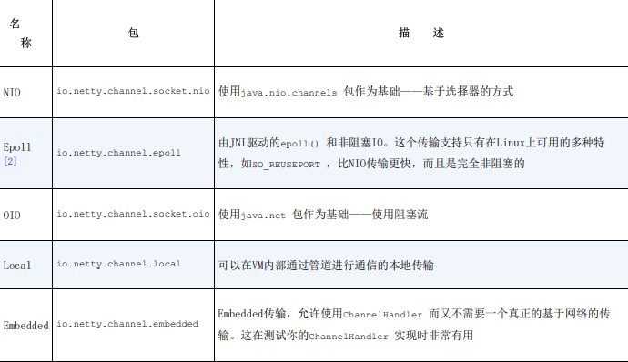
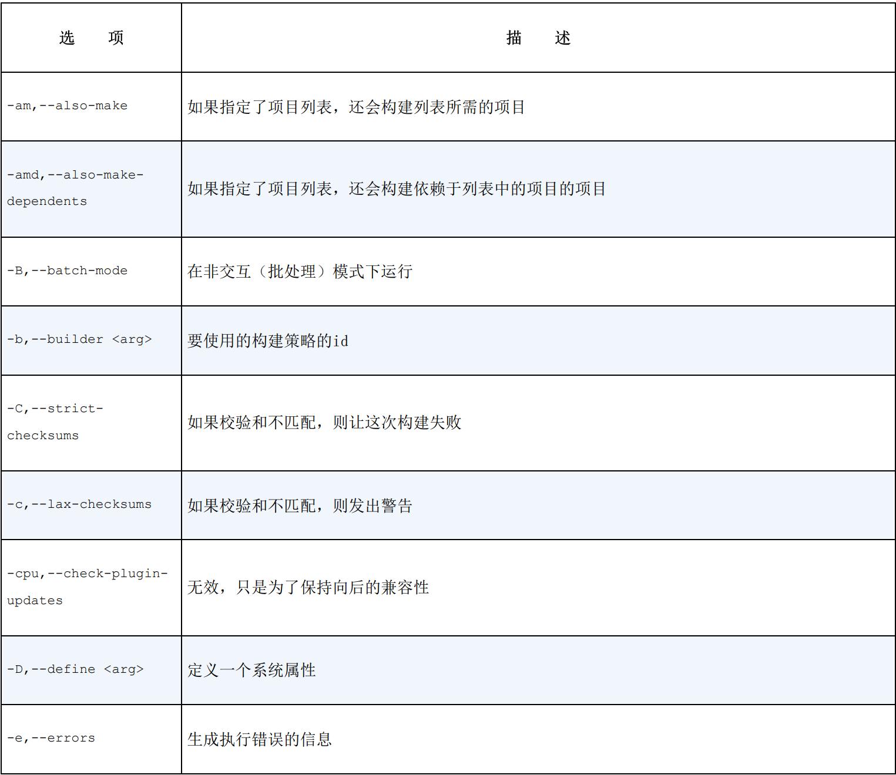
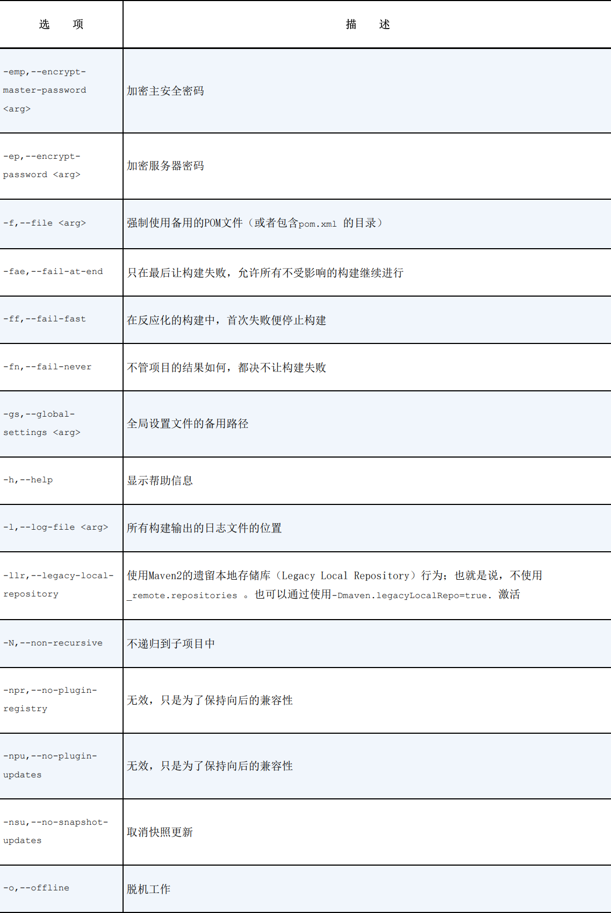
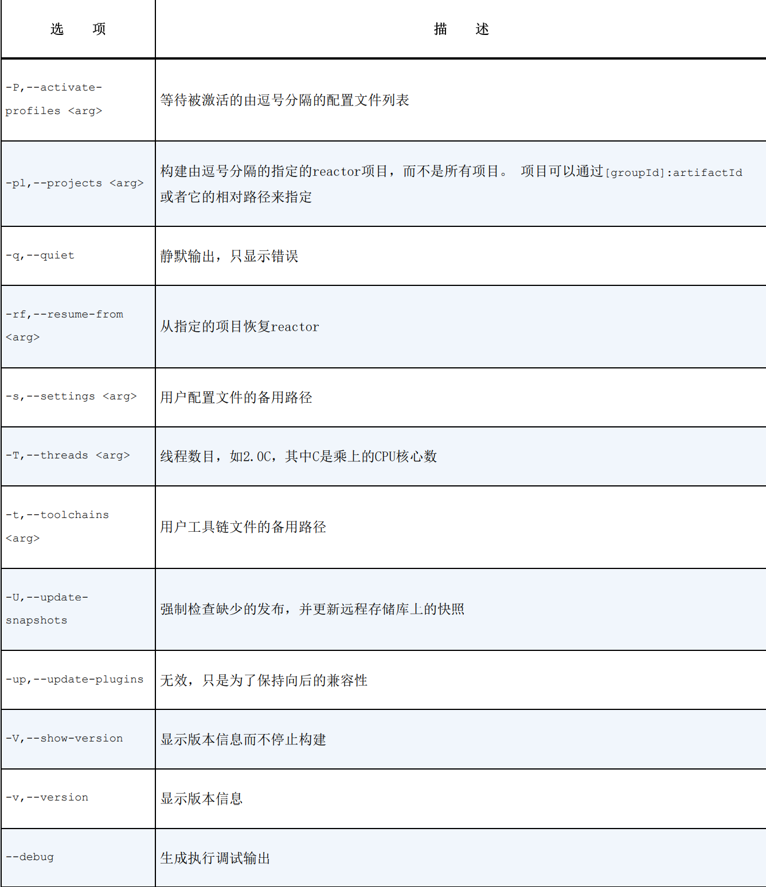

# Netty 

高性能的水平扩展的分布式架构

# 简单API介绍

## 异步和事件驱动

demo01中通过套接字实现简单通信，但是如果是大量用户需要通讯就面临三个问题

- 设置很多线程可能都在空等，浪费CPU资源
- 系统资源有限，为每个线程分配资源，空等线程显然就浪费者内存资源
- 线程切换涉及上下文切换，显然会占用很多性能

### Java NIO

通过<b>管道</b>来实现数据的输送，相较于轮询、中断、DMA具有更高的CPU利用率。

- 较少的线程可以处理许多连接，减少内存管理和上下文切换的开销
- 没有I/O操作需要处理的时候，线程可以用于其它任务

但是在高负载下可靠、高效处理比较繁琐且容易出错。

## Netty简介

特性：健壮、安全、高可用、高性能、更新快、易用

### 核心组件

这里不做过多解释了，如果熟悉过一两个项目，应该对这些不会陌生。

- channel：传入、传出的数据载体
- 回调：给请求的响应
- Feature：异步编程的的一个任务的开启
- 事件和ChannelHandler：很多框架，前端后端都包含这类"发布者订阅者"设计思想

## 第一个Netty案例

详见ch02.demo

- channelActive() ——在到服务器务的连接已经被建立之后将被调用；
- channelRead0() ——服务器收到一条消息时被调用
- exceptionCaught() ——在处理过程引发异常及时被调用

## Netty的组件和设计

### Channel、EventLoop、ChannelFuture

- Channel ————Socket
- EventLoop ————控制流、多线程、并发
- ChannelFuture ————异步通知

#### Channel接口

基本的I/O(bind、connect、read、write)依赖于底层网络传输所提供的源于。基于Java网路编程，其基本构造是Socket。
Netty的Channel简化了Socket的复杂性。

- EmbeddedChannel
- LocalServerChannel
- NioDatagramChannel
- NioScptChannel
- NioSocketChannel

#### EventLoop接口

- 一个EventLoopGroup 包含一个或者多个EventLoop ；
- 一个EventLoop 它的生命周期内只与一个Thread绑定；
- 所有由EventLoop处理的I/O事件都将在它专有的Thread上被处理；
- 一个Channel 在它的生命周期内只注册一个EventLoop ；
- 一个EventLoop 可能会被分配给一个或者多个Channel 。

#### ChannelFuture接口

Netty的所有I/O操作都是异步的。一个操作不可能立即返回，所以要在某个时间点确定其结果的方法。
Netty的ChannelFuture中的addListener()方法注册了一个ChannelFutureListener，以便在某个操作完成时得到通知。

### ChannelHandler和ChannelPipeline

#### ChannelHandler接口

充当了所有处理入栈和出战数据的应用程序逻辑的容器。

#### ChannelPipeline接口

提供了ChannelHandler链的容器，定义了用于在该链上传播出入站事件流的API。当Channel被创建时，他会自动地被分配到它专属的ChannelPipeline。

ChannelHandler安装到ChannelPipeline的过程：

- 一个ChannelInitializer的实现被注册到ServerBootstrap中；
- 当ChannelInitializer.initChannel()方法被调用，就在Pipeline中安装一组自定义的ChannelHandler
- 移除ChannelInitializer

<b>入站：</b>服务器端到客户端；反之称为出站。

这里跟Spring Security的过程很相似，不做详细阐述。

### 引导

就是通过ip、端口监听应用或者绑定端口提供服务。

ServerBootstrap需要两个EventLoopGroup：一个用来监听绑定的应用程序，另一个用来处理已经收到的客户端的请求。

## 传输

### 传输API

核心是Channel

- ChannelConfig：包含了所有Channel的配置，支持热更新
- ChannelPipeline：持有出入站数据以及事件的ChannelHandler实例
- ChannelHandler：
    - 数据格式转换
    - 异常通知
    - 提供Channel变为活动或者非活动的通知
    - 提供当Channel注册到EventLoop或者从EventLoop注销时的通知
    - 提供用户自定义事件的通知

> 拦截过滤器 ChannelPipeline 实现一种常见的设计——拦截过滤器（Intercepting
> Filter）。好似UNIX的管道

### 内置的传输



#### NIO——非阻塞IO

是JDK1.4之后，基于选择器的API。NIO提供了所有IO操作的全异步实现。

选择器背后的基本概念是一个注册表，所有的Channel把自己关心的事情注册到Selector中

- 新Channel已被接收且已经就绪
- Channel连接已经完成
- Channel有已经就绪的可供读取的数据
- Channel可用于写数据

选择器运行在一个检查状态变化并且对其做出相应响应的线程上，在应用程序对状态的改变做出响应之后，选择器将会被重置，并重复这个过程。

> 零拷贝（zero-copy）目前只有使用NIO或者Epoll传输时才可使用的特性。可以快速高效地将数据从文件系统移动到网络接口，而不需要将其从内核オ间复制到用户空间，其在像FTP或者HTTP
> 这样的协议中可以显著提升性能。但是，并不是所有的操作都支持这一特性。特别对实现了数据加密或者压缩的文件系统是不可用的——只能传输文件的原始内容。反过来，传输已被加密的文件则不是问题。

#### Epoll——用于Linux的本地非阻塞传输

一个高度可扩展的IO事件通知特性。Netty为Linux提供了一组NIO
API，以一种跟自身设计更加一致的方式来使用epoll，更加轻量使用中断，如果运行于Linux，高负载情况下性能由于JDK的NIO。

#### OIO——旧的阻塞IO

通过SO_TIMEOUT这个socket标志，指定等待一个IO操作完成的最大毫秒数，如果没有完成就会捕获这个异常并继续处理循环。在EventLoop下次运行时，继续尝试。

#### 用于JVM内部通信的Local传输

在同一个JVM中运行的客户端和服务器进行异步通信。

#### Embedded传输

将ChannelHandler传入到其他的ChannelHandler内部，可以扩展一个ChannelHandler，又不需要修改其内部代码。

### 传输的用例


## ByteBuf

作为NIO ByteBuffer在Netty中的替代品

### ByteBuf API

Netty的数据通过ByteBuf和ByteBufHolder进行暴露。

优点：

- 被用户自定义的缓冲区扩展
- 通过内置的复合缓冲区实现了透明的零拷贝
- 容量可以按需增长
- 在读和写两种模式间切换不需要调用ByteBuffer的flip
- 读和写使用了不同的索引
- 支持方法的链式调用
- 支持引用计数
- 支持池化

### ByteBuf类——Netty的数据容器

维护了读和写两个索引，读的索引值必然是写于写的索引值。也可设置写索引的最大值。

- 堆缓冲区

将数据存储在JVM堆空间中，这种模式成为支撑数组，能在没有池化的情况下提供快速的分配和释放

- 直接缓冲区
  直接将数据存在内存中，避免每次调用本地IO之前将缓冲区的内容复制到一个中间缓冲区（或者从中间缓冲区把内容复制到缓冲区）。相对于堆缓冲区，直接缓冲区的分配和释放更昂贵。

- 复合缓冲区

为多个ByteBuf提供一个聚合视图，按需添加或者删除ByteBuf实例。

`CompositeByteBuf` 将多个缓冲区合并为单个缓冲区的虚拟表示。

考虑如下场景，可以重用消息体的时候，对于每个消息都会创建一个新的头部，为了不重新分配这两个缓冲区，可以使用CompositeByteBuf消除了没必要的复制的同时，暴露了通用的ByteBuf
API。

```java
// 基于ByteBuffer 实现复合缓冲区
ByteBuffer[]message=new ByteBuffer[]{header,body};
        ByteBuffer message2=ByteBuffer.allocate(header.remaining()+body.remaining());
        message2.put(header)
        message2.put(body)
        message2.flip()

// 基于CompositeByteBuf
        CompositeByteBuf messageBuf=Unpooled.compositeBuffer();
        ByteBuf headerBuf=...
        ByteBuf bodyBuf=...
        messageBuf.addComponents(headerBuf,bodyBuf);
// 移除头部
        messageBuf.removeComponent(0);
// 循环遍历
        for(ByteBuf buf:messageBuf){...}
```

### 字节级操作

#### 随机访问索引

通过索引来随机读取字节数组不改变Index

#### 顺序访问索引

同时具有读索引、写索引，避免ByteBuffer使用flip的方法来转换读写模式

#### 可丢弃字节

将已经读取过的字节进行丢弃并回收空间，随着readIndex的增加而增加，即重用这部分空间进行写操作。

#### 可读字节

`isReadale()`
通过readXXX或者skipXXX操作都会改变readerIndex,增加已读数据。

#### 可写字节

`writableBytes()`
通过writeXXX写的时候会改变writerIndex，减少写空间。

#### 索引管理

通过XXXIndex进行设置索引，clear会将index变为0，可以重读，也可以覆盖写。

#### 查找操作

`forEachByte(ByteBufProcessor.FIND_NUL)` 将含有NULL结尾的内容的Flash套接字集成，用该方法可以高效的消费Flash数据，执行较少的边界检查。

#### 派生缓冲区

为ByteBuf提供专门的内容视图,返回新的ByteBuf实例：

- duplicate
- slice
- slice(int,int)
- Unpooled.unmodifiabelBuffer
- order
- readSlice

由于内部存储是共享的，所以视图修改也会对源数据的修改。

> ByteBuf复制：需要真实副本应该使用copy，返回一个独立的数据副本

### ByteBufHolder

用来存储各种属性值，状态码、Cookie等。

### ByteBuf分配

#### 按需分配

ByteBufAllocator 接口

降低了分配和释放内存的开销，通过池化，可以用来分配任意类型的的ByteBuf实例。


可以通过Channel或者ChannelHandlerContext进行获取

```java
Channel channel=...;
        ByteBufAllocator allocator=channel.alloc();

        ChannelHandlerContext ctx=...;
        ByteBufAllocator allocator2=ctx.alloc();
```

两种ByteBufAllocator实现方式:PooledByteBufAllocator和UnpooledByteBufAllocator,前者池化了ByteBuf以提高性能并且最大限度减少内存碎片，后者不池化ByteBuf
，每次调用返回一个新的实例。

#### Unpooled缓冲区

提供了静态的辅助方法来创建未池化的ByteBuf实例。


#### ByteBufUtil

一个有用的方法是boolean equals(ByteBuf, ByteBuf)，判断两个实例是否相等。

#### 引用计数

通过引用计数来堆某个对象持有的资源不再被其他对象引用时，释放该对象所持有的资源来优化内容使用和性能的技术。

release()方法会清空所有的活动引用。

> 一般来说最后都是由引用技术的对象那一方来负责释放。

## ChannelHandler 和 ChannelPipeline

### ChannelHandler

#### Channel的生命周期


注册之后接收请求，然后发送给ChannelPipeline的ChannelHandler中注册到EventLoop（线程），运行完成之后变成不活跃，最后取消注册。

#### ChannelHandler的生命周期


子接口：

- ChannelInboundHandler 处理入站数据
- ChannelOutboundHandler 处理出站数据集

如果被添加到多个Pipeline的时候要标注@Sharable，必须保证ChannelHandler是线程安全的。

> 通过共享ChannelHandler可以让多个ChannelPipeline来跨Channel统计信息。

#### ChannelInboundHandler接口

常用方法：


#### ChannelOutboundHandler 接口

按需推迟操作或者事件，如远程节点的写入被暂停了，那么可以推迟冲刷操作并在稍后继续。


> ChannelPromise 和 ChannelFuture 在数据出站完成之后，进行通知；ChannelPromise是ChannelFuture的子类，如setSuccess和setFailure

#### ChannelHandler适配器

就像Tomcat中好多容器都存在XXXXBase一样，这里ChannelInboundHandlerAdapter和ChannelOutboundHandler提供了ChannelInboundHandler接口和ChannelOutboundHandler
接口一些基本实现，

> @Sharable 表示可以被添加到多个容器中

##### 资源管理

在消耗或者无法传输消费时都要进行资源的释放。尤其是在消费之后，还要传回已经处理的通知，同时Netty提供了资源泄露检测机制。

### ChannelPipeline

链，每次ChannelHandler创建都被分配到一个ChannelPipeline，不受开发人员干预。

ChannelHandler可以同时实现出站和入站，在ChannelPipeline中，默认同一个方向的Handler先处理。

### ChannelHandlerContext

代表了ChannelHandler 和 ChannelPipeline的关联，每当ChannelHandler 添加到 ChannelPipeline之后，就会创建ChannelHandlerContext
，主要负责和下一个ChannelHandler的交互。而ChannelHandler和ChannelPipeline的方法则是负责整个Pipeline的交互。

可以通过该类来获取Channel和Pipeline的引用，也能获取ChannelHandler。

事件流更短，所以ChannelHandlerContext拥有最大的性能。即可以从ChannelPipeline的某个特定点开始传播事件，可以减少它不感兴趣的ChannelHandler
带来的开销。同时避免将事件传入可能对他感兴趣的ChannelHandler。

简而言之，就是减少对其他人的没必要的影响。


### 异常处理

#### 入站异常处理

默认将异常转发给pipeline中的下一个ChannelHandler，如果到达尾端，就记录为未处理，之后决定要不要将异常传播出去。

#### 出站异常处理

每次出战返回一个ChannelFuture，注册到其中的ChannelFutureListener在操作完成时被通知操作是否成功。

## EventLoop和线程模型

### EventLoop接口

基于Java.util.concurrent包，一个EventLoop可以回被指派用于服务多个Channel，同时根据核心的不同，能创建多个EventLoop实例。通过parent方法能获取当前EventLoop
实例所属的EventLoopGroup。

保证了在同一个线程中处理某个EventLoop中所产生的所有事件，解决了上下文切换开销的问题。

### 任务调度

#### JDK的任务调度

通过ScheduledExecutorService来实现


#### EventLoop调度任务

线程池管理会有额外线程的创建，这将会导致性能瓶颈，Netty通过Channel的EventLoop实现任务调度解决了这个问题。

```java
        ScheduledFuture<?> future=ch.eventLoop().schedule(()->{
        System.out.println("5 s later");
        },5,TimeUnit.SECONDS);
```

在5s后提交给Channel的EventLoop执行。

```java
        ScheduledFuture<?> future=ch.eventLoop().scheduleAtFixedRate(()->{
        System.out.println("5 s later");
        },5,5,TimeUnit.SECONDS);
```

在5s后每5s提交给Channel的EventLoop执行。

### 实现细节

#### 线程管理

通过检查Thread是否是分配给当前Channel以及他的EventLoop的那个线程，如果是就直接执行，否则就放入队列之后执行。


每个EventLoop都有自己的任务队列，相互之间独立，所以不需要额外在ChannelHandler中进行额外同步。

> 长时间的任务 通过EventExecutor进行执行，不要使用EventLoop，回导致饥饿

#### EventLoop线程的分配

EventLoop包含在EventLoopGroup中，不同的传输实现，EventLoop的创建和分配也不同。

1. 异步传输

少量被多个Channel共享的EventLoop。


EventLoopGroup 分配 固定的EventLoop（一个线程），之后每个Channel都会被EventLoopGroup分配一个EventLoop.之后通过轮询调用每个EventLoop队列中的Channel。

由于多个Channel共享一个EventLoop（线程），所以ThreadLocal用处大大减小。

2. 阻塞传输


一个Thread一个Channel，所以保证了Netty涉及的一致性。保证了Netty的可靠性和易用性。

## 引导

### Bootstrap类

引导层负责将所有的层次结构组装起来并运行。服务器致力于使用一个父Channel来接收客户端连接，子Channel来用于它们之间的通信。客户端需要一个单独的，没有父Channel的Channel来用于网络交互

> 引导类被标记为Cloneable，通过浅拷贝使得配置完成的引导类实例能够被另许多有相同配置的Channel来使用。

### 引导客户端

Bootstrap在bind方法之后就创建一个新的Channel，之后调用connect来建立连接。

在connect之后，Bootstrap会创建一个新的Channel


> 在引导的过程中，调用bind或者connect之前，必须调用以下方法来设置所需的组件
> group
> channel 或者 channelFactory
> handler

### 引导服务器


如网络编程的Selector思想由来一样，首先依旧绑定一个监听客户端请求的端口，之后有客户端请求到来之后，就分配新的Channel（即端口）来和客户端保持通信，在这个过程中该Channel分配到的EventLoop
（线程）在所有的创建了的Channel之间共享。通过group来进行线程共享，有点多线程Selector的味道了噢。

### 为引导过程添加多个ChannelHandler

将多个ChannelHandler添加到ChannelPipeline中，如果程序中在初始化引导类的时候需要多个Handler就可以自定义实现ChannelInitializerImpl来安装到ChannelPipeline；

ChannelInitializer就好像Tomcat中的RuleSet的思想（把所有的规则在一个地方统一配置）一样，把所有的Handler都在initChannel时进行添加。

### 使用Netty的ChannelOption和属性

通过ChannelOption能够让所有创建的Channel自动完成配置。
可用的ChannelOption 包括底层连接的详细信息，如keep-alive 或者超时属性以及缓冲区设置。就像SocketOption一样可以设置很多属性值。

通过AttributeMap抽象（一个由Chanel和引导类提供的集合）以及AttributeKey<T>（一个用于插入和获取属性值的泛型类）可以将任何类型的数据项阈客户端和服务器Channel相关联。

### 引导DatagramChannel

无连接的数据包进行传输需要该类。详情见com.nju.netty.ch08.Demo06

### 关闭

优雅地关闭。详情见com.nju.netty.ch08.Demo07

## 单元测试

### EmbeddedChannel 概述

这个实现提供了通过ChannelPipeline传播事件的简便方法。将入站或者出站数据写入到EmbeddedChannel中，检查是否有东西到达ChannelPipeline
的尾端，以此得知消息是否被编码或者解码以及触发了ChannelHandler动作。

常用方法：


流程图：


### 使用EmbeddedChannel测试ChannelHandler

#### 测试入站消息

详情见com.nju.netty.ch09.demo01.FixedLengthFrameDecoder

#### 测试出站消息

详情见com.nju.netty.ch09.demo02.AbsIntegerEncoder

### 测试异常处理

如果读取的字节数超出了某个特定的限制，就会抛出TooLongFrameException来防范资源被耗尽的方法。

# 编解码器

应用程序和网络之间的数据转换，需要编码器和解码器。

## 编解码器框架

### 什么是编解码器

编解码器由编码器和解码器组成，将字节流从一种格式转换为另一种格式。

编码器操作出站数据，解码器处理入站数据。

### 解码器

- 将字节解码为消息——ByteToMessageDecoder 和 ReplayingDecoder
- 将另一种消息类型解码为另一个种——MessageToMessageDecoder

为了处理入站数据，所以解码器实现了ChannelInboundHandler

#### ByteToMessageDecoder

将字节解码为消息，会对入站数据进行缓冲，直到准备好处理。


> 编解码器的引用计数
>
> 消息一旦被编码或者解码，就会被自动释放，如果想以后继续引用可以`ReferenceCountUtil.retain(message)` 来增加引用计数，防止释放。

#### 抽象类ReplayingDecoder

扩展了ByteToMessageDecoder，不必调用readableBytes，只需要使用其自定义的ReplayingDecoderByteBuf即可。

详情见com.nju.netty.ch10.demo01.ToIntegerDecoder2。不足会抛出Error，如果数据足够多会继续调用read。

> 更多类处理器：
>
> - LineBasedFrameDecoder：通过行尾控制字符(\n或者\r\n)来解析消息数据
> - HttpObjectDecoder：一个Http数据的解码器

#### MessageToMessageDecoder

在channel之间进行数据的转换


详情见com.nju.netty.ch10.demo01.IntegerToStringDecoder

其中整个Demo1的流程图：


#### TooLongFrameException

为了防止解码器缓冲大量数据以至于耗尽内存，通过TooLongFrameException类，可以使得帧超出指定大小限制时抛出。

当使用一个可变帧大小的协议的时候，这种保护措施尤为重要。

详情见com.nju.netty.ch10.demo02.SafeByteToMessageDecoder

### 编码器

#### MessageToByteEncoder


详情见com.nju.netty.ch10.demo03.ShortToByteEncoder

流程图如下：


#### 抽象类MessageToMessageEncoder

详情见com.nju.netty.ch10.demo03.IntegerToStringEncoder

### 抽象的编解码器类

复合了ChannelInboundHandler 和 ChannelOutboundHandler 接口。但是可用性和可扩展性差。

#### 抽象类的ByteToMessageCodec

将字节码进行解码，可能为POJO，之后再编码。

#### 抽象类MessageToMessageCodec

decode将 INBOUND_IN 类型的数据转化为 OUTBOUND_IN 类型的消息，encode则进行逆向操作，

INBOUND_IN就好似网络传送的类型，OUTBOUND_IN就好似是应用程序所处理的类型

> WebSocket : 能实现Web浏览器和服务器之间的双向通信。

#### CombinedChannelDuplexHandler

避免了一个独立部署解码器编码器损失的便利性和结合解码器、编码器的可重用性。

充当ChannelInboundHandler和ChannelOutboundHandler的容器，。

其实就是通过组合代替继承思想。

详情见com.nju.netty.ch10.demo05;

## 预置的ChannelHandler和编解码器

### 通过SSL/TLS保护Netty应用程序

> TLS：传输层安全协议

Java提供了javax.net.ssl包，SSLContext和SSLEngine使得实现解密和加密非常简单直接。Netty通过SslHandler的ChannelHandler实现该API，内部通过SSLEngine来完成实际工作。

> Netty还提供了OpenSSL工具包的SSLEngine实现，比JDK提供的SSLEngine具有更好的性能
> 。

Netty通过SslHandler进行加密解密的数据流：


通过ChannelInitializer进行设置，之前提过使用该类进行Handler的注册。

因为是第一个Channel在pipeline最后返回，所以把sslHandler作为第一个Handler可以使得数据处理之后在进行加密。

在握手阶段，两个节点可以相互验证并且商定加密方式，SSL/TLS握手一旦完成之后提供通知，数据就会被加密。

### 构建基于Netty的HTTP/HTTPS应用程序

通过Netty提供的ChannelHandler来处理HTTP、HTTPS不需要编写编解码器，详情见com.nju.netty.ch11.demo01.SslChannelInitializer

#### HTTP解码器、编码器、编解码器

Netty提供了多个种解码器、编码器来简化对这个协议的使用。如下所示：


详情见com.nju.netty.ch11.demo02.HttpPipelineInitializer.

#### 聚合HTTP消息

注册之后可以处理HTTPObject消息了，但是由于HTTP请求和响应由很多部分组成，需要聚合。Netty提供了聚合器（添加了新的ChannelHandler)
进行分段信息缓冲，最后使得能看到完整消息进行发送。

详情见：com.nju.netty.ch11.demo03.HttpAggregatorInitializer

#### HTTP压缩

使用HTTP时，开启压缩功能来减小传输数据的大小，但是会损失一些CPU时钟周期上的开销

Netty为压缩和解压缩提供了ChannelHandler，同时支持gzip和deflate编码

> HTTP请求头种支持的压缩格式，如下：
>
> 

详情见：com.nju.netty.ch11.demo04.HttpCompressionInitializer

#### HTTPS

将SSLHandler添加到ChannelPipeline即可。
详情见：com.nju.netty.ch11.demo05.HttpsCodecInitializer

#### WebSocket

为网页和远程服务器之间的双向通信提供了一种代替HTTP轮询的方案。

通信以开始的普通HTTP协议逐渐升级成为双向的WebSocket。如下所示：


同样为了应用程序支持WebSocket，需要将适当的客户端或者服务器WebSocketChannel添加到ChannelPipeline中，通过它俩来处理WebSocket定义的特殊帧（WebSocketFrame分为数据帧或者控制帧）；


详情见：com.nju.netty.ch11.demo06.WebSocketServerInitializer

### 空闲的连接和超时

检查空闲连接以及超时及时释放资源至关重要。


详情见：com.nju.netty.ch11.demo07.IdleStateHandlerInitializer

### 解码基于分隔符的协议和基于长度的协议

#### 基于分隔符的协议

使用定义的字符来标记消息或者消息段。

- DelimiterBasedFrameDecoder : 使用用户自定义的分隔符来提取帧的解码器
- LineBasedFrameDecoder：提取行尾符分割的帧的解码器

详情见：com.nju.netty.ch11.demo09.CmdHandlerInitializer

#### 基于长度的协议

在帧的头部存储了长度编码。

- FixedLengthFrameDecoder：在调用构造函数时指定的定长帧
- LengthFieldBasedFrameDecoder：根据帧头部中存储的头部的长度提取帧。当帧变化时采用该方法。

详情见：com.nju.netty.ch11.demo10.LengthBasedInitializer

### 写大型数据

写操作非阻塞，所以没有写出所有数据也会在完成时返回ChannelFuture，如果慢连接就会导致内存释放的延迟，导致内存耗尽。

通过Netty的零拷贝的支持（将数据直接从文件传输到网络接口），只需要实现FileRegion作为传输通道即可。

```java
    // 从文件传输到网络接口，知识和文件内容的直接传输
    FileInputStream in=new FileInputStream(file);
            FileRegion region=new DefaultFileRegion(
            in.getChannel(),0,file.length());
            channel.writeAndFlush(region).addListener(
            new ChannelFutureListener(){
@Override
public void operationComplete(ChannelFuture future)throws Exception{
        if(!future.isSuccess()){
        Throwable cause=future.cause();
        // Do something
        }
        }
        });
```

详情见：com.nju.netty.ch11.demo12.ChunkedWriteHandlerInitializer

### 序列化数据

#### JDK序列化

出于兼容性，且必须和使用了ObjectOutputStream和ObjectInputStream的远程节点交互就应该选在JDK序列化。Netty提供的用于和JDK进行操作的序列化类：


#### 使用 JBoss Marshalling 进行序列化

通过工厂配置实现参数可插拔，比JDK序列化快三倍。Netty对两组解码器、编码器为JBoss Marshalling提供支持。适合和使用了JBoss
Marshalling的远程节点一起使用。


详情见：com.nju.netty.ch11.demo13.MarshallingInitializer

#### 通过Protocol Buffers序列化

紧凑且高效对结构化的数据进行编码以及解码，多种语言绑定，适合跨语言的项目。


详情见：com.nju.netty.ch11.demo14.ProtoBufInitializer

# 网络协议

WebSocket提高Web应用程序的性能以及响应性而开发的先进的网络协议。

## WebSocket

详情见com.nju.netty.ch12.demo01

> 实时Web：能够消息发出就被另一方收到，不需要周期性检查或者更新

### WebSocket简介

能够在Web上进行双向数据传输，异步处理消息回执。


聊天室服务器逻辑展示：


详情代码见：com.nju.netty.ch12.demo01

#### 处理HTTP请求

显示聊天室以及发出的消息的网页。

> WebSocket帧 传输方式每一帧代表一部分消息，一个完整的消息有很多帧

#### 处理WebSocket帧

6中WebSocket帧：


#### 初始化ChannelPipeline

在ChatServerInitializer初始化pipeline之后的管道状态：


HttpRequest升级为WebSocket之后的管道状态：


#### 引导

创建引导来安装ChatServerInitializer代码

## 使用UDP广播事件

### UDP基础知识

TCP需要建立、释放连接，保证数据有序可靠的传输。UDP不需要连接，不能保证有序可靠，但是速度快。

### UDP广播

TCP和UDP都支持单播的传输方式，传送到一个唯一地址标识的网络目的地。UDP还支持多播、国博。

### UDP应用程序

详情见：com.nju.netty.ch13.demo01

处于安全考虑，不建议在不安全的环境中使用UDP广播。路由器出于该原因也会广播消息限制在来源网络

> 发布订阅模式：生产者或者服务发布事件，多个客户端进行订阅


### 编写广播

主要的消息容器和Channel类型：


整体事件流：


### 编写监视器

讲netcat替换为一个更加完整的事件消费者，称之为LogEventMonitor。

1. 接收LogEventBroadcaster广播的UDP DatagramPacket
2. 将他们解码为LogEvent消息
3. 通过LogEvent消息写出到System.out


首先用Decoder将入站数据进行解码成指定的类型，经典的Netty操作。

# 案例研究

## 第一部分

### Droplr 构建移动服务

#### 创造快速的上传体验

1. 先传到本地后就返回资源路径，之后在定时上传到S3，但是可能之后上传S3出错，导致连接有问题，那么这些连接都是废物连接了。
2. 在客户上传文件的同时，就打开S3连接，通过数据管道进行缓冲并且节流这两个连接
    - 需要缓冲，以在客户端到服务器，以及服务器到S3这两个分支之间保持一条稳定的流。
    - 需要节流，以防止当服务器到S3分支上的速度慢于客户端到服务器的分支，导致内存耗尽，
    - 出现错误，两端能进行彻底的回滚。

选择Netty的原因：

- 快速
- 能够伸缩，从1个连接扩展到10000个连接，每个服务器都能保持吞吐量，且不会出现崩溃或者内存泄露。
- 支持对底层数据的控制。字节级别的读取、TCP拥塞控制

1.基本要素：服务器和流水线

```java
pipelineFactory=new ChannelPipelineFactory(){
@Override
public ChannelPipeline getPipeline()throws Exception{
        ChannelPipeline pipeline=Channels.pipeline();
        pipeline.addLast("idleStateHandler",new IdleStateHandler(...)); ← --IdleStateHandler 将关闭不
        pipeline.addLast("httpServerCodec",new HttpServerCodec()); ← --HttpServerCodec 将Ր入的字节䖜
        pipeline.addLast("requestController", ← --将RequestController添加到ChannelPipeline 中
        new RequestController(...));
        return pipeline;
        }
        };
```

```java
public class RequestController
        extends IdleStateAwareChannelUpstreamHandler {
    @Override
    public void channelIdle(ChannelHandlerContext ctx,
                            IdleStateEvent e) throws Exception {
        // Shut down connection to client and roll everything back.
    }

    @Override
    public void channelConnected(ChannelHandlerContext ctx,
                                 ChannelStateEvent e) throws Exception {
        if (!acquireConnectionSlot ( )) {
            // Maximum number of allowed server connections reached,
            // respond with 503 service unavailable
            // and shutdown connection.
        } else {
            // Set up the connection's request pipeline.
        }
    }

    @Override
    public void messageReceived(ChannelHandlerContext ctx, MessageEvent e) throws Exception {
        if (isDone ( )) return;
        if (e.getMessage ( ) instanceof HttpRequest) {
            handleHttpRequest ((HttpRequest) e.getMessage ( )); // -- Droplr服务器请求验证的关键点
        } else if (e.getMessage ( ) instanceof HttpChunk) {
            handleHttpChunk ((HttpChunk) e.getMessage ( )); // -- 当前请求有一个活动的处理器且能接收数据
        }
    }
}
```

2. 请求处理器

/account等类似请求的接收转发器

3. 父接口

每个请求处理器都是RequestHandler（对于请求HttpRequest和分块HttpChunk的无状态处理器）接口的实现。

4. 处理器的实现

AbstractRequestHandler是所有RequestHandler的子类型的层次结构中的根，慢慢具体至最后的SimpleHandler。在一个非IO工作线程执行，非CPU限定的，可以快速读取Json、访问数据库等。

5. 上传服务器

- 充当正在上传文件的API客户端的服务器
- 充当S3客户端，推送它从API客户端接收的数据。

#### 性能

NIO的使用使得提升了上万甚至几十万的并发连接。

### Firebase 实时数据同步服务

#### 架构


Firebase能够处理本地高速缓存和Firebase上存储的数据之间的同步，任何数据进行更改都会被实时同步到域Firebase相连接的潜在的数十万个客户端上。

Netty的流水线和处理器模式将传输相关的细节隔离开来。同时为应用程序提供了一个公共的消息流抽象，极大简化了添加新协议所需要的工作。

#### 长轮询

同时使用长轮询和WebSocket传输，对于不支持WebSocket的Firebase流量，Firebase使用了Netty自定义的库来进行长轮询。逻辑上处理双向消息流。

必须保证消息的按顺序投递和关闭通知。

#### HTTP1.1 keep-alive和流水线化

#### 控制SslHandler

通过Netty对网络通信进行细粒度控制的例子，通过pipeline中多个位置对流量进行拦截，保证数据在最后被解密并且进行处理之后分配到了对应的账户再进行精确的计费。

### 构建移动服务

Netty 处理实时在线的移动设备的惊群效应。

#### 移动消息的基础知识

推送比SMS具有更高吞吐量且更便宜，如果不喜欢某个应用程序的通知，可以直接删除或者禁用。


通常，应用程序的安装都会执行代码以检索一个平台相关的标识符，并且将该标识符上报到一个持久化的中心化服务。之后程序安装之外的逻辑会发起一个请求来向该设备投递一条消息。

之后推送消息可以通过：

- 应用程序维护一条到后端服务器的直接连接，然后消息直接递交给应用程序
- 应用程序依赖第三方来代表后端服务 将消息递交给应用程序。

#### 第三方递交

第三方推送递交的情况下，需要API有不同的协议，对于继承他们并且达到最佳的吞吐量，需要有不同的实现。Netty可以消除不同协议之间的差异。

#### 直接面向设备的递交

挑战：

- 频繁的连接的关闭和建立
- 跨平台的连接性差异性
- 移动电话会产生大量常规的网络流量
- 考虑电池和带宽问题，否则会导致消息无法正确推送到用户。
- 基础设施需要大规模伸缩。

#### Netty擅长管理大量的并发连接

Netty运行在JVM上，而JVM运行在linux上会最终使用Linux的epoll来管理套接字中的感兴趣时间，从而Netty使得开发者轻松地接收大量打开的套接字——一个Linux进程将近一百万的TCP
连接。但是如果不考虑服务器宕机或者线程失败的后果，必须要增加高可用。

#### 跨越防火墙边界

其他的Netty使用场景

- 内部的RPC框架
  低延迟高吞吐量
- 负载和性能测试
  用于负载和性能测试框架，可以通过Netty和Redis结合，来以最小的负载测试端到端的消息吞吐量。
- 同步协议的异步客户端
  Netty为同步的协议创建异步的客户端，如Kafka、Memcached。使得在同步和异步之间来回切换，不需要更改任何上有代码。

### Netty 在 Facebook的使用

通过netty构建了Thrift服务的两个新框架Nifty和Swift

#### Thrift

被用于Evernote、last.fm、HBase等

主要组件：

- IDL（接口定义语言）：定义远程服务
- 协议：用来将数据元素编码或者解码为通用的二进制（JSON、Thrift的二进制协议）
- 传输：提供一个用于读或者写不同媒体（TCP套接字、管道、内存缓冲区）的通用接口
- Thrift编译器——解析IDL文件来生成服务器和客户端的存根代码，在IDL定义的自定义类型的序列化或者反序列化代码

#### 使用Netty改善Java Thrift

Thrift使用了多线程的OIO，每个连接维护一个线程。Netty改善以后形成了Nifty。

1. Nifty编解码

可以处理根据头部处理分帧消息或者普通消息。

2. 服务器排序响应

- 初始异步IO中为了保证有序性，所以客户端主要使用同步IO，在服务器相应之前不会进行新的请求，如下：


- 为了能够减少等待时间，且能够支持流水线化的请求，并且保证请求被正确的顺序处理，即采用了异步客户端，如下：


这时候在第一个请求相应之前，客户端就可以发送多个请求。

- 采用缓冲区的想法，把后到但是先处理完的响应进行缓冲起来，当前面的请求完成了，再把缓冲中的响应写出去。


#### Nifty 异步客户端的设计

1. 流水线化

在同一连接上发送多个请求而不需要等待器响应的能力，如果服务器有空闲工作线程，就应该并行处理这些请求。

2. 多路复用

相对Java的NIO中的Selector实现的多路复用虽然已经实现了多路复用，但是客户端按序响应就会存在额外的延迟，因为之后的响应必须等之前的响应处理完之后才发送。

通过Swift实现多路复用异步处理消息，但是按序返回，如下：


请求中添加序列号，之后Swift将请求获取，要求协议层把请求编码到一个缓冲区，之后将编码请求缓冲区传递给Nifty的Channel以便写出（这样就可以知道缓冲区中所有请求的顺序，按需完成），一旦处理完会通知Swift
，让他调用协议层对缓冲区进行解码。

#### 结果

性能得到大幅度提升，稳定性更高，由于Netty采用的基于散列超时器解决了很多处于等待关闭状态的连接的关闭。

# 附录

## Maven

1. 构件

   <packaging\> : pom、jar、ear、war以及maven-plugin,构建Maven之后所生成的文件类型，Pom本身不产生构件，用来作为依赖库。
   pom类型常用于微服务中作为父Pom,通过<modules> 可以将子模块包含进来，共享父Pom的依赖，

2. GAV坐标

   <groupId\> 、<artifactId\> 以及<version\> 的首字母

   <groupId\>：项目或者项目组的全局唯一标识，通常是Java源代码中的全限定Java包名。如io.netty

   <artifactId\>:某个项目组的不同构件，如netty-all

   <version\>：构件版本

   <type\>:构件的类型

   <classifier\>:区分相同的pom但是被不同方式构建的构件，如javadoc、sources、jdk16、jdk17

3. 依赖

```xml

<dependencies>
    <dependency>
        <groupId/>
        <artifactId/>
        <version/>
        <!--    type、scope 如果依赖不是compile 或者 jar 的依赖 是必须的-->
        <type/>
        <scope/>
        <!--    指定元素在文件系统中的绝对位置   -->
        <systemPath/>
    </dependency>
    ...
</dependencies>

```

<scope\>

- compile:编译和执行需要的默认值
- runtime:只有执行需要
- optional:不被引用了这个项目所产生的构件的其他项目，视为传递依赖
- provided:不会被包含在由这个POM产生的WAR文件的WEB_INF/lib中
- test：只有编译和测试的执行需要

4. 依赖管理

<dependencyManagement\>：可以包含被其他项目使用的<dependency\>,可以供POM的子项目进行使用，其他项目可以通过<
scope\>的import来导入他们。

```xml

<properties>
    <netty.version>4.1.9</netty.version>
</properties>
<dependencyManagement>
<dependencies>
    <dependency>
        <groupId>io.netty</groupId>
        <artifactId>netty-all</artifactId>
        <version>${netty.version}</version>
    </dependency>
</dependencies>
</dependencyManagement>

```

5. 生命周期

三个内置的构建生命周期：clear、default、site，前两个用于清理和分发项目。

构建生命周期的各个阶段的部分清单：

- validate 检查项目是否正确，所有必须的信息是否已经就绪
- process-source 处理源代码，
- compile 编译项目的源代码
- process-test-resource 复制并处理资源到测试目标目录中
- test-compile 将测试源代码编译到测试目标目录中
- test 使用合适的单元测试框架测试编译的源代码
- package 将编译的代码打包为他的可分发格式
- integration-test 处理并将软件包部署到一个可以运行集成测试的环境中
- verify 运行任何的检查以验证软件包是否有效，并符合质量标准
- install 将软件包安装到本地存储库，在那里其他本地构建的鲜蘑菇可以将他引用为依赖
- deploy 将最终构建上传到远程存储库，以与其他开发人员和项目共享。

6. 插件

所有的构建生命周期阶段的执行都通过插件来实现。


```xml

<plugin>
    <groupId>org.codehaus.mojo</groupId>
    <artifactId>exec-maven-plugin</artifactId>
    <version>1.2.1</version>
</plugin>
```

7. 插件管理

如同dependencyManagement一样，子Pom可以直接继承使用。

```xml

<build>
    <pluginManagement>
        <plugins>
            <plugin>
                <!--      maven 提供的插件，所以可以省略groupId          -->
                <artifactId>maven-compiler-plugin</artifactId>
                <version>3.2</version>
                <configuration>
                    <source>1.7</source>
                    <target>1.7</target>
                </configuration>
            </plugin>
            <plugin>
                <groupId>org.codehaus.mojo</groupId>
                <artifactId>exec-maven-plugin</artifactId>
                <version>1.2.1</version>
            </plugin>
        </plugins>
    </pluginManagement>
</build>

```

子类继承插件

```xml

<build>
    <plugins>
        <plugin>
            <artifactId>maven-compiler-plugin</artifactId>
        </plugin>
        <plugin>
            <groupId>org.codehaus.mojo</groupId>
            <artifactId>exec-maven-plugin</artifactId>
        </plugin>
    </plugins>
</build>

```

8. 配置文件

通过<profile\>来改变pom的行为，根据JDK版本、操作系统或者目标部署环境来构建参数

9. 存储库

可以是远程也能是本地的。

10. 快照和发布

远程库通常包含了快照和发布两个区域，

- 如果<version\> 由SNAPSHOT结尾会被认为该构件尚未发布，可以使用相同Version进行上传，每次哦都会分配一个唯一的时间戳，所以项目拉取的总是最新的构件。

- 非SNAPSHOT结尾就是发布版本，只允许某个特定Version上传一次。

当构建SNAPSHHOT
依赖的项目是，会检查本地依赖库是否相应的版本，如果没有就会去指定的远程仓库进行检索，这时候就会拉取到最新时间戳的构件；如果本地有这个构件，且当前构建也是这一天中的第一个，那么会尝试更新本地副本。可以通过setting.xml进行设置。

## pom的继承和聚合

1. 继承

包含子项目要继承的信息，当然子项目可以重写

2. 聚合

聚合器pom会构建一个或者多个子项目。

```xml

<modules>
    <module>Server</module>
    <module>Client</module>
</modules>
```

3. 案例

```xml

<project>
    <modelVersion>4.0.0</modelVersion>
    <!--  声明当前pom的父pom  -->
    <parent>
        <groupId>nia</groupId>
        <artifactId>nia-samples-parent</artifactId>
        <version>1.0-SNAPSHOT</version>
    </parent>

    <!--  当前pom的gav  -->
    <artifactId>chapter2</artifactId>
    <packaging>pom</packaging>
    <name>2. Echo Client and Server</name>
    <!--  声明了父pom下的目录，其中包含了将由这个pom来构建的maven项目  -->
    <modules>
        <module>Client</module>
        <module>Server</module>
    </modules>
    <!--  可以通过命令行进行重写。默认子项目会继承这些属性  -->
    <properties>
        <echo-server.hostname>localhost</echo-server.hostname>
        <echo-server.port>9999</echo-server.port>
    </properties>
    <!-- 父Pom的依赖子项目可以继承  -->
    <dependencies>
        <dependency>
            <groupId>io.netty</groupId>
            <artifactId>netty-all</artifactId>
        </dependency>
    </dependencies>
    <build>
        <!--    父Pom的插件可以由子项目继承    -->
        <plugins>
            <plugin>
                <artifactId>maven-compiler-plugin</artifactId>
            </plugin>
            <plugin>
                <artifactId>maven-failsafe-plugin</artifactId>
            </plugin>
            <plugin>
                <artifactId>maven-surefire-plugin</artifactId>
            </plugin>
            <plugin>
                <groupId>org.codehaus.mojo</groupId>
                <artifactId>exec-maven-plugin</artifactId>
            </plugin>
        </plugins>
    </build>
</project>
```

```xml

<project>
    <!--  指明父pom  -->
    <parent>
        <groupId>nia</groupId>
        <artifactId>chapter2</artifactId>
        <version>1.0-SNAPSHOT</version>
    </parent>
    <artifactId>echo-server</artifactId>


    <build>
        <!--    exec-maven-plugin 插件可以执行Maven 命令行的任意命令 ；在这里，我们用它来执行Echo服务    -->
        <plugins>
            <plugin>
                <groupId>org.codehaus.mojo</groupId>
                <artifactId>exec-maven-plugin</artifactId>
                <executions>
                    <execution>
                        <id>run-server</id>
                        <goals>
                            <goal>java</goal>
                        </goals>
                    </execution>
                </executions>
                <configuration>
                    <mainClass>nia.echo.EchoServer</mainClass>
                    <arguments>
                        <argument>${echo-server.port}</argument>
                    </arguments>
                </configuration>
            </plugin>
        </plugins>
    </build>
</project>

```

4. Mvn 语法






