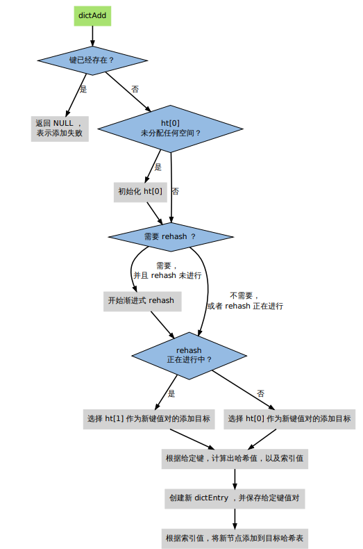
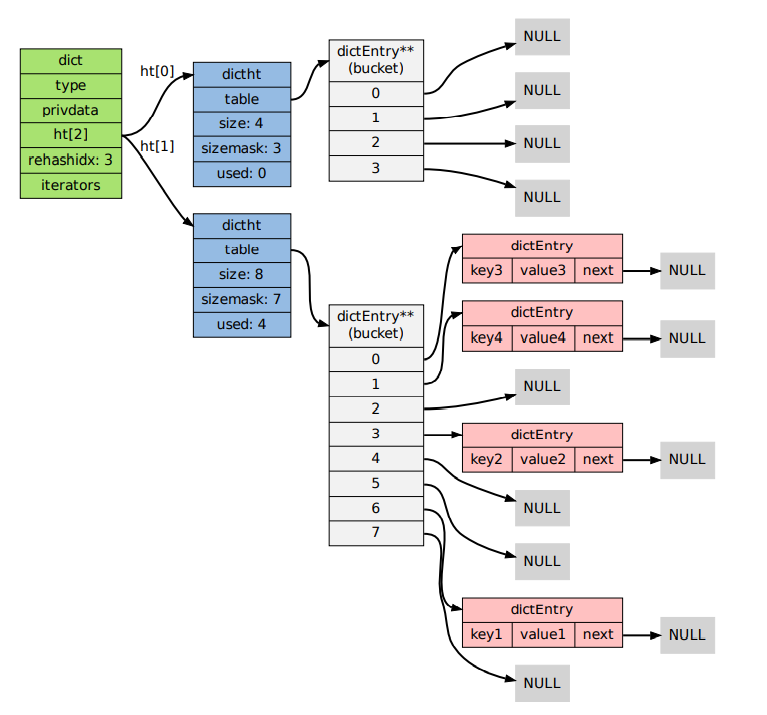

《Redis设计与实现》

# 内部数据结构

Redis不仅支持K-V，还支持列表、哈希、有序集合、集合。

## 简单动态字符串 (SDS)

### sds的用途

1. 实现字符串对象
2. Redis中作为char*类型的替代品

Redis的字符串可以保存字符串值也可以其他的值，只有value保存字符串的值的时候，value才是sds值

> 在Redis中，客户端传入服务器的协议内容、aof缓存、返回给客户端的恢复这些重要内容都是sds保存。
> 能动态扩展、性能高、资源利用率高、安全性高（防止越界）

### Redis中的字符串

c语言中的char数组，不缓存长度、不能追加
- strlen(s) O(n)
- N次追加，N次realloc
```c++
typedef char *sds;

struct sdshdr{
    // buf 已占用长度
    int len;
    
    // buf 剩余长度
    int free;
    
    // 实际保存字符串数据的地方
    char buf[];
}
```

```c++
// 示例
struct sdshdr {
    len = 11;
    free = 0;
    buf = "hello world\0"; // buf 的实际长度为 len + 1
};

```

### 优化追加操作

SET方法会赋予刚好字符串的大小，APPEND会追加之后，把free字段变成len一样大小（即进行一倍扩展）
,只要APPEND不超过现在的free就不会再扩容。

> 执行过APPEND后的预分配空间不会释放，除非字符串对应的键被删除或者关闭Redis后重新载入字符串都西昂。
> 如果频繁大体积字符串APPEND,那么就需要定时让服务器进行内存释放

## 双端链表

### 双端链表的应用 

对列表执行RPUSH、LPOP、LLEN就是用双端链表，

```redis
RPUSH brans Apple Microsoft Google

LPOP brands

LLEN brands

LRANGE brands 0 -1
```

> Redis列表使用两种数据接口作为底层实现
> 1. 双端链表
> 2. 压缩列表
> 后者使用内存更少，默认后者；有需要的是偶才会转换成双端链表

#### Redis自身功能的构建 

- 事务模块使用双端链表来按顺序保存输入的命令
- 服务器模块使用双端链表来保存多个客户端
- 发布订阅模块使用双端链表来保存订阅模式的多个客户端
- 事件模块使用双端链表来保存时间事件

### 双端链表的实现


listNode是双端链表的节点
```c++
typedef struct listNode {
    // 前驱节点
    struct listNode *prev;
    // 后继节点
    struct listNode *next;
    // 值
    void *value;
} listNode;
```

list是双端链表本身
```c++
typedef struct list {
    // 表头指针
    listNode *head;
    // 表尾指针
    listNode *tail;
    // 节点数量
    unsigned long len;
    // 复制函数
    void *(*dup)(void *ptr);
    // 释放函数
    void (*free)(void *ptr);
    // 比对函数
    int (*match)(void *ptr, void *key);
} list;

```

行为和性能特征：
- listNode 带有前驱后继，能够双向操作
- 保留了头尾指针，O(1)实现头插、尾插，高校实现LPUSH RPOP RPOP LPUSH
- list带有len，所以LLEN函数也是O(1)

### 迭代器

为双端队列进行双向迭代

```c++
typedef struct listIter {
    // 下一节点
    listNode *next;
    // 迭代方向
    int direction;
} listIter;
```

## 字典（映射、关联数组）

K-V键值对

### 字典的应用

1. Redis的键空间（存储所有的KV数据）
2. 哈希键的一种底层实现

#### 实现Redis键空间

Redis是一个键值对数据库，通过字典来存储所有键值对K-V（V是各种类型的value数据）

当用户添加键值对的时候，程序就把该键值对添加到Redis中；删除时，就会把键值对从Redis中删除。

FLUSHDB 清空键空间所有键值对数据

DBSIZE 返回键空间所有键值对

所有的操作都是在键空间上进行的

#### hash类型键的底层实现

Hash类型的底层实现
- 字典
- 压缩列表

后者更省空间，默认是后者；如有需要才会转成前者。

Hash键操作，底层大概率为hash表
```shell
HSET book name "The design and implementatios of Redis"

HSET book type "source code analysis"

HSET book release-date "2013.3.8"

HGETALL book
```

### 字典的实现

- 数组或链表，适用于元素不多
- hash表，高效且简单（Redis的字典底层实现）
- 复杂的平衡树，高效且稳定，且能排序

```c++
typedef struct dict {
    // 特定于类型的处理函数
    dictType *type;
    // 类型处理函数的私有数据
    void *privdata;
    // 哈希表（2 个）
    dictht ht[2];
    // 记录 rehash 进度的标志，值为-1 表示 rehash 未进行
    int rehashidx;
    // 当前正在运作的安全迭代器数量
    int iterators;
} dict;
```

ht[0] 字典主要使用的哈希表， ht[1]对0号哈希表进行rehash时使用

dictht实现如下
```c++
typedef struct dictht {
    // 哈希表节点指针数组（俗称桶，bucket）
    dictEntry **table;
    // 指针数组的大小
    unsigned long size;
    // 指针数组的长度掩码，用于计算索引值
    unsigned long sizemask;
    // 哈希表现有的节点数量
    unsigned long used;
} dictht;
```

entry实现如下:
```c++
typedef struct dictEntry {
    // 键
    void *key;
    // 值
    union {
    void *val;
    uint64_t u64;
    int64_t s64;
    } v;
    // 链往后继节点
    struct dictEntry *next;
} dictEntry;
```

跟HashMap一样，table是一个数组，都指向链表的头节点，每个节点都是entry，冲突越多链表越长


#### 哈希算法

1. MurmurHash2 32bit算法：分布律和速度都非常好
2. 基于djb算法实现大小写无关的散列算法

命令表以及Lua脚本缓存都用到了算法2；Redis数据库、集群、哈希键、阻塞都用到了算法1

### 添加键值对到字典

- 如果字典的0号哈希table为空，就需要对0号hash进行初始化
- 插入时发生键碰撞，要处理碰撞
- 插入时字典满足rehash，需要启动rehash



### 添加元素到空白字典

初始ht[0]的table，默认大小是4


### 添加新键值对发生碰撞处理

通过链地址法来解决冲突


### 添加新键值对发生了rehash操作

哈希表的性能依赖于size（Hash表大小）和used（节点数量）的比率
- 1：1 性能最好
- 节点数量比哈希表大很多（很多碰撞），那么会退化成多个链表，性能差

为了让字典键值对不断增多的情况下保持良好性能，对ht[0]进行rehash：
不修改任何键值对，对哈希表扩容，尽量比率维持在1：1

每次添加之前，都会检查ratio = used / size
1. 自然rehash ： ratio >= 1 且dict_can_resize为真
2. 强制rehash ： ratio > dict_force_resize_ratio 

> dict_can_resize 为 false
> 1. Redis使用子进程对Redis数据库执行后台持久化任务（BGSAVE 、 BGREWRITEAOF），为了最大化copy on write禁止，会暂时设置dict_can_resize为假，避免执行自然rehash。
> 2. 当然如果满足强制rehash，那么不管怎么样都会被rehash

### Rehash执行过程

1. 创建一个ht[0] table 更大的ht[1] table
2. ht[0] table迁移到ht[1] table中
3. 将原有ht[0] 清空，并用ht[1]替换ht[0]


具体过程如下

#### 1. 开始rehash

字典的rehashidx为0，表示开始rehash；创建两倍used的ht[1]->table


#### 2. rehash进行中

迁移ht[0]->table 到 ht[1]->table，多次进行，通过rehashidx进路ht[0]->table中已经完成迁移的entry下标


#### 3. 节点迁移完毕

到了这个阶段，所有的节点都已经从 ht[0] 迁移到 ht[1] 了



#### 4. Rehash完毕

释放ht[0];用ht[1]代替ht[0];创建新的ht[1];rehashidx=-1,表示rehash结束


### 渐进式rehash

rehash在激活之后，分批次、渐进式完成（将rehash分散到多个步骤，避免集中计算），否则插入的键值对触发rehash，等待rehash结束再返回
就响应性太差了。同时阻塞服务器也不是好的行为

主要由 _dictRehashStep 和 dictRehashMilliseconds 两个函数进行
- _dictRehashStep

Redis数据库字典、哈希键字典被动rehash

- dictRehashMilliseconds

Redis服务器常规任务程序执行，用于对Redis数据库字典主动rehash

#### _dictRehashStep

每次执行 _dictRehashStep ，ht[0]->table 哈希表第一个不为空的索引上的所有节点就会全
部迁移到 ht[1]->table。rehash 开始进行之后（d->rehashidx 不为 -1），每次执行一次添加、查找、删除操作，
_dictRehashStep 都会被执行一次：

#### dictRehashMilliseconds

dictRehashMilliseconds 可以在指定的毫秒数内，对字典进行 rehash。
Redis 的服务器常规任务执行时,通过该函数尽可能rehash，加速rehash进程

#### 其他措施

rehash 过程中直接往ht[1]添加，同时查找删除在ht[0]、ht[1]上都能进行，确保rehash顺利开展

### 字典收缩

当可用 远大于 已用  就会rehash来收缩（shrink）字典，和扩展的rehash过程一样。

1. 创建一个比 ht[0]->table 小的 ht[1]->table ；
2. 将 ht[0]->table 中的所有键值对迁移到 ht[1]->table ；
3. 将原有 ht[0] 的数据清空，并将 ht[1] 替换为新的 ht[0] ；

收缩规则：被初始化过了且字典使用率小于系统允许的最小比率，默认10%

```c++
int htNeedsResize(dict *dict) {
    long long size, used;
    // 哈希表已用节点数量
    size = dictSlots(dict);
    // 哈希表大小
    used = dictSize(dict);
    // 当哈希表的大小大于 DICT_HT_INITIAL_SIZE
    // 并且字典的填充率低于 REDIS_HT_MINFILL 时
    // 返回 1
    return (size && used && size > DICT_HT_INITIAL_SIZE &&
    (used*100/size < REDIS_HT_MINFILL));
}
```

收缩是手动执行，扩展是自动触发。

- 当字典用于实现哈希键的时候，每次从字典中删除一个键值对，程序就会执行一次
htNeedsResize 函数，如果字典达到了收缩的标准，程序将立即对字典进行收缩；
- 当字典用于实现Redis数据库所有K-V键值对存储的时候，收缩的时机由
redis.c/tryResizeHashTables 函数决定，

### 字典的迭代

- 迭代器首先迭代字典的第一个哈希表，然后，如果 rehash 正在进行的话，就继续对第二
个哈希表进行迭代。
- 当迭代哈希表时，找到第一个不为空的索引，然后迭代这个索引上的所有节点。
- 当这个索引迭代完了，继续查找下一个不为空的索引，如此循环，一直到整个哈希表都迭
代完为止。

两种类型迭代器：
- 安全迭代器：在迭代进行过程中，可以对字典进行修改。
- 不安全迭代器：在迭代进行过程中，不对字典进行修改。

```c++
typedef struct dictIterator {
    dict *d; // 正在迭代的字典
    int table, // 正在迭代的哈希表的号码（0 或者 1）
    index, // 正在迭代的哈希表数组的索引
    safe; // 是否安全？
    dictEntry *entry, // 当前哈希节点
    *nextEntry; // 当前哈希节点的后继节点
} dictIterator;
```

## 跳表

一种随机化数据，层次化的链表中保存元素，效率可以和平衡树媲美。


Redis中的改版跳跃表

1. 允许重复的 score 值：多个不同的 member 的 score 值可以相同。
2. 进行对比操作时，不仅要检查 score 值，还要检查 member ：当 score 值可以重复时，
   单靠 score 值无法判断一个元素的身份，所以需要连 member 域都一并检查才行。
3. 每个节点都带有一个高度为 1 层的后退指针，用于从表尾方向向表头方向迭代：当执行
   ZREVRANGE 或 ZREVRANGEBYSCORE 这类以逆序处理有序集的命令时，就会用到
   这个属性。

修改版跳跃表：
```c++
typedef struct zskiplist {
    // 头节点，尾节点
    struct zskiplistNode *header, *tail;
    // 节点数量
    unsigned long length;
    // 目前表内节点的最大层数
    int level;
} zskiplist;
```

节点：
```c++
typedef struct zskiplistNode {
    // member 对象
    robj *obj;
    // 分值
    double score;
    // 后退指针
    struct zskiplistNode *backward;
    // 层
    struct zskiplistLevel {
    // 前进指针
    struct zskiplistNode *forward;
    // 这个层跨越的节点数量
    unsigned int span;
    } level[];
} zskiplistNode;
```

### 应用

实现有序集数据类型

跳跃表指向有序集合的score和member，以score为索引，对元素排序

```shell
ZADD s 6 x 10 y 15 z

ZRANGE s 0 -1 WITHSCORES
```


跳跃表要和另一个实现有序集的结构（字典）分享 member 和 score 值，所以跳跃
表只保存指向 member 和 score 的指针,所以实际上member和score不是在一个节点进行存储的

# 内存映射数据结构

为了解决Redis创建内部数据结构导致内存耗费的问题，Redis在条件允许的情况下，使用内存映射数据结构来代替内部数据结构

即通过特殊编码的字节序列来代替数据结构，减少内存开销，当然这一过程CPU会占用更多。

## 整数集合

intset用于有序、无重复复保存整数值，其整数类型通过该集合中的元素的最长元素来决定。

如果在一个 intset 里面，最长的元素可以用 int16_t 类型来保存，那么这个 intset
的所有元素都以 int16_t 类型来保存。

如果有一个新元素要加入到这个 intset ，并且这个元素不能用 int16_t 类型来保存
——比如说，新元素的长度为 int32_t ，那么这个 intset 就会自动进行“升级” ：先将集合中现
有的所有元素从 int16_t 类型转换为 int32_t 类型，接着再将新元素加入到集合中。

### 整数集合的应用

集合键的底层实现之一：只保存整数，元素数量不多

### 数据结构和主要操作

```c++
typedef struct intset {
    // 保存元素所使用的类型的长度
    uint32_t encoding;
    // 元素个数
    uint32_t length;
    // 保存元素的数组
    int8_t contents[];
} intset
```

contents数组读取和写入是要进行类型转换和指针计算来获取元素在内存中的正确位置。
分配的容量由encoding决定

#### 添加元素


### 升级


intsetUpgradeAndAdd过程如下：
1. 对新元素进行检测，看保存这个新元素需要什么类型的编码；
2. 将集合 encoding 属性的值设置为新编码类型，并根据新编码类型，对整个 contents 数
   组进行内存重分配。
3. 调整 contents 数组内原有元素在内存中的排列方式，让它们从旧编码调整为新编码。

4. 将新元素添加到集合中。

## 压缩列表

Ziplist由一系列特殊编码的内存块构成的列表，包含多个节点，每个节点可以保存一个长度受限的字符数组或者整数。

节约内存，被哈希键、列表键、有序集合键作为底层实现使用

### ziplist的构成

ziplist header 部分的长度总是固定的（4 字节 + 4 字节 + 2 字节），因此将指针移动到表
头节点的复杂度为常数时间；除此之外，因为表尾节点的地址可以通过 zltail 计算得出，因
此将指针移动到表尾节点的复杂度也为常数时间。


zltail 记录到尾部节点的起始地址的长度

### 节点构成


#### pre_entry_length

pre_entry_length 记录了前一个节点的长度，通过这个值，可以进行指针计算，从而跳转到
上一个节点

#### encoding 和 length

两者一起决定了content部分所保存的数据的类型及长度

encoding的长度为两个bit:
- 00 、01 和 10 表示 content 部分保存着字符数组。
- 11 表示 content 部分保存着整数。

#### content

保存着节点内容：


### 添加节点到末端

1. 记录到达 ziplist 末端所需的偏移量（因为之后的内存重分配可能会改变 ziplist 的地址，
因此记录偏移量而不是保存指针）
2. 根据新节点要保存的值，计算出编码这个值所需的空间大小，以及编码它前一个节点的
   长度所需的空间大小，然后对 ziplist 进行内存重分配。
3. 设置新节点的各项属性：pre_entry_length 、encoding 、length 和 content 。
4. 更新 ziplist 的各项属性，比如记录空间占用的 zlbytes ，到达表尾节点的偏移量 zltail
   ，以及记录节点数量的 zllen 。

### 添加中间节点

先分配内存，插入ziplist，之后填入数据，这时候就要改变前驱后继节点的信息，最后更新ziplist各项属性。

后继节点更新的时候：
1. next 的 pre_entry_length 域的长度正好能够编码 new 的长度（都是 1 字节或者都是 5
   字节）
2. next 的 pre_entry_length 只有 1 字节长，但编码 new 的长度需要 5 字节
3. next 的 pre_entry_length 有 5 字节长，但编码 new 的长度只需要 1 字节

1、3直接更新，2需要对后继节点逐个检查，扩容，直到遇到一个能不需要扩容得节点。（连锁更新）

### 删除节点
1. 定位节点，节点左移覆盖被删除得节点内存，收缩多余空间。
2. 检查更新后继节点，和添加一样，可能会引起连锁更新。

# Redis数据类型

## 对象处理机制

键类型不同，能执行的命令也各不相同。
Redis必须让每个键带有类型信息，以选择合适的处理方式。即底层会根据不同的编码encoding进行不同操作，
但是用户只需要进行某指令而不需要关注底层的实现，即屏蔽底层实现。

为了解决以上问题，Redis 构建了自己的类型系统，这个系统的主要功能包括：
- redisObject 对象。
- 基于 redisObject 对象的类型检查。 
- 基于 redisObject 对象的显式多态函数。
- 对 redisObject 进行分配、共享和销毁的机制。

### redisObject数据结构、以及Redis的数据类型

redisObject是Redis本身处理的参数，Redis数据库中的键、值也都是这个数据类型

```c++
/*
* Redis 对象
*/
typedef struct redisObject {
   // 类型
   unsigned type:4;
   // 对齐位
   unsigned notused:2;
   // 编码方式
   unsigned encoding:4;
   // LRU 时间（相对于 server.lruclock）
   unsigned lru:22;
   // 引用计数
   int refcount;
   // 指向对象的值
   void *ptr;
} robj;
```
下面三个属性最为重要

- type：值的类型

```c++
#define REDIS_STRING 0 // 字符串
#define REDIS_LIST 1 // 列表
#define REDIS_SET 2 // 集合
#define REDIS_ZSET 3 // 有序集
#define REDIS_HASH 4 // 哈希表
```

- encoding：对象所保存的值的编码
```c++
#define REDIS_ENCODING_RAW 0 // 编码为字符串
#define REDIS_ENCODING_INT 1 // 编码为整数
#define REDIS_ENCODING_HT 2 // 编码为哈希表
#define REDIS_ENCODING_ZIPMAP 3 // 编码为 zipmap
#define REDIS_ENCODING_LINKEDLIST 4 // 编码为双端链表
#define REDIS_ENCODING_ZIPLIST 5 // 编码为压缩列表
#define REDIS_ENCODING_INTSET 6 // 编码为整数集合
#define REDIS_ENCODING_SKIPLIST 7 // 编码为跳跃表
```
- ptr：指向实际保存值的指针，由type和encoding决定

如 果 一 个 redisObject 的 type 属 性 为 REDIS_LIST ， encoding 属 性 为
REDIS_ENCODING_LINKEDLIST ，那么这个对象就是一个 Redis 列表，它的值保存在一个双
端链表内，而 ptr 指针就指向这个双端链表；

redisObject、Redis所有数据类型、Redis底层实现三者关系如下：


### 命令的类型检查和多态

1. 根据给定 key ，在数据库字典中查找和它对应的 redisObject ，如果没找到，就返回
   NULL 。
2. 检查 redisObject 的 type 属性和执行命令所需的类型是否相符，如果不相符，返回类
   型错误。
3. 根据 redisObject 的 encoding 属性所指定的编码，选择合适的操作函数来处理底层的
   数据结构。
4. 返回数据结构的操作结果作为命令的返回值。

### 对象共享

Flyweight模式：预分配一些常见对象，在多个数据结构之间共享，避免重复分配的麻烦，节约了CPU时间

- 各种命令的返回值，比如执行成功时返回的 OK ，执行错误时返回的 ERROR ，类型错误时
返回的 WRONGTYPE ，命令入队事务时返回的 QUEUED 等等。
- 包括0在内，小于redis.h/REDIS_SHARED_INTEGERS的所有整数
（REDIS_SHARED_INTEGERS 的默认值为 10000）


> 共享对象只能被带指针的数据结构使用：字典、双端链表；
> 整数集合、压缩列表就不适用

### 引用计数以及对象销毁

创建的时候1，共享就+1，释放就-1，最后refcount=0就销毁整个redisObject

## 字符串 String

除了GET、SET等命令的操作对象外，Redis中的所有Key以及执行命令时提供的参数，都是字符串类型的

### 字符串编码

- REDIS_ENCODING_INT使用long来保存long类型值
- REDIS_ENCODING_RAW用 sdshdr 保存sds、long long、double、long double类型值

### 编码的选择

字符串创建之后默认使用后者，但将保存到数据库的时候，会将字符串转化为前者。

## 哈希表 HASH

HSET、HLEN等命令的操作对象，使用REDIs_ENCODING_ZIPLIST和REDIS_ENCODING_HT两种编码方式

### 字典编码的哈希表

哈希表的key为字典的key，哈希表的值是字典的值；键、值都为字符串对象


### 压缩列表编码的哈希表

将键值一起压入压缩列表，新添加的键值对会被添加到压缩列表表尾，查找、删除也是先定位key，再根据key定位值的位置。


### 编码选择

默认是压缩表，若满足下列之一就会转换成REDIS_ENCODING_HT
- 哈希表中的某个key或者value长度大于server.hash_max_ziplist_value（默认64）
- 压缩列表中的节点数大于server.hash_max_ziplist_entries(默认512)

## 列表 LIST

REDIS_LIST是 LPUSH、LRANGE等命令的操作对象，使用ZIPLIST或者LINKEDLIST进行实现

### 编码选择

默认ZIPLIST，若满足下列之一就会转换成LINKEDLIST
- 向列表添加字符串值，且字符串长度超过server.list_max_ziplist_value(默认64)
- ziplist包含的节点超过server.list_max_ziplist_entries(默认512)

### 阻塞的条件

BLPOP、BRPOP、BRPOPLPUSH阻塞客户端，统称为阻塞原语。

阻塞条件： 这些命令用于空列表

### 阻塞

阻塞的步骤
1. 将客户端的状态设为“正在阻塞” ，并记录阻塞这个客户端的各个键，以及阻塞的最长时限
   （timeout）等数据。
2. 将客户端的信息记录到 server.db[i]->blocking_keys 中（其中 i 为客户端所使用的数
   据库号码）。
3. 继续维持客户端和服务器之间的网络连接，但不再向客户端传送任何信息，造成客户端
   阻塞。

server.db[i]->blocking_keys 是一个字典，字典的键是那 些造成客户端阻塞的键，而字典的值是一个链表，链表里保存了所有因为这个键而被阻塞的客
户端（被同一个键所阻塞的客户端可能不止一个）：


脱离阻塞的方法：
1. 被动脱离：有其他客户端为造成阻塞的键推入了新元素。
2. 主动脱离：到达执行阻塞原语时设定的最大阻塞时间。
3. 强制脱离：客户端强制终止和服务器的连接，或者服务器停机。

### 被动脱离:lpush\rpush\linsert


当向一个空键推入新元素时，pushGenericCommand 函数执行以下两件事：
1. 将 readyList 添加到服务器。

```c++
typedef struct readyList {
   redisDb *db;
   robj *key;
} readyList;
```

2. 将新元素 value 添加到键 key3 。

Redis 的主进程在执行完 pushGenericCommand 函数之后，会继续调用 handleClientsBlockedOnLists 函数 来接触某一个客户端的阻塞

1. 如果 server.ready_keys 不为空，那么弹出该链表的表头元素，并取出表头元素中的
   readyList 值。
2. 根据 readyList 值所保存的 key 和 db ，在 server.blocking_keys 中查找所有因为 key
   而被阻塞的客户端（以链表的形式保存）。
3. 根据 readyList 值所保存的 key 和 db ，在 server.blocking_keys 中查找所有因为 key
   而被阻塞的客户端（以链表的形式保存）。
4. 删除 server.blocking_keys 中相应的客户端数据，取消客户端的阻塞状态。
5. 继续执行步骤 3 和 4 ，直到 key 没有元素可弹出，或者所有因为 key 而阻塞的客户端都 取消阻塞为止。
6. 继续执行步骤 1 ，直到 ready_keys 链表里的所有 readyList 结构都被处理完为止。

### FBFS先阻塞先服务策略

添加到blocking_keys的时候，默认添加在最后，而进行取消阻塞是队头开始取消阻塞，所以是一个FIFO链表，Redis中成为FBFS。

### 主动取消：超过最大等待时间被取消

每次 Redis 服务器常规操作函数（server cron job）执行时，程序都会遍历查询那些处于“正在阻塞”状态的客户端的最大阻塞时限，如果已经过期就会撤销阻塞，给客户端返回一个空白回复。

## 集合 SET

SADD 、 SRANDMEMBER 等 命 令 的 操 作 对 象， 它 使 用 INTSET 和 HT

### 编码的选择

第一个元素long long,就设置初始编码intset，否则设置为字典

### 编码的切换

默认intset，如果满足以下任意一个条件，就会被转换成字典:
- intset 保存的整数值个数超过 server.set_max_intset_entries （默认值为 512 ）。
- 试图往集合里添加一个新元素，并且这个元素不能被表示为 long long 类型。

### 交集 O(n^2)

SINTER、SINTERSTORE 

### 并集 O(n)

SUNION、SUNIONSTORE

### 差集 O(n^2)

SDIFF、SDIFFSTORE

## 有序集 ZSET

是 ZADD 、 ZCOUNT等命令的操作对象， 它使用ZIPLIST 和 SKIPLIST 两种方式编码：

### 编码选择

如果满足下述任一条件就创建压缩列表，否则就是跳跃表。
- 服务器属性 server.zset_max_ziplist_entries 的值大于 0 （默认为 128 ）。
- 元素的 member 长度小于服务器属性 server.zset_max_ziplist_value 的值（默认为 64 ）。

### ZIPLIST

每个有序集元素以两个相邻的 ziplist 节点表示，第一个节点保存元素的 member 域， 第二个元素保存元素的 score 域。
多个元素之间按 score 值从小到大排序，如果两个元素的 score 相同，那么按字典序对 member 进行对比，决定那个元素排在前面，那个元素排在后面。


### SKIPLIST

```c++
typedef struct zset {
   // 字典
   dict *dict;
   // 跳跃表
   zskiplist *zsl;
} zset;
```


过使用字典结构，并将 member 作为键，score 作为值，有序集可以在 O(1) 复杂度内：
- 检查给定 member 是否存在于有序集（被很多底层函数使用）；
- 取出 member 对应的 score 值（实现 ZSCORE 命令）。

通过使用跳跃表，可以让有序集支持以下两种操作：有点InnoDb非聚簇索引的味道
- 在 O(log N) 期望时间、O(N) 最坏时间内根据 score 对 member 进行定位；
- 范围性查找和处理操作是（高效地）实现 ZRANGE 、ZRANK 和 ZINTERSTORE
等命令的关键。

# 功能的实现

## 事务

MULTI、DISCARD、EXEC、WATCH

### 事务

一批命令打包顺序执行,MULTI开启，EXEC执行，三个阶段分别为
- 开始事务
- 命令入队


- 执行事务

```shell
redis> MULTI
OK
redis> SET book-name "Mastering C++ in 21 days"
QUEUED
redis> GET book-name
QUEUED
redis> SADD tag "C++" "Programming" "Mastering Series"
QUEUED
redis> SMEMBERS tag
QUEUED
redis> EXEC
```

1) OK
2) "Mastering C++ in 21 days"
3) (integer) 3
4) "Mastering Series"
   1) "C++"
   2) "Programming"

### 执行事务

EXEC DISCARD MULTI WATCH这四个命令即使处于事务状态，也会直接执行。

### 事务和非事务状态下执行命令

非事务状态下，Redis 命令都由同一个函数执行，所以它们共享很多服务器的一般设置，比如 AOF 的配置、RDB 的配置，以及内存限制

事务中的命令和普通命令在执行上的区别：
1. 非事务状态下的命令以单个命令为单位执行，前一个命令和后一个命令的客户端不一定 是同一个； 
而事务状态则是以一个事务为单位，执行事务队列中的所有命令：除非当前事务执行完毕，否则服务器不会中断事务，也不会执行其他客户端的其他命令。
2. 在非事务状态下，执行命令所得的结果会立即被返回给客户端；
   而事务则是将所有命令的结果集合到回复队列，再作为 EXEC 命令的结果返回给客户端。

### DISCARD

- DISCARD 命令用于取消一个事务，它清空客户端的整个事务队列，然后将客户端从事务状态
调整回非事务状态，最后返回字符串 OK 给客户端，说明事务已被取消。

- Redis 的事务是不可嵌套的，当客户端已经处于事务状态，而客户端又再向服务器发送 MULTI
时，服务器只是简单地向客户端发送一个错误，然后继续等待其他命令的入队。

- WATCH 只能在客户端进入事务状态之前执行，在事务状态下发送 WATCH 命令会引发一个
错误（和前面处理 MULTI 的情况一样）

### 带 WATCH 的事务

如果被WATCH的键被其他客户端并发修改了，那么整个事务不再执行


通过一个 watched_keys字典，键保存Redis需要监视的Key，值则是监视这个Key的客户端。

当键被修改的时候（比如 FLUSHDB 、SET 、DEL 、LPUSH 、SADD 、ZREM ，诸如此类），就会检查这个key是不是在watched_keys字典中，
如果存在就会把所有监视的客户端的 REDIS_DIRTY_CAS 选项打开，之后EXEC的时候，客户端会检查当前状态，如果REDIS_DIRTY_CAS就表示事务不安全，就执行失败。


### ACID

保证了一致性和隔离性

#### 原子性

Redis不回滚或重试，不具备原子性

#### 一致性

入队错误、执行错误、Redis 进程被终结

- 入队错误：在命令入队的过程中，如果客户端向服务器发送了错误的命令，那么服务器将向客户端返回一个出错信息，并且将客户端的事务状态设为
  REDIS_DIRTY_EXEC 。之后EXEC执行就会失败。   意味着不会导致不一致性。

- 执行错误： 在事务执行的过程中发生错误，不会引起事务中断或者整个失败，不会影响已完成事务命令结果，也不会影响后续事务，所以不影响一致性。

- Redis进程被终结：根据持久化情况分类
  - 内存模式：如果 Redis 没有采取任何持久化机制，那么重启之后的数据库总是空白的，所
    以数据总是一致的。
  - RDB：执行事务的时候，不会中断事务去执行RDB工作。也就是事务执行之后，才会执行RDB，所以即使事务执行了一半，也不会影响一致性，以为RDB保存的是最近一次
    没有问题的数据库快照。
  - AOF：


## 慢查询日志

慢日志记录
```c++
typedef struct slowlogEntry {
    // 命令参数
    robj **argv;
    // 命令参数数量
    int argc;
    // 唯一标识符
    long long id; /* Unique entry identifier. */
    // 执行命令消耗的时间，以纳秒（1 / 1,000,000,000 秒）为单位
    long long duration; /* Time spent by the query, in nanoseconds. */
    // 命令执行时的时间
    time_t time; /* Unix time at which the query was executed. */
} slowlogEntry;
```

redis.h/redisServer 结构里保存了几个和慢查询有关的属性

```c++
struct redisServer {
    // ... other fields
    // 保存慢查询日志的链表
    list *slowlog; /* SLOWLOG list of commands */
    // 慢查询日志的当前 id 值
    long long slowlog_entry_id; /* SLOWLOG current entry ID */
    // 慢查询时间限制
    long long slowlog_log_slower_than; /* SLOWLOG time limit (to get logged) */
    // 慢查询日志的最大条目数量
    unsigned long slowlog_max_len; /* SLOWLOG max number of items logged */
    // ... other fields
};
```


### 慢查询日志的操作

- 查看 O(n)
- 删除 O(n)
- 获取链表的数量=获取slowlog链表的数量 O(1)


