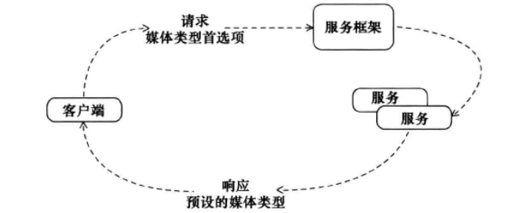

《服务设计模式——SOAP/WSDL与RESTful Web服务设计解决方案》


# 前言

做了几个月项目之后，突然迷惑了,产生了如下疑问：

- 为什么Spring中Web服务的API这样设计？究竟什么样的算优雅？
- 怎么样接口设计，接口设计如何更加优雅？
- 怎么样能够低耦合高内聚的接口？接口的复用性能更高，减少维护成本呢？

希望通过本书给出答案。

# 时间线

2023-05-19 -

# 从对象到Web服务

HTTP两种形式：

- 定义标准的服务行为
- 作为传输数据的运输机制

## Web服务优缺点、使用场景：

- Web服务建立的屏障，自然地将客户端与服务端解耦，能够不影响客户端情况下，修改服务实现。
- Web服务调用代价昂贵，序列化和反序列化就需要很多时间
- Web服务调用通常是分布式通信，容易出现客户端、 服务或网络自身发生异常， 但其他部分仍然继续正常运行时， 即局部故障。
  如网络不可靠、服务器超负荷等，需要多种策略来检测并且处理这些局部故障。

Web服务大多数支持流式数据传输，最小化内存使用，因为不必缓存数据，适用于传输大型文档和消息。但是多媒体文件传输，使用实时流
传输协议（RTP） 以及实时控制协议（RTCP）都比HTTP更合适。

## 服务和松散耦合

- 功能耦合；在特定场景下，客户端期望生成的效果可能依赖于Web服务的逻辑
- 数据结构的耦合：客户端必须理解服务接收和返回的数据结构、 这些结构中使用的数据类型 ， 以及消息中使用的字符编码（如Unicode)。
- 时间耦合：如果收到请求， 就必须马上处理， 那么就是存在高度的时间耦合。如果客户端必须阻塞并等候响应 ， 那么时间耦合也会很高。
  如使用请求/确认机制，或者客户端的异步响应处理器就可以降低时间耦合
- URI耦合： 客户端往往与服务URI高度耦合。这会让服务所有者很难移动或重命名服务URI, 也无法采用新的URI构造模式，
  因为这些操作很可能会让客户端崩溃。

# Web服务API风格

| 模式名称             | 问题                                                  | 描述                                                                                                                 |
|------------------|-----------------------------------------------------|--------------------------------------------------------------------------------------------------------------------|
| RPC API          | 客户端如何通过 HTTP 执行远程 过程                                | 定义一组消息， 以标识要执行的远程过程；同时定义一套固定的元素 ， 它们直接映射到远程过程的参数。 客户端必须将消息发送到为远程过程分配的一个统一资源 标识符 (Uniform Resource Identifier, URI) |
| 消息 (Message) API | 客户端如何通过 HTTP 向远程系统发送命令 、 通知或其他信息同时避免与远程过程直接耦合       | 定义一组与远程过程不相关的消息。 这些消息可以承载不同的信息：特定的主题、 要执行的任务、 事件等。 客户端向指定的 URI 发送消息后， 一旦服务器收到消 息 就会检查它的内容， 再决定应该执行什么过程             |
|资源 (Resource) API| 客户端应该如何处理由远程系统,管理的数据，同时避免与远程过程的直接耦合，并最小化对特定领域API的需求 | 为所有的过程、 领域数据的实例 、 文件分配一个URI。利用HTTP作为一种完整的应用协议．用于定义标准的服务行为。尽可能利用标准化的媒体类型和状态码来交换信良                                   |

## 设计Web服务API的考虑因素

- 封装性：对客户端隐藏实现细节，应该对客户端隐藏内部实体，领域模型、数据库的变动不应该影响客户端。
- 服务契约：服务契约是一种约定， 规定了客户端和服务的交互方式。即双方正常的交互行为，包括了非技术需求，如响应时间。
- 自治性：当服务可以控制自身的执行， 并较少依赖外部因素时， 就更可能得到一致的、 可靠的输出结果。 这意味着 ，
  Web服务API通常不提倡（甚至禁止）使用分布式事务。此外， 分布式事务经常会成为服务可伸缩性的绊脚石，
  因为服务锁定数据库后，可能网络原因或者另一个服务自身的原因失去了连接，导致数据库长时间被锁。
- 延迟：客户端在 收到Web服务的响应之前总要花费一段时间。序列化、反序列化、请求转发...为了减少网络IO，可能会发送较大的数据块，减少多次IO时间。

## RPC API


简单地用关键字为方法加上特定注解， 就可以将类方法输出为 Web 服务。 对于利用 XML 的框架， 这些注解也支持自动生成XSD (
用千描述服务的输入和输出消息）。 例如， 如果一个加了注解的类方法的名称是
GetStockQuote, 那么框架可能生成两段XSD, 分别描述名称为 GetStockQuote 和 GetStockQuoteResponse 的输入和输出消息。

通过这一点可以得出一个结论，RPC API的消息与远程过程（即服务）是紧密耦合的；通过关联，客户端也会与相应的过程耦合。

### 考虑因素

- 创建扁平 API 的倾向：将参数列表封装成vo，即将服务签名设计成只接受一个单消息参数，就有可能增加这种风格的灵活性。 使用这种模式，
  服务开发人员可以避免为服务方法强制规定某种严格的元素顺序， 同时还可以将消息设计为包含更多可选或重复的元索。
- 位置透明性和代理：即服务真实位置对外隐藏，客户端只要调用即可。
- 实现异步：服务端后台处理请求，接收到请求之后，返回一个简单的响应即可，完成之后再进行真正数据返回
- 避免阻塞：客户端也能避免阻塞，继续执行后续操作
- 二进制编码：通过压缩数据成二进制，减少网络带宽，但是应该测试后抉择是否真实有效。

## 消息API


序列化、反序列化、根据消息内容选择processor根据进行消息处理

## 资源API

客户端应用程序使用或处理由远程系统管理的文本、图片、文档或其他类型的媒体文件。

客户端如何处理由远程系统管理的数据，如何避免与远程过程直接耦合，如何最小化对领域特定的API的需求？


> HTTP规范：
> 为所有过程、领域数据的实例以及文件分配一个URI。利用HTTP作为一种完整的应用协议，以定义标准的服务行为。 利用标准化的媒体类型和可能获得的状态码，以交换信息。

资源与URI是一对多的关系，一个资源可以有多个地址，如同一个人可以有一个正式名字和多个绰号一样。不过，一个URI应该只用千引用一
个逻辑资源。这样，客户端才能唯一地标识和访问特定的资源或资源集合。由于每个URI只引用一个资源或资源集合，所以我们可以轻松地增加、修改或删除服务，同时将对其他服务的影响减到最小。

- PUT: 用千创建或更新资源。
- GET: 用千检索资源的表述。
- DELETE: 用千删除一个资源。
- POST: POST的行为多种多样。用Post代替DELETE和PUT会模糊请求的含义。
- OPTION: 发现目标URI支持的HTTP方法
- HEAD: 用于获取在URI上交换的与媒体类型有关的元数据。 它类似千GET, 只是不返回关于资源的表述。

### 安全的方法

如果操作不会产生副作用，则认为它们是安全的。也就是说，安全的操作不会触发写操作（即创建、更新或删除）。GET、HEAD、和OPTIONS
方法可以实现为安全的操作。

### 幕等的方法

幕等性是指无论调用同一个过程多少次，只要参数相同，就返回相同的结果。GET、HEAD、PUT、DELETE,以及OPTIONS都是幕等的，但POST不是幕等的。

### 考虑因素

- 适用不同类型的客户端：客户端类型很多时，资源API就是一个不错的选择。在必须交换大型文档、 消息 ， 或二进制文件时 ， 资源API也特别有效 。 这
  种方式的优点是不需要把这些媒体类型封装在消息封套。即不需要协商过多的协议。
- 可寻址能力：通过资源API. 客户端可以方便地保存和共享的服务链接。 问题是对恶意用户来说，URI往往为他们提供了挖掘信息组织结构的线索。服务
  拥有者总是应该实现适当的身份验证和授权逻辑，以确认调用者的身份，并限制每个调用者能够执行的操作。可以通过消息API 或 RPC API 来过滤所有的请求。
- 服务连接器的代码生成：喜欢使用代码生成工具自动生成客户端服务连接器的开发 人员来说， 基于消息API 或 RPC API 的服务或许是更好的选择。
- 实现异步性
- 如何避免阻塞
- 能够支持客户端偏好：不必每种表现形式使用互不相同的 URI。相反，可以使用媒体类型协商，让客户端指定它们各自的偏好
- 延迟绑定：当服务处理完请求之后 ，客户端一般还需要按照特定的顺序来调用其他服务.通过采用链接服务模式客户端在收到服务影响后，就能够发现其他可以被调用的相关服务。
- 利用缓存技术的能力:如果读请求的资源没发生变化，那么直接进行缓存的返回即可，对读友好。


### 资源API与REST

资源API通常会遵循REST的原则，但并不是每个资源API都可以认为是符合REST风格的。

- 客户端／服务器：无论使用何种API, 所有Web服务都需要满足此约束。
- 无状态性：不是每个资源API都是无状态的。有时Web服务会在多个调用之间维护客户端状态。
- 可缓存的响应：大多数资源API可以利用缓存技术。是否应该对响应数据进行缓存是另一
个讨论话题。 应该注意到的是，RPC API和消息API返回的响应也能够由中介进行缓存，但这样的模式通常必须使用特定的基础设施。
- 统一的接口： 这是—个相当复杂的约束。 它要求在所有组件（即客户端、 中间层和服务器）之间使用统一的接口。REST实践者建议资源API必须严格按照HTTP规范的规定来使用服务器方法（即， GET、 PUT、 POST和DELETE)
- 分层系统：如果从开放系统互连 (Open Systems Interconnection, OSI) 模型的角度来看，所有Web服务，无论使用什么API风格，都满足该原则。
- 按需代码：这个原则要求客户端应用程序应该是可扩展的，允许下载和执行脚本或插件，以支持服务提供的媒体类型。

# 客户端和服务器之间的交互

| 模式名称     | 问题                                                     | 描述                                                          |
|----------|--------------------------------------------------------|-------------------------------------------------------------|
| 请求／响应模式  | Web服务处理诮求和提供结果， 最简单的方式                                 | 当服务收到诮求时， 就开始处理， 井通过同一个客户端连接来返回结果                           |
| 诮求／确认模式  | Web服务如何保护系统． 使其免受诘求负载中峰值的影响；底层系统不可用时， Web服务如何保证请求能够得到处理 | 当服务收到诘求时.先将请求转发至一个后台进程，然后返回一个确认消息，该确认消息中包含一个唯一的诸求标识符        |
| 媒体类型协商模式 | Web 服务如何为同一逻辑资源提供多种表现形式， 同时最小化为该资沥分配的不同URI的数量| 允许客户端在HTTP诮求标头中指定一种 或多种媒体类双首选项。将诸求发送到服务之后，服务能够按照预设的格式生成响应   |                                                            |
|链接服务模式|当服务将诮求处理完之后， 客户端如何发现其他可以调用的相关服务， 同时屏蔽 服务位置和URI模式的变化| 只发布少数几个根 Web 服务的地址,并在每个响应中包含相关服务的地址.客户端通过解析响应．就能够发现后续服务的URI |


## 请求、响应模式

### 考虑因素

- 时间耦合：必须立即处理诮求，无延迟地返回响应，所以时间耦合度高。可以通过诸求／确认／轮询(Request/Acknowledge/ Poll)或请求／确认／回调(Request/Acknowledge/Callback)
之类的模式加以解决。请求／响应模式只适用千处理谐求和返回响应的平均时间"比较短暂"、客户端也能够接受响应丢失的情况。
- 中介：请求／响应模式涉及客户端和服务之间的点对点连接，除此之外，二者之间还存在各种中介。如缓存或者防火墙。

## 请求、确认模式

异步处理的传统方式是采用网络可寻址的消息队列技术， 消息先存储到远程队列，直到目标系统接收这些消息。如果客户端无法连接到远程队列，其队列基础架构通常会将消息先保存在它自己的本地队列中，并不断重复尝试发送消息，直至最终成功发送消息。

该模式下需要接收请求之后，要将请求发送到指定的队列，同时要有及时响应，如下：


### 考虑因素

请求确认模式下，如果提供更新或最终处理结果，如客户需要知道订单状态什么时候发生了改变、旅客创建的旅游服务什么时候创建完成等，这些可以通过下面三种方式实现：

- 轮询：请求／确认／轮询作为请求／确认模式的一个变种。服务器会提供一个请求标识符，要求客户端根据该请求标识符定期轮询另一个Web服务， 以获取更新信息或最终处理结果。

如果轮询太慢那么可能存在时间延迟，但是如果轮询过快该方法占用过多的CPU和网络带宽
- 回调与转发：不再让客户端轮询另一个服务而获得结果，而由请求处理器将信息推送回客户端或转发给其他参与者。也就是说需要客户端提供一个回调服务给服务器，来让服务器进行后续处理。

如果请求和回调服务之间只是一对一通信，那么请求／确认／回调模式在处理请求时需要的系统资源（例如，CPU、内存等）级别可能只比请求／响应模式稍微高出一点。但是如果单一请求会生成多个更新、一个请求的结果必须发送给很多回调服务，
或者对于每个接收者，更新或处理结果要以很多种方式进行格式化，那么需要的系统资源将会高出很多倍。如果原始客户端不能或不希望提供一个可公开寻址的回调服务，就不能使用请求／确认／回调模式。虽然可以利用很多安全手段（例如防火墙、X.509证书、SAML令牌、私有网络）来防止未被授权的访问，但一些机构还是不愿意冒这种风险，也不愿意耗费必要的资金。
- 发布／订阅模式基础：一个消息发送者（即发布者）先将消息传输给一个中介（例如， Web服务）， 对消息感兴趣的各方（即订阅者）可以从这个中介接收信息，
同时又保证他们彼此独立， 不感知其他各方的存在（即解耦）。

上述的轮询与转发其实是发布订阅的两种实现，转发是更接近发布订阅的，服务器处理完之后进行结果的投递，客户端则是结果的订阅者。

## 媒体类型协商模式

利用标准HTTP协议进行内容协商，客户端通过HTTP请求头中设置一种或者多种媒体类型首选项，服务器按照这些预设格式生成响应。



- 服务器驱动的协商：客户端使用Accept Request 来提供它的媒体类型偏好。服务器框架根据媒体类型偏好的匹配成都选择一个最匹配的请求处理器。
- 客户端驱动的协商：客户端使用Accept Request 来提供它的媒体类型偏好，Web服务收到请求后，会提供一组客户端可以考虑使用的URI，让客户端来选择最满足需要的服务URI。

## 链接服务


# 案例

## SOAP/WSDL

service-design-patterns/chapter02/soap

## rest

Springboot 整合 JAX-RS 实现Restful风格代码的Web服务

service-design-patterns/chapter02/rest

## 请求/确认模式

基于JMS来转发Java服务，消息投递给队列之后，服务器直接返回处理完成，之后由消费者进行处理。也就是客户端不能知道具体的处理结果。

### 环境搭建

```shell
docker pull rmohr/activemq

docker run --name activemq -d \
-p 61616:61616 \
-p 8161:8161 rmohr/activemq
```

service-design-patterns/chapter03/jms

## 请求/确认/轮询

用Java来实现一个支持轮询的资源 API，消息投递给队列之后，服务器直接将资源请求路径返回，之后由消费者进行处理。客户之后轮询该资源请求路径来获取处理结果。

service-design-patterns/chapter03/polling

## 请求/确认/转发(待做)

## 媒体类型协商模式-服务器驱动的协商

客户端指定类型，服务器按照类型最适配地响应

service-design-patterns/chapter03/mine-negotiation

