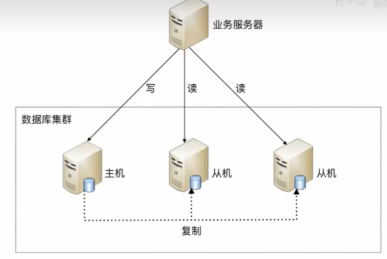
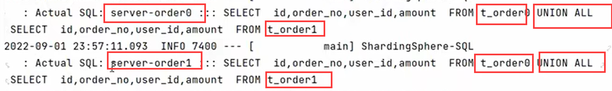
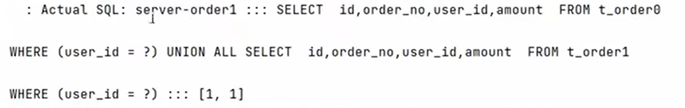

ShardingSphere5学习笔记

# 高性能架构模式

海量数据，单数据库难以满足需求，需要考虑集群。500W 或者 单表2GB建议分库分表

## 读写分离

将数据库读写操作分散到不同的节点上



增删改操作路由到主机、读路由到从机。从机需要复制主机的数据。

这里会涉及数据不一致问题：CAP理论、BASE理论

### CAP理论
- Consistence（一致性）:读能够读到最新数据
- Availability(可用性):非故障节点在合理的时间内返回合理的响应（如果返回响应超时也是不可用）
- Partition Tolerance(分区容错性):网络分区之后，系统能够继续履行职责。（不同网络中部署的服务器，出现了网络问题，导致脑裂，变成几个集群网络，不再是一个整体）
不可能保证网络不出现问题，即不出现网络分区的现象， 所以必须保证P。同时CA是一对矛盾的属性。 
如为了保证一致性，当最新数据写完之后，在进行数据同步的时候出现网络分区导致不一致的时候，就不能提供服务。即只能CP。否则就只能保证AP。

### BASE理论
因为CAP中的C很难保证，即很难保证强一致性，这个时候就出现了BASE理论。
- Base Available(基本可用)：分布式系统中出现故障，允许损失部分可用性，如原本3s的应该的响应，现在5s内返回。
- Soft State（软状态）：中间状态，即允许数据不一致性的存在
- Eventual Consistency（最终一致性）：系统中的数据经过一定时间后，会达到一致性。

## 数据库分片

> 阿里巴巴开发手册：三年后如果能到达单表500万行或者2GB，才推荐分库分表

### 垂直分库

数据量小的时候，一个数据库有多张不同业务的表，如用户表、商品表、订单表……

垂直分片就是按业务分类，将表分到不同的数据库，将压力分散到不同数据库。

当表中数据很多的时候，可以进行垂直分表、水平分表

### 垂直分表

字段过多，可以将很多不常用的字段分到另一张表

### 水平分库

不是根据业务，而是相当于用一些算法进行映射，决定插入到那个数据库中的数据表，如最常见的根据ID 进行水平分库。
偶数到0库，奇数到1库。

### 水平分表

将一部分数据分到另一张表，如以日期进行拆分到多张表，减少数据的扫描，提升性能。

# 实现方式

## 程序代码封装（Sharding Sphere）

自己进行数据访问层的封装，实现读写分离和数据库服务器的连接管理。


## 中间件封装（MyCat、Sharding Sphere）

解耦，将负责读写分离和数据库服务器连接的数据库中间件独立出来，以此独立一套系统出来。


# MYSQL主从同步

## 主从同步原理

slave通过一个IO线程从master读取binlog进行数据同步，需要一个连接验证，即登录账号

## docker环境安装

```shell
# 查看系统内核
uname -r
# 查看已经安装的CentOS版本
cat /etc/redhat-release

# docker
# 添加镜像源
yum-config-manager --add-repo http://mirrors.aliyun.com/docker-ce/linux/centos/docker-ce.repo

# 安装yum 依赖 和 镜像源
yum install -y yum-utils device-mapper-persistent-data lvm2
yum makecache 
# 安装docker
yum -y install docker-ce（如果centos8 `sudo yum install docker-ce docker-ce-cli containerd.io --allowerasing`
systemctl enable docker && systemctl start docker

# 设置docker镜像
sudo mkdir -p /etc/docker
sudo tee /etc/docker/daemon.json <<-'EOF'
{
  "registry-mirrors": ["https://tgie9tnd.mirror.aliyuncs.com"]
}
EOF
sudo systemctl daemon-reload && sudo systemctl restart docker

# 卸载docker
systemctl stop docker
yum remove -y docker-ce
rm -rf /var/lib/docker
```

## 一主多从

```shell
# 关闭防火墙以免连接不上，当然也可以直接开放端口
systemctl stop docker
systemctl stop firewalld
systemctl start docker
```

### 主服务器
```shell
# -d 守护进程后台启动
docker run -d \
-p 3306:3306 \
-v /software/mysql/master/conf:/etc/mysql/conf.d \
-v /software/mysql/master/data:/var/lib/mysql   \
-e MYSQL_ROOT_PASSWORD=123456   \
--name mysql-master             \
mysql:8.0.29

# 宿主机MYSQL配置文件修改
vim /software/mysql/master/conf/my.cnf

# 重启mysql
docker restart mysql-master
```

配置内容如下：
```shell
[mysqld]
# 服务器唯一id 默认1
server-id=1
# 设置日志格式，默认ROW
binlog_format=STATEMENT
# 二进制日志名字，默认binlog
# log-bin=binlog
# 设置需要复制的数据库，默认复制全部数据库
# binlog-do-db=db_test
# 设置不需要复制的数据库
#binlog-ignore-db=mysql
#binlog-ignore-db=information_schema
```

```shell
# 进入容器 env LANG=C.UTF-8 避免容器中文乱码
docker exec -it mysql-master env LANG=C.UTF-8 /bin/bash
# 在容器中进入MYSQL
mysql -uroot -p
# 修改默认密码校验方式
ALTER USER 'root'@'%' IDENTIFIED WITH mysql_native_password BY '123456';
```

```mysql
-- 主机中创建slave用户
-- 创建slave用户
CREATE USER 'slave'@'%';
-- 设置密码
ALTER USER 'slave'@'%' IDENTIFIED WITH mysql_native_password BY '123456';
-- 授予复制权限
GRANT REPLICATION SLAVE ON *.* TO 'slave'@'%';
-- 刷新权限
FLUSH PRIVILEGES;

-- 查看主服务器状态
SHOW MASTER STATUS;
```
这里标出了后续slave需要读取数据的位置


### 从服务器

SLAVE1
```shell
docker run -d \
-p 3307:3306 \
-v /software/mysql/slave1/conf:/etc/mysql/conf.d \
-v /software/mysql/slave1/data:/var/lib/mysql   \
-e MYSQL_ROOT_PASSWORD=123456   \
--name mysql-slave1            \
mysql:8.0.29

# 宿主机MYSQL配置文件修改
vim /software/mysql/slave1/conf/my.cnf

# 重启mysql
docker restart mysql-slave1
```

配置内容如下：
```shell
[mysqld]
# 服务器唯一id 默认1
server-id=2
# 中继日志名字，默认XXXX-relay-bin
# relay-log=relay-bin
```

```shell
# 进入容器
docker exec -it mysql-slave1 env LANG=C.UTF-8 /bin/bash
# 进入容器内
mysql -uroot -p
# 修改默认密码校验方式
ALTER USER 'root'@'%' IDENTIFIED WITH mysql_native_password BY '123456';
```

```mysql
-- 在从机上执行一下SQL,配置主从关系
CHANGE MASTER TO MASTER_HOST='172.19.240.201',
    MASTER_USER='slave',MASTER_PASSWORD='123456', MASTER_PORT=3306,
    MASTER_LOG_FILE='binlog.000003',MASTER_LOG_POS=1051;
```

SLAVE2  
```shell
docker run -d \
-p 3308:3306 \
-v /software/mysql/slave2/conf:/etc/mysql/conf.d \
-v /software/mysql/slave2/data:/var/lib/mysql   \
-e MYSQL_ROOT_PASSWORD=123456   \
--name mysql-slave2            \
mysql:8.0.29

# 宿主机MYSQL配置文件修改
vim /software/mysql/slave2/conf/my.cnf

# 重启mysql
docker restart mysql-slave2
```

配置内容如下：
```shell
[mysqld]
# 服务器唯一id 默认1
server-id=3
# 中继日志名字，默认XXXX-relay-bin
# relay-log=relay-bin
```

```shell
# 进入容器
docker exec -it mysql-slave2 env LANG=C.UTF-8 /bin/bash
# 进入容器内
mysql -uroot -p
# 修改默认密码校验方式
ALTER USER 'root'@'%' IDENTIFIED WITH mysql_native_password BY '123456';
```

```mysql
-- 在从机上执行一下SQL,配置主从关系
CHANGE MASTER TO MASTER_HOST='172.19.240.201',
    MASTER_USER='slave',MASTER_PASSWORD='123456', MASTER_PORT=3306,
    MASTER_LOG_FILE='binlog.000003',MASTER_LOG_POS=1051;
```

## 启动主从同步

```mysql
-- 启动从机复制功能
START SLAVE ;
-- 查看状态
SHOW SLAVE STATUS\G
```

如果是yes就是启动成功。


## 停止主从同步

```mysql
-- 在从机执行，停止IO和SQL线程
STOP SLAVE;

-- 在从机执行，删除SLAVE数据库的relaylog日志，并重新启用relaylog
RESET SLAVE;

-- 在主机执行，删除所有binlog日志文件，并将日志索引文件清空，重新开始所有新的日志文件
-- 用于第一次进行搭建主从库，进行主库binlog初始化工作
RESET MASTER;
```

## 常见问题
- 问题1

slave_io_running是no或者connecting的时候，需要SHOW SLAVE STATUS\G查看last_io_error

- 问题2

启动之后出现WARNING：IPV4 forwarding is disabled. Networking will not work; 会导致远程连不上容器中的mysql。

需要开启防火墙端口。

# ShardingSphere-JDBC读写分离

利用上述的主从架构完成读写分离

默认主库写，从库读。开启事务之后，为了保证主从库间的事务一致性，避免跨服务器的分布式事务，ShardingSphere-JDBC读写都用主库。

> Junit 只要加了@Tranctional就会默认回滚，即使没有Rollback

```properties
# 应用名称
spring.application.name=sharding-jdbc-demo
# 开发环境设置
spring.profiles.active=dev
# 内存模式
spring.shardingsphere.mode.type=Memory

# 配置真实数据源
spring.shardingsphere.datasource.names=master,slave1,slave2

# 配置第 1 个数据源
spring.shardingsphere.datasource.master.type=com.zaxxer.hikari.HikariDataSource
spring.shardingsphere.datasource.master.driver-class-name=com.mysql.cj.jdbc.Driver
spring.shardingsphere.datasource.master.jdbc-url=jdbc:mysql://172.19.240.201:3306/db_test
spring.shardingsphere.datasource.master.username=root
spring.shardingsphere.datasource.master.password=123456

# 配置第 2 个数据源
spring.shardingsphere.datasource.slave1.type=com.zaxxer.hikari.HikariDataSource
spring.shardingsphere.datasource.slave1.driver-class-name=com.mysql.cj.jdbc.Driver
spring.shardingsphere.datasource.slave1.jdbc-url=jdbc:mysql://172.19.240.201:3307/db_test
spring.shardingsphere.datasource.slave1.username=root
spring.shardingsphere.datasource.slave1.password=123456

# 配置第 3 个数据源
spring.shardingsphere.datasource.slave2.type=com.zaxxer.hikari.HikariDataSource
spring.shardingsphere.datasource.slave2.driver-class-name=com.mysql.cj.jdbc.Driver
spring.shardingsphere.datasource.slave2.jdbc-url=jdbc:mysql://172.19.240.201:3308/db_test
spring.shardingsphere.datasource.slave2.username=root
spring.shardingsphere.datasource.slave2.password=123456

# 读写分离类型，如: Static，Dynamic
spring.shardingsphere.rules.readwrite-splitting.data-sources.myds.type=Static
# 写数据源名称
spring.shardingsphere.rules.readwrite-splitting.data-sources.myds.props.write-data-source-name=master
# 读数据源名称，多个从数据源用逗号分隔
spring.shardingsphere.rules.readwrite-splitting.data-sources.myds.props.read-data-source-names=slave1,slave2

# 负载均衡算法名称
spring.shardingsphere.rules.readwrite-splitting.data-sources.myds.load-balancer-name=alg_round

# 负载均衡算法配置
# 负载均衡算法类型
spring.shardingsphere.rules.readwrite-splitting.load-balancers.alg_round.type=ROUND_ROBIN
#spring.shardingsphere.rules.readwrite-splitting.load-balancers.alg_random.type=RANDOM
#spring.shardingsphere.rules.readwrite-splitting.load-balancers.alg_weight.type=WEIGHT
#spring.shardingsphere.rules.readwrite-splitting.load-balancers.alg_weight.props.slave1=1
#spring.shardingsphere.rules.readwrite-splitting.load-balancers.alg_weight.props.slave2=2

# 打印SQl
spring.shardingsphere.props.sql-show=true
```
testLoadBalance、testTransactional、testInsert

# ShardingSphere-JDBC垂直分片

## 环境搭建

```shll
docker run -d \
-p 3301:3306 \
-v /software/mysql/user/conf:/etc/mysql/conf.d \
-v /software/mysql/user/data:/var/lib/mysql   \
-e MYSQL_ROOT_PASSWORD=123456   \
--name mysql-user            \
mysql:8.0.29

docker exec -it mysql-user env LANG=C.UTF-8 /bin/bash

CREATE DATABASE db_user;

CREATE TABLE t_user(
    id BIGINT AUTO_INCREMENT,
    uname VARCHAR(30)
);

# 进行表以及数据库创建

docker run -d \
-p 3302:3306 \
-v /software/mysql/order/conf:/etc/mysql/conf.d \
-v /software/mysql/order/data:/var/lib/mysql   \
-e MYSQL_ROOT_PASSWORD=123456   \
--name mysql-order            \
mysql:8.0.29

docker exec -it mysql-order env LANG=C.UTF-8 /bin/bash

CREATE DATABASE db_order;

CREATE TABLE t_order(
    id BIGINT AUTO_INCREMENT,
    order_no VARCHAR(30),
    user_id BIGINT,
    amount DECIMAL(10,2),
    PRIMARY KEY(id)
);
```

## 测试

```properties
# 应用名称
spring.application.name=sharding-jdbc-demo
# 开发环境设置
spring.profiles.active=dev
# 内存模式
spring.shardingsphere.mode.type=Memory

# 配置真实数据源
spring.shardingsphere.datasource.names=server-user,server-order

# 配置第 1 个数据源
spring.shardingsphere.datasource.server-user.type=com.zaxxer.hikari.HikariDataSource
spring.shardingsphere.datasource.server-user.driver-class-name=com.mysql.cj.jdbc.Driver
spring.shardingsphere.datasource.server-user.jdbc-url=jdbc:mysql://172.19.240.201:3301/db_user
spring.shardingsphere.datasource.server-user.username=root
spring.shardingsphere.datasource.server-user.password=123456

# 配置第 2 个数据源
spring.shardingsphere.datasource.server-order.type=com.zaxxer.hikari.HikariDataSource
spring.shardingsphere.datasource.server-order.driver-class-name=com.mysql.cj.jdbc.Driver
spring.shardingsphere.datasource.server-order.jdbc-url=jdbc:mysql://172.19.240.201:3302/db_order
spring.shardingsphere.datasource.server-order.username=root
spring.shardingsphere.datasource.server-order.password=123456

# 标准分片表配置（数据节点）
# spring.shardingsphere.rules.sharding.tables.<table-name>.actual-data-nodes=值
# 值由数据源名 + 表名组成，以小数点分隔。
# <table-name>：逻辑表名
spring.shardingsphere.rules.sharding.tables.t_user.actual-data-nodes=server-user.t_user
spring.shardingsphere.rules.sharding.tables.t_order.actual-data-nodes=server-order.t_order

# 打印SQl
spring.shardingsphere.props.sql-show=true
```

testInsertOrderAndUser、testSelectFromOrderAndUser

# ShardingSphere-JDBC水平分片

<b> 水平分片主键需要在业务层进行控制，不能自增</b>

```shell
# 创建容器
docker run -d \
-p 3310:3306 \
-v /software/mysql/order0/conf:/etc/mysql/conf.d \
-v /software/mysql/order0/data:/var/lib/mysql   \
-e MYSQL_ROOT_PASSWORD=123456   \
--name mysql-order0            \
mysql:8.0.29

docker exec -it mysql-order0 env LANG=C.UTF-8 /bin/bash
```

```mysql
CREATE DATABASE db_order;

USE db_order;

CREATE TABLE t_order0(
    id BIGINT,
    order_no VARCHAR(30),
    user_id BIGINT,
    amount DECIMAL(10,2),
    PRIMARY KEY(id)
);
  
CREATE TABLE t_order1(
    id BIGINT,
    order_no VARCHAR(30),
    user_id BIGINT,
    amount DECIMAL(10,2),
    PRIMARY KEY(id)
);
```


```shell
docker run -d \
-p 3311:3306 \
-v /software/mysql/order1/conf:/etc/mysql/conf.d \
-v /software/mysql/order1/data:/var/lib/mysql   \
-e MYSQL_ROOT_PASSWORD=123456   \
--name mysql-order1          \
mysql:8.0.29

docker exec -it mysql-order1 env LANG=C.UTF-8 /bin/bash
```

```mysql
CREATE DATABASE db_order;

USE db_order;

CREATE TABLE t_order0(
    id BIGINT,
    order_no VARCHAR(30),
    user_id BIGINT,
    amount DECIMAL(10,2),
    PRIMARY KEY(id)
);
  
CREATE TABLE t_order1(
    id BIGINT,
    order_no VARCHAR(30),
    user_id BIGINT,
    amount DECIMAL(10,2),
    PRIMARY KEY(id)
);
```

> inline 表达式 ${begin..end} 表示范围区间 ， ${[unit1,unit2,unit_x]}枚举值

testInsertOrder、testShardingSelectAll、testInsertOrderDatabaseStrategy、testShardingSelectByUserId

分库分表之后查询的时候会使用union all


根据ID进行分片是考虑到经常可能会用id进行查询

