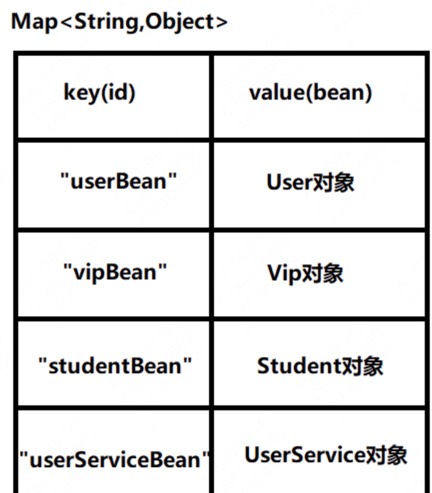
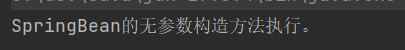

# 前言

主要是去对Spring的回顾，只做简单的记录

# 知识总结

## DIP、OCP、IOC

### DIP

依赖倒置原则(Dependence Inversion Principle)，简称DIP，主要倡导面向抽象编程，面向接口编程，不要面向具体编程，让上层不再依赖下层，下面改动了，  
上面的代码不会受到牵连。这样可以大大降低程序的耦合度，耦合度低了，扩展力就强了，同时代码复用性也会增强。

### OCP

对扩展开放，就修改关闭。简单说就是新增加变化没有问题，但是不应该去影响已有的代码

### IOC

控制反转（Inversion of Control，缩写为IoC），是面向对象编程中的一种设计思想，可以用来降低代码之间的耦合度，符合依赖倒置原则。
控制反转的核心是：将对象的创建权交出去，将对象和对象之间关系的管理权交出去，由第三方容器来负责创建与维护。
控制反转常见的实现方式：依赖注入（Dependency Injection，简称DI），包括两种方式：
- set方法注入
- 构造方法注入

Spring框架就是一个实现了IoC思想的框架。

## Spring

### 核心模块

主要是IOC和AOP：

<b>
- 基于POJO的轻量级和最小侵入性编程
- 通过IOC、AOP实现松耦合
- 基于切面和管理进行声明式编程
- 通过切面和模版减少样板式代码
</b>

1. Spring Core模块
这是Spring框架最基础的部分，它提供了依赖注入（DependencyInjection）特征来实现容器对Bean的管理。核心容器的主要组件是 BeanFactory，BeanFactory是工厂模式的一个实现，是任何Spring应用的核心。它使用IoC将应用配置和依赖从实际的应用代码中分离出来。
2. Spring AOP模块
Spring在它的AOP模块中提供了对面向切面编程的丰富支持，Spring AOP 模块为基于 Spring 的应用程序中的对象提供了事务管理服务。通过使用 Spring AOP，不用依赖组件，就可以将声明性事务管理集成到应用程序中，可以自定义拦截器、切点、日志等操作。

### Bean注入简述

1. 通过applicationContext（spring容器）进行获取

    bean 配置文件,其中bean的id是唯一标识
    ```shell script
    <?xml version="1.0" encoding="UTF-8"?>
    <beans xmlns="http://www.springframework.org/schema/beans"
           xmlns:xsi="http://www.w3.org/2001/XMLSchema-instance"
           xsi:schemaLocation="http://www.springframework.org/schema/beans http://www.springframework.org/schema/beans/spring-beans.xsd">
        
        <bean id="userBean" class="com.powernode.spring6.bean.User"/>
    </beans>
    ```

    程序编写 可以通过类路径、系统文件路径，BeanFactory（上下文的超类）进行实现，
    ```java
        // 初始化Spring容器上下文（解析beans.xml文件，创建所有的bean对象）
        ApplicationContext applicationContext = new ClassPathXmlApplicationContext("beans.xml");
        // 根据id获取bean对象
        Object userBean = applicationContext.getBean("userBean");
        System.out.println(userBean);
        
        // 通过系统文件路径的方式进行获取，并且转换成指定的类型
        ApplicationContext applicationContext2 = new FileSystemXmlApplicationContext("d:/spring6.xml");
        Vip vip = applicationContext2.getBean("vipBean2", Vip.class);
        System.out.println(vip);
        
        BeanFactory beanFactory = new ClassPathXmlApplicationContext("spring.xml");
        Object vipBean = beanFactory.getBean("vipBean");
        System.out.println(vipBean);
    ```

   上述过程默认通过 User 的无参构造函数进行对象的创建。是通过反射进行创建的：
   ```java
       // dom4j解析beans.xml文件，从中获取class的全限定类名
        // 通过反射机制调用无参数构造方法创建对象
        Class clazz = Class.forName("com.xxx.xxx.bean.User");
        Object obj = clazz.newInstance();
   ```
2. 创建之后，通过Map<String,Object>存储,后续其实就是通过map进行对象的获取。IOC其实就是通过xml+工厂模式+反射进行实现的


### 日志框架

1. 引入依赖
    ```xml
    <!--log4j2的依赖-->
    <dependency>
      <groupId>org.apache.logging.log4j</groupId>
      <artifactId>log4j-core</artifactId>
      <version>2.19.0</version>
    </dependency>
    <dependency>
      <groupId>org.apache.logging.log4j</groupId>
      <artifactId>log4j-slf4j2-impl</artifactId>
      <version>2.19.0</version>
    </dependency>
    ```

2. 在类的根路径下提供log4j2.xml配置文件（文件名固定为：log4j2.xml，文件必须放到类根路径下。）
    ```xml
    <?xml version="1.0" encoding="UTF-8"?>
    
    <configuration>
    
        <loggers>
            <!--
                level指定日志级别，从低到高的优先级：
                    ALL < TRACE < DEBUG < INFO < WARN < ERROR < FATAL < OFF
            -->
            <root level="DEBUG">
                <appender-ref ref="spring6log"/>
            </root>
        </loggers>
    
        <appenders>
            <!--输出日志信息到控制台-->
            <console name="spring6log" target="SYSTEM_OUT">
                <!--控制日志输出的格式-->
                <PatternLayout pattern="%d{yyyy-MM-dd HH:mm:ss SSS} [%t] %-3level %logger{1024} - %msg%n"/>
            </console>
        </appenders>
    
    </configuration>
    ```

3. 日志使用
    ```java
    Logger logger = LoggerFactory.getLogger(FirstSpringTest.class);
    logger.info("我是一条日志消息");
    ```

### 依赖注入方式

#### set注入
Spring会利用反射调用相应的set方法，并将注入的参数传递给该方法。这种方式使得Spring能够在运行时动态地将依赖注入到目标对象中。

1. set注入
    ```java
    private UserDao userDao;
    private String[] goods;
    private List<String> names;
    // 一个人有多个住址
    private Map<Integer, String> addrs;
    private UserDao aaa;
    private AccountDao accountDao;

    // 这个set方法非常关键 按名字自动注入 必须要
    public void setAaa(UserDao aaa) {
        this.aaa = aaa;
    }
    
    // 这个set方法非常关键 按类型自动注入 必须要
    public void setAccountDao(AccountDao accountDao) {
        this.accountDao = accountDao;
    }

    public void setAddrs(Map<Integer, String> addrs) {
        this.addrs = addrs;
    }
    
    public void setNames(List<String> names) {
        this.names = names;
    }
    // 使用set方式注入，必须提供set方法。
    // 反射机制要调用这个方法给属性赋值的。
    public void setUserDao(UserDao userDao) {
        this.userDao = userDao;
    }
    
    public void setGoods(Goods[] goods) {
        this.goods = goods;
    }
    ```

2. xml配置
    ```xml
    <bean id="userDaoBean" class="com.powernode.spring6.dao.UserDao"/>
    <!--自动注入-->
    <!--byType表示根据类型自动装配-->
    <bean id="accountService" class="com.powernode.spring6.service.AccountService" autowire="byType"/>
    <bean class="com.powernode.spring6.dao.AccountDao"/>
    
    <!--byName表示根据类名字自动装配-->
    <bean id="userService" class="com.powernode.spring6.service.UserService" autowire="byName"/>
    <bean id="aaa" class="com.powernode.spring6.dao.UserDao"/>
    
    <!--手动注入-->
    <bean id="userServiceBean" class="com.powernode.spring6.service.UserService">
        <property name="addrs">
            <map>
                <!--如果key不是简单类型，使用 key-ref 属性-->
                <!--如果value不是简单类型，使用 value-ref 属性-->
                <entry key="1" value="北京大兴区"/>
                <entry key="2" value="上海浦东区"/>
                <entry key="3" value="深圳宝安区"/>
            </map>
        </property>
         <property name="names">
            <list>
                <value>铁锤</value>
                <value>张三</value>
                <value>张三</value>
                <value>张三</value>
                <value>狼</value>
            </list>
        </property>
        <property name="userDao" ref="userDaoBean"/>
        <property name="goods">
            <array>
                <!--这里使用ref标签即可-->
                <ref bean="goods1"/>
                <ref bean="goods2"/>
            </array>
        </property>
        
        
    </bean>
    ```

#### 构造注入
1. 构造注入
    ```java
    private OrderDao orderDao;

    // 通过反射机制调用构造方法给属性赋值
    public OrderService(OrderDao orderDao) {
        this.orderDao = orderDao;
    } 
    ```
2. xml 配置
    ```xml
    <bean id="orderDaoBean" class="com.powernode.spring6.dao.OrderDao"/>
    <bean id="orderServiceBean" class="com.powernode.spring6.service.OrderService">
      <!--index="0"表示构造方法的第一个参数，将orderDaoBean对象传递给构造方法的第一个参数。-->
      <constructor-arg index="0" name="orderService" ref="orderDaoBean"/>
    </bean>
    ```

#### 通过util进行复用

1. xml配置头部util

    xmlns:util="http://www.springframework.org/schema/util"

    http://www.springframework.org/schema/util http://www.springframework.org/schema/util/spring-util.xsd">

    ```xml
        <?xml version="1.0" encoding="UTF-8"?>
        <beans xmlns="http://www.springframework.org/schema/beans"
               xmlns:xsi="http://www.w3.org/2001/XMLSchema-instance"
               xmlns:util="http://www.springframework.org/schema/util"
               xsi:schemaLocation="http://www.springframework.org/schema/beans http://www.springframework.org/schema/beans/spring-beans.xsd
                                   http://www.springframework.org/schema/util http://www.springframework.org/schema/util/spring-util.xsd">
        
            <util:properties id="prop">
                <prop key="driver">com.mysql.cj.jdbc.Driver</prop>
                <prop key="url">jdbc:mysql://localhost:3306/spring</prop>
                <prop key="username">root</prop>
                <prop key="password">123456</prop>
            </util:properties>
        
            <bean id="dataSource1" class="com.powernode.spring6.beans.MyDataSource1">
                <property name="properties" ref="prop"/>
            </bean>
        
            <bean id="dataSource2" class="com.powernode.spring6.beans.MyDataSource2">
                <property name="properties" ref="prop"/>
            </bean>
        </beans> 
    ```

2. 程序编写
    ```java
        public class MyDataSource2 {
            private Properties properties;
        
            public void setProperties(Properties properties) {
                this.properties = properties;
            }
        
            @Override
            public String toString() {
                return "MyDataSource2{" +
                        "properties=" + properties +
                        '}';
            }
        }
        
        public class MyDataSource1 {
            private Properties properties;
        
            public void setProperties(Properties properties) {
                this.properties = properties;
            }
        
            @Override
            public String toString() {
                return "MyDataSource1{" +
                        "properties=" + properties +
                        '}';
            }
        }
    ```

#### 引入外部属性配置文件
1. 程序编写
``` java
  public class MyDataSource implements DataSource {
     private String driver;
     private String url;
     private String username;
     private String password;
   
     public void setDriver(String driver) {
         this.driver = driver;
     }
   
     public void setUrl(String url) {
         this.url = url;
     }
   
     public void setUsername(String username) {
         this.username = username;
     }
   
     public void setPassword(String password) {
         this.password = password;
     }
  }
```

2. properties配置

```properties
driver=com.mysql.cj.jdbc.Driver
url=jdbc:mysql://localhost:3306/spring
username=root
password=root123
```

3. 数据源配置

```properties
    <context:property-placeholder location="jdbc.properties"/>
    
    <bean id="dataSource" class="com.powernode.spring6.beans.MyDataSource">
        <property name="driver" value="${driver}"/>
        <property name="url" value="${url}"/>
        <property name="username" value="${username}"/>
        <property name="password" value="${password}"/>
    </bean>
```

## Bean的作用域

1. singleton

   Bean对象默认是单例的.默认都是相同的
   
   ```java
   public class SpringBean {
       public SpringBean() {
           System.out.println("SpringBean的无参数构造方法执行。");
       }
   }
   
   @Test
   public void testScope(){
      ApplicationContext applicationContext = new ClassPathXmlApplicationContext("spring-scope.xml");
   }
   ```
   
   
   
   通过测试得知，默认情况下，Bean对象的创建是在初始化Spring上下文的时候就完成的。

2. prototype

   在每一次执行getBean()方法的时候创建Bean对象，调用几次则创建几次。
   
   ```properties
   <bean id="sb" class="com.powernode.spring6.beans.SpringBean" scope="prototype" />
   ```
   
   ```java
   @Test
   public void testScope(){
      ApplicationContext applicationContext = new ClassPathXmlApplicationContext("spring-scope.xml");
   }
   ```
   
   这一次在初始化Spring上下文的时候，并没有创建Bean对象。不会打印任何东西。

3. 其他scope

   scope属性的值不止两个，它一共包括8个选项：
   - singleton：默认的，单例。 
   - prototype：原型。每调用一次getBean()方法则获取一个新的Bean对象。或每次注入的时候都是新对象。 
   - request：一个请求对应一个Bean。仅限于在WEB应用中使用。 
   - session：一个会话对应一个Bean。仅限于在WEB应用中使用。 
   - global session：portlet应用中专用的。如果在Servlet的WEB应用中使用global session的话，和session一个效果。（portlet和servlet都是规范。servlet运行在servlet容器中，例如Tomcat。portlet运行在portlet容器中。）
   - application：一个应用对应一个Bean。仅限于在WEB应用中使用。 
   - websocket：一个websocket生命周期对应一个Bean。仅限于在WEB应用中使用。 
     - 自定义scope：很少使用。参见
