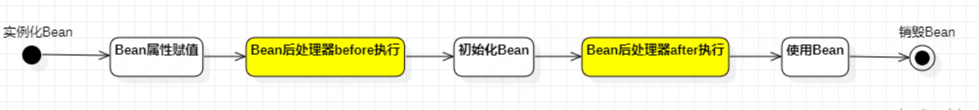

# 前言

主要是去对Spring的回顾，只做简单的记录

# 知识总结

## DIP、OCP、IOC

### DIP

依赖倒置原则(Dependence Inversion Principle)，简称DIP，主要倡导面向抽象编程，面向接口编程，不要面向具体编程，让上层不再依赖下层，下面改动了，  
上面的代码不会受到牵连。这样可以大大降低程序的耦合度，耦合度低了，扩展力就强了，同时代码复用性也会增强。

### OCP

对扩展开放，就修改关闭。简单说就是新增加变化没有问题，但是不应该去影响已有的代码

### IOC

控制反转（Inversion of Control，缩写为IoC），是面向对象编程中的一种设计思想，可以用来降低代码之间的耦合度，符合依赖倒置原则。
控制反转的核心是：将对象的创建权交出去，将对象和对象之间关系的管理权交出去，由第三方容器来负责创建与维护。
控制反转常见的实现方式：依赖注入（Dependency Injection，简称DI），包括两种方式：
- set方法注入
- 构造方法注入

Spring框架就是一个实现了IoC思想的框架。

## Spring

### 核心模块

主要是IOC和AOP：

<b>
- 基于POJO的轻量级和最小侵入性编程
- 通过IOC、AOP实现松耦合
- 基于切面和管理进行声明式编程
- 通过切面和模版减少样板式代码
</b>

1. Spring Core模块
这是Spring框架最基础的部分，它提供了依赖注入（DependencyInjection）特征来实现容器对Bean的管理。核心容器的主要组件是 BeanFactory，BeanFactory是工厂模式的一个实现，是任何Spring应用的核心。它使用IoC将应用配置和依赖从实际的应用代码中分离出来。
2. Spring AOP模块
Spring在它的AOP模块中提供了对面向切面编程的丰富支持，Spring AOP 模块为基于 Spring 的应用程序中的对象提供了事务管理服务。通过使用 Spring AOP，不用依赖组件，就可以将声明性事务管理集成到应用程序中，可以自定义拦截器、切点、日志等操作。

### Bean注入简述

1. 通过applicationContext（spring容器）进行获取

    bean 配置文件,其中bean的id是唯一标识
    ```shell script
    <?xml version="1.0" encoding="UTF-8"?>
    <beans xmlns="http://www.springframework.org/schema/beans"
           xmlns:xsi="http://www.w3.org/2001/XMLSchema-instance"
           xsi:schemaLocation="http://www.springframework.org/schema/beans http://www.springframework.org/schema/beans/spring-beans.xsd">
        
        <bean id="userBean" class="com.nju.spring6.bean.User"/>
    </beans>
    ```

    程序编写 可以通过类路径、系统文件路径，BeanFactory（上下文的超类）进行实现，
    ```java
        // 初始化Spring容器上下文（解析beans.xml文件，创建所有的bean对象）
        ApplicationContext applicationContext = new ClassPathXmlApplicationContext("beans.xml");
        // 根据id获取bean对象
        Object userBean = applicationContext.getBean("userBean");
        System.out.println(userBean);
        
        // 通过系统文件路径的方式进行获取，并且转换成指定的类型
        ApplicationContext applicationContext2 = new FileSystemXmlApplicationContext("d:/spring6.xml");
        Vip vip = applicationContext2.getBean("vipBean2", Vip.class);
        System.out.println(vip);
        
        BeanFactory beanFactory = new ClassPathXmlApplicationContext("spring.xml");
        Object vipBean = beanFactory.getBean("vipBean");
        System.out.println(vipBean);
    ```

   上述过程默认通过 User 的无参构造函数进行对象的创建。是通过反射进行创建的：
   ```java
       // dom4j解析beans.xml文件，从中获取class的全限定类名
        // 通过反射机制调用无参数构造方法创建对象
        Class clazz = Class.forName("com.xxx.xxx.bean.User");
        Object obj = clazz.newInstance();
   ```
2. 创建之后，通过Map<String,Object>存储,后续其实就是通过map进行对象的获取。IOC其实就是通过xml+工厂模式+反射进行实现的


### 日志框架

1. 引入依赖
    ```xml
    <!--log4j2的依赖-->
    <dependency>
      <groupId>org.apache.logging.log4j</groupId>
      <artifactId>log4j-core</artifactId>
      <version>2.19.0</version>
    </dependency>
    <dependency>
      <groupId>org.apache.logging.log4j</groupId>
      <artifactId>log4j-slf4j2-impl</artifactId>
      <version>2.19.0</version>
    </dependency>
    ```

2. 在类的根路径下提供log4j2.xml配置文件（文件名固定为：log4j2.xml，文件必须放到类根路径下。）
    ```xml
    <?xml version="1.0" encoding="UTF-8"?>
    
    <configuration>
    
        <loggers>
            <!--
                level指定日志级别，从低到高的优先级：
                    ALL < TRACE < DEBUG < INFO < WARN < ERROR < FATAL < OFF
            -->
            <root level="DEBUG">
                <appender-ref ref="spring6log"/>
            </root>
        </loggers>
    
        <appenders>
            <!--输出日志信息到控制台-->
            <console name="spring6log" target="SYSTEM_OUT">
                <!--控制日志输出的格式-->
                <PatternLayout pattern="%d{yyyy-MM-dd HH:mm:ss SSS} [%t] %-3level %logger{1024} - %msg%n"/>
            </console>
        </appenders>
    
    </configuration>
    ```

3. 日志使用
    ```java
    Logger logger = LoggerFactory.getLogger(FirstSpringTest.class);
    logger.info("我是一条日志消息");
    ```

### 依赖注入方式

#### set注入
Spring会利用反射调用相应的set方法，并将注入的参数传递给该方法。这种方式使得Spring能够在运行时动态地将依赖注入到目标对象中。

1. set注入
    ```java
    private UserDao userDao;
    private String[] goods;
    private List<String> names;
    // 一个人有多个住址
    private Map<Integer, String> addrs;
    private UserDao aaa;
    private AccountDao accountDao;

    // 这个set方法非常关键 按名字自动注入 必须要
    public void setAaa(UserDao aaa) {
        this.aaa = aaa;
    }
    
    // 这个set方法非常关键 按类型自动注入 必须要
    public void setAccountDao(AccountDao accountDao) {
        this.accountDao = accountDao;
    }

    public void setAddrs(Map<Integer, String> addrs) {
        this.addrs = addrs;
    }
    
    public void setNames(List<String> names) {
        this.names = names;
    }
    // 使用set方式注入，必须提供set方法。
    // 反射机制要调用这个方法给属性赋值的。
    public void setUserDao(UserDao userDao) {
        this.userDao = userDao;
    }
    
    public void setGoods(Goods[] goods) {
        this.goods = goods;
    }
    ```

2. xml配置
    ```xml
    <bean id="userDaoBean" class="com.nju.spring6.dao.UserDao"/>
    <!--自动注入-->
    <!--byType表示根据类型自动装配-->
    <bean id="accountService" class="com.nju.spring6.service.AccountService" autowire="byType"/>
    <bean class="com.nju.spring6.dao.AccountDao"/>
    
    <!--byName表示根据类名字自动装配-->
    <bean id="userService" class="com.nju.spring6.service.UserService" autowire="byName"/>
    <bean id="aaa" class="com.nju.spring6.dao.UserDao"/>
    
    <!--手动注入-->
    <bean id="userServiceBean" class="com.nju.spring6.service.UserService">
        <property name="addrs">
            <map>
                <!--如果key不是简单类型，使用 key-ref 属性-->
                <!--如果value不是简单类型，使用 value-ref 属性-->
                <entry key="1" value="北京大兴区"/>
                <entry key="2" value="上海浦东区"/>
                <entry key="3" value="深圳宝安区"/>
            </map>
        </property>
         <property name="names">
            <list>
                <value>铁锤</value>
                <value>张三</value>
                <value>张三</value>
                <value>张三</value>
                <value>狼</value>
            </list>
        </property>
        <property name="userDao" ref="userDaoBean"/>
        <property name="goods">
            <array>
                <!--这里使用ref标签即可-->
                <ref bean="goods1"/>
                <ref bean="goods2"/>
            </array>
        </property>
        
        
    </bean>
    ```

#### 构造注入
1. 构造注入
    ```java
    private OrderDao orderDao;

    // 通过反射机制调用构造方法给属性赋值
    public OrderService(OrderDao orderDao) {
        this.orderDao = orderDao;
    } 
    ```
2. xml 配置
    ```xml
    <bean id="orderDaoBean" class="com.nju.spring6.dao.OrderDao"/>
    <bean id="orderServiceBean" class="com.nju.spring6.service.OrderService">
      <!--index="0"表示构造方法的第一个参数，将orderDaoBean对象传递给构造方法的第一个参数。-->
      <constructor-arg index="0" name="orderService" ref="orderDaoBean"/>
    </bean>
    ```

#### 通过util进行复用

1. xml配置头部util

    xmlns:util="http://www.springframework.org/schema/util"

    http://www.springframework.org/schema/util http://www.springframework.org/schema/util/spring-util.xsd">

    ```xml
        <?xml version="1.0" encoding="UTF-8"?>
        <beans xmlns="http://www.springframework.org/schema/beans"
               xmlns:xsi="http://www.w3.org/2001/XMLSchema-instance"
               xmlns:util="http://www.springframework.org/schema/util"
               xsi:schemaLocation="http://www.springframework.org/schema/beans http://www.springframework.org/schema/beans/spring-beans.xsd
                                   http://www.springframework.org/schema/util http://www.springframework.org/schema/util/spring-util.xsd">
        
            <util:properties id="prop">
                <prop key="driver">com.mysql.cj.jdbc.Driver</prop>
                <prop key="url">jdbc:mysql://localhost:3306/spring</prop>
                <prop key="username">root</prop>
                <prop key="password">123456</prop>
            </util:properties>
        
            <bean id="dataSource1" class="com.nju.spring6.beans.MyDataSource1">
                <property name="properties" ref="prop"/>
            </bean>
        
            <bean id="dataSource2" class="com.nju.spring6.beans.MyDataSource2">
                <property name="properties" ref="prop"/>
            </bean>
        </beans> 
    ```

2. 程序编写
    ```java
        public class MyDataSource2 {
            private Properties properties;
        
            public void setProperties(Properties properties) {
                this.properties = properties;
            }
        
            @Override
            public String toString() {
                return "MyDataSource2{" +
                        "properties=" + properties +
                        '}';
            }
        }
        
        public class MyDataSource1 {
            private Properties properties;
        
            public void setProperties(Properties properties) {
                this.properties = properties;
            }
        
            @Override
            public String toString() {
                return "MyDataSource1{" +
                        "properties=" + properties +
                        '}';
            }
        }
    ```

#### 引入外部属性配置文件
1. 程序编写
``` java
  public class MyDataSource implements DataSource {
     private String driver;
     private String url;
     private String username;
     private String password;
   
     public void setDriver(String driver) {
         this.driver = driver;
     }
   
     public void setUrl(String url) {
         this.url = url;
     }
   
     public void setUsername(String username) {
         this.username = username;
     }
   
     public void setPassword(String password) {
         this.password = password;
     }
  }
```

2. properties配置

```properties
driver=com.mysql.cj.jdbc.Driver
url=jdbc:mysql://localhost:3306/spring
username=root
password=root123
```

3. 数据源配置

```properties
    <context:property-placeholder location="jdbc.properties"/>
    
    <bean id="dataSource" class="com.nju.spring6.beans.MyDataSource">
        <property name="driver" value="${driver}"/>
        <property name="url" value="${url}"/>
        <property name="username" value="${username}"/>
        <property name="password" value="${password}"/>
    </bean>
```

## Bean的作用域

1. singleton

   Bean对象默认是单例的.默认都是相同的
   
   ```java
   public class SpringBean {
       public SpringBean() {
           System.out.println("SpringBean的无参数构造方法执行。");
       }
   }
   
   @Test
   public void testScope(){
      ApplicationContext applicationContext = new ClassPathXmlApplicationContext("spring-scope.xml");
   }
   ```
   
   
   
   通过测试得知，默认情况下，Bean对象的创建是在初始化Spring上下文的时候就完成的。

2. prototype

   在每一次执行getBean()方法的时候创建Bean对象，调用几次则创建几次。
   
   ```properties
   <bean id="sb" class="com.nju.spring6.beans.SpringBean" scope="prototype" />
   ```
   
   ```java
   @Test
   public void testScope(){
      ApplicationContext applicationContext = new ClassPathXmlApplicationContext("spring-scope.xml");
   }
   ```
   
   这一次在初始化Spring上下文的时候，并没有创建Bean对象。不会打印任何东西。

3. 其他scope

   scope属性的值不止两个，它一共包括8个选项：
   - singleton：默认的，单例。 
   - prototype：原型。每调用一次getBean()方法则获取一个新的Bean对象。或每次注入的时候都是新对象。 
   - request：一个请求对应一个Bean。仅限于在WEB应用中使用。 
   - session：一个会话对应一个Bean。仅限于在WEB应用中使用。 
   - global session：portlet应用中专用的。如果在Servlet的WEB应用中使用global session的话，和session一个效果。（portlet和servlet都是规范。servlet运行在servlet容器中，例如Tomcat。portlet运行在portlet容器中。）
   - application：一个应用对应一个Bean。仅限于在WEB应用中使用。 
   - websocket：一个websocket生命周期对应一个Bean。仅限于在WEB应用中使用。 
     - 自定义scope：很少使用。参见

## Bean实例华方法

Spring为Bean提供了多种实例化方式，通常包括4种方式。（也就是说在Spring中为Bean对象的创建准备了多种方案，目的是：更加灵活）
- 第一种：通过构造方法实例化
- 第二种：通过简单工厂模式实例化
- 第三种：通过factory-bean实例化
- 第四种：通过FactoryBean接口实例化

### 构造方法

```java
public class User {
    public User() {
        System.out.println("User类的无参数构造方法执行。");
    }
}
```

```xml
    <bean id="userBean" class="com.nju.spring6.bean.User"/>
```

### 工厂模式

```java
public class Vip {
}

public class VipFactory {
    public static Vip get(){
        return new Vip();
    }
}

```

需要指定factory-method的方法
```xml
<bean id="vipBean" class="com.nju.spring6.bean.VipFactory" factory-method="get"/>
```


### factory-bean方式

这种方式本质上是：通过工厂方法模式进行实例化。

```java
public class Order {
}
public class OrderFactory {
    public Order get(){
        return new Order();
    }
}
```

在Spring配置文件中指定factory-bean以及factory-method
```xml
<bean id="orderFactory" class="com.nju.spring6.bean.OrderFactory"/>
<bean id="orderBean" factory-bean="orderFactory" factory-method="get"/>
```

### 通过FactoryBean接口实例化

FactoryBean在Spring中是一个接口。被称为“工厂Bean”。“工厂Bean”是一种特殊的Bean。所有的“工厂Bean”都是用来协助Spring框架来创建其他Bean对象的。

```java
public class Person {
}

public class PersonFactoryBean implements FactoryBean<Person> {

    @Override
    public Person getObject() throws Exception {
        return new Person();
    }

    @Override
    public Class<?> getObjectType() {
        return null;
    }

    @Override
    public boolean isSingleton() {
        // true表示单例
        // false表示原型
        return true;
    }
}
```

在Spring配置文件中配置FactoryBean。

```xml
<bean id="personBean" class="com.nju.spring6.bean.PersonFactoryBean"/>
```


## BeanFactory和FactoryBean的区别

### BeanFactory

Spring IoC容器的顶级对象，BeanFactory被翻译为“Bean工厂”，在Spring的IoC容器中，“Bean工厂”负责创建Bean对象。
BeanFactory是工厂。

### FactoryBean

它是一个Bean，是一个能够辅助Spring实例化其它Bean对象的一个Bean。在Spring中，Bean可以分为两类：
- 第一类：普通Bean
- 第二类：工厂Bean（记住：工厂Bean也是一种Bean，只不过这种Bean比较特殊，它可以辅助Spring实例化其它Bean对象。）

## Bean的生命周期

[Bean的生命周期](lifecycle/src/main/java/com/nju/spring6)

### 什么是Bean的生命周期

Spring其实就是一个管理Bean对象的工厂。它负责对象的创建，对象的销毁等。所谓的生命周期就是：对象从创建开始到最终销毁的整个过程。

- 什么时候创建Bean对象？
- 创建Bean对象的前后会调用什么方法？
- Bean对象什么时候销毁？
- Bean对象的销毁前后调用什么方法？

### 生命周期五步

Bean生命周期的管理，可以参考Spring的源码：AbstractAutowireCapableBeanFactory类的doCreateBean()方法。Bean生命周期可以粗略的划分为五大步：
- 第一步：实例化Bean
- 第二步：Bean属性赋值
- 第三步：初始化Bean
- 第四步：使用Bean
- 第五步：销毁Bean

```java
public class User {
    private String name;

    public User() {
        System.out.println("1.实例化Bean");
    }

    public void setName(String name) {
        this.name = name;
        System.out.println("2.Bean属性赋值");
    }

    public void initBean(){
        System.out.println("3.初始化Bean");
    }

    public void destroyBean(){
        System.out.println("5.销毁Bean");
    }

}
```

```xml
    <!--
    init-method属性指定初始化方法。
    destroy-method属性指定销毁方法。
    -->
    <bean id="userBean" class="com.nju.spring6.bean.User" init-method="initBean" destroy-method="destroyBean">
        <property name="name" value="zhangsan"/>
    </bean>
```

编写测试代码

```java
        ApplicationContext applicationContext = new ClassPathXmlApplicationContext("spring.xml");
        User userBean = applicationContext.getBean("userBean", User.class);
        System.out.println("4.使用Bean");
        // 只有正常关闭spring容器才会执行销毁方法
        ClassPathXmlApplicationContext context = (ClassPathXmlApplicationContext) applicationContext;
        context.close();
```

- 第一：只有正常关闭spring容器，bean的销毁方法才会被调用。
- 第二：ClassPathXmlApplicationContext类才有close()方法。
- 第三：配置文件中的init-method指定初始化方法。destroy-method指定销毁方法。

### 生命周期七步

第3步是初始化Bean的时候在初始化前和初始化后添加代码，可以加入“Bean后处理器”。



1. 编写一个类实现BeanPostProcessor类，并且重写before和after方法：
```java
public class LogBeanPostProcessor implements BeanPostProcessor {
    @Override
    public Object postProcessBeforeInitialization(Object bean, String beanName) throws BeansException {
        System.out.println("Bean后处理器的before方法执行，即将开始初始化");
        return bean;
    }

    @Override
    public Object postProcessAfterInitialization(Object bean, String beanName) throws BeansException {
        System.out.println("Bean后处理器的after方法执行，已完成初始化");
        return bean;
    }
}
```
2. 配置xml
```xml
<!--配置Bean后处理器。这个后处理器将作用于当前配置文件中所有的bean。-->
<bean class="com.nju.spring6.bean.LogBeanPostProcessor"/>
```

### 生命周期10步


Aware相关的接口包括：BeanNameAware、BeanClassLoaderAware、BeanFactoryAware
- 当Bean实现了BeanNameAware，Spring会将Bean的名字传递给Bean。
- 当Bean实现了BeanClassLoaderAware，Spring会将加载该Bean的类加载器传递给Bean。
- 当Bean实现了BeanFactoryAware，Spring会将Bean工厂对象传递给Bean。

测试以上10步，可以让User类实现5个接口，并实现所有方法：
- BeanNameAware
- BeanClassLoaderAware
- BeanFactoryAware
- InitializingBean
- DisposableBean

### 不同作用域对应不同的生命周期管理

Spring 根据Bean的作用域来选择管理方式。
- singleton作用域的Bean，Spring 能够精确地知道该Bean何时被创建，何时初始化完成，以及何时被销毁；
- prototype 作用域的 Bean，Spring 只负责创建，当容器创建了 Bean 的实例后，Bean 的实例就交给客户端代码管理，Spring 容器将不再跟踪其生命周期。也就是销毁时候的第9步第10步不会运行


### new的对象交给Spring管理

```java
    // 自己new的对象
    User user = new User();
    System.out.println(user);

    // 创建 默认可列表BeanFactory 对象
    DefaultListableBeanFactory factory = new DefaultListableBeanFactory();
    // 注册Bean
    factory.registerSingleton("userBean", user);
    // 从spring容器中获取bean
    User userBean = factory.getBean("userBean", User.class);
    System.out.println(userBean);
```

## Bean循环依赖


A对象中有B属性。B对象中有A属性。这就是循环依赖

1. 通过测试得知：在singleton + set注入的情况下，循环依赖是没有问题的。Spring可以解决这个问题。在这种模式下，相同于提前曝光自己的地址，后面大家都可以直接用了，因为是单例模式，
所以后面属性赋值之后也能同步。也就是创建之后曝光地址最后赋值。

[RecycleTest.java](recycle/src/main/java/com/nju/spring6/RecycleTest.java)

2. prototype下的set注入产生的循环依赖，需要两个类都是prototype才会出现循环依赖

[RecycleTest.java](recycle/src/main/java/com/nju/spring6/RecycleTest.java)

3. singleton下的构造注入产生的循环依赖

因为构造方法注入会导致实例化对象的过程和对象属性赋值的过程没有分离开，必须在一起完成导致的。


### 解决的机理


Cache of singleton objects: bean name to bean instance. 单例对象的缓存：key存储bean名称，value存储Bean对象【一级缓存】
Cache of early singleton objects: bean name to bean instance. 早期单例对象的缓存：key存储bean名称，value存储早期的Bean对象【二级缓存】
Cache of singleton factories: bean name to ObjectFactory. 单例工厂缓存：key存储bean名称，value存储该Bean对应的ObjectFactory对象【三级缓存】

从源码中可以看到，spring会先从一级缓存中获取Bean，如果获取不到，则从二级缓存中获取Bean，如果二级缓存还是获取不到，则从三级缓存中获取之前曝光的ObjectFactory对象，  
通过ObjectFactory对象获取Bean实例，这样就解决了循环依赖的问题。

## 手写Spring框架

Spring IoC容器的实现原理：工厂模式 + 解析XML + 反射机制。

[ClassPathXmlApplicationContext](myspring/src/main/java/com/nju/spring6/core/ClassPathXmlApplicationContext.java)

## Spring IoC注解式开发

### 注解回顾

```java
@Target(value = {ElementType.TYPE})
@Retention(value = RetentionPolicy.RUNTIME)
public @interface Component {
    String value();
}
```

Target注解和Retention注解，这两个注解被称为元注解。

Target注解用来设置Component注解可以出现的位置，以上代表表示Component注解只能用在类和接口上。

Retention注解用来设置Component注解的保持性策略，以上代表Component注解可以被反射机制读取。

String value(); 是Component注解中的一个属性。该属性类型String，属性名是value。

#### 通过反射机制读取注解

[注解案例](annotation/src/main/java/com/nju/spring6/Test.java)

### spring中常用的注解 

@Controller、@Service、@Repository这三个注解都是@Component注解的别名。

也就是说：这四个注解的功能都一样。用哪个都可以。
只是为了增强程序的可读性，建议：
- 控制器类上使用：Controller
- service类上使用：Service
- dao类上使用：Repository

他们都是只有一个value属性。value属性用来指定bean的id，也就是bean的名字。

开启bean的注解扫描
```properties
<context:component-scan base-package="com.nju.spring6.bean"/>
```

只想扫描指定的注解
```properties
    <context:component-scan base-package="com.nju.spring6.bean3" use-default-filters="false">
        <context:include-filter type="annotation" expression="org.springframework.stereotype.Controller"/>
    </context:component-scan>
``` 
use-default-filters="false" 表示：不再spring默认实例化规则，即使有Component、Controller、Service、Repository这些注解标注，也不再实例化。
<context:include-filter type="annotation" expression="org.springframework.stereotype.Controller"/> 表示只有Controller进行实例化。

use-default-filters="true" 表示：使用spring默认的规则，只要有Component、Controller、Service、Repository中的任意一个注解标注，则进行实例化。
```properties
<context:component-scan base-package="com.nju.spring6.bean3">
   <context:exclude-filter type="annotation" expression="org.springframework.stereotype.Repository"/>
   <context:exclude-filter type="annotation" expression="org.springframework.stereotype.Service"/>
   <context:exclude-filter type="annotation" expression="org.springframework.stereotype.Controller"/>
</context:component-scan>
```

### 负责注入的注解

#### @Value

@Value注解可以出现在属性上、setter方法上、以及构造方法的形参上。
```java
@Component
public class User {
    @Value(value = "zhangsan")
    private String name;
    @Value("20")
    private int age;
}

@Component
public class User {

   private String name;

   private int age;

   @Value("李四")
   public void setName(String name) {
      this.name = name;
   }

   @Value("30")
   public void setAge(int age) {
      this.age = age;
   }
}

@Component
public class User {

   private String name;

   private int age;

   public User(@Value("隔壁老王") String name, @Value("33") int age) {
      this.name = name;
      this.age = age;
   }
}
```

#### @Autowired与@Qualifier

单独使用@Autowired注解，默认根据类型装配。【默认是byType】

```java
    // 在属性上注入
    @Autowired 
    private UserDao userDao;
    // 出现在setter方法上
    @Autowired
    public void setUserDao(UserDao userDao) {
        this.userDao = userDao;
    }
    // 构造方法上.当有参数的构造方法只有一个时，@Autowired注解可以省略。
    @Autowired
    public UserService(UserDao userDao) {
        this.userDao = userDao;
    }
    // 标注在构造方法的形参上
    public UserService(@Autowired UserDao userDao) {
        this.userDao = userDao;
    }
```

<b>@Autowired注解和@Qualifier注解联合起来才可以根据名称进行装配，在@Qualifier注解中指定Bean名称。</b>

```java
@Autowired
@Qualifier("userDaoForOracle") // 这个是bean的名字。
```

#### @Resource

- @Resource注解是JDK扩展包中的,@Autowired注解是Spring框架自己的。
- @Resource注解默认根据名称装配byName，未指定name时，使用属性名作为name。通过name找不到的话会自动启动通过类型byType装配。
- @Autowired注解默认根据类型装配byType，如果想根据名称装配，需要配合@Qualifier注解一起用。
- @Resource注解用在属性上、setter方法上。
- @Autowired注解用在属性上、setter方法上、构造方法上、构造方法参数上。

@Resource依赖
```properties
<!--spring 6-->
<dependency>
  <groupId>jakarta.annotation</groupId>
  <artifactId>jakarta.annotation-api</artifactId>
  <version>2.1.1</version>
</dependency>

<!--spring 5-->
<dependency>
   <groupId>javax.annotation</groupId>
   <artifactId>javax.annotation-api</artifactId>
   <version>1.3.2</version>
</dependency>
```

```java
    // 默认就是查找userDao，找不到的时候根据UserDao接口类型查找
    @Resource
    private UserDao userDao;

    // 默认找set方法名中的userDao
    @Resource
    public void setUserDao(UserDao userDao) {
        this.userDao = userDao;
    }
```

### 全注解开发

写一个配置类来代替配置文件。

```java
   @Configuration
   @ComponentScan({"com.nju.spring6.dao", "com.nju.spring6.service"})
   public class Spring6Configuration {
   }

// 测试类也相应改变
    ApplicationContext applicationContext = new AnnotationConfigApplicationContext(Spring6Configuration.class);
    UserService userService = applicationContext.getBean("userService", UserService.class);
    userService.save();
```

## JdbcTemplate

pom依赖
```xml
     <!--新增的依赖:mysql驱动-->
     <dependency>
         <groupId>mysql</groupId>
         <artifactId>mysql-connector-java</artifactId>
         <version>8.0.30</version>
     </dependency>
     <!--新增的依赖：spring jdbc，这个依赖中有JdbcTemplate-->
     <dependency>
         <groupId>org.springframework</groupId>
         <artifactId>spring-jdbc</artifactId>
         <version>6.0.0-M2</version>
     </dependency>
```

spring.xml
```xml
<bean id="myDataSource" class="com.nju.spring6.jdbc.MyDataSource">
   <property name="driver" value="com.mysql.cj.jdbc.Driver"/>
   <property name="url" value="jdbc:mysql://localhost:3306/spring6"/>
   <property name="username" value="root"/>
   <property name="password" value="123456"/>
</bean>
<bean id="jdbcTemplate" class="org.springframework.jdbc.core.JdbcTemplate">
    <property name="dataSource" ref="myDataSource"/>
</bean>
```

JdbcTemplate中有一个DataSource属性，这个属性是数据源，我们都知道连接数据库需要Connection对象，而生成Connection对象是数据源负责的。
数据源有阿里巴巴的druid连接池，c3p0，dbcp等

### 基础SQL
```java
     // 获取JdbcTemplate对象
     ApplicationContext applicationContext = new ClassPathXmlApplicationContext("spring.xml");
     JdbcTemplate jdbcTemplate = applicationContext.getBean("jdbcTemplate", JdbcTemplate.class);
     // 注意：insert delete update的sql语句，都是执行update方法。

     // 增加
     // 第一个参数：要执行的SQL语句。（SQL语句中可能会有占位符 ? ）
     // 第二个参数：可变长参数，参数的个数可以是0个，也可以是多个。一般是SQL语句中有几个问号，则对应几个参数。
     String sql = "insert into t_user(id,real_name,age) values(?,?,?)";
     int count = jdbcTemplate.update(sql, null, "张三", 30);
     
     // 删除
     String sql = "delete from t_user where id = ?";
     int count = jdbcTemplate.update(sql, 1);
     
     // 改
     String sql = "update t_user set real_name = ?, age = ? where id = ?";
     int count = jdbcTemplate.update(sql, "张三丰", 55, 1);
     
     // 查一个对象
     // 第一个参数：sql语句
     // 第二个参数：Bean属性值和数据库记录行的映射对象。在构造方法中指定映射的对象类型。
     // 第三个参数：可变长参数，给sql语句的占位符问号传值。
     String sql = "select id, real_name, age from t_user where id = ?";
     User user = jdbcTemplate.queryForObject(sql, new BeanPropertyRowMapper<>(User.class), 2);
     
     // 查多个对象
     String sql = "select id, real_name, age from t_user";
     List<User> users = jdbcTemplate.query(sql, new BeanPropertyRowMapper<>(User.class));
     
     // 查询一个值
     String sql = "select count(1) from t_user";
     Integer count = jdbcTemplate.queryForObject(sql, int.class);
     
     // 批量添加
     String sql = "insert into t_user(id,real_name,age) values(?,?,?)";
     Object[] objs1 = {null, "小花", 20};
     Object[] objs2 = {null, "小明", 21};
     Object[] objs3 = {null, "小刚", 22};
     List<Object[]> list = new ArrayList<>();
     list.add(objs1);
     list.add(objs2);
     list.add(objs3);
     int[] count = jdbcTemplate.batchUpdate(sql, list);

     // 批量修改
     String sql = "update t_user set real_name = ?, age = ? where id = ?";
     Object[] objs1 = {"小花11", 10, 2};
     Object[] objs2 = {"小明22", 12, 3};
     Object[] objs3 = {"小刚33", 9, 4};
     List<Object[]> list = new ArrayList<>();
     list.add(objs1);
     list.add(objs2);
     list.add(objs3);
     int[] count = jdbcTemplate.batchUpdate(sql, list);

     // 批量删除
     String sql = "delete from t_user where id = ?";
     Object[] objs1 = {2};
     Object[] objs2 = {3};
     Object[] objs3 = {4};
     List<Object[]> list = new ArrayList<>();
     list.add(objs1);
     list.add(objs2);
     list.add(objs3);
     int[] count = jdbcTemplate.batchUpdate(sql, list);

    // 回调函数
   String sql = "select id, real_name, age from t_user where id = ?";
   User user = jdbcTemplate.execute(sql, new PreparedStatementCallback<User>() {
   @Override
   public User doInPreparedStatement(PreparedStatement ps) throws SQLException, DataAccessException {
      User user = null;
      ps.setInt(1, 5);
      ResultSet rs = ps.executeQuery();
         if (rs.next()) {
            user = new User();
            user.setId(rs.getInt("id"));
            user.setRealName(rs.getString("real_name"));
            user.setAge(rs.getInt("age"));
      }
      return user;
      }
   });
```


