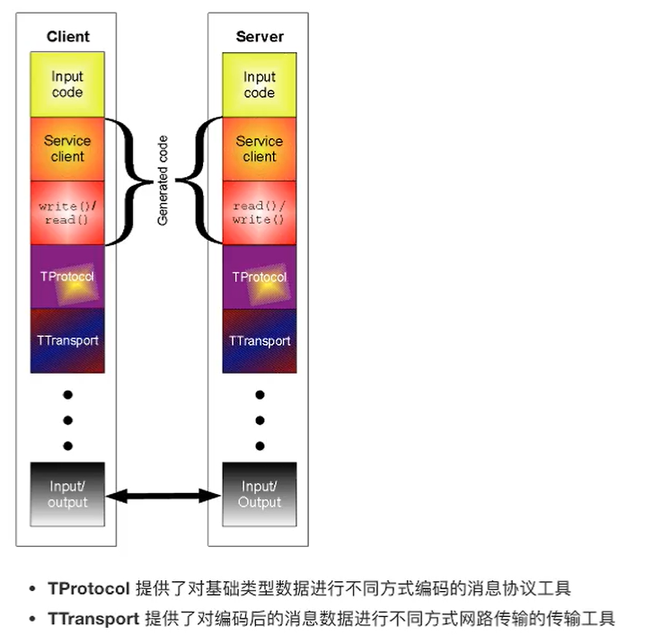

简单学习一下Thrift，主要是想简单了解一下是什么，为什么，怎么用。

# What

为了防止客户端和服务端对数据编解码规则重复编写。Thrift允许我们使用一种独立于任何编程语言的新的语言来定义接口服务，通常把这种语言成为接口定义语言（IDL，Interface Definition 
Language)，我们使用Thrift的IDL将接口定义在一个文本文件中（通常使用.thrift后缀名，成为接口定义文件)，然后使用Thrift提供的编译器(compiler)根据这个文件生成所需要的语言的程序源代码。

