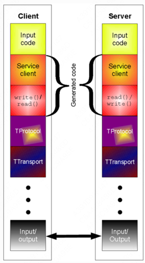

Thrift 简单回顾

# What

Thrift 是一个轻量级、独立于语言的软件堆栈，具有相关的 RPC 代码生成机制。Thrift 为数据传输、数据序列化和应用程序级处理提供了干净的抽象。



## 协议栈

###  运行时库（Runtime Library）：
协议层和传输层是运行时库的一部分。这意味着可以定义一个服务，并在不重新编译代码的情况下更改协议和传输方式。
###  协议层（Protocol Layer）：用来序列化、反序列化
- TBinaryProtocol - 一种直接的二进制格式，将数字值编码为二进制，而不是转换为文本。
- TCompactProtocol - 数据的非常高效、紧凑的编码方式（详见下文）。
- TDenseProtocol - 类似于TCompactProtocol，但会从传输的内容中剥离元信息，并在接收方重新添加。TDenseProtocol仍处于实验阶段，尚未在Java实现中提供。
- TJSONProtocol - 使用JSON对数据进行编码。
- TSimpleJSONProtocol - 一种仅用于写入的JSON协议。适用于脚本语言解析。
- TDebugProtocol - 使用人类可读的文本格式以帮助调试。

### 传输层（Transport Layer）
传输层负责从线路读取和写入数据。Thrift支持以下传输方式：

- TSocket - 使用阻塞式套接字I/O进行传输。
- TFramedTransport - 将数据分成帧发送，每个帧前面都有一个长度。当使用非阻塞服务器时，需要使用此传输方式。
- TFileTransport - 此传输方式将数据写入文件。虽然Java实现中没有包含此传输方式，但实现起来应该很简单。
- TMemoryTransport - 使用内存进行I/O。Java实现内部使用一个简单的ByteArrayOutputStream。
- TZlibTransport - 使用zlib进行压缩。与另一个传输方式一起使用。Java实现中不可用。

### Processor（处理器）
处理器接受输入和输出协议作为参数。从输入读取数据，通过用户指定的处理程序处理数据，然后将数据写入输出。

### Server（服务器）

将监听端口的连接，并将接收到的数据发送到处理器以处理。监听端口的连接，并将接收到的数据发送到处理器以处理。

支持的服务器
- TSimpleServer - 使用标准阻塞I/O的单线程服务器。适用于测试。
- TThreadPoolServer - 使用标准阻塞I/O的多线程服务器。
- TNonblockingServer - 使用非阻塞I/O的多线程服务器（Java实现使用NIO通道）。必须使用TFramedTransport。

## Thrift类型

Thrift类型系统包括基本类型，如bool、byte、double、string和integer，还包括特殊类型，如binary，并支持结构体（相当于类但没有继承）和容器（list、set、map），这些容器对应于大多数编程语言中常见的接口。该类型系统专注于所有编程语言中可用的关键类型，并省略了仅适用于某些编程语言的类型。

### 基础类型

基本类型
- bool：布尔值（true或false）
- byte：8位有符号整数
- i16：16位有符号整数
- i32：32位有符号整数
- i64：64位有符号整数
- double：64位浮点数
- string：使用UTF-8编码的文本字符串
注意：由于许多编程语言中没有本地无符号整数类型，因此不支持无符号整数类型。必要时，有符号整数可以安全地转换为它们的无符号对应项。

### 特殊类型

binary：未编码字节序列

###  结构体

结构体具有一组强类型字段，每个字段都有唯一的名称标识符。它们看起来非常类似于C语言中的结构体。
```c++
struct Example {
  1:i32 number=10,
  2:i64 bigNumber,
  3:double decimals,
  4:string name="thrifty"
}
```

### 容器
- list（映射到C++ STL vector、Java ArrayList等）
- set（映射到STL set、Java HashSet等）
  - PHP不支持set - 因此它被视为类似于List map
- map（映射到STL map、Java HashMap等）

上述所有内容都是默认值，但可以自定义以对应于任何语言的不同类型。因此，已添加自定义代码生成指令。

### 异常

根据目标编程语言的情况，它们继承自本地异常基类。

```c++
exception InvalidOperation {
1: i32 what,
2: string why
}
```

### 服务

服务由一组命名函数组成，每个函数都有一组参数和返回类型。它在语义上等同于定义接口或纯虚抽象类。

```c++
service <name> {
<returntype> <name>(<arguments>)
[throws (<exceptions>)]
...
}

An example:
service StringCache {
void set(1:i32 key, 2:string value),
string get(1:i32 key) throws (1:KeyNotFound knf),
void delete(1:i32 key)
}
```

# How

## 编写.thrift文件


在.thrift文件中，可以定义您的服务器将实现的服务，并且这些服务将由任何客户端调用。Thrift编译器将读取此文件并生成源代码，以供您编写的服务器和客户端使用。

一个简单的.thrift文件，我们在其中为此演示定义了简单的乘法服务，如下所示：

```c++
namespace java tutorial
namespace py tutorial

/*
 C like comments are supported
*/
// This is also a valid comment

typedef i32 int // We can use typedef to get pretty names for the types we are using
service MultiplicationService
{
        int multiply(1:int n1, 2:int n2),
}
```

在上面的文件中定义了一个服务，用于将两个数字相乘并返回它们的乘积，以避免使我们的第一个演示难以理解。如果您将此文件命名为multiplication.thrift，并且想要使用Java和Python，您需要运行以下命令：

```shell
thrift --gen java multiplication.thrift
thrift --gen py multiplication.thrift
```

Thrift现在将为您生成代码，并将其分别放置在gen-java和gen-py目录中。请确保您有足够的权限在目录中写入。否则，您可能需要以sudo用户身份运行上述命令。

- 请注意上面文件中我们定义的命名空间。它们指示Thrift应在gen-java和gen-py中生成名为tutorial的子目录，并在其中放置输出文件。我们可以为Java和Python指定不同的命名空间。我们也可以省略指定命名空间。在后一种情况下，文件将直接放置在gen-java和gen-py目录中。
- 请注意，我们还可以使用更易于记忆的方式（在本例中使用int替代i32）对Thrift类型进行typedef。

### 引入其他的.thrift文件

```c++
include "shared.thrift"
```

### 定义C类型的枚举

```c++
enum Operation {
  ADD = 1,
  SUBTRACT = 2,
  MULTIPLY = 3,
  DIVIDE = 4
}
```

### 定义结构体

字段可以声明为“可选”，这可以确保如果它们未设置，则不会包含在序列化输出中——这在某些语言中需要进行一些手动管理。每个字段类型前面的数字标识符是Thrift执行版本控制的方式  
。Thrift定义语言支持自动分配字段标识符，但最好的编程实践是始终明确指定字段标识符。正如Thrift的白皮书所解释的那样，为了避免手动分配的标识符和自动分配的标识符之间的冲突，省略标识符的字段将被分配从-1递减的标识符，并且该语言仅支持正标识符的手动分配。

```c++
struct Work {
  1: i32 num1 = 0,
  2: i32 num2,
  3: Operation op,
  4: optional string comment,
}
```

### 定义异常

```c++
exception InvalidOperation {
  1: i32 what,
  2: string why
}
```

### 定义服务

```c++
service Calculator extends shared.SharedService {

   void ping(),

   i32 add(1:i32 num1, 2:i32 num2),

   i32 calculate(1:i32 logid, 2:Work w) throws (1:InvalidOperation ouch),

   /**
    * This method has a oneway modifier. That means the client only makes
    * a request and does not listen for any response at all. Oneway methods
    * must be void.
    */
   oneway void zip()

}
```

上述命令将生成一个名为gen-java的目录，其中包含Thrift在Java中生成的所有代码。选项-r用于指定我想要递归生成潜在包含在我们的.thrift文件中的代码。生成代码  
后，您现在可以准备创建客户端和服务器代码，并使用Thrift生成的代码来为您完成繁重的工作，如下所示。

## 根据.thrift生成代码

thrift -r --gen java filame.thrift

上述命令将生成一个名为gen-java的目录，其中包含Thrift在Java中生成的所有代码。选项-r用于指定我想要递归生成潜在包含在我们的.thrift文件中的代码。

如果遇到问题`ImportError: No module named Thrift`,切换到thrift的安装目录下的lib/py运行下属命令

```shell script
sudo python setup.py install
```

## 案例

### [简单案例](multi-demo/src/main/java/com/nju)

1. 创建.thrift文件
```c++
namespace java tutorial
namespace py tutorial

typedef i32 int // We can use typedef to get pretty names for the types we are using
service MultiplicationService
{
        int multiply(1:int n1, 2:int n2),
}
```
2. 生成java和py文件
```shell script
thrift --gen java multiple.thrift
thrift --gen py multiple.thrift
```
3. 实现Thrift生成的接口
4. 编写乘法服务器
5. 编写乘法客户端

## [复杂案例](calc-demo/src/main/java/com/nju)

1. 创建.thrift
```c++

include "shared.thrift"

namespace cpp tutorial
namespace d tutorial
namespace java tutorial
namespace php tutorial
namespace perl tutorial

/**
 * Thrift also lets you define constants for use across languages. Complex
 * types and structs are specified using JSON notation.
 */
const i32 INT32CONSTANT = 9853
const map<string,string> MAPCONSTANT = {'hello':'world', 'goodnight':'moon'}

/**
 * You can define enums, which are just 32 bit integers. Values are optional
 * and start at 1 if not supplied, C style again.
 */
enum Operation {
  ADD = 1,
  SUBTRACT = 2,
  MULTIPLY = 3,
  DIVIDE = 4
}

/**
 * Structs are the basic complex data structures. They are comprised of fields
 * which each have an integer identifier, a type, a symbolic name, and an
 * optional default value.
 *
 * Fields can be declared "optional", which ensures they will not be included
 * in the serialized output if they aren't set.  Note that this requires some
 * manual management in some languages.
 */
struct Work {
  1: i32 num1 = 0,
  2: i32 num2,
  3: Operation op,
  4: optional string comment,
}

/**
 * Structs can also be exceptions, if they are nasty.
 */
exception InvalidOperation {
  1: i32 what,
  2: string why
}

/**
 * Ahh, now onto the cool part, defining a service. Services just need a name
 * and can optionally inherit from another service using the extends keyword.
 */
service Calculator extends shared.SharedService {

  /**
   * A method definition looks like C code. It has a return type, arguments,
   * and optionally a list of exceptions that it may throw. Note that argument
   * lists and exception lists are specified using the exact same syntax as
   * field lists in struct or exception definitions.
   */

   void ping(),

   i32 add(1:i32 num1, 2:i32 num2),

   i32 calculate(1:i32 logid, 2:Work w) throws (1:InvalidOperation ouch),

   /**
    * This method has a oneway modifier. That means the client only makes
    * a request and does not listen for any response at all. Oneway methods
    * must be void.
    */
   oneway void zip()

}
```
2. 计算服务处理器
3. 计算服务类
4. 计算服务客户端

> 生成密钥对，证书
>
> keytool -genkeypair -alias server -keyalg RSA -keysize 2048 -keystore .keystore -storepass thrift -validity 365
> keytool -exportcert -alias server -keystore .keystore -storepass thrift -file server.crt
> keytool -importcert -alias server -file server.crt -keystore .truststore -storepass thrift -noprompt
