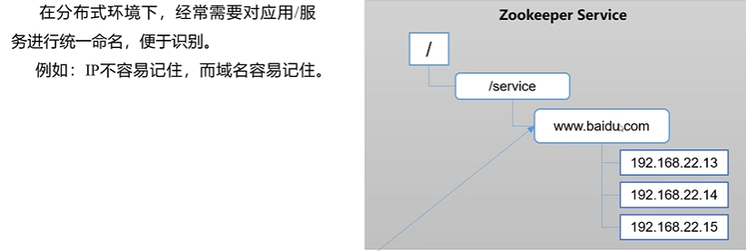
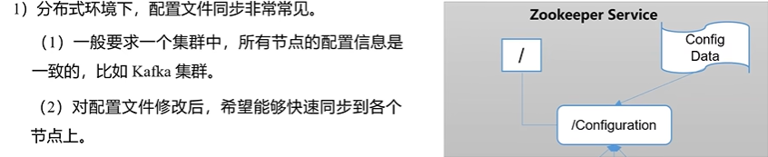
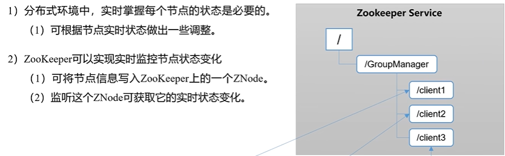
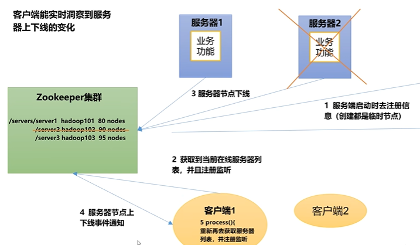
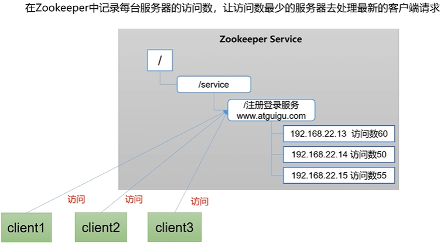
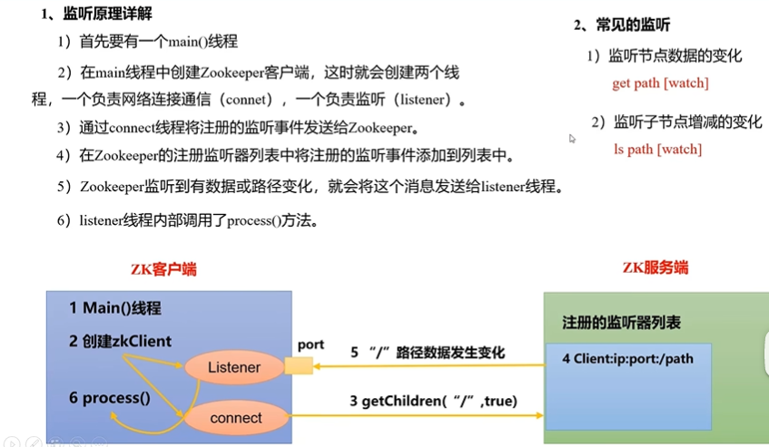

《从Paxos到Zookeeper》

# 开胃菜

## 是什么

类文件系统 + 消息通知机制

## 特点

- 一个Leader 多个Follower组成的集群
- 半数以上节点存活，Zookeeper就能正常服务。故推荐使用奇数个服务器
- 全局数据一致，每个Server保存一份相同的数据副本，Client无论请求哪个Server数据都一致
- 更新请求按照FIFO进行
- 数据更新是原子性操作
- 实时性，在一定时间内，client能读到最新的数据（主要是节点间数据同步）

## 数据结构

类似Unix文件系统，每个Znode存1MB数据。每个Znode通过路径唯一标识。

## 应用场景

- 统一命名服务

- 统一配置管理

- 统一集群管理

- 动态上下线

- 软负载均衡


# 面试题

## Leader选举

### 启动时

每个节点都会优先投自己，当其他的节点陆续上线之后，会根据myid来决定票选谁为Leader，一旦某个节点超过了
半数选票那么选举结束，该节点为Leader，其余为Follower。

### 非启动时

当服务器运行期间无法和Leader保持连接

#### 集群中存在Leader

被告知选举失败，仅需要等待后续与Leader重新建立连接

#### 集群中不存在Leader

选举的时候，根据Epoch > ZXID（事务ID） > SID 的优先级进行投票，
如果出现了脑裂的时候，选出了两个Leader，在后续合并的时候，会根据Epoch进行
新Leader晋升，同时把失败的Leader集群中的事务删除，直到和新Leader同步

## 监听器
观察者模式push



# zookeeper 简单上手

## docker 环境准备

```shell
docker images
docker search zookeeper
docker pull zookeeper:3.5.7

mkdir -p /mydata/zookeeper/data # 数据挂载目录
mkdir -p /mydata/zookeeper/conf # 配置挂载目录
mkdir -p /mydata/zookeeper/logs # 日志挂载目录

docker run -d --name zookeeper --privileged=true -p 2181:2181  -v /mydata/zookeeper/data:/data -v /mydata/zookeeper/conf:/conf -v /mydata/zookeeper/logs:/datalog zookeeper:3.5.7

# 修改配置
vim /mydata/zookeeper/conf/zoo.cfg 

dataDir=/data  # 保存zookeeper中的数据
dataLogDir=/datalog
tickTime=2000  # 通信心跳时间
initLimit=5    # LF(leader - follower)初始通信时限
syncLimit=2    # LF 同步通信时限
autopurge.snapRetainCount=3
autopurge.purgeInterval=0
maxClientCnxns=60
standaloneEnabled=true
admin.enableServer=true
server.1=localhost:2888:3888;2181
```

## 测试程序

详情见ZkClient
